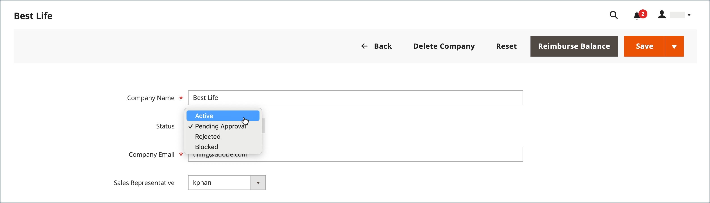

# Aprovar uma conta de empresa

O status das solicitações recebidas da loja para criar uma empresa é `Pending Approval` até que a solicitação seja revisada pelo administrador da loja e seja aprovada ou rejeitada. O status de uma conta de empresa pode ser definido como qualquer um dos seguintes:

- [!UICONTROL Active]
- [!UICONTROL Pending Approval]
- [!UICONTROL Rejected]
- [!UICONTROL Blocked]

Você também pode usar o [Controle de ações](account-company-manage.md) para aprovar várias solicitações de empresa.

{width="700" zoomable="yes"}

## Aprovar uma conta de empresa pendente

1. Na barra lateral _Admin_, vá para **[!UICONTROL Customers]** > **[!UICONTROL Companies]**.

   Você pode usar o seletor _[!UICONTROL Columns]_acima da grade para exibir a coluna **[!UICONTROL Status]**.

1. Na coluna _[!UICONTROL Action]_, clique em **[!UICONTROL Edit]**.

1. Defina **[!UICONTROL Company Status]** como `Active`.

   {width="700" zoomable="yes"}

1. Quando for solicitada a confirmação, clique em **[!UICONTROL Change status]**.

   O administrador da empresa recebe uma notificação por email informando que a empresa está ativa no momento.

1. Se aplicável, defina **[!UICONTROL Sales Representative]** para uma conta de usuário Admin específica.

1. Expanda  a seção **[!UICONTROL Account Information]** e use o campo **[!UICONTROL Comment]** para inserir observações sobre a conta.

   Os comentários não estão visíveis na loja.

1. Quando terminar, clique em **[!UICONTROL Save]**.

   Um email de confirmação é enviado à empresa e ao administrador da empresa informando que a conta da empresa foi aprovada.

## Status da empresa

| Status | Descrição |
|------------------|--------------------------------------------------------------------------------------------------------------------------------------------|
| [!UICONTROL Active] | A empresa é aprovada e pode ser gerenciada na loja pelo administrador da empresa. |
| [!UICONTROL Pending Approval] | Uma solicitação para criar uma conta de empresa foi enviada da loja, mas ainda não foi revisada. |
| [!UICONTROL Rejected] | A solicitação para criar uma conta de empresa foi rejeitada pelo administrador de armazenamento. |
| [!UICONTROL Blocked] | A conta da empresa não está mais em boa posição. O cliente pode acessar a conta na loja, mas não pode fazer compras. |

{style="table-layout:auto"}
