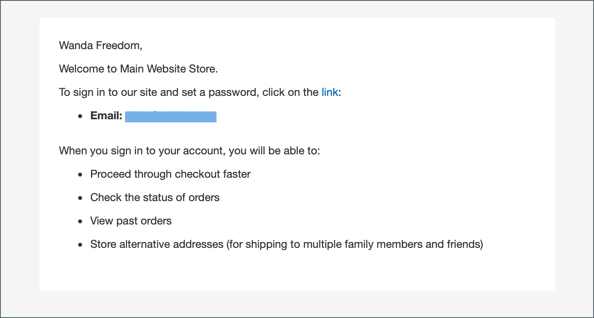

# Criar uma conta de empresa

As contas da empresa podem ser configuradas na loja pelo cliente ou pelo administrador. Todas as solicitações para criar uma conta da empresa devem ser aprovadas pelo administrador de armazenamento antes que a conta se torne ativa.

A pessoa que configura uma conta de empresa na loja recebeu uma função de [administrador da empresa](account-company-admin.md). Depois que a solicitação para criar uma conta da empresa for aprovada, o administrador da empresa poderá definir uma senha de conta e fazer logon na conta.

## Método 1: o cliente cria a conta da loja

>[!IMPORTANT]
>
>Para dar suporte a este método (permitindo que os clientes registrem sua empresa na loja), verifique se os [Recursos B2B](enable-basic-features.md) estão habilitados.

1. No canto superior direito do cabeçalho da loja, o cliente clica em **[!UICONTROL Create an Account]** e escolhe **[!UICONTROL Create New Company Account]**.

   {width="700" zoomable="yes"}

   >[!NOTE]
   >
   >Se um visitante estiver conectado a uma conta de usuário registrada, ele poderá criar uma conta da empresa navegando até _[!UICONTROL Customer Profile]_>**[!UICONTROL Company Structure]**>**[!UICONTROL Create a Company Account]**.

1. Na seção _[!UICONTROL Company Information]_, o cliente faz o seguinte:

   - Preenche os campos obrigatórios:

      - **[!UICONTROL Company Name]**
      - **[!UICONTROL Company Email]**

   - Preenche os campos restantes, conforme aplicável:

      - **[!UICONTROL Company Legal Name]**
      - **[!UICONTROL VAT/TAX ID]**
      - **[!UICONTROL Reseller ID]**

   {width="700" zoomable="yes"}

1. Preenche os campos obrigatórios na seção _[!UICONTROL Legal Address]_.

   - **[!UICONTROL Street Address]**
   - **[!UICONTROL City]**
   - **[!UICONTROL Country]**
   - **[!UICONTROL State/Province]**
   - **[!UICONTROL ZIP/Postal Code]**
   - **[!UICONTROL Phone Number]**

   {width="700" zoomable="yes"}

1. Na seção _[!UICONTROL Company Administrator]_, faz o seguinte:

   - Digite o **[!UICONTROL Email address]** para o administrador da empresa.

     O endereço de email do administrador da empresa pode ser igual ao endereço de email da empresa ou um endereço de email diferente. Se um endereço de email diferente for inserido, uma conta de usuário da empresa será criada, além da conta de administrador da empresa.

   - Insira as **[!UICONTROL First Name]** e **[!UICONTROL Last Name]** do administrador da empresa.

   - Opcionalmente, preenche os seguintes campos:

      - **[!UICONTROL Job Title]**
      - **[!UICONTROL Work Phone Number]**
      - **[!UICONTROL Gender]**

   

1. Conclui a validação se o reCAPTCHA estiver habilitado para esta função de loja.

1. Quando a informação estiver completa, selecione **[!UICONTROL Submit]**.

   Quando a solicitação para criar uma conta da empresa é aprovada pelo comerciante, a notificação por email é enviada ao administrador da empresa.

   {width="500"}

   Quando a senha é definida, o administrador da empresa pode [entrar](../customers/customer-sign-in.md) na conta.

## Método 2: o comerciante cria a conta do administrador

O processo de criação de uma empresa pelo Administrador é essencialmente o mesmo da loja, mas com campos adicionais.

{width="700" zoomable="yes"}

1. Na barra lateral _Admin_, vá para **[!UICONTROL Customers]** > **[!UICONTROL Companies]**.

1. Clique em **[!UICONTROL Add New Company]** e faça o seguinte:

   - Preencha estes campos obrigatórios:

      - **[!UICONTROL Company Name]**
      - **[!UICONTROL Company Email]**

   - Se você não estiver pronto para ativar a conta, defina **[!UICONTROL Status]** como `Pending Approval`. (Definido como `Active` por padrão.)

   - Se aplicável, escolha a conta de administrador do **[!UICONTROL Sales Representative]** que gerenciará a conta.

1. Na seção _[!UICONTROL Account Information]_, faça o seguinte:

   - Preencha os seguintes campos conforme aplicável:

      - **[!UICONTROL Company Legal Name]**
      - **[!UICONTROL VAT/TAX ID]**
      - **[!UICONTROL Reseller ID]**

   - Para **[!UICONTROL Comment]**, insira todas as informações adicionais sobre o cliente que possam ser necessárias.

     Os comentários são visíveis somente no Administrador.

   {width="700" zoomable="yes"}

1. Na criação inicial da empresa, a grade _[!UICONTROL Company Hierarchy]_&#x200B;fica vazia quando você a expande. Depois de salvar a empresa, você pode incluí-la em uma hierarquia de empresa. Consulte [Gerenciamento da Empresa](manage-companies.md).

1. Na seção _[!UICONTROL Legal Address]_, preencha estes campos obrigatórios:

   - **[!UICONTROL Street Address]**
   - **[!UICONTROL City Country]**
   - **[!UICONTROL ZIP/Postal Code]**
   - **[!UICONTROL Phone Number]**

1. Na seção _[!UICONTROL Company Admin]_, faça o seguinte:

   - Preencha estes campos obrigatórios:

      - **[!UICONTROL Email]**
      - **[!UICONTROL First Name]**
      - **[!UICONTROL Last Name]**

   - Preencha as seguintes partes opcionais do nome, que podem ser aplicáveis a alguns nomes de clientes mais do que outros e podem ser usadas a seu critério:

      - **[!UICONTROL Prefix]**
      - **[!UICONTROL Middle Name/Initial]**
      - **[!UICONTROL Suffix]**

   - Se as informações estiverem disponíveis, preencha os campos restantes para descrever o administrador da empresa:

      - **[!UICONTROL Website]**
      - **[!UICONTROL Job Title]**
      - **[!UICONTROL Work Phone Number]**
      - **[!UICONTROL Gender]**
      - **[!UICONTROL Send Welcome Email From]**

   {width="700" zoomable="yes"}

1. Na seção _[!UICONTROL Company Credit]_, que exibe um resumo da atividade de crédito do cliente, preencha quantos campos na parte inferior da seção forem aplicáveis:

   - **[!UICONTROL Credit Currency]**
   - **[!UICONTROL Credit Limit]**
   - **[!UICONTROL Allow to Exceed Credit Limit]**
   - **[!UICONTROL Reason for Change]**

   {width="700" zoomable="yes"}

1. Na seção _[!UICONTROL Advanced Settings]_, faça o seguinte:

   >[!NOTE]
   >
   >A atribuição do grupo de clientes determina qual catálogo compartilhado está disponível para a empresa e seus funcionários. Por padrão, a empresa é atribuída ao grupo de clientes definido como padrão na configuração.

   - Você pode alterar a atribuição **[!UICONTROL Customer Group]** da empresa e de seus funcionários para um grupo que tenha acesso a um catálogo compartilhado diferente ou a um grupo de clientes padrão. Você será solicitado a confirmar antes que o grupo seja alterado.

     {width="600"}

   - Se você quiser permitir que os funcionários da empresa gerem cotações a partir de suas contas, defina **[!UICONTROL Allow Quotes]** como `Yes`.

   - Se você quiser permitir que os funcionários da empresa criem e usem ordens de compra a partir de suas contas, defina **[!UICONTROL Enable Purchase Orders]** como `Yes`.

   - Para alterar os **[!UICONTROL Applicable Payment Methods]** que estão disponíveis para a empresa, desmarque a caixa de seleção **[!UICONTROL Use config settings]** e escolha uma das seguintes opções:

     | Opção | Descrição |
     |-------------------------------|-----------------------------------------------------------------------------------------------------------------------------------------------------------------------------------------------------------------------------------------|
     | `B2B Payment Methods` | (Padrão) Habilita todos os [métodos de pagamento definidos como padrão](../configuration-reference/general/b2b-features.md#default-b2b-payment-methods) para ordens B2B. |
     | `All Enabled Payment Methods` | Disponibiliza todos os [métodos de pagamento habilitados](../configuration-reference/sales/payment-methods.md) para contas de clientes associadas à conta da empresa. |
     | `Selected Payment Methods` | Permite selecionar os métodos de pagamento disponíveis para contas de clientes associadas à conta da empresa. Para selecionar vários métodos de pagamento, mantenha pressionada a tecla Ctrl (PC) ou a tecla Command (Mac) e selecione cada opção. |

     {style="table-layout:auto"}

   - Para alterar os **[!UICONTROL Applicable Shipping Methods]** que estão disponíveis para a empresa, desmarque a caixa de seleção **[!UICONTROL Use config settings]** e escolha uma das seguintes opções:

     | Opção | Descrição |
     |--------------------------------|----------------------------------------------------------------------------------------------------------------------------------------------------------------------------------------------------------------------------------------------------|
     | `B2B Shipping Methods` | (Padrão) Habilita todos os [métodos de envio definidos como padrão](../configuration-reference/general/b2b-features.md#default-b2b-shipping-methods) para pedidos B2B. |
     | `All Enabled Shipping Methods` | Disponibiliza todos os [métodos de envio habilitados](../configuration-reference/sales/delivery-methods.md) para contas de clientes associadas à conta da empresa. |
     | `Selected Shipping Methods` | Permite selecionar os métodos de entrega disponíveis para contas de clientes associadas à conta da empresa. Para selecionar vários métodos de envio, mantenha pressionada a tecla Ctrl (PC) ou a tecla Command (Mac) e selecione cada opção. |

     {style="table-layout:auto"}

1. Quando terminar, selecione **[!UICONTROL Save]**.

   Quando a solicitação para criar uma conta da empresa é aprovada pelo comerciante, uma notificação por email é enviada para o endereço de email do administrador da empresa.

   Quando a senha é definida, o administrador da empresa pode [entrar](../customers/customer-sign-in.md) na conta.

## Barra de botões

| Botão | Descrição |
|---------------------------|------------------------------------------------------------------|
| [!UICONTROL Back] | Retorna à página Empresas sem salvar as alterações. |
| [!UICONTROL Reset] | Restaura os valores originais em todos os campos com alterações não salvas. |
| [!UICONTROL Save] | Salva as alterações na empresa e mantém o perfil aberto. |
| [!UICONTROL Save & Close] | Salva as alterações na empresa e fecha o perfil. |

{style="table-layout:auto"}

## Descrições dos campos

| Campo | Descrição |
|-----------------------------------|---------------------------------------------------------------------------------------------------------------------------------------------------------------------------------------------------------------------------------------------------------------------------------------------------------------------------------------------------------------------------------------------------------------------------------------------------------------------------------------------------------------------------------------------------------------------------------------------------------------------------------------------------------------------------------------------------------------------------------------------------------------------------------------------------------------------------------------------------------------------------------------------------------------------------------|
| [!UICONTROL Company Name] | O nome da empresa é inserido quando a conta da empresa é criada pela primeira vez e pode ser uma versão reduzida do nome legal completo. |
| [!UICONTROL Status] | (Somente administrador) Indica o estado atual da conta da empresa. Opções:  **[!UICONTROL Active]**- A conta da empresa foi aprovada pelo administrador de armazenamento. O administrador da empresa e os membros associados podem fazer logon na conta da loja e fazer compras. **[!UICONTROL Pending Approval]** - Uma solicitação para abrir uma conta da empresa foi enviada, mas ainda não foi aprovada pelo administrador de armazenamento.  **[!UICONTROL Rejected]**- Uma solicitação para abrir uma conta da empresa foi enviada, mas não foi aprovada pelo administrador de armazenamento. As credenciais de logon iniciais usadas para enviar a solicitação estão bloqueadas. **&#x200B; Bloqueado &#x200B;**- Os membros da empresa podem fazer logon e acessar o catálogo, mas não podem fazer compras. O administrador de armazenamento pode bloquear uma conta da empresa que não esteja em boa posição. O bloqueio na conta pode ser removido pelo administrador de armazenamento a qualquer momento. |
| [!UICONTROL Company Email] | O endereço de email associado à conta da empresa. |
| [!UICONTROL Sales Representative] | (Somente administrador) O usuário administrador que é o contato principal da conta da empresa. |

{style="table-layout:auto"}

### [!UICONTROL Account Information]

| Campo | Descrição |
|---------------------------------|-----------------------------------------------------------------------------------------------------------------------------------------------------------------------------------------------------------------------------------------------------------------------------------------------------------------------------------------------------------------------------------------------------------------------------------------------------------------|
| [!UICONTROL Company Legal Name] | O nome legal completo da empresa. |
| [!UICONTROL VAT / TAX ID] | O número de [imposto sobre valor agregado](../stores-purchase/vat.md) atribuído à empresa por algumas jurisdições para fins de relatório de imposto. Para configurar a ID de IVA/IMPOSTO do cliente para aparecer na vitrine, consulte [Criar Novas Opções de Conta](../configuration-reference/customers/customer-configuration.md).   **_Observação:_** o administrador da empresa e outros usuários da empresa não têm seus próprios números de identificação de IVA/IMPOSTO separados em suas contas de cliente. |
| [!UICONTROL Reseller ID] | O número de revenda atribuído à empresa para fins de relatório de imposto. |
| [!UICONTROL Comment] | (Somente administrador) Essas notas sobre a conta da empresa são para referência e visíveis somente do administrador. |

{style="table-layout:auto"}

### [!UICONTROL Company Hierarchy]

| Campo | Descrição |
|-----------------------------------|------------------------------------------------------------------------------------------------------------------------------------------------------|
| [!UICONTROL Company ID] | O número de ID da empresa. |
| [!UICONTROL Company Name] | O nome completo da empresa.  Um `current company indicator` aparece na linha da empresa que está sendo editada. |
| [!UICONTROL Company Email] | O endereço de email associado à conta da empresa. |
| [!UICONTROL Phone Number] | O número de telefone principal da empresa. |
| [!UICONTROL Country] | O país onde a empresa está registrada para realizar negócios. |
| [!UICONTROL State/Province] | O estado ou província onde a empresa está registrada para realizar negócios. |
| [!UICONTROL City] | A cidade onde a empresa está registrada para realizar negócios. |
| [!UICONTROL Group/Shared Catalog] | (Somente Administrador) Indica o [grupo de clientes](../customers/customer-groups.md) ou o [catálogo compartilhado](catalog-shared.md) atribuído à empresa. |
| [!UICONTROL Company Admin] | O nome completo do administrador da empresa. |
| [!UICONTROL Action] | A lista de ações possíveis para essa linha de empresa. |

{style="table-layout:auto"}

### [!UICONTROL Legal Address]

| Campo | Descrição |
|------------------------------|-----------------------------------------------------------------------------|
| [!UICONTROL Street Address] | O endereço onde a empresa está registrada para realizar negócios. |
| [!UICONTROL City] | A cidade onde a empresa está registrada para realizar negócios. |
| [!UICONTROL Country] | O país onde a empresa está registrada para realizar negócios. |
| [!UICONTROL State/Province] | O estado ou província onde a empresa está registrada para realizar negócios. |
| [!UICONTROL ZIP/Postal Code] | O CEP ou código postal onde a empresa está registrada para realizar negócios. |
| [!UICONTROL Phone Number] | O número de telefone principal da empresa. |

{style="table-layout:auto"}

### [!UICONTROL Company Admin]

| Campo | Descrição |
|--------------------------------------|---------------------------------------------------------------------------------------------------------------------------------------------------------------------------------------------------------------------------------------------------|
| [!UICONTROL Website] | Determina o site ao qual o administrador da empresa pertence. |
| [!UICONTROL Job Title] | O título do administrador da empresa que gerencia a conta da empresa. |
| [!UICONTROL Work Phone Number] | O número de telefone do administrador da empresa que gerencia a conta da empresa. |
| [!UICONTROL Email] | O endereço de email do administrador da empresa pode ser igual ao endereço de email da empresa. Se um endereço de email diferente for inserido, uma conta individual separada será criada para o administrador da empresa, além da conta da empresa. |
| [!UICONTROL Prefix] | Se aplicável, o prefixo associado ao nome do administrador da empresa (como `Mr.`, `Ms.`, `Mrs.` ou `Dr.`). Dependendo da configuração, o campo de entrada pode ser um campo de texto ou lista. |
| [!UICONTROL First Name] | O nome do administrador da empresa. |
| [!UICONTROL Middle Name/Initial] | O nome do meio ou a inicial do administrador da empresa. |
| [!UICONTROL Last Name] | O sobrenome do administrador da empresa. |
| [!UICONTROL Suffix] | Se aplicável, o sufixo associado ao nome do administrador da empresa (como `Jr.`, `Sr.` ou `III.`). Dependendo da configuração, o campo de entrada pode ser um campo de texto ou lista. |
| [!UICONTROL Gender] | O sexo do administrador da empresa. Opções: `Male` / `Female` / `Not Specified` |
| [!UICONTROL Send Welcome Email From] | A exibição de loja da qual o email de boas-vindas deve ser enviado. |

{style="table-layout:auto"}

### [!UICONTROL Company Credit]

| Campo | Descrição |
|-------------------------------------------|-----------------------------------------------------------------------------------------------------------------------------------------------------------------------------------------|
| [!UICONTROL Credit Currency] | (Somente administrador) A moeda aceita pela loja para compras em crédito da empresa. |
| [!UICONTROL Credit Limit] | (Somente Administrador) O limite de crédito estendido para a conta da empresa. |
| [!UICONTROL Allow to Exceed Credit Limit] | (Somente Administrador) Indica se a empresa tem permissão para exceder o limite de crédito. Opções: `Yes` / `No` |
| [!UICONTROL Reason for Change] | (Somente administrador) Uma nota que explica por que a empresa tem ou não permissão para exceder o limite de crédito. Este campo só estará ativo se a permissão para exceder o limite de crédito for alterada. |

{style="table-layout:auto"}

### [!UICONTROL Advanced Settings]

| Campo | Descrição |
|------------------------------------------|--------------------------------------------------------------------------------------------------------------------------------------------------------------------------------------------------------------------------|
| [!UICONTROL Customer Group] | (Somente Administrador) Indica o [grupo de clientes](../customers/customer-groups.md) ou o [catálogo compartilhado](catalog-shared.md) atribuído à empresa. |
| [!UICONTROL Allow Quotes] | (Somente Administrador) Determina se os membros da empresa podem preparar e enviar cotações negociáveis em nome da empresa. |
| [!UICONTROL Enable Purchase Orders] | (Somente Administrador) Determina se os membros da empresa podem enviar pedidos como [ordens de compra](account-dashboard-my-purchase-orders.md) em nome da empresa. |
| Métodos de pagamento aplicáveis | (Somente Administrador) Indica os métodos de pagamento disponíveis para compras da empresa. Opções: `B2B Payment Methods` / `All Enabled Payment Methods` / `Selected Payment Methods` |
| [!UICONTROL Payment Methods] | (Somente Administrador) Fica ativo se métodos de pagamento específicos estiverem ativados. Para disponibilizar vários métodos de pagamento para a conta da empresa, mantenha pressionada a tecla Ctrl (PC) ou a tecla Command (Mac) e selecione cada opção. |
| [!UICONTROL Applicable Shipping Methods] | (Somente Administrador) Indica os métodos de envio disponíveis para compras da empresa. Opções: `B2B Shipping Methods` / `All Enabled Shipping Methods` / `Selected Shipping Methods` |
| [!UICONTROL Shipping Methods] | (Somente administrador) Fica ativo se métodos específicos de envio forem ativados. Para disponibilizar vários métodos de pagamento para a conta da empresa, mantenha pressionada a tecla Ctrl (PC) ou a tecla Command (Mac) e selecione cada opção. |

{style="table-layout:auto"}
