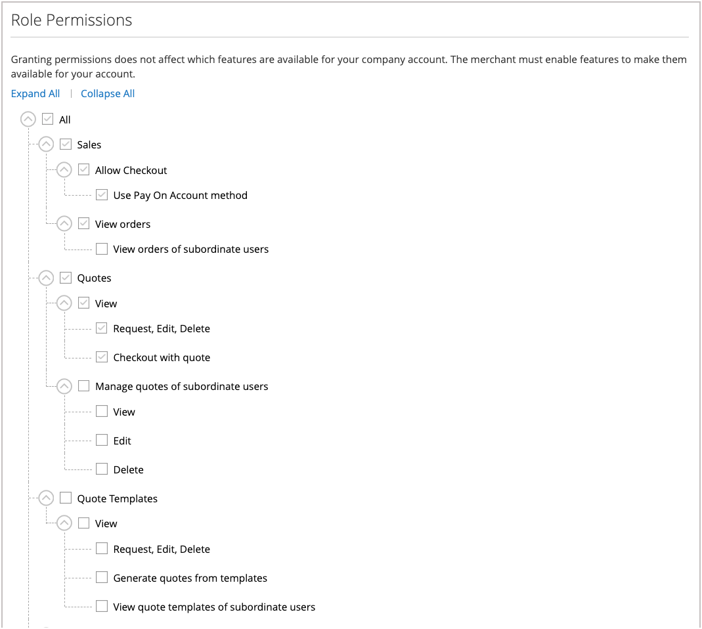

# Funções e permissões da empresa

As funções para usuários da empresa são configuradas com vários níveis de permissão para acessar informações e recursos de vendas. Por padrão, o administrador da empresa é um _superusuário_ com permissões totais. A página [Acesso Negado](../content-design/pages.md#access-denied) será exibida se o usuário não tiver permissão para acessar a página.

{width="700" zoomable="yes"}

O sistema tem uma função de Usuário Padrão predefinida, que você pode usar _como está_ ou modificar para atender às suas necessidades. É possível criar quantas funções forem necessárias para corresponder à estrutura da empresa e às responsabilidades organizacionais, como as seguintes:

- **Usuário Padrão** — O usuário padrão tem acesso total às atividades relacionadas a vendas e cotações, bem como acesso somente para visualização a informações de perfil e crédito da empresa.

- **Comprador Sênior** — Um comprador sênior pode ter acesso a todos os recursos de Vendas e Cotações e permissões somente para visualização do Perfil da Empresa, Usuário e Equipes, Informações de Pagamento e Crédito da Empresa.

- **Comprador Assistente** — Um comprador assistente pode ter permissão para fazer um pedido usando o _Check-out com Cotação_ e para exibir pedidos, cotações e informações no perfil da empresa.

## Gerenciar funções e permissões

1. O administrador da empresa faz logon em sua conta de armazenamento.

1. No painel esquerdo, escolhe **[!UICONTROL Roles and Permissions]**.

1. Conclui qualquer uma das tarefas a seguir.

### Criar uma função

1. Cliques **[!UICONTROL Add New Role]**.

   {width="600" zoomable="yes"}

1. Entra um **[!UICONTROL Role Name]** descritivo.

1. Em _[!UICONTROL Role Permissions]_, executa um dos seguintes procedimentos:

   - Marca a caixa de seleção de cada recurso ou atividade que os usuários com a função atribuída têm permissão para acessar.

   - Marque a caixa de seleção **[!UICONTROL All]** e desmarque a caixa de seleção de cada recurso ou atividade que os usuários atribuídos à função não têm permissão para acessar.

1. Cliques **[!UICONTROL Save Role]**.

1. Cria quantas funções forem necessárias repetindo essas etapas.

### Modificar uma função

1. Para que a função seja modificada, o administrador da empresa clica em **[!UICONTROL Edit]** na coluna _[!UICONTROL Actions]_.

1. Faz as alterações necessárias nas configurações de nome e permissão.

1. Quando terminar, clica em **[!UICONTROL Save Role]**.

### Duplicar uma função

1. Para que a função seja duplicada, o administrador da empresa clica em **[!UICONTROL Duplicate]** na coluna _[!UICONTROL Actions]_.

1. Faz as alterações necessárias nas configurações de nome e permissão.

1. Quando terminar, clica em **[!UICONTROL Save Role]**.

### Excluir uma função

1. O administrador da empresa encontra a função a ser excluída na lista de funções.

   Somente as funções sem usuários atribuídos podem ser excluídas.

1. Cliques em **[!UICONTROL Delete]** na coluna _[!UICONTROL Actions]_.

1. Quando for solicitada a confirmação, clique em **[!UICONTROL OK]**.

## Ações

| Ação | Descrição |
|-----------| ----------- |
| [!UICONTROL Duplicate] | Cria uma cópia da função selecionada. O nome da função duplicada tem `- Duplicated` adicionado ao final. |
| [!UICONTROL Edit] | Altere o nome e/ou o conjunto de permissões. |
| [!UICONTROL Delete] | Exclua a função. Somente as funções sem usuários atribuídos podem ser excluídas. |

{style="table-layout:auto"}

## Permissões de função

Os administradores da empresa podem atualizar a configuração de permissão para uma função selecionando o [!UICONTROL Edit action] e selecionando ou removendo permissões na lista **Permissões de função**.

{width="700" zoomable="yes"}

## Atribuir uma função a um usuário da empresa

Após definir as funções necessárias, o administrador da empresa atribui uma função a cada usuário da empresa.

1. Faz logon na conta da empresa como administrador da empresa.

1. No painel esquerdo, escolhe **[!UICONTROL Company Users]**.

   {width="700" zoomable="yes"}

1. Localiza o usuário na lista e clica em **[!UICONTROL Edit]**.

1. Escolhe o **[!UICONTROL User Role]** apropriado para o usuário.

   {width="700" zoomable="yes"}

1. Cliques **[!UICONTROL Save]**.
