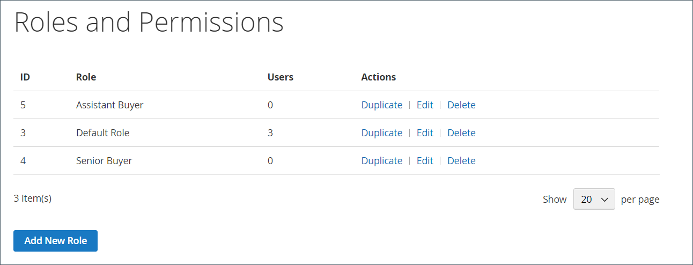

# Funções e permissões da empresa

Você configura funções para usuários da empresa com vários níveis de permissão para acessar informações e recursos de vendas. Por padrão, o administrador da empresa é um *superusuário* com permissões totais. A página [Acesso Negado](../content-design/pages.md#access-denied) será exibida se um usuário não tiver permissão para acessar a página.

{width="700" zoomable="yes"}

O sistema tem uma função de Usuário Padrão predefinida, que você pode usar *como está* ou modificar para atender às suas necessidades. É possível criar quantas funções forem necessárias para corresponder à estrutura da empresa e às responsabilidades organizacionais, como as seguintes:

- **Usuário Padrão** — O usuário padrão tem acesso total às atividades relacionadas a vendas e cotações e acesso somente para visualização ao perfil da empresa e às informações de crédito.

- **Comprador Sênior** — Um comprador sênior pode ter acesso a todos os recursos de Vendas e Cotações e permissões somente para visualização do Perfil da Empresa, Usuários e Equipes, Informações de Pagamento e Crédito da Empresa.

- **Comprador Assistente** — Um comprador assistente pode ter permissão para fazer um pedido usando o **[!UICONTROL Checkout with quote]** e exibir pedidos, cotações e informações no perfil da empresa.

## Gerenciar funções e permissões

Gerenciar funções de empresa da conta da loja do administrador da empresa.

**Para abrir Funções e Permissões:**

1. Faça logon na loja como administrador da empresa.

1. No painel esquerdo, selecione **[!UICONTROL Roles and Permissions]**.

1. Conclua uma das tarefas a seguir.

### Criar uma função

1. Clique em **[!UICONTROL Add New Role]**.

   {width="600" zoomable="yes"}

1. Insira um **[!UICONTROL Role Name]** descritivo.

1. Em **[!UICONTROL Role Permissions]**, execute um dos procedimentos a seguir:

   - Marque a caixa de seleção de cada recurso ou atividade que os usuários atribuídos à função têm permissão para acessar.

   - Marque a caixa de seleção **[!UICONTROL All]** e desmarque a caixa de seleção de cada recurso ou atividade que os usuários atribuídos à função não têm permissão para acessar.

1. Clique em **[!UICONTROL Save Role]**.

1. Repita essas etapas para criar quantas funções forem necessárias.

### Modificar uma função

1. Localize a função que você deseja modificar e clique em **[!UICONTROL Edit]** na coluna **[!UICONTROL Actions]**.

1. Faça as alterações necessárias nas configurações de nome e permissão.

1. Quando terminar, clique em **[!UICONTROL Save Role]**.

### Duplicar uma função

1. Localize a função que você deseja duplicar e clique em **[!UICONTROL Duplicate]** na coluna **[!UICONTROL Actions]**.

1. Faça as alterações necessárias nas configurações de nome e permissão.

1. Quando terminar, clique em **[!UICONTROL Save Role]**.

### Excluir uma função

1. Na lista de funções, localize a função a ser excluída.

   Somente as funções sem usuários atribuídos podem ser excluídas.

1. Clique em **[!UICONTROL Delete]** na coluna **[!UICONTROL Actions]**.

1. Quando for solicitada a confirmação, clique em **[!UICONTROL OK]**.

## Ações da lista de funções {#actions}

| Ação | Descrição |
| --- | --- |
| [!UICONTROL Duplicate] | Cria uma cópia da função selecionada. O nome da função duplicada tem `- Duplicated` adicionado ao final. |
| [!UICONTROL Edit] | Altera o nome e o conjunto de permissões. |
| [!UICONTROL Delete] | Exclui a função. Somente as funções sem usuários atribuídos podem ser excluídas. |

{style="table-layout:auto"}

## Permissões de função

Os recursos B2B são limitados por **permissões** (recursos ACL). Quando um usuário da empresa abre uma página ou executa uma ação na loja, o aplicativo verifica se a função inclui a permissão necessária.

Os administradores da empresa podem atualizar a configuração de permissão para uma função selecionando **[!UICONTROL Edit]** e depois selecionando ou limpando permissões na lista **[!UICONTROL Role Permissions]**.

{width="700" zoomable="yes"}

Atribua estes recursos quando você **criar ou editar uma função de empresa** na conta da empresa. Usuários com permissão para gerenciar funções podem abrir o formulário de função e definir a árvore de permissão.

As permissões de função são organizadas em uma estrutura em árvore, com opções principais e opções subordinadas. Selecionar uma opção principal seleciona automaticamente todas as opções subordinadas. Limpar uma opção principal limpa automaticamente todas as opções subordinadas. Também é possível selecionar ou desmarcar opções subordinadas individualmente.

### Todas as permissões

| Rótulo de permissão | Descrição |
| --- | --- |
| Todos | Nó raiz de **todas** permissões atribuídas a esta função de vitrine. |

### Permissões de vendas

| Rótulo de permissão | Descrição |
| --- | --- |
| Vendas | Principal para check-out e visibilidade de pedido para usuários da empresa. |
| Permitir check-out | Fazer pedidos no check-out. |
| Usar o método Pagar por Conta | Use o **Pagamento por Conta** (crédito da empresa) no check-out quando ele estiver disponível. |
| Exibir pedidos | Exibir as próprias ordens do usuário. |
| Exibir ordens de usuários subordinados | Exibir pedidos feitos por usuários abaixo deste usuário na hierarquia. |

### Permissões de aspas

Nó pai na árvore de permissões da empresa: **Aspas**.

| Rótulo de permissão | Descrição |
| --- | --- |
| Aspas | Pai para ações de cotação negociáveis de vitrine. |
| Exibir (aspas) | Exibir cotações negociáveis. |
| Solicitação, Editar, Excluir | Solicitar novas cotações, editar e excluir cotações de acordo com as regras de negócios. |
| Check-out com cotação | Concluir o check-out usando uma cotação aprovada. |
| Gerenciar cotações de usuários subordinados | Pai de ações nas cotações dos subordinados. |
| Exibição (cotações de subordinados) | Exibir cotações de subordinados. |
| Editar (cotações de subordinados) | Editar cotações de subordinados. |
| Excluir (cotações de subordinados) | Deletar cotações de subordinados. |

### Modelos de cotação

Nó pai: **Modelos de Cotação** (em **Cotações** na árvore da empresa).

| Rótulo de permissão | Descrição |
| --- | --- |
| Modelos de Cotação | Recursos do modelo pai da cotação na vitrine. |
| Visualização (modelos) | Exibir modelos de cotação. |
| Solicitação, Editar, Excluir | Criar, atualizar, cancelar e gerenciar modelos de cotação. |
| Gerar cotações a partir de modelos | Gerar cotações negociáveis a partir de modelos. |
| Gerenciar modelos de cota de usuários subordinados | Pai para ações de modelo subordinadas. |
| Visualização (modelos dos subordinados) | Exibir modelos de cota dos subordinados. |
| Editar (modelos dos subordinados) | Editar modelos de cota dos subordinados. |
| Excluir (modelos dos subordinados) | Deletar modelos de cota dos subordinados. |

### Aprovações de pedidos

Nó pai: **Aprovações de pedidos**. As permissões de ordem de compra e regra de aprovação são aninhadas nesta ramificação na árvore.

### Ordens de compra

| Rótulo de permissão | Descrição |
| --- | --- |
| Aprovações de pedidos | Pai para ordem de compra e recursos de aprovação. |
| Exibir minhas Ordens de Compra | Exibir ordens de compra criadas por este usuário. |
| Exibição para subordinados | Exibir ordens de compra para usuários abaixo deste usuário na hierarquia. |
| Exibir para todas as empresas | Exibir ordens de compra na empresa. |
| Aprovar OCs automaticamente criadas nesta função | Aprovar automaticamente ordens de compra criadas por usuários nesta função quando as regras permitirem. |

### Regras de ordem de compra

| Rótulo de permissão | Descrição |
| --- | --- |
| Aprovar Ordens de Compra sem outras aprovações | Aprovar ordens de compra mesmo quando outras aprovações normalmente seriam necessárias (por regras de aprovação). |
| Exibir regras de aprovação | Exibir regras de aprovação de ordem de compra. |
| Criar, Editar e Excluir | Criar, editar e excluir regras de aprovação. |

### Perfil da empresa e contatos

Permissões de vitrine para seções de perfil de empresa. As entradas **Editar** aninhadas se aplicam somente sob a permissão **Exibir** acima delas na árvore de funções.

| Rótulo de permissão | Descrição |
| --- | --- |
| Perfil da empresa | Acesse as áreas de perfil da empresa como um grupo. |
| Informações da conta (Exibir) | Exibir informações de conta da empresa. |
| Editar | Edite as informações da conta da empresa (em Informações da conta). |
| Endereço Legal (Exibir) | Exiba o endereço legal da empresa. |
| Editar | Edite o endereço legal da empresa (em Endereço legal). |
| Contatos (Exibir) | Exibir contatos da empresa. |
| Informações de Pagamento (Exibir) | Exibir informações de pagamento no perfil da empresa. |
| Informações sobre Remessa (Exibir) | Exibir informações de remessa no perfil da empresa. |

## Gerenciamento de usuários da empresa

| Rótulo de permissão | Descrição |
| --- | --- |
| Gerenciamento de usuários da empresa | Pai para funções e para usuários ou equipes. |
| Exibir funções e permissões | Exibir funções de empresa e suas permissões. |
| Gerenciar funções e permissões | Crie ou edite funções e atribua permissões. |
| Exibir usuários e equipes | Exibir usuários e equipes da empresa. |
| Gerenciar usuários e equipes | Adicionar, editar ou remover usuários e equipes. |

## Crédito da empresa

| Rótulo de permissão | Descrição |
| --- | --- |
| Crédito da empresa | Acesse a área de crédito da empresa. |
| Visualização (histórico de crédito) | Exibir o histórico de crédito da empresa e as informações de saldo relacionadas. |

## Atribuir uma função a um usuário da empresa

Depois de definir as funções necessárias, atribua uma função a cada usuário da empresa.

**Para atribuir uma função:**

1. Faça logon na loja como administrador da empresa.

1. No painel esquerdo, selecione **[!UICONTROL Company Users]**.

   {width="700" zoomable="yes"}

1. Localize o usuário na lista e clique em **[!UICONTROL Edit]**.

1. Selecione o **[!UICONTROL User Role]** apropriado para o usuário.

   {width="700" zoomable="yes"}

1. Clique em **[!UICONTROL Save]**.

>[!MORELIKETHIS]
>
>- [Gerenciar usuários da empresa](account-company-users.md)
>- [Estrutura de conta da empresa](account-company-structure.md)
>- [Função de administrador da empresa](account-company-admin.md)
>- [Gerenciar empresas](manage-companies.md)
>- [Habilitar recursos B2B](enable-basic-features.md)
