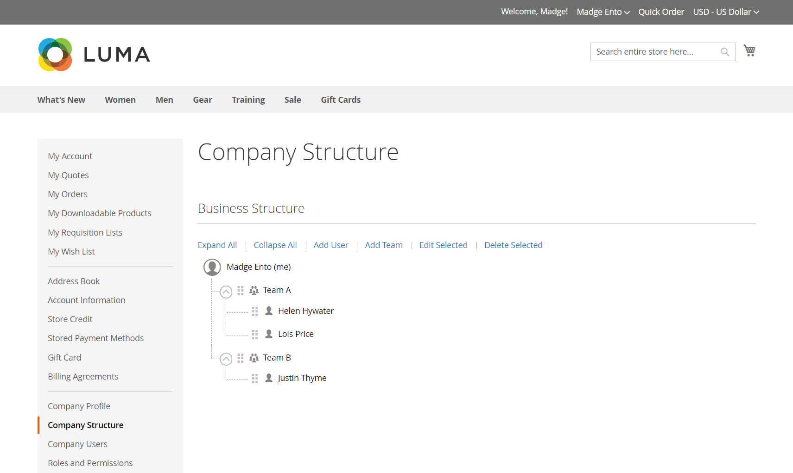

# Estrutura de conta da empresa

Uma conta de empresa pode ser configurada para refletir a estrutura da empresa. Inicialmente, a estrutura da empresa inclui apenas o administrador da empresa, mas pode ser expandida para incluir equipes de usuários. Os usuários podem ser associados a equipes ou organizados dentro de uma hierarquia de divisões e subdivisões dentro da empresa.

{width="500"}

No painel de contas do administrador da empresa na loja, a estrutura da empresa é representada como uma árvore e consiste inicialmente apenas no administrador da empresa.

{width="700" zoomable="yes"}

Para comerciantes, a estrutura completa da empresa é refletida nas grades de _Empresas_ e _Clientes_ no Administrador. A grade Empresas lista todas as empresas independentemente do status.

{width="700" zoomable="yes"}

O exemplo a seguir mostra a grade [!UICONTROL Customers] com as contas iniciais de administrador de empresa para cada empresa.

{width="700" zoomable="yes"}

Depois de criar a conta, o administrador da empresa pode definir uma estrutura de empresa com [equipes](account-company-structure.md), configurar os [usuários da empresa](account-company-users.md) e estabelecer [funções e permissões](account-company-roles-permissions.md) para cada um.

>[!NOTE]
>
>Quando um usuário da empresa é adicionado, o usuário da empresa é adicionado inicialmente à estrutura raiz da empresa, subordinado ao administrador da empresa. Se o administrador da empresa executar várias funções na empresa, crie contas de usuário da empresa separadas com um endereço de email diferente para cada função.

## Ícones de estrutura da empresa

| Ícone | Descrição |
| ---- | ----------------- |
|  | Representa o administrador da empresa na estrutura da empresa. |
|  | Representa uma equipe na estrutura da empresa. |
|  | Representa um usuário na estrutura da empresa. |
|  | Move uma equipe para outra posição na estrutura da empresa. |
|  | Expande uma equipe na estrutura da empresa. |
|  | Recolhe uma equipe na estrutura da empresa. |

{style="table-layout:auto"}

## Criar equipes da empresa

A estrutura de uma conta de empresa deve refletir a organização de compras, seja ela simples e simples ou uma organização complexa com equipes diferentes para cada subdivisão e divisão da empresa.

Se o armazenamento estiver [configurado](enable-basic-features.md) para permitir que as empresas gerenciem suas próprias contas, a configuração da estrutura da empresa é uma das primeiras tarefas que um administrador de empresa conclua após a aprovação da conta. Na conta da empresa, a estrutura da empresa é representada como uma árvore com o administrador da empresa na parte superior.

{width="450"}

1. O administrador da empresa faz logon em sua conta.

1. No painel esquerdo, escolhe **[!UICONTROL Company Structure]**.

1. Em **[!UICONTROL Business Structure]**, clica em **[!UICONTROL Add Team]** e faz o seguinte:

   - Insira o **[!UICONTROL Team Title]** e **[!UICONTROL Description]**.

     O Título da equipe pode ser qualquer item que represente a estrutura da empresa, como uma equipe, escritório ou divisão na empresa

     {width="700" zoomable="yes"}

   - Quando terminar, clica em **[!UICONTROL Save]**.

   - Cria quantas equipes forem necessárias.

1. Para criar uma hierarquia de equipes, o administrador faz o seguinte:

   - Seleciona a equipe principal e clique em **[!UICONTROL Add Team]**.

     {width="600" zoomable="yes"}

   - Insira o **[!UICONTROL Team Title]** e **[!UICONTROL Description]**.

   - Cliques **[!UICONTROL Save]**.

1. Repete essas etapas para criar quantas equipes ou divisões e subdivisões forem necessárias.

   {width="600" zoomable="yes"}

## Mover uma equipe

Como o administrador da empresa trabalha com a estrutura da empresa, ele pode arrastar equipes ou divisões para outros locais na estrutura.

1. O administrador da empresa localiza a equipe a ser movida.

1. Clica e arrasta a equipe para uma nova posição na estrutura da empresa.

## Excluir uma equipe

>[!NOTE]
>
>Antes de excluir um grupo, é recomendável verificar se o grupo correto está selecionado — os grupos excluídos não podem ser restaurados.

1. O administrador da empresa seleciona a equipe a ser excluída.

1. Cliques **[!UICONTROL Delete Selected]**.

1. Quando for solicitada a confirmação, clique em **[!UICONTROL Delete]**.

## Expandir ou recolher a estrutura da equipe

Como o administrador da empresa trabalha com a estrutura da empresa, ele pode recolher ou expandir a árvore:

- Cliques **[!UICONTROL Collapse All]** ou **[!UICONTROL Expand All]**.

- Clica em  para recolher uma equipe ou em  para expandir uma equipe.

## Atribuir usuários às equipes

Quando equipes e usuários são adicionados pela primeira vez à [estrutura da empresa](account-company-structure.md), eles são colocados no mesmo nível sob o administrador da empresa.

{width="700" zoomable="yes"}

| Controle | Descrição |
|--- |--- |
| [!UICONTROL Collapse All / Expand All] | Recolhe ou expande a árvore de estrutura de negócios |
| [!UICONTROL Add User] | Cria um usuário abaixo da equipe atual |
| [!UICONTROL Add Team] | Cria uma equipe |
| [!UICONTROL Edit Selected / Remove from Structure] | Edita informações do usuário ou remove usuários da árvore de negócios. Para obter detalhes, consulte [Gerenciar contas de usuário da empresa](account-company-users.md). |

{style="table-layout:auto"}

1. No painel esquerdo, o administrador da empresa escolhe **[!UICONTROL Company Structure]**.

1. Para atribuir um usuário a uma equipe existente, ele arrasta () o usuário para a equipe apropriada.

   {width="700" zoomable="yes"}
