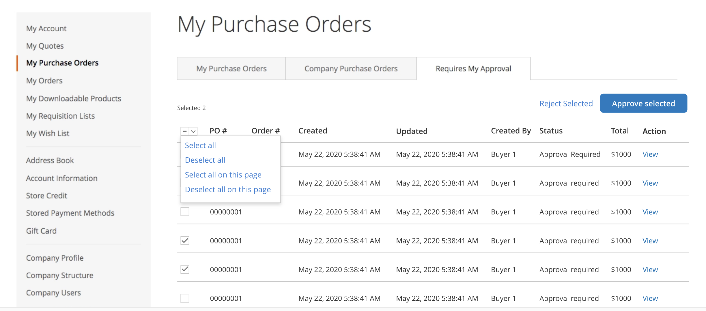

# [!UICONTROL My Purchase Orders]

Quando as ordens de compra são [habilitadas para uma empresa](purchase-order-flow.md), qualquer ordem de um cliente conectado a uma conta de usuário da empresa é automaticamente criada como uma ordem de compra (OC). Os usuários da empresa com as permissões necessárias podem criar, editar e excluir as OCs que eles criam, juntamente com as OCs criadas por usuários subordinados.

{width="700" zoomable="yes"}

>[!NOTE]
>
>Os Pedidos de Compra criam um _instantâneo_ dos preços de item, descontos e preços de envio no momento em que o pedido foi criado. Se o preço de um item for alterado depois que a OC for criada, será usado o preço original.

## Gerenciar ordens de compra

Na página _Exibir Ordem de Compra_, o cliente pode gerenciar a OC, dependendo de suas [permissões de função](account-company-roles-permissions.md).

- Para ver a OC, clique em **[!UICONTROL View]**.
- Para ver comentários sobre a OC, clique na guia **[!UICONTROL Comments]**.
- Para ver um histórico completo de pedidos, clique na guia **[!UICONTROL History Log]**.

>[!IMPORTANT]
>
>Se um item em uma ordem de compra estiver esgotado ou tiver quantidade insuficiente disponível, quando a ordem de compra for convertida em uma ordem real, ocorrerá um erro. Se as ordens pendentes estiverem ativadas, a ordem será processada normalmente.

## Nova ordem de compra a partir de ordem de compra existente

Se o cliente tiver uma ordem de compra existente e quiser adicionar novos itens, ele poderá gerar uma ordem de compra duplicada com novos produtos adicionados à nova OC. O cliente conclui as seguintes etapas:

1. Na página _Minha Ordem de Compra_, o cliente localiza a ordem de compra e clica no link **[!UICONTROL View]**.

1. O cliente clica em **[!UICONTROL Add Items to Shopping Cart]**.

   A página Carrinho de compras é aberta com todos os itens listados.

1. Faz adições ou alterações.

1. (Opcional) Usa o **[!UICONTROL Custom Reference Number]** para adicionar um número de fatura/OC interno ao pedido.

1. Segue o fluxo de trabalho de check-out normal e clica em **[!UICONTROL Place Purchase Order]**.

Se eles tiverem itens em seu carrinho de compras quando clicarem em _[!UICONTROL Add Items to Shopping Cart]_, o sistema exibirá uma caixa de diálogo. Essa caixa de diálogo permite que eles escolham entre mesclar os itens do carrinho com os novos itens ou substituir os itens no carrinho de compras pelos itens na OC.

A ordem de compra original poderá ser fechada se não for mais necessária.

## Aprovações de ordem de compra

Para um cliente designado como aprovador com base na estrutura da empresa ou na função atribuída da empresa, a página do painel _[!UICONTROL My Purchase Orders]_&#x200B;exibe a guia **[!UICONTROL Requires My Approval]**. O cliente clica nessa guia para revisar OCs que estão aguardando sua aprovação. O contador mostra quantos pedidos estão aguardando aprovação.

Depois de clicar em **[!UICONTROL View]** para uma ordem de compra e examinar os detalhes, o aprovador pode clicar em **[!UICONTROL Approve]** ou **[!UICONTROL Reject]**.

### Aprovação/rejeição em massa

A partir do Adobe Commerce 2.4.1, os aprovadores podem aprovar ou rejeitar várias ordens de compra de uma vez.

1. Na página _[!UICONTROL My Purchase Order]_, clique na guia **[!UICONTROL Requires My Approval]**.

1. Marque a caixa de seleção para cada ordem de compra a ser aprovada ou rejeitada.

1. Cliques **[!UICONTROL Approve Selected]** ou **[!UICONTROL Reject Selected]**.

Um cliente pode selecionar somente as ordens de compra com um status que permita uma ação. Os administradores da empresa podem fazer aprovações ou rejeições em massa para quaisquer ordens de compra ativas em sua empresa.
