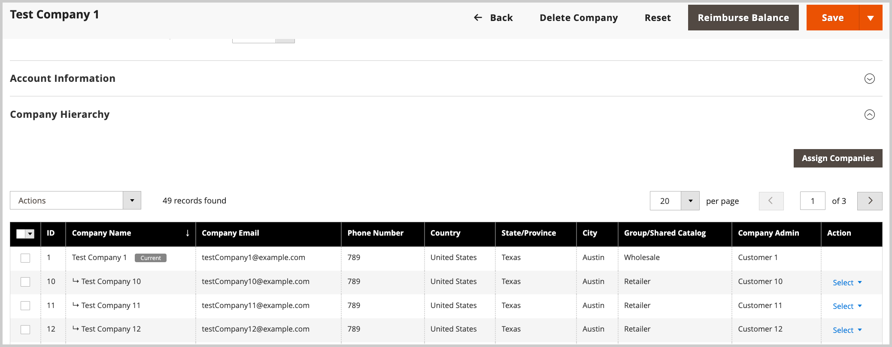

# Gerenciar o [!UICONTROL Company Hierarchy]

[!BADGE 1.5.0-beta]{type=Informative url="/help/b2b/release-notes.md" tooltip="Disponível somente para participantes do programa Beta"}

Os administradores podem criar um [!UICONTROL Company Hierarchy] atribuindo empresas relacionadas a uma empresa principal designada, que é a empresa no topo da organização. Se a [!UICONTROL Company Type] for `Company`, a empresa não fará parte de uma organização e está qualificada para se tornar uma empresa principal ou ser atribuída a uma empresa principal existente.

No Administrador, você gerencia atribuições de empresa editando uma empresa e atualizando a configuração [!UICONTROL Company Hierarchy] para atribuir ou cancelar atribuições de empresas.

{width="700"}

>[!NOTE]
>
>Para obter detalhes sobre a grade [!UICONTROL Company Hierarchy], consulte as descrições dos campos [Hierarquia da Empresa](account-company-create.md#company-hierarchy).

## Atribuir empresas a uma organização

1. Na barra lateral _Admin_, navegue até **[!UICONTROL Customers]** > **[!UICONTROL Companies]**.

   {width="700" zoomable="yes"}

1. Na grade [!UICONTROL Companies], abra a página de detalhes da empresa para criar as atribuições.

   - Para atribuir empresas adicionais a uma empresa principal existente, selecione a ação **[!UICONTROL Edit]** para a empresa principal.
   - Para criar uma empresa principal, selecione a ação **[!UICONTROL Edit]** para que a empresa designe como principal.

     Não é possível criar uma empresa principal a partir de uma empresa principal ou secundária existente.

1. Na página de detalhes da empresa, expanda **[!UICONTROL Company Hierarchy]**.

   {width="700" zoomable="yes"}

   A grade mostra as atribuições de empresa existentes, se houver. A empresa principal sempre está posicionada na parte superior da grade [!UICONTROL Company Hierarchy]. O sinalizador `[!UICONTROL Current]` indica a empresa que está sendo editada.

1. Adicionar empresas à organização principal.

   - Escolha em uma lista de empresas disponíveis, selecionando **[!UICONTROL Assign Companies]**.

   - **Selecione Tudo nesta Página** ou selecione um ou mais itens de linha da empresa específicos.

   - Selecione **[!UICONTROL Assign Selected Companies]**.

   - Conclua a atribuição da empresa selecionando **[!UICONTROL Assign]**.

     {width="675" zoomable="yes"}

## Cancelar atribuição de empresas a uma empresa principal

1. Na barra lateral _Admin_, navegue até **[!UICONTROL Customers]** > **[!UICONTROL Companies]**.

   {width="700" zoomable="yes"}

1. Na grade [!UICONTROL Companies], abra a página de detalhes da empresa principal selecionando **[!UICONTROL Edit]**.

1. Exiba a lista de empresas atribuídas expandindo **[!UICONTROL Company Hierarchy]**.

1. Na grade [!UICONTROL Company Hierarchy], cancele a atribuição de uma empresa usando o controle de ação **[!UICONTROL Select]** para escolher **[!UICONTROL Unassign from parent]**.

   {width="700" zoomable="yes"}

1. Quando solicitado, remova a empresa atribuída da hierarquia selecionando **[!UICONTROL Unassign]**.
