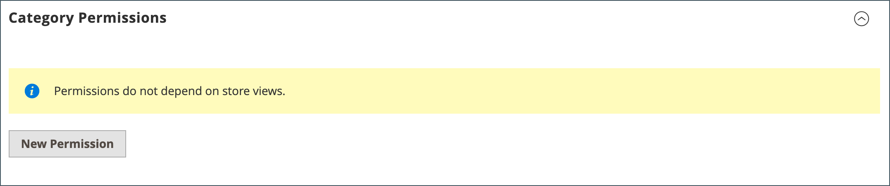
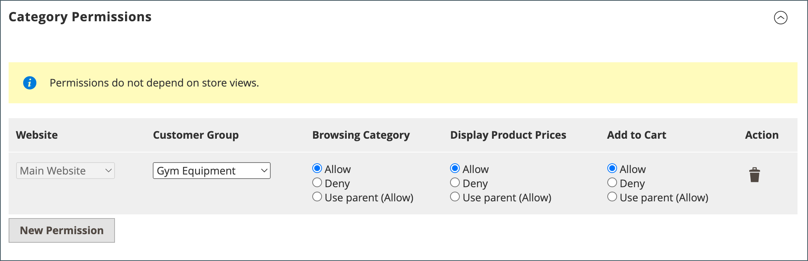

# Gerenciar seus catálogos compartilhados

A página _[!UICONTROL Shared Catalogs]_&#x200B;fornece acesso às ferramentas necessárias para gerenciar seus catálogos compartilhados, incluindo seleção de produtos, preços personalizados, permissões de categoria e detalhes de catálogo. A página é semelhante ao espaço de trabalho padrão de Administração, com filtros e controles de ação. A grade lista todos os catálogos compartilhados, incluindo o catálogo público compartilhado padrão e todos os catálogos personalizados que você configurou.

Se a extensão [!DNL Adobe Commerce Optimizer Connector for B2B] estiver instalada, a página também fornecerá acesso às [!DNL Adobe Commerce Optimizer] exibições de catálogo criadas quando o conector sincroniza dados de cada catálogo compartilhado para [!DNL Adobe Commerce Optimizer], e às chaves de acesso restritas que protegem as exibições de catálogo para experiências da loja B2B.

## Atualizar a seleção de produtos

A seleção de produtos em qualquer catálogo compartilhado pode ser facilmente atualizada a partir da coluna _[!UICONTROL Action]_&#x200B;da grade de catálogos compartilhados. As alterações feitas estão visíveis para os membros de qualquer conta da empresa associada. O processo é o mesmo que escolher produtos para uma nova [estrutura de catálogo](catalog-shared-pricing-structure.md), exceto que o escopo da configuração não pode ser alterado.

1. Na barra lateral _Admin_, vá para **[!UICONTROL Catalog]** > **[!UICONTROL Shared Catalogs]**.

1. Para o catálogo compartilhado na grade, vá para a coluna **[!UICONTROL Action]** e selecione **[!UICONTROL Set Pricing and Structure]**.

   {width="700" zoomable="yes"}

1. Siga as instruções em [Etapa 2: Escolher produtos](catalog-shared-pricing-structure.md#step-2-choose-the-products).

   Você pode ignorar o primeiro item, pois o escopo de um catálogo compartilhado não pode ser alterado após ser salvo pela primeira vez.

Se você estiver trabalhando com um produto específico, a seção _[!UICONTROL Products In Shared Catalog]_&#x200B;listará cada catálogo compartilhado em que o produto está disponível. Para saber mais, consulte [Adicionar produtos a um catálogo compartilhado](catalog-shared-product-add.md).

{width="600" zoomable="yes"}

## Atualizar preços personalizados

Os preços personalizados de produtos em qualquer catálogo compartilhado podem ser facilmente atualizados na coluna Ação da grade Catálogos compartilhados. As alterações feitas estão visíveis na loja para membros da empresa associada ou grupo de clientes. O processo é o mesmo que definir preços personalizados para um novo [catálogo compartilhado](catalog-shared-pricing-structure.md), exceto que o escopo da configuração não pode ser alterado.

1. Na barra lateral _Admin_, vá para **[!UICONTROL Catalog]** > **[!UICONTROL Shared Catalogs]**.

1. Para o catálogo compartilhado na grade que você deseja atualizar, vá para a coluna **[!UICONTROL Action]** e selecione **[!UICONTROL Set Pricing and Structure]**.

1. Na página _[!UICONTROL Catalog Structure]_, clique em **[!UICONTROL Configure]**&#x200B;e siga um destes procedimentos:

   - No indicador de progresso, na parte superior da página, clique em **[!UICONTROL Pricing]**.
   - No canto superior direito, clique em **[!UICONTROL Next]**.

1. Siga as instruções em [Etapa 3: definir preços personalizados](catalog-shared-pricing-structure.md#step-3-set-custom-prices).

## Atualizar permissões de categoria

[Permissões de categoria](../catalog/category-permissions.md) são automaticamente definidas como `Allow` para produtos adicionados da árvore de categorias a um catálogo compartilhado. Posteriormente, você pode ajustar as permissões ou criar regras adicionais, conforme necessário.

>[!NOTE]
>
>**[Versão 1.3.0](release-notes.md#b2b-v130) e posterior** do B2B — Quando você cria um catálogo compartilhado, cada [permissão de categoria](../catalog/category-permissions.md) é definida como `Allow` para _[!UICONTROL Display Product Prices]_&#x200B;e_[!UICONTROL Add to Cart]_ para grupos de clientes atribuídos. Anteriormente, essas configurações eram automaticamente definidas como `Deny`, mesmo quando as permissões do catálogo eram definidas como `Allow`.

>[!IMPORTANT]
>
>**_[!UICONTROL Shared Catalog]_** substitui todas as [configurações de permissão de grupo](../configuration-reference/catalog/catalog.md#category-permissions) existentes para **_todas_** categorias no catálogo quando habilitado. [!UICONTROL Shared Catalog] controla totalmente todas as permissões de categoria no catálogo quando ele é habilitado.

1. Na barra lateral _Admin_, vá para **[!UICONTROL Catalog]** > **[!UICONTROL Categories]**.

1. Na árvore de categorias, selecione a categoria dos produtos que deseja atualizar.

   Para incluir todos os produtos, selecione a categoria de nível superior na árvore.

1. Role para baixo e expanda  na seção **[!UICONTROL Category Permissions]**.

1. Clique em **[!UICONTROL New Permission]** e faça o seguinte:

   {width="600" zoomable="yes"}

   - Escolha o **[!UICONTROL Customer Group]** que corresponde ao catálogo compartilhado e altere as configurações de permissão, conforme necessário.

     {width="600" zoomable="yes"}

   - Para criar uma regra de permissões para outro grupo de clientes, clique em **[!UICONTROL New Permissions]** e repita o processo.

   - Para excluir uma regra de permissão, clique no ícone da _Lixeira_ 

1. Quando terminar, clique em **[!UICONTROL Save]**.

## Atualizar os detalhes do catálogo

As informações detalhadas de qualquer catálogo compartilhado podem ser facilmente atualizadas na coluna Ação da grade Catálogos compartilhados. As alterações feitas são refletidas em qualquer conta da empresa associada.

{width="700" zoomable="yes"}

1. Na barra lateral _Admin_, vá para **[!UICONTROL Catalog]** > **[!UICONTROL Shared Catalogs]**.

1. Para o catálogo compartilhado que você deseja atualizar, vá para a coluna **[!UICONTROL Action]** e selecione **[!UICONTROL General Settings]**.

   {width="600" zoomable="yes"}

1. Atualize as informações detalhadas do catálogo conforme necessário.

   - Alterar o nome de um catálogo compartilhado também altera o nome do grupo de clientes correspondente.
   - Alterar o tipo de catálogo de `Custom` para `Public` converte o catálogo público existente em um catálogo personalizado. Todas as empresas associadas ao catálogo público original são reatribuídas à substituição. Um catálogo público não pode ser convertido em um catálogo personalizado.
   - Para identificar a classificação de imposto aplicada às compras feitas por meio do catálogo compartilhado, selecione o [!UICONTROL Customer Tax Class].

1. Quando terminar, clique em **[!UICONTROL Save]**.

## Gerenciar configuração de exibição de catálogo

Com a extensão [!DNL Adobe Commerce Optimizer Connector for B2B] instalada, a seção _[!UICONTROL Catalog Views]_&#x200B;de um catálogo compartilhado lista as exibições de catálogo [!DNL Adobe Commerce Optimizer] projetadas do catálogo compartilhado e permite gerenciar as chaves de acesso restrito que as protegem.

1. Na barra lateral _Admin_, vá para **[!UICONTROL Catalog]** > **[!UICONTROL Shared Catalogs]**.

1. Para o catálogo compartilhado que você deseja revisar, vá para a coluna **[!UICONTROL Action]** e selecione **[!UICONTROL General Settings]**.

1. No painel _[!UICONTROL Shared Catalog Information]_, selecione **[!UICONTROL Catalog Views]**.

Para saber mais sobre exibições de catálogo e edição de chaves de acesso restrito, consulte [Gerenciar configuração de exibição de catálogo](catalog-views-manage.md).

## Referência de página do catálogo compartilhado

### Barra de botões

| Botão | Descrição |
| --- | --- |
| [!UICONTROL Back] | Retorna à página Catálogos compartilhados sem salvar o novo catálogo compartilhado. |
| [!UICONTROL Delete] | Exclui o catálogo e reatribui qualquer empresa associada e seus membros ao catálogo público compartilhado. |
| [!UICONTROL Reset] | Limpa o formulário de qualquer alteração não salva e restaura as informações detalhadas do catálogo original. |
| [!UICONTROL Duplicate] | Cria uma [cópia duplicada do catálogo](catalog-shared-create.md). Para um catálogo personalizado, o modelo de precificação e a estrutura do original, mas sem as associações de empresa. Se um catálogo compartilhado público for duplicado, o tipo de catálogo duplicado será alterado para `custom`. Um grupo de clientes correspondente também é criado com o mesmo nome do catálogo duplicado. Por padrão, um catálogo duplicado é denominado _Duplicate of_ do catálogo original. |
| [!UICONTROL Save and Continue Edit] | Salva todas as alterações e mantém o formulário aberto no modo de edição. |
| [!UICONTROL Save] | Salva alterações, fecha o formulário e retorna à página Catálogos compartilhados. |

{style="table-layout:auto"}

### Detalhes do catálogo

| Campo | Descrição |
| --- | --- |
| [!UICONTROL Name] | Identifica o catálogo compartilhado em todo o Administrador e nas contas de cliente em que ele está disponível. O nome do catálogo deve ser descritivo e não deve ter mais de 32 caracteres. Você não pode ter dois catálogos compartilhados com o mesmo nome. Máximo de caracteres: 32 |
| [!UICONTROL Type] | **[!UICONTROL Custom]** - Identifica um catálogo com preços personalizados que está disponível somente para as empresas específicas às quais ele está atribuído. **[!UICONTROL Public]**- Identifica o catálogo compartilhado que está disponível para todos os visitantes convidados e para clientes conectados que não estão associados a uma empresa. Um catálogo público compartilhado &quot;padrão&quot; é criado quando o Adobe Commerce B2B é instalado, mas deve ser configurado pelo administrador. Somente um catálogo público compartilhado pode existir por vez. |
| [!UICONTROL Customer Tax Class] | Determina a classe de imposto usada para compras feitas do catálogo. As opções incluem todas as classes de imposto disponíveis. A classe de imposto está associada ao grupo de clientes criado ou usado para o catálogo compartilhado. Consulte [Classes de imposto](../stores-purchase/tax-class.md). |
| [!UICONTROL Description] | Uma breve explicação de como o catálogo deve ser usado. |

{style="table-layout:auto"}

### Exibições de catálogo

{{$include /help/_includes/catalog-views-reference-table.md}}
