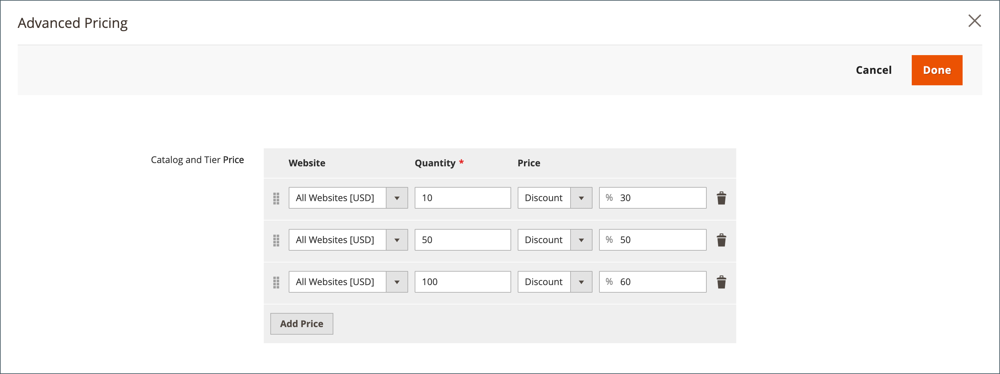

# Definir preço e estrutura do catálogo compartilhado

A definição de preços e da estrutura de um catálogo compartilhado é um processo de duas etapas. O local atual no processo é realçado com um número na barra de progresso na parte superior da página. É possível exibir a outra etapa do processo a qualquer momento, clicando na barra de progresso. Por exemplo, se estiver trabalhando em preços personalizados, talvez você queira retornar à página de seleção de produto para referência. Basta clicar em **[!UICONTROL Products]** na barra de progresso, na parte superior da página, e clique em **[!UICONTROL Pricing]** para retornar à página de preços personalizados. Seu trabalho não está perdido neste processo.

{width="700" zoomable="yes"}

Na árvore de categorias padrão, a categoria raiz é o contêiner mais acima e é chamada de _Categoria padrão_ nos dados de amostra. No entanto, quando os catálogos compartilhados são ativados, a árvore de categoria tem um container externo chamado _Catálogo raiz_. O catálogo raiz abrange todas as outras estruturas de categoria existentes no sistema. Para obter mais informações, consulte [Escopo do catálogo](../catalog/introduction.md#catalog-scope).

## Etapa 1: Abrir a configuração de estrutura e preços do catálogo compartilhado

1. No _Admin_ barra lateral, vá para **[!UICONTROL Catalog]** > **[!UICONTROL Shared Catalogs]**

1. Para o catálogo compartilhado na grade, vá para a _[!UICONTROL Action]_e clique em **[!UICONTROL Set Pricing and Structure]**.

   {width="700" zoomable="yes"}

1. Na primeira vez que o catálogo compartilhado for configurado, clique em **[!UICONTROL Configure]** para continuar com as etapas a seguir.

## Etapa 2: Escolher os produtos

A primeira etapa do processo é escolher os produtos que deseja incluir no catálogo compartilhado. A página de seleção de produtos apresenta a [árvore de categoria](../catalog/category-create.md) à esquerda e uma grade de produtos sincronizada à direita. Se você clicar em uma categoria na árvore, os produtos na categoria aparecerão na grade.

Somente as categorias com produtos selecionados aparecem na [navegação superior](../catalog/navigation-top.md) quando o catálogo compartilhado é exibido na loja. Por padrão, apenas os três primeiros níveis de categoria são incluídos na navegação da loja, não incluindo a categoria raiz.

1. Use o **Loja** seletor para definir o [escopo](../catalog/introduction.md#product-scope) da configuração.

   O escopo da configuração só pode ser definido antes que o catálogo compartilhado seja salvo pela primeira vez. Posteriormente, se você editar a seleção de produtos, o seletor da Loja não estará disponível.

   {width="600" zoomable="yes"}

1. Na árvore de categorias, siga um destes procedimentos:

   - Para incluir todos os produtos, clique **[!UICONTROL Select all]** ou marque a caixa de seleção da categoria principal.
   - Para incluir categorias específicas de produtos, marque a caixa de seleção de cada categoria que deseja incluir.
   - Para incluir ou excluir um produto individual, marque ou desmarque a caixa de seleção do produto.

   A notação abaixo de cada categoria na árvore mostra o número de produtos da categoria atualmente incluídos no catálogo compartilhado. A notação abaixo de [categoria raiz](../catalog/category-root.md) mostra o número total de produtos de todas as categorias atualmente selecionadas para o catálogo compartilhado.

1. Para exibir produtos de categoria na grade, clique no nome da categoria na árvore. Quando uma categoria é selecionada, ocorre o seguinte:

   - O botão de alternância na primeira coluna da grade é definido como verde _Ligado_ posição para cada produto selecionado.
   - Se um produto for atribuído a várias categorias e não for selecionado em uma delas, ele permanecerá disponível em outras categorias e também ao usar [pesquisa no catálogo](../catalog/search.md).
   - O sistema define automaticamente [Permissões de categoria](../catalog/category-permissions.md) para `Allow` para os produtos selecionados.

1. Se necessário, use os filtros e outros controles de grade para localizar os produtos que deseja incluir no catálogo compartilhado.

   Você pode selecionar ou omitir produtos individualmente clicando no botão de alternância na primeira coluna.

   Se você selecionar uma categoria que não tem produtos, mas está vinculada ao conteúdo CMS ou a um link externo, ela será exibida na navegação superior da loja.

   As configurações de categoria definidas não são gravadas permanentemente no banco de dados até que a configuração seja salva. No entanto, elas são salvas temporariamente enquanto você trabalha na estrutura e nos preços.

1. Clique em **[!UICONTROL Next]**.

   {width="600" zoomable="yes"}

## Etapa 3: Definir preços personalizados

Você pode definir preços personalizados para cada produto individualmente ou usar o _[!UICONTROL Action]_controle para definir preços personalizados como um valor ou porcentagem fixa para vários registros de produto.

- **[!UICONTROL Fixed]**: especifica o preço final do produto. Por exemplo, se você inserir um preço fixo de USD$ 10,00, o preço na vitrine da empresa correspondente será USD$ 10,00.

  >[!NOTE]
  >
  >O valor mínimo entre o Preço Base e o valor Fixo inserido é usado como o preço final do produto.

  >[!NOTE]
  >
  >**_Preço Fixo_** produto As opções personalizáveis são _não_ afetados pelas regras de Preço do Grupo, Preço da Camada, Preço Especial ou Preço do Catálogo.

- **[!UICONTROL Percentage]**: determina o preço personalizado com base no percentual de desconto. Por exemplo, para oferecer um desconto de 10%, defina o tipo de preço personalizado como `Percentage` e insira `10`. O preço personalizado com desconto é 90% do preço original do produto.

Para definir o desconto como um valor fixo ou uma porcentagem para os seguintes tipos de produto, use o _[!UICONTROL Custom Price]_coluna na grade:

- [Simples](../catalog/product-create-simple.md) (incluindo variações de produtos configuráveis)
- [Pacote](../catalog/product-create-bundle.md)
- [Baixável](../catalog/product-create-downloadable.md)
- [Virtual](../catalog/product-create-virtual.md)

A coluna Preço personalizado fica em branco para [configurável](../catalog/product-create-configurable.md) e [agrupado](../catalog/product-create-grouped.md) tipos de produtos e para [cartões-presente](../catalog/product-gift-card-create.md).

A seleção de produtos na grade não pode ser alterada de _Preços personalizados_ página. No entanto, é possível usar o indicador de progresso na parte superior da página para retornar à etapa anterior e alterar a seleção de produtos.

{width="600" zoomable="yes"}

### Aplicar um preço personalizado

1. Para uma instalação de vários sites, defina **[!UICONTROL Website]** ao sítio Internet onde se aplicam os preços personalizados.

   {width="600" zoomable="yes"}

1. Use um dos métodos a seguir para selecionar os produtos aos quais a precificação personalizada será aplicada.

   - Use a árvore de categorias para selecionar todos os produtos em uma categoria específica.
   - Defina o _[!UICONTROL Mass Actions]_controle no cabeçalho para `Select All`.
   - Marque a caixa de seleção de produtos individuais.

   A grade exibe os produtos nas categorias selecionadas no momento e você pode usar os controles padrão para localizar produtos e filtrar a lista.

   {width="600" zoomable="yes"}

1. Definir **[!UICONTROL Actions]** a um dos seguintes:

   - `Set Discount` - Aplica uma porcentagem de desconto a todos os produtos selecionados. Cada preço de produto afetado é exibido como um **_com desconto_** preço.
   - `Adjust Fixed Price` - Aplica um percentual de desconto de preço fixo a todos os produtos selecionados. Cada preço de produto afetado é exibido como um **_ajustado fixo_** preço.

   {width="600" zoomable="yes"}

1. Quando solicitado, insira o desconto ou o ajuste de preço e clique em **[!UICONTROL Apply]**.

   {width="400"} 

   {width="400"}

   O desconto é aplicado a todos os produtos selecionados e o _Preço personalizado_ A coluna reflete o tipo de desconto e o valor aplicado.

   {width="600" zoomable="yes"}

### Aplicar um preço de camada

[Nível de preços](../catalog/product-price-tier.md) permite oferecer um desconto por quantidade para produtos no catálogo compartilhado. A variável _Preço da camada_ a coluna da grade contém um link para a variável _Advanced Pricing_ que se aplicam especificamente ao catálogo compartilhado. Se o produto já incluir a definição de preços por níveis, o número de níveis existentes aparecerá entre parênteses após o link.

As instruções a seguir mostram como aplicar preços de camada a um único produto. Para aplicar preços de camada a vários produtos, consulte [Importar preços de camada](../systems/data-import-price-tier.md).

1. Para o produto na grade, vá para a _Preço da camada_ e clique em **[!UICONTROL Configure]**.

   {width="600" zoomable="yes"}

1. No _Advanced Pricing_ clique em **[!UICONTROL Add Price]** e faça o seguinte:

   {width="600" zoomable="yes"}

   - Definir **[!UICONTROL Website]** ao site onde se aplica o preço de nível.
   - Insira a quantidade do produto que deve ser comprado para receber o desconto.
   - Definir **[!UICONTROL Price]** para um dos seguintes tipos de desconto:
      - `Fixed`
      - `Discount`
   - Insira o valor do desconto.
   - Para inserir outra camada, clique em **Adicionar preço** e repita o processo para definir a próxima camada.

   {width="600" zoomable="yes"}

1. Quando terminar, clique em **[!UICONTROL Done]**.

   Na grade, o número de camadas é mostrado entre parênteses na variável _[!UICONTROL Tier Price]_coluna.

   {width="600" zoomable="yes"}

## Salvar a estrutura e os preços

Quando o preço personalizado estiver concluído, clique em **[!UICONTROL Generate Catalog]** depois **[!UICONTROL Save]**.

O catálogo compartilhado agora é salvo no banco de dados. Seu nome aparece no campo _[!UICONTROL Shared Catalog]_coluna da_[!UICONTROL Products]_ grade. O próximo passo é [atribuir o catálogo compartilhado a uma empresa](./catalog-shared-assign-companies.md).
