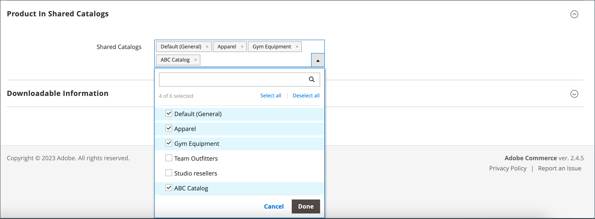

# Adicionar produtos a um catálogo compartilhado

Os produtos podem ser adicionados a um catálogo compartilhado individualmente ou em grupos de vários produtos por categoria.

Os seguintes requisitos devem ser atendidos para que um produto complexo (como pacote, agrupado ou configurável) fique visível na loja em um catálogo compartilhado:

- Todos os [produtos associados](../catalog/product-configurations.md) e opções devem ser atribuídos ao mesmo catálogo compartilhado e habilitados no catálogo principal.
- Para produtos [configuráveis](../catalog/product-create-configurable.md) e [agrupados](../catalog/product-create-grouped.md), somente os produtos associados habilitados estarão visíveis.
- Para um produto [pacote](../catalog/product-create-bundle.md), todas as opções devem ser incluídas no catálogo compartilhado.

  {width="600" zoomable="yes"}

## Método 1: adicionar um único produto

1. Na barra lateral _Admin_, vá para **[!UICONTROL Catalog]** > **[!UICONTROL Products]**.

1. Para o produto na grade que você deseja adicionar, vá para a coluna _[!UICONTROL Action]_e clique em **[!UICONTROL Edit]**.

1. Role para baixo, expanda  a seção _[!UICONTROL Product in Shared Catalogs]_e faça o seguinte:

   - Marque a caixa de seleção de cada catálogo compartilhado em que o produto deve aparecer. Para escolher todos os catálogos, clique em **[!UICONTROL Select all]**.

     {width="600" zoomable="yes"}

     O nome de cada catálogo selecionado aparece no campo _[!UICONTROL Shared Catalogs]_.

     {width="600" zoomable="yes"}

   - Clique em **[!UICONTROL Done]** para salvar as configurações.

1. Quando terminar, clique em **[!UICONTROL Save]**.

## Método 2: adicionar vários produtos

1. Na barra lateral _Admin_, vá para **[!UICONTROL Catalog]** > **[!UICONTROL Shared Catalogs]**.

1. Para o catálogo compartilhado na grade, vá para a coluna _[!UICONTROL Action]_e selecione **[!UICONTROL Set Pricing and Structure]**.

1. Na árvore de categorias, siga um destes procedimentos:

   - Para incluir todos os produtos, clique em **[!UICONTROL Select all]** ou marque a caixa de seleção da categoria principal.
   - Para incluir categorias específicas de produtos, marque a caixa de seleção de cada categoria que deseja incluir.
   - Para incluir ou excluir um produto individual, marque ou desmarque a caixa de seleção do produto.

   A notação abaixo de cada categoria na árvore mostra o número de produtos da categoria atualmente incluídos no catálogo compartilhado. A anotação abaixo da [categoria raiz](../catalog/category-root.md) mostra o número total de produtos de todas as categorias atualmente selecionadas para o catálogo compartilhado.

1. Para exibir produtos de categoria na grade, clique no nome da categoria na árvore.

   Quando uma categoria é selecionada, ocorre o seguinte:

   - O botão de alternância na primeira coluna da grade está definido como `On` para cada produto selecionado.
   - Se um produto for atribuído a várias categorias e omitido em uma delas, ele permanecerá disponível por meio das outras categorias e por meio da [pesquisa no catálogo](../catalog/search.md).
   - O sistema define automaticamente [Permissões de Categoria](../catalog/category-permissions.md) a `Allow` para os produtos selecionados.
