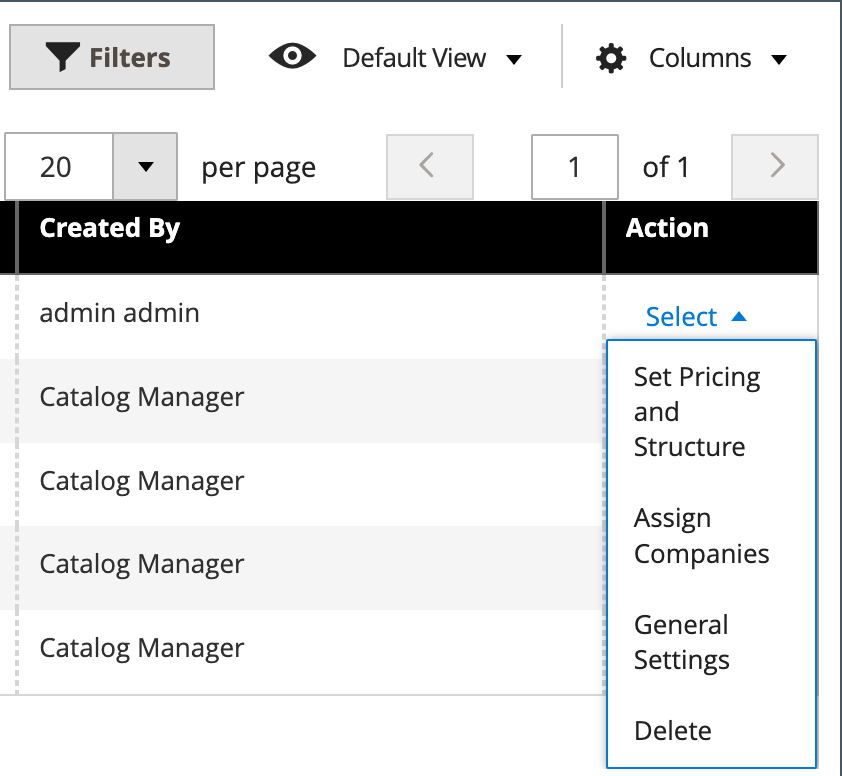

# Visão geral do catálogo compartilhado

O Adobe Commerce B2B oferece a capacidade de manter catálogos _compartilhados_ com barreira com preços personalizados para diferentes empresas. Além do catálogo de produtos padrão, _primário_, ele fornece ao cliente acesso a dois tipos de catálogos compartilhados com estruturas de preços diferentes.

Se o [recurso Catálogo Compartilhado](enable-basic-features.md) estiver habilitado na configuração, o catálogo primário original permanecerá visível do Administrador, mas somente o catálogo compartilhado público Padrão (Geral) ficará visível da loja. Além disso, é possível criar catálogos personalizados que só podem ser exibidos para membros de contas da [empresa](account-companies.md) específicas.

Para o catálogo compartilhado público de `Default (General)`, você deve atribuir produtos para exibir o catálogo na loja. Por padrão, está vazio e não contém nenhum produto.

>[!NOTE]
>
>**[Versão 1.3.0](release-notes.md#b2b-v130) e posterior** do B2B — Quando você cria um catálogo compartilhado, cada [permissão de categoria](../catalog/category-permissions.md) para o catálogo é definida como _[!UICONTROL Allow for the Display Product Prices]_&#x200B;e&#x200B;_[!UICONTROL Add to Cart]_ para grupos de clientes aos quais é atribuído esse acesso nas configurações de permissão do catálogo. Anteriormente, essas configurações eram automaticamente definidas como `Deny`, mesmo quando as permissões do catálogo eram definidas como `Allow`.

>[!IMPORTANT]
>
>Todas as [configurações de permissão de grupo](../configuration-reference/catalog/catalog.md#category-permissions) existentes são ignoradas por **_todas_** categorias no catálogo quando o recurso **_[!UICONTROL Shared Catalog]_** está habilitado. [!UICONTROL Shared Catalog] controla totalmente todas as permissões de categoria no catálogo quando ele é habilitado.

A página _[!UICONTROL Shared Catalogs]_&#x200B;fornece acesso às ferramentas usadas para gerenciar seus catálogos compartilhados. A página é semelhante ao [espaço de trabalho de administração](../getting-started/admin-workspace.md) padrão, com filtros e controles de ação. A grade lista todos os catálogos compartilhados, incluindo o catálogo público compartilhado padrão e todos os catálogos personalizados que você configurou.

{width="700" zoomable="yes"}

## Acessar a página [!UICONTROL Shared Catalogs]

Na barra lateral _Admin_, vá para **[!UICONTROL Catalog]** > **[!UICONTROL Shared Catalogs]**.

## Controles de ações

Os [controles de ações](../getting-started/admin-actions-control.md) no canto superior esquerdo podem ser usados com o controle de ações em massa para excluir catálogos compartilhados selecionados que não são mais necessários. Na grade, a coluna _[!UICONTROL Actions]_&#x200B;contém a seleção completa de ferramentas para gerenciar seus catálogos compartilhados.

{width="350"}

| Controle | Descrição |
|------|-----------|
| [[!UICONTROL Set Pricing and Structure]](catalog-shared-pricing-structure.md) | Determina a seleção de produto e o preço personalizado disponíveis no catálogo compartilhado. |
| [[!UICONTROL Assign Companies]](catalog-shared-assign-companies.md) | Determina quais empresas podem acessar um catálogo compartilhado. |
| [[!UICONTROL General Settings]](catalog-shared-manage.md) | Determina as informações detalhadas do catálogo, incluindo nome, tipo de catálogo, classe de imposto do cliente e descrição. |
| [!UICONTROL Delete] | Exclui os catálogos compartilhados selecionados. |

{style="table-layout:auto"}

## Descrições da coluna

| Cabeçalho | Descrição |
|--- |--- |
| [!UICONTROL Select] | Seleciona registros de catálogo compartilhado para aplicar uma ação. O controle no cabeçalho pode ser usado para selecionar todos ou desmarcar todos os registros de catálogo compartilhados na grade. Para selecionar um catálogo compartilhado individual, marque a caixa de seleção. |
| [!UICONTROL ID] | Um identificador numérico exclusivo atribuído em sequência quando o catálogo é criado. |
| [!UICONTROL Name] | O nome do catálogo compartilhado. Por padrão, o catálogo compartilhado padrão (Geral) está disponível. |
| [!UICONTROL Type] | Identifica o tipo de catálogo compartilhado como:  **[!UICONTROL Public]**- O catálogo compartilhado público padrão é criado automaticamente quando o Adobe Commerce B2B é instalado. Inicialmente, ele é atribuído aos grupos de clientes `General` e `Not Logged In`, e é visível para convidados e clientes individuais conectados que não estão associados a uma empresa. O sistema oferece suporte a apenas um catálogo público compartilhado por vez. **[!UICONTROL Custom]** - Um catálogo compartilhado personalizado contém preços que são visíveis apenas para associados conectados das contas atribuídas da empresa. Você pode criar quantos catálogos compartilhados personalizados forem necessários. |
| [!UICONTROL Customer Tax Class] | A classe de imposto atribuída ao grupo de clientes correspondente. Essa coluna não aparece na grade padrão, mas pode ser adicionada alterando o layout da coluna. |
| [!UICONTROL Created At] | A data e a hora em que o catálogo compartilhado foi criado. |
| [!UICONTROL Created By] | O nome e o sobrenome do administrador de armazenamento que criou o catálogo compartilhado. |
| [!UICONTROL Action] | Lista as ações que serão aplicadas aos catálogos selecionados. Opções: `Set Pricing and Structure` / `Assign Companies` / `General Settings` / `Delete` |

{style="table-layout:auto"}
