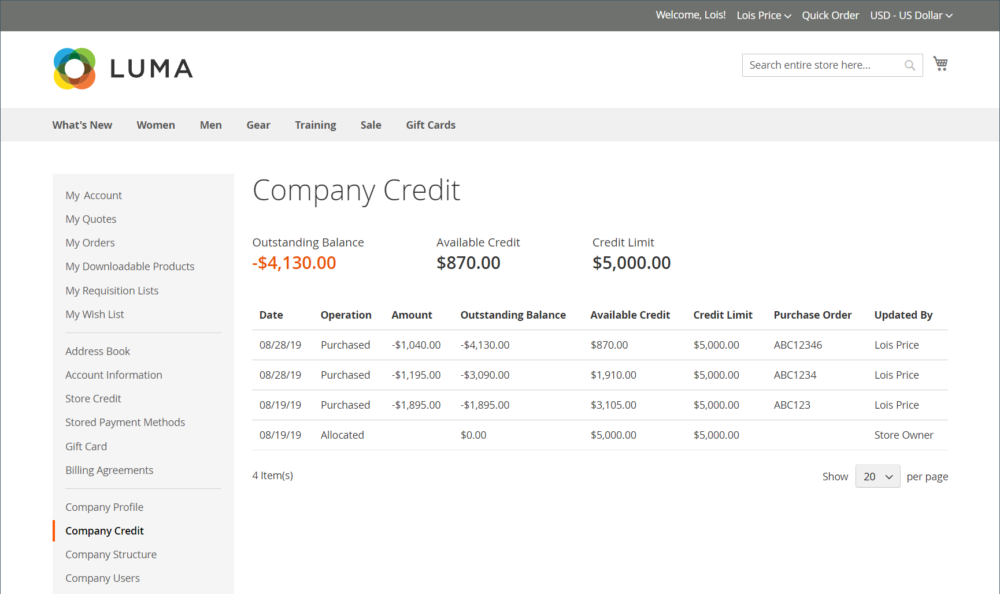

# Gerenciar crédito da empresa

Se o [Pagamento na Conta](../getting-started/../b2b/enable-basic-features.md#configure-payment-on-account) estiver habilitado na configuração, as empresas poderão fazer compras em suas contas até o limite de crédito concedido à empresa. Quando ativado, os clientes podem verificar o status do crédito da empresa no painel de conta.

{width="700" zoomable="yes"}

Você pode definir os seguintes parâmetros relacionados a crédito para cada perfil de empresa:

- Moeda de crédito
- Limite de crédito
- Permitir que o limite de crédito seja excedido
- Motivo da alteração

Se a empresa tiver um saldo pendente, um aviso ao administrador da loja aparecerá na parte superior da ordem de venda quando for exibido pelo Administrador. Para saber mais, consulte [Criar uma conta de empresa](account-company-create.md).

## Atividade de crédito da empresa

A seção [!UICONTROL Company Credit] do perfil da empresa exibe um resumo da atividade de crédito do cliente, com uma grade do histórico de crédito da empresa.

{width="700" zoomable="yes"}

| Coluna | Descrição |
|--- |--- |
| [!UICONTROL Date] | A data da transação. Para exibir a data e a hora, passe o mouse sobre a data. |
| [!UICONTROL Operation] | O tipo de atividade associada à transação. Valores:  **[!UICONTROL Allocated]**- Crédito atribuído à empresa. **[!UICONTROL Updated]** - Uma alteração foi aplicada a um dos seguintes campos: [!UICONTROL Credit limit] / [!UICONTROL Credit currency] / [!UICONTROL Allow to exceed credit limit]  **[!UICONTROL Purchased]**- Um pedido foi feito. **[!UICONTROL Reimbursed]** - O saldo pendente foi reembolsado.  **[!UICONTROL Refunded]**- Valor do memorando de crédito reembolsado. **[!UICONTROL Reverted]** - O pedido foi cancelado e o valor foi devolvido ao saldo de crédito. |
| [!UICONTROL Amount] | O valor da transação associado aos seguintes tipos de transação: `Purchased` / `Reimbursed` / `Refunded` / `Reverted`  Para valores de compra, o valor aparece na moeda de exibição do armazenamento e no formato da configuração de moeda de crédito, seguido da taxa de conversão atual (se aplicável). Por exemplo:  EUR 20.000,00 ($22.400,00)  USD/EUR 0,8928 |
| [!UICONTROL Outstanding Balance] | O valor reembolsado, menos o total devido de todos os pedidos feitos usando o método Pagamento por Conta. O valor pode aparecer como um valor positivo ou negativo.  **[!UICONTROL Positive value]**- Um pagamento antecipado é representado como um valor positivo. **[!UICONTROL Negative value]** - Um valor devido é representado como um valor negativo. |
| [!UICONTROL Available Credit] | A soma de _[!UICONTROL Credit Limit]_&#x200B;e_[!UICONTROL Outstanding Balance]_. Se a empresa excedeu o limite de crédito, o valor aparece como um valor negativo. |
| [!UICONTROL Credit Limit] | O valor do crédito estendido para a empresa. |
| [!UICONTROL Updated By] | O nome da pessoa que iniciou a operação. |
| [!UICONTROL Custom Reference Number] | O número de referência personalizado associado à transação. |
| [!UICONTROL Comment] | Uma compilação dos valores do campo `Reason for Change`, de acordo com o tipo de operação.  **[!UICONTROL Purchased]**- Inclui comentários da compra, o número do pedido e o link para o pedido. **[!UICONTROL Reimbursed]** - Inclui comentários da transação reembolsada. |
| [!UICONTROL Action] | Somente para `Reimbursed` operações. **[!UICONTROL Edit]** - Permite que o valor de reembolso seja atualizado. |

{style="table-layout:auto"}

## Atualizar as informações de crédito

Quando o cliente faz o pagamento de seu crédito pendente para o comerciante, um administrador de loja deve atualizar as informações de crédito do cliente no Administrador.

1. Na barra lateral _Admin_, vá para **Clientes > Empresas**.

1. Localize a empresa na grade e abra-a no modo _Editar_.

1. Expanda a seção **Crédito da Empresa**.

1. Para **Limite de Crédito**, insira o novo valor.

1. Altere os outros valores conforme necessário.

1. Quando as atualizações estiverem concluídas, clique em **[!UICONTROL Save]**.

## Receber Pagamentos

Um saldo reembolsado é um pagamento off-line feito por uma empresa em relação ao saldo de sua conta. O administrador de loja insere o valor manualmente no perfil da empresa, usando o botão _Reembolsar Saldo_. Quando o valor é enviado, o sistema recalcula o saldo pendente e o crédito disponível da empresa e registra a ação no histórico de crédito da empresa. O valor reembolsado é inserido na moeda de crédito, conforme especificado na configuração.

### Aplicar um pagamento a uma conta da empresa

1. Na barra lateral _Admin_, vá para **[!UICONTROL Customers]** > **[!UICONTROL Companies]**.

1. Localize o registro da empresa na lista e abra-o no modo **[!UICONTROL Edit]**.

1. Na parte superior da página, clique em **Reembolsar saldo**.

1. Na caixa de diálogo, adicione as informações de pagamento:

   {width="500"}

   - Insira o **Valor** do pagamento.

     O valor pode ser inserido como um valor positivo ou negativo.

   - Se aplicável, insira o **Número de Referência Personalizado** para referência.

     Somente um número de referência personalizado pode ser inserido por reembolso. Para aplicar o pagamento a várias OCs, crie um reembolso separado para cada uma.

   - Conforme necessário, insira um **Comentário** para descrever o reembolso.

1. Clique em **Reembolso**.

   O saldo pendente e o crédito disponível da empresa são recalculados e o histórico de Crédito da Empresa é atualizado para refletir o reembolso.

### Editar um reembolso

1. Abra o perfil da empresa no modo **[!UICONTROL Edit]**.

1. Expanda  a seção **Crédito da Empresa**.

1. Localize a transação de reembolso na grade e clique em **[!UICONTROL Edit]**.

1. Faça as alterações necessárias no **Número de Referência Personalizado** e no **Comentário**.

   O valor do reembolso não pode ser alterado.

1. Clique em **[!UICONTROL Save]**.

## Informações de crédito da vitrine

Para o administrador da empresa, o painel de contas exibe a seção _Crédito da Empresa_. Ele fornece o saldo pendente atual, o crédito disponível e o limite de crédito alocado à conta da empresa, seguido de uma lista de faturas pendentes.

Se o comerciante cancelar um pedido que foi cobrado de crédito da empresa, o valor do pedido será retornado ao saldo da empresa e o _Histórico de Alocação de Crédito_ incluirá um registro da ação.

{width="700" zoomable="yes"}

## Demonstração de crédito da empresa

Saiba mais sobre como gerenciar o crédito da empresa assistindo a este vídeo de demonstração:

>[!VIDEO](https://video.tv.adobe.com/v/344445?quality=12&learn=on)
