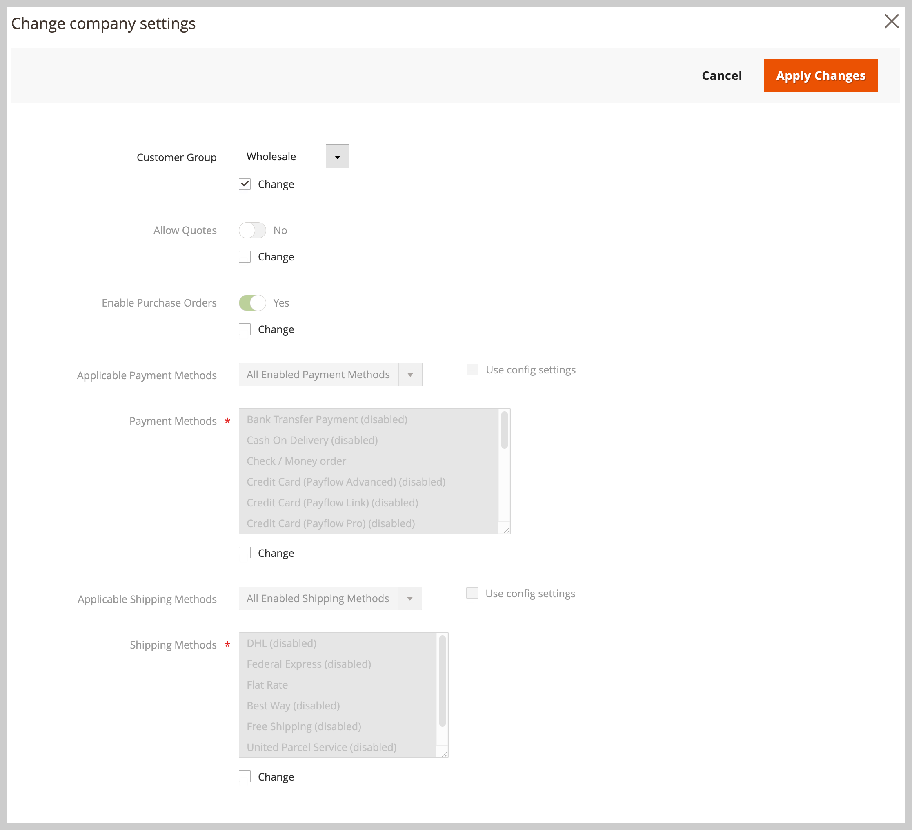

# Gerenciar o [!UICONTROL Company Hierarchy]

Os administradores podem criar um [!UICONTROL Company Hierarchy] atribuindo empresas relacionadas a uma empresa principal designada, que é a empresa no topo da hierarquia organizacional.

No Administrador, crie uma empresa principal editando uma empresa individual (`[!UICONTROL Company Type] = Company`) e atribuindo empresas relacionadas na configuração [!UICONTROL Company Hierarchy].

{width="700"}

>[!NOTE]
>
>Para obter detalhes sobre a grade [!UICONTROL Company Hierarchy], consulte as descrições dos campos [Hierarquia da Empresa](account-company-create.md#company-hierarchy).

Gerencie atribuições de empresa editando uma empresa principal e usando a grade *[!UICONTROL Company Hierarchy]* para adicionar ou remover empresas. Use o controle *[!UICONTROL Actions]* para gerenciar a [configuração avançada](#change-company-settings) para empresas na organização.

## Atribuir empresas a uma empresa principal

1. Na barra lateral _Admin_, navegue até **[!UICONTROL Customers]** > **[!UICONTROL Companies]**.

   {width="700" zoomable="yes"}

1. Na grade [!UICONTROL Companies], abra a página de detalhes da empresa para criar as atribuições.

   - Para atribuir empresas adicionais a uma empresa principal existente, selecione a ação **[!UICONTROL Edit]** para a empresa principal.
   - Para criar uma empresa principal, selecione a ação **[!UICONTROL Edit]** para a empresa designada como principal.

     Não é possível criar uma nova empresa pai a partir de uma empresa pai ou filho existente.

1. Na página Detalhes da empresa, expanda **[!UICONTROL Company Hierarchy]** e selecione **[!UICONTROL Assign Companies]**.

   {width="675" zoomable="yes"}

1. Na lista de empresas disponíveis, escolha as empresas a serem atribuídas e selecione **[!UICONTROL Assign Selected Companies]**.

   {width="675" zoomable="yes"}

1. Quando solicitado, conclua a atribuição da empresa selecionando **[!UICONTROL Assign]**.

## Cancelar atribuição de empresas a uma empresa principal

1. Na página Empresas, abra a página de detalhes da empresa principal selecionando a ação **[!UICONTROL Edit]**.

   {width="700" zoomable="yes"}

1. Exiba a lista de empresas atribuídas expandindo **[!UICONTROL Company Hierarchy]**.

1. Remover a empresa da organização.

   - Na coluna [!UICONTROL Action] para a empresa a ser removida, **[!UICONTROL Select]** > **[!UICONTROL Unassign from parent]**.

     {width="640" zoomable="yes"}

   - Quando solicitado, remova a empresa atribuída da hierarquia selecionando **[!UICONTROL Unassign]**.

## Gerenciar configurações da empresa para uma organização

Atualize a configuração [Configurações Avançadas](account-company-create.md#advanced-settings) de uma organização para aplicar a configuração pai a todas as empresas filho ou para aplicar as mesmas configurações às empresas selecionadas na organização.

Durante o processo de atualização, os valores da configuração inicial são padronizados para os valores atuais configurados para a empresa principal. Você deve alterar pelo menos uma configuração para atualizar a configuração de empresas selecionadas.

**Alterar a configuração de Configurações Avançadas para várias empresas**

1. Na barra lateral _Admin_, navegue até **[!UICONTROL Customers]** > **[!UICONTROL Companies]**.

1. Na grade [!UICONTROL Companies], edite a empresa principal selecionando **[!UICONTROL Edit]** na coluna **[!UICONTROL Action]**.

1. Na página de detalhes da empresa principal, expanda a seção **[!UICONTROL Company Hierarchy]** para exibir as empresas incluídas na organização.

1. Selecione as empresas a serem configuradas.

   {width="675" zoomable="yes"}

1. No controle **[!UICONTROL Actions]** acima da grade, selecione **[!UICONTROL Change company settings]**.

   {width="675" zoomable="yes"}

1. Altere a configuração das configurações.

   - Na página [!UICONTROL Change company settings], encontre a definição de configuração a ser modificada.

   - Marque a caixa de seleção **[!UICONTROL Change]** para habilitar a configuração.

   - Atualize o valor conforme necessário.

     {width="575" zoomable="yes"}

1. Depois de atualizar a configuração, selecione **[!UICONTROL Apply Changes]**.

1. Quando solicitado, selecione **[!UICONTROL Change settings]** para atualizar a configuração das empresas selecionadas.

>[!TIP]
>
>Gerencie as configurações avançadas de uma única empresa editando o item de linha da empresa.
