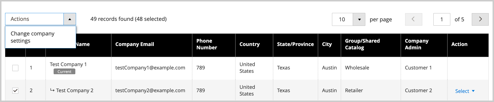

# Gerenciar hierarquias da empresa

O recurso [!UICONTROL Company Hierarchy] permite organizar várias empresas relacionadas em uma única estrutura de empresa principal. Isso é ideal para empresas com subsidiárias, franquias, vários locais ou estruturas organizacionais complexas que precisam de gerenciamento centralizado e, ao mesmo tempo, mantêm identidades de empresas individuais.

## Casos de uso

* **Gerenciamento Centralizado**—Aplique definições e configurações em várias empresas de uma única empresa pai
* **Manter Estrutura** — Organiza empresas em uma hierarquia lógica que reflete sua organização de negócios
* **Simplificar Operações**— Gerencie cotações, ordens de compra, métodos de pagamento e configurações de remessa para toda a organização
* **Preservar Autonomia** — As empresas individuais mantêm suas identidades enquanto se beneficiam de configurações compartilhadas

## Pré-requisitos

Antes de criar uma hierarquia de empresa, verifique se:

* Os recursos B2B são ativados na instalação do Commerce
* Você tem acesso de administrador para gerenciar empresas
* As empresas pai e filho já foram criadas como empresas individuais
* Você entende que a aplicação das configurações de pai substituirá as configurações de empresa filho existentes

## Como funciona

Os administradores podem criar uma hierarquia de empresa atribuindo empresas relacionadas a uma empresa principal designada, que é a empresa no topo da hierarquia organizacional.

No Administrador, crie uma empresa principal editando uma empresa individual (`[!UICONTROL Company Type] = Company`) e atribuindo empresas relacionadas na configuração [!UICONTROL Company Hierarchy].

{width="700"}

>[!NOTE]
>
>Para obter detalhes sobre a grade [!UICONTROL Company Hierarchy], consulte as descrições dos campos [Hierarquia da Empresa](account-company-create.md#company-hierarchy).

Gerencie atribuições de empresa editando uma empresa principal e usando a grade *[!UICONTROL Company Hierarchy]* para adicionar ou remover empresas. Use o controle *[!UICONTROL Actions]* para gerenciar a [configuração avançada](#change-company-settings) para empresas na organização.

## Atribuir empresas a uma empresa principal

1. Na barra lateral _Admin_, navegue até **[!UICONTROL Customers]** > **[!UICONTROL Companies]**.

   {width="700" zoomable="yes"}

1. Na grade [!UICONTROL Companies], abra a página de detalhes da empresa para criar as atribuições.

   * Para atribuir empresas adicionais a uma empresa principal existente, selecione a ação **[!UICONTROL Edit]** para a empresa principal.
   * Para criar uma empresa principal, selecione a ação **[!UICONTROL Edit]** para a empresa designada como principal.

     Não é possível criar uma nova empresa pai a partir de uma empresa pai ou filho existente.

1. Na página Detalhes da empresa, expanda **[!UICONTROL Company Hierarchy]** e selecione **[!UICONTROL Assign Companies]**.

   {width="675" zoomable="yes"}

1. Na lista de empresas disponíveis, escolha as empresas a serem atribuídas e selecione **[!UICONTROL Assign Selected Companies]**.

   {width="675" zoomable="yes"}

1. Quando solicitado, conclua a atribuição da empresa selecionando **[!UICONTROL Assign]**.

## Cancelar atribuição de empresas a uma empresa principal

1. Na página Empresas, abra a página de detalhes da empresa principal selecionando a ação **[!UICONTROL Edit]**.

   {width="700" zoomable="yes"}

1. Exiba a lista de empresas atribuídas expandindo **[!UICONTROL Company Hierarchy]**.

1. Remover a empresa da organização.

   * Na coluna [!UICONTROL Action] para a empresa a ser removida, **[!UICONTROL Select]** > **[!UICONTROL Unassign from parent]**.

     {width="640" zoomable="yes"}

   * Quando solicitado, remova a empresa atribuída da hierarquia selecionando **[!UICONTROL Unassign]**.

## Gerenciar configurações da empresa para uma organização

Atualize a configuração [Configurações Avançadas](account-company-create.md#advanced-settings) de uma organização. Você pode:

* Aplicar as definições de configuração pai a todas as empresas filho
* Aplicar as mesmas configurações às empresas selecionadas na organização

É possível aplicar qualquer uma das seguintes configurações:

* **Gerenciamento de Cotações**—Habilita ou desabilita a capacidade das empresas solicitarem e gerenciarem cotações
* **Ordens de Compra** — Controla se as empresas podem criar e gerenciar ordens de compra
* **Configuração do Método de Pagamento**—Defina quais métodos de pagamento estão disponíveis para as empresas
* **Configurações do Método de Pagamento**—Configure parâmetros e limites específicos do método de pagamento
* **Disponibilidade do Método de Remessa**—Defina quais métodos de remessa as empresas podem usar
* **Configuração do Método de Remessa**—Defina as configurações e restrições do método de remessa

Durante o processo de atualização, os valores da configuração inicial são padronizados para os valores atuais configurados para a empresa principal. Você deve marcar a caixa de seleção Alterar para que pelo menos uma configuração aplique configurações às empresas selecionadas. Você também pode atualizar o valor padrão de cada configuração antes de aplicar as alterações.

>[!WARNING]
>
>A aplicação das configurações da empresa principal substitui as configurações da empresa secundária existentes, incluindo limites de crédito, métodos de pagamento, configurações de envio e restrições personalizadas. Depois de aplicar as configurações, ainda é possível gerenciar e personalizar as configurações avançadas para empresas principais e secundárias individuais editando o item de linha da empresa.

### Práticas recomendadas

Ao aplicar configurações de empresa principal a empresas secundárias, considere as seguintes práticas recomendadas:

* Revisar as configurações de empresa filho existentes antes de aplicar as configurações de pai
* Testar primeiro as alterações nas configurações em uma única empresa secundária
* Comunicar as alterações aos administradores da empresa que podem ser afetadas

### Aplicar definições de configuração pai a empresas filhas

1. Na barra lateral _Admin_, navegue até **[!UICONTROL Customers]** > **[!UICONTROL Companies]**.

1. Na grade [!UICONTROL Companies], edite a empresa principal selecionando **[!UICONTROL Edit]** na coluna **[!UICONTROL Action]**.

1. Na página de detalhes da empresa principal, expanda a seção **[!UICONTROL Company Hierarchy]** para exibir as empresas incluídas na organização.

1. Selecione as empresas a serem configuradas.

   {width="675" zoomable="yes"}

1. No controle **[!UICONTROL Actions]** acima da grade, selecione **[!UICONTROL Change company settings]**.

   {width="675" zoomable="yes"}

1. Altere a configuração das configurações.

   * Na página [!UICONTROL Change company settings], encontre a definição de configuração a ser modificada.

   * Marque a caixa de seleção **[!UICONTROL Change]** para habilitar a configuração.

   * Atualize o valor, se necessário.

     {width="575" zoomable="yes"}

1. Depois de atualizar a configuração, selecione **[!UICONTROL Apply Changes]**.

1. Quando solicitado, selecione **[!UICONTROL Change settings]** para atualizar a configuração das empresas selecionadas.

>[!MORELIKETHIS]
>
>* [Criar uma conta de empresa](account-company-create.md) - Saiba como criar empresas individuais antes de criar hierarquias
>* [Funções e permissões da empresa](account-company-roles-permissions.md) - Compreender o acesso do usuário nas estruturas da empresa
>* [Gerenciamento de crédito da empresa](credit-company.md) - Configurar limites de crédito e condições de pagamento para empresas
>* [Gerenciar empresas](manage-companies.md) - Visão geral dos recursos de gerenciamento da empresa
>* [Habilitar recursos B2B](enable-basic-features.md) - Habilitar e configurar a funcionalidade B2B
