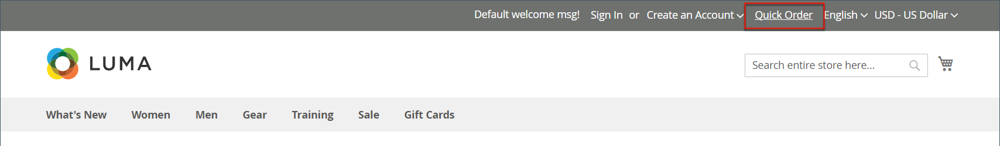

# Pedidos rápidos

A variável _Pedido rápido_ O recurso reduz o processo de pedido a vários cliques para clientes que sabem o nome do produto ou a SKU dos produtos que desejam solicitar. Pedidos com vários SKUs podem ser informados manualmente ou importados para o formulário Pedido rápido. O Pedido rápido pode ser usado por clientes que estão conectados a suas contas e por convidados. Quando ativado, a variável _Pedido rápido_ será exibido na parte superior da página, ao lado do nome do cliente.

{width="700" zoomable="yes"}

## Habilitar pedidos rápidos para sua loja

1. No _Admin_ barra lateral, vá para **[!UICONTROL Stores]** > _[!UICONTROL Settings]_>**[!UICONTROL Configuration]**.

1. No _[!UICONTROL General]_no painel esquerdo, escolha **[!UICONTROL B2B Features]**.

1. Definir **[!UICONTROL Enable Quick Order]** para `Yes`.

   {width="600" zoomable="yes"}

1. Clique em **[!UICONTROL Save Config]**.

1. Quando solicitado, clique em [Gerenciamento de cache](../systems/cache-management.md) e atualiza todos os caches inválidos.

## Fluxos de trabalho de pedido rápido

Os clientes podem especificar produtos para pedidos rápidos usando um dos métodos a seguir.

### Método 1: informar produtos individuais

1. O cliente clica no link **[!UICONTROL Quick Order]** link.

1. Seleciona o produto por SKU ou nome do produto:

   Para colocar um **pedido rápido por SKU**, o cliente faz o seguinte:

   - Insere o **[!UICONTROL SKU]**.

   - Cliques **[!UICONTROL Add to List]**.

     O SKU aparece na linha de entrada, com os detalhes do produto abaixo.

     {width="600" zoomable="yes"}

   Para colocar um **pedido rápido pelo nome do produto**, o cliente faz o seguinte:

   - Insere os primeiros caracteres do **[!UICONTROL Product Name]**.

     >[!NOTE]
     >
     >Não use o _Enter_ para escolher o nome do produto.

   - Quando a lista de correspondências possíveis for exibida, o cliente clicará no produto que deseja solicitar.

     {width="700" zoomable="yes"}

1. Insere o **[!UICONTROL Qty]**.

1. Usando a próxima linha de entrada, repete esse processo quantas vezes forem necessárias.

1. Cliques **[!UICONTROL Add to Cart]**.

### Método 2: informar vários produtos

1. No **[!UICONTROL Enter Multiple SKUs]** , o cliente executará um dos seguintes procedimentos:

   - Insere um SKU por linha

   - Insere todos os SKUs na mesma linha, separados por vírgulas e sem espaços.

     {width="600" zoomable="yes"}

1. Para adicionar os produtos à lista, clique em **[!UICONTROL Add to List]**.

1. Insere o **[!UICONTROL Qty]** a ser ordenado para cada item na lista.

   {width="600" zoomable="yes"}

   >[!NOTE]
   >
   >Se o produto tiver opções necessárias, o cliente será solicitado a escolher as opções. Eles podem aguardar até chegarem ao carrinho de compras para adicionar opções de produto.

   {width="600" zoomable="yes"}

### Método 3: carregar uma lista de produtos

1. No _[!UICONTROL Add from File]_clique em **[!UICONTROL Download Sample]**para baixar um modelo de pedido.

   {width="600" zoomable="yes"}

1. Abre o arquivo baixado.

1. Usa o modelo para adicionar os SKUs do produto a serem carregados para a lista de Pedidos rápidos.

1. Ao concluir, clique em **[!UICONTROL Save]**.

   {width="400" zoomable="yes"}

1. Para fazer upload do arquivo, clique em **[!UICONTROL Choose]** e seleciona o arquivo do sistema.

   Os itens são adicionados à lista de Pedidos rápidos.

1. Quando estiver pronto, clique em **[!UICONTROL Add to Cart]**.

Depois que o cliente cria o pedido rápido, ele pode prosseguir com a finalização da compra como de costume.

{width="700" zoomable="yes"}
