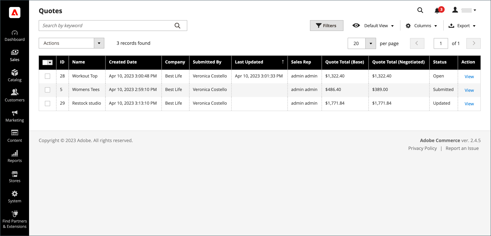
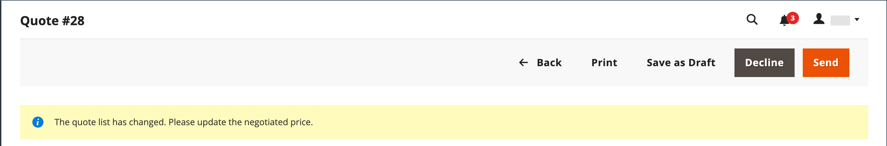
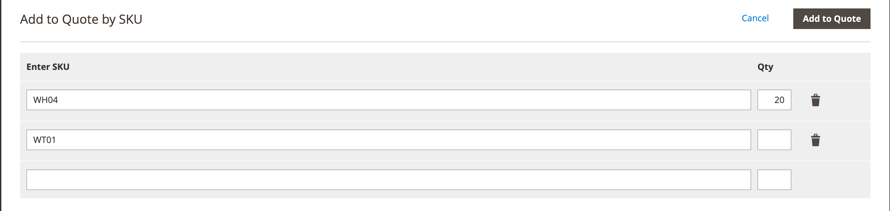

# Negociar uma cotação

Se as [Cotações B2B estiverem habilitadas](configure-quotes.md) na configuração, a negociação de preço poderá ser iniciada por um comprador autorizado de uma empresa ou um representante de vendas.

Os compradores iniciam o processo de negociação de preço [solicitando uma cotação](quote-request.md) do carrinho de compras. Os Representantes de Vendas podem iniciar a negociação [criando uma cotação de rascunho para um comprador](sales-rep-initiates-quote.md), atualizando a cotação com os itens da ordem e os preços iniciais e enviando-a ao comprador.

Quando a negociação de preços começar, as cotações serão listadas na grade [Cotações](quotes.md). Todas as negociações entre o comprador e o vendedor ocorrem por email e são iniciadas e rastreadas a partir da exibição detalhada da cotação.

Durante o processo de negociação, o vendedor pode fazer o seguinte com o Administrador:

- Adicionar ou remover produtos
- Alterar a quantidade
- Aplicar um desconto a itens de linha ou ao preço total
- Adicionar ou alterar o método de envio
- Adicionar comentários
- Enviar a cotação atualizada ao comprador ou salvar como rascunho

Os compradores gerenciam o processo de negociação de cotações na loja usando o [[!UICONTROL My Quotes]](account-dashboard-my-quotes.md). Enquanto a cotação estiver aberta para revisão, seu status na conta do comprador será definido como `Pending`. O comprador pode alterar e ressubmeter a cota mesmo se ela tiver sido recusada ou tiver expirado.

## Etapa 1: exibir a solicitação

1. Na barra lateral Admin, vá para **[!UICONTROL Sales]** > **[!UICONTROL Quotes]**.

   A nova solicitação aparece na grade _[!UICONTROL Quotes]_.

1. Na coluna _Actions_, clique em **[!UICONTROL View]**.

   {width="700" zoomable="yes"}

## Etapa 2: Modificar a cotação

1. Em _[!UICONTROL Quote & Account Information]_, clique no ícone_ Calendário _().

   {width="575" zoomable="yes"}

1. Escolha um **[!UICONTROL Expiration Date]** para a cotação.

1. Role para baixo até a seção _[!UICONTROL Quote Totals]_e atualize o **[!UICONTROL Negotiated Price]**conforme necessário.

   {width="600" zoomable="yes"}

   Se o comprador alterar a quantidade de quaisquer itens na cota, um aviso será exibido na parte superior da cota, indicando que a lista de itens foi alterada e o preço negociado deverá ser atualizado.

   {width="600" zoomable="yes"}

### Adicionar novos produtos à cotação

1. Clique em **[!UICONTROL Add Products by SKU]**.

1. Digite o **[!UICONTROL SKU]** e **[!UICONTROL Qty]** a serem adicionados.

   {width="600" zoomable="yes"}

### Aplicar atualizações de item de linha

Aplicar alterações de item de linha na seção _[!UICONTROL Items Quoted]_, se necessário.

{width="600" zoomable="yes"}

- Altere o **[!UICONTROL Quantity]** que deve ser comprado pelo preço proposto.

- Selecione **[!UICONTROL Configure]** e altere as opções do produto.

  A opção [!UICONTROL Configure] está disponível somente em um item de linha para um produto configurável

- No menu **[!UICONTROL Action]**, selecione uma ação para atualizar o item:
   - **Item de desconto** para aplicar um desconto como porcentagem, valor fixo ou preço preferencial.
Opcionalmente, você pode bloquear a quantia de desconto para evitar descontos adicionais. Se o desconto não estiver bloqueado,
o desconto de item de linha e qualquer desconto de nível de cotação são aplicados ao preço do produto.
   - **Deixe uma observação para o comprador** para fornecer ao comprador informações adicionais sobre um item
   - **Remover** para remover um item da cotação.

### Aplicar alterações e atualizar

- Para aplicar as alterações, clique em **[!UICONTROL Add to Quote]**.

- Para atualizar a cotação, clique em **[!UICONTROL Recalculate the Quote]**.

- Para aplicar as alterações e atualizar a cotação para o catálogo compartilhado e as regras de preço, clique em **[!UICONTROL Update Prices]** e em **[!UICONTROL Proceed]** para confirmar a atualização.

  {width="600" zoomable="yes"}

### Atualizar informações de envio

1. Se o comprador incluir um endereço _Enviar para_ na cotação, clique em **[!UICONTROL Get shipping methods and rates]**.

1. Escolha um método de envio entre as opções disponíveis.

1. Insira um **[!UICONTROL Proposed Shipping Price]**.

   Os _[!UICONTROL Quote Totals]_são atualizados para refletir o preço de envio proposto.

### Anexar um documento de suporte

1. Na caixa _Adicionar comentário_, clique em **[!UICONTROL Attach file]**.

   Por padrão, os [arquivos anexados](../configuration-reference/sales/quotes.md) podem ter até 2 MB em qualquer um dos seguintes formatos de arquivo: DOC, DOCX, XLS, XLSX, PDF, TXT, JPG ou JPEG, PNG.

1. Escolha o arquivo no diretório.

## Etapa 3: Atualizar informações de nível de cotação e enviar sua resposta

1. Na seção _[!UICONTROL Negotiation]_da guia_[!UICONTROL Comments]_, digite sua resposta na seção **[!UICONTROL Add your comment]**.

1. Para incluir um documento de suporte, clique em **[!UICONTROL Attach file]** e selecione o arquivo do seu diretório.

   O tamanho máximo de arquivo permitido para anexos é de 2 MB.

1. Para aplicar um desconto à cotação como um todo:

   - Em _[!UICONTROL Quote Totals]_, na seção_[!UICONTROL Negotiated Price]_, escolha um dos seguintes tipos de desconto:

      - `Percentage Discount`
      - `Amount Discount`
      - `Proposed Price`

   - Insira o valor como uma porcentagem ou preço fixo.

     {width="600" zoomable="yes"}

1. Enviar ou salvar a cotação:

   - Se a cotação estiver pronta para ser enviada de volta ao comprador, clique em **[!UICONTROL Send]**.

   - Para continuar trabalhando na cotação mais tarde, clique em **[!UICONTROL Save as Draft]**.

## Etapa 4: Acompanhar uma cotação

Quando você envia uma cotação, o sistema notifica o comprador e o representante de vendas que gerencia a conta da empresa. O e-mail inclui um link para a cotação na conta do comprador e a data de expiração da cotação. Em qualquer ponto da negociação, o comprador pode executar uma das seguintes ações:

- Aceite a cotação negociada e conclua a compra.
- Envie uma resposta com uma contraoferta e continue a negociação.
- Encerre a negociação.

Para monitorar a posição no workflow, verifique o email e o status da cotação na grade. Você pode continuar o processo de negociação enquanto for necessário.

## Barra de botões

| Botão | Descrição |
|----------------------------|---------------------------------------------------------------------------------------------------------------------------------------------------------------------------------------------------------------------------------------------------------------------------------------------------------------------------------------------------------------|
| [!UICONTROL Back] | Retorna à página _[!UICONTROL Quotes]_sem salvar as alterações. |
| [!UICONTROL Print] | Envia a cotação para uma impressora ou a salva como um arquivo PDF. |
| [!UICONTROL Create Copy] | [!BADGE 1.5.0-beta capabilities]{type=Informative url=&quot;/help/b2b/release-notes.md&quot; tooltip=&quot;Disponível somente para participantes do programa da Beta&quot;} Cria e abre uma cópia da cotação atual com `(copy)` anexado ao nome original. Renomeie a nova cotação editando o campo [!UICONTROL Name]. Processe a nova cotação salvando-a como rascunho ou enviando-a ao cliente. |
| [!UICONTROL Save as Draft] | Salve todas as alterações feitas na cotação, mas não as envie de volta ao comprador. |
| [!UICONTROL Decline] | Rejeita o pedido de negociação de preços, quer no inquérito inicial, quer durante as negociações em curso. Quando uma cotação é recusada, o vendedor deve adicionar um comentário para explicar a decisão. Quando uma cotação é recusada, todos os preços negociados são redefinidos para os valores originais. Esse botão é desativado enquanto o vendedor aguarda uma resposta do comprador. |
| [!UICONTROL Send] | Envia a cotação atualizada como uma resposta à consulta do comprador. Esse botão será desativado se o vendedor estiver aguardando uma resposta do comprador. |

{style="table-layout:auto"}

## Descrições dos campos

As informações de cotação e funções no Administrador estão organizadas nas seções a seguir.

### [!UICONTROL Quote & Account Information]

| Campo | Descrição |
|-------------------------------------------------|------------------------------------------------------------------------------------------------------------------------------------------------------------------------------------------------------------------------------------------------------------------------------------------------------------------------------------------------------------------------------------------------------------------------------------------------------------------------------------------------------------------------------------------------------------------------------------------------------------------------------------------------------------------------------------------------------------------------------------------------------------------------------------------------------------------------------------------------------------------------------------------------------------------------------------------------------------------------------------------------------------------------------------------------------------------------------------------------------------|
| [!UICONTROL Name] | O nome atribuído a uma solicitação de cotação pelo [comprador](account-company-roles-permissions.md). |
| [!UICONTROL Status] | Indica o estado atual da cotação. O status de uma cotação só pode ser alterado por ação por parte do comprador ou do vendedor. Consulte também as [Configurações de status](quotes.md) do Administrador e a [conta do comprador](account-dashboard-my-quotes.md). |
| [!UICONTROL Created] | A data e a hora em que o comprador submeteu pela primeira vez a solicitação de uma cotação. |
| [!UICONTROL Created By] | O nome e sobrenome do comprador da empresa que enviou a solicitação de cotação. |
| [!UICONTROL Expiration Date] | Indica o último dia em que a cotação atual é válida. A data de expiração padrão é definida na configuração como 30 dias depois que um comprador envia uma solicitação de cotação.   O vendedor pode substituir a data de expiração padrão inserindo uma data diferente (DD MMM YYYY ) ou escolhendo a data no calendário. A cotação nunca expira se o campo for deixado em branco.   Para cotações abertas, o vendedor recebe uma [notificação por email](../systems/email-templates.md) 48 horas antes do vencimento da cotação. Os compradores são notificados 24 horas antes da data de expiração.   O status da cotação muda para _Expirado_ e o comprador não pode fazer mais alterações na cotação. Os preços propostos na cotação revertem para os valores originais do catálogo.   Se uma cotação estiver aberta para análise pelo vendedor quando a cotação estiver definida para expirar, a data de expiração será redefinida de acordo com o intervalo definido na configuração.   A Data de Vencimento é o único campo na seção _Cotação e Conta_ que pode ser editado durante o processo de revisão. |
| [!UICONTROL Company] | O nome legal da [empresa](account-companies.md) que o comprador representa. |
| [!UICONTROL Company Admin Email] | O endereço de email do [administrador de empresa](account-company-admin.md). |
| [!UICONTROL Sales Rep] | O [representante de vendas](account-company-manage.md) que trabalha para o vendedor e é o contato principal atribuído à conta da empresa. |
| [!UICONTROL Shared Catalog (or Customer Group)] | O [catálogo compartilhado](catalog-shared.md) ou o [grupo de clientes](account-company-customer-group.md) ao qual a empresa está atribuída. A cotação pode incluir preços personalizados do catálogo compartilhado atribuído à empresa. |

{style="table-layout:auto"}

### [!UICONTROL Add to Quote by SKU]

| Campo | Descrição |
|---------------------------|-----------------------------------------------------------|
| [!UICONTROL Enter SKU] | O SKU do produto a ser adicionado à cotação. |
| [!UICONTROL Qty] | O número de itens deste SKU a serem adicionados à cotação. |
| [!UICONTROL Add to Quote] | Adiciona a quantidade do produto especificado à cotação. |

{style="table-layout:auto"}

### [!UICONTROL Items Quoted]

| Campo | Descrição |
|-----------------------------------------|---------------------------------------------------------------------------------------------------------------------------------------------------------------------------------------------------------------------------|
| [!UICONTROL Name & SKU] | O nome do produto vinculado e a unidade de manutenção de estoque (SKU). |
| [!UICONTROL Stock] | O número de produtos sob este SKU que estão atualmente disponíveis para venda. |
| [!UICONTROL Cost] | O valor que o vendedor pagou para comprar o produto. |
| [!UICONTROL Catalog Price] | O preço do produto no catálogo do comprador, com base no grupo de clientes ou catálogo compartilhado atribuído à empresa do comprador. |
| [!UICONTROL Cart Price] | O preço original do item no carrinho, menos os descontos aplicados do carrinho. O preço do carrinho pode ser diferente do preço do catálogo se houver descontos ou regras de carrinho que se aplicam ao grupo de clientes do comprador. |
| [!UICONTROL Discount] | O desconto de item de linha aplicado ao item. O valor pode ser uma porcentagem, um valor fixo ou um preço proposto. |
| [!UICONTROL Qty] | O número de unidades neste SKU que é a base para o preço cotado. Somente um número positivo maior que zero pode ser inserido. Se desejar alterar a quantidade para zero, exclua o item da linha da cotação. |
| [!UICONTROL Subtotal] | O preço proposto multiplicado pela quantidade de itens encomendados. |
| [!UICONTROL Estimated Tax] | O valor do imposto estimado para este item de linha, de acordo com a configuração. Dependendo das Configurações de Cálculo de Imposto, o imposto estimado pode ser baseado em qualquer uma das seguintes opções: Preço Unitário / Total de Linhas / Total |
| [!UICONTROL Subtotal (Incl./Excl. Tax)] | Dependendo da configuração, essa coluna pode exibir o subtotal com ou sem impostos estimados. |
| [!UICONTROL Action] | Menu de seleção de operações que podem ser aplicadas a um item de linha:<ul><li>**[!UICONTROL Discount item]**</li><li>**[!UICONTROL Leave a note to Buyer]**</li><li>**[!UICONTROL Remove an item from the quote]**</li></ul>. |
| [!UICONTROL Configure] | Permite alterar as opções de um produto configurável. |
| [!UICONTROL Update Prices] | Atualiza a cotação com as alterações mais recentes do catálogo compartilhado e das regras de preço. |
| [!UICONTROL Recalculate Quote] | Recalcula todos os preços de cota, regras de preço de carrinho e impostos para refletir as alterações na cota. |

{style="table-layout:auto"}

### [!UICONTROL Shipping Information]

| Campo | Descrição |
|--------------------------------------|------------------------------------------------------------------------------------------------------------------------------------------------------------------------------|
| [!UICONTROL Shipping Address] | Exibe o endereço de entrega especificado na conta da compradora. O endereço de entrega fica em branco se o comprador não tiver especificado um endereço antes de enviar a solicitação. |
| [!UICONTROL Shipping Method & Price] | O link Obter Métodos de Envio e Taxas será exibido se o comprador incluir um endereço _Enviar para_ na cotação. |

{style="table-layout:auto"}

### [!UICONTROL Negotiation]

| Campo | Descrição |
|--------------------------|----------------------------------------------------------------------------------------------------------------------------------------------------------------------------------------------------------------------------------------------------------------------------------------------------------------------------------------------------------------------------------------------------------------------------------------------------------------------------------------------------------------------------------------------------------------------------------------------------------------------------------------------------------|
| [!UICONTROL Comments] | A guia Comentários da seção Negociação é usada para informar uma mensagem ao comprador sobre a cota.  **[!UICONTROL Add your comment]**- Os comentários são usados para se comunicar com o comprador durante o processo de negociação. Use os comentários para explicar quaisquer descontos oferecidos na cotação ou o motivo pelo qual uma solicitação de cotação foi recusada. **[!UICONTROL Attach file]** - O tamanho máximo de arquivo e os tipos de arquivo com suporte para [arquivos anexados](configure-quotes.md) são determinados pela configuração. Por padrão, um arquivo anexado pode ter até 2 MB e qualquer um dos seguintes tipos de arquivos: DOC, DOCX, XLS, XLSX, PDF, TXT, JPG ou JPEG, PNG. |
| [!UICONTROL History Log] | Essa guia exibe um histórico completo da cotação com datas, status da cotação e comentários. |

{style="table-layout:auto"}

### [!UICONTROL Quote Totals]

| Campo | Descrição |
|-----------------------------------------------------|-----------------------------------------------------------------------------------------------------------------------------------------------------------------------------------------------------------------------------------------------------------------------------------------------------------------------------------------------------------------------------------------------------------------------------------------------------------------------------------------------------------------------------------------------------------------------------------------------------------------------------------------------------------------------|
| [!UICONTROL Total Cost] | O custo total para o vendedor dos itens incluídos na cotação. |
| [!UICONTROL Catalog Total Price  (Incl./Excl. Tax)] | O preço total dos itens na cotação sem imposto, de acordo com os preços no catálogo compartilhado ou no catálogo principal usado como a base da cotação. Expanda a seção para exibir os valores usados no cálculo, dependendo da configuração [Exibir Subtotal](../configuration-reference/sales/tax.md) da configuração. Opções:  **[!UICONTROL Subtotal (Excl. Tax)]**- O Preço Total do Catálogo sem imposto estimado. **[!UICONTROL Subtotal (Incl. Tax)]** - O Preço Total do Catálogo sem imposto estimado.  **[!UICONTROL Estimated Tax]**- O valor do imposto que é estimado para ser aplicado ao Preço Total do Catálogo. |
| Preço negociado | O desconto oferecido ao comprador pode ser baseado em qualquer um dos seguintes:  **[!UICONTROL Percentage Discount]**- O desconto como uma porcentagem. **[!UICONTROL Amount Discount]** - O desconto como valor fixo.  **[!UICONTROL Proposed Price]**- O preço proposto pelo vendedor.
Se todos os itens na cotação tiverem um desconto de item bloqueado, a seção [!UICONTROL Negotiated Price] será desabilitada porque nenhum desconto adicional poderá ser aplicado.

Se um produto tiver um desconto de item de linha que não esteja bloqueado, o desconto de item de linha e o desconto em nível de cotação serão aplicados ao preço do produto.
 |
| [!UICONTROL Quote Subtotal (Incl./Excl. Tax)] | O preço total proposto de cada item de linha na cotação, com ou sem imposto, dependendo das configurações de [cálculo de imposto](../configuration-reference/sales/tax.md) na configuração. |
| [!UICONTROL Shipping & Handling] | O valor informado pelo vendedor no campo Preço de Remessa Proposto na seção Informações de Remessa da cotação. Se esse campo estiver vazio, o valor será baseado no método de envio selecionado. |
| [!UICONTROL Estimated Tax] | O valor do imposto que é estimado como devido, conforme especificado nas [configurações de exibição](../configuration-reference/sales/tax.md) da configuração. |
| [!UICONTROL Quote Grand Total (Incl. Tax)] | O total final na parte inferior da cotação que inclui o preço negociado, o imposto estimado e a remessa e manuseio propostos. |

{style="table-layout:auto"}
