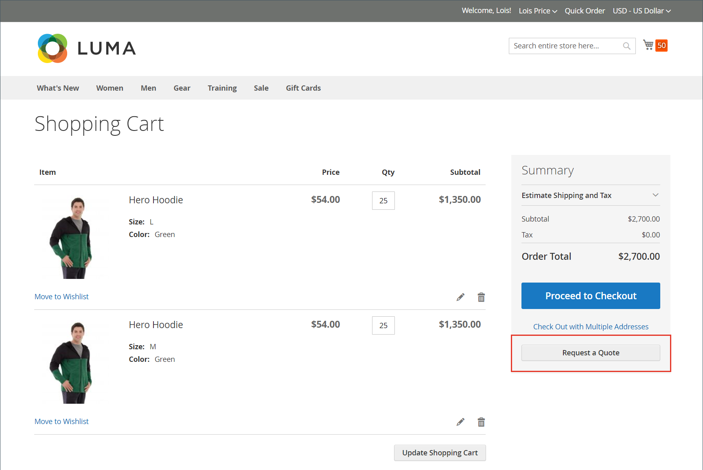

# Solicitação de cotação

Se as cotações estiverem habilitadas na [Configuração dos recursos de vendas](configure-quotes.md), um comprador autorizado de uma empresa poderá iniciar o processo de negociação de preços solicitando uma cota do carrinho de compras. Se um comprador não estiver pronto para submeter uma cota para negociação, ele poderá salvá-la como uma preliminar.

>[!NOTE]
>
>Uma solicitação de cotação não pode incluir códigos de desconto ou cartões-presente.

## Experiência de solicitação de cotação do cliente

1. O cliente faz logon em sua conta de usuário como comprador com [permissão](account-company-roles-permissions.md) para solicitar uma cotação.

1. Adiciona os produtos a serem incluídos na cotação ao carrinho.

   >[!TIP]
   > 
   >Os clientes podem adicionar uma lista de SKUs de produtos ao carrinho mais rapidamente usando o [Pedido rápido](quick-order.md).

1. Seleciona **[!UICONTROL Request a Quote]**.

   {width="700" zoomable="yes"}

1. Na caixa **[!UICONTROL Add your comment]**, o cliente insere uma breve observação para descrever a solicitação.

1. Insere um **[!UICONTROL Quote Name]**.

   {width="400" zoomable="yes"}

1. Se necessário, anexa um documento ou imagem de suporte à cotação:

   - Seleciona **[!UICONTROL Attach file]**.
   - Escolhe o arquivo do sistema.

   Por padrão, um [arquivo anexado](configure-quotes.md) pode ter até 2 MB, em qualquer um dos seguintes formatos de arquivo: DOC, DOCX, XLS, XLSX, PDF, TXT, JPG ou JPEG, PNG.

1. Cria e processa a cotação:

   - Envia a cotação para o Vendedor selecionando **[!UICONTROL Request a Quote]**.
   - Salva a cotação como rascunho selecionando **[!UICONTROL Save as Draft]**.

     Se o comprador salvar a cotação como um rascunho, ela estará disponível em [!UICONTROL My Quotes] no estado `Draft`. Cotações de rascunho não estão visíveis para o Vendedor até que o Comprador as envie para revisão.
