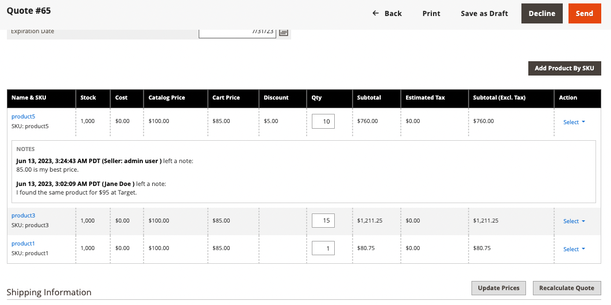

# Fluxos de trabalho e caso de uso de modelos de cotação

O recurso Modelo de Cota permite que compradores e vendedores simplifiquem o processo de cota criando modelos de cota reutilizáveis e personalizáveis.

- **Cotações Personalizáveis** — Os compradores podem gerar cotações vinculadas a partir de um modelo pré-aprovado, permitindo a personalização dentro de parâmetros especificados, como quantidades e seleções de itens de linha.
- **Limites de Pedidos**—Os vendedores podem definir compromissos de pedidos mínimos e máximos, garantindo que os compradores adiram aos volumes de compras acordados. Depois que o comprador aceitar o modelo de cota, a contagem limite da ordem será incrementada sempre que uma cota vinculada for gerada. Se a cotação vinculada for fechada sem ser convertida em um pedido, o pedido será subtraído da contagem limite. Quando o limite máximo de pedidos é atingido, o modelo de orçamento expira.
- **Datas de Expiração** — Os modelos podem ter períodos de validade (*[!UICONTROL Valid Until]*), garantindo que os termos sejam aplicáveis somente dentro de um período especificado. Na expiração, o modelo é fechado e todas as cotas vinculadas associadas são fechadas.
- **Descontos e Preços**- Os vendedores podem usar os mesmos recursos de item de linha, nível de cota e desconto de preço de remessa disponíveis com cotas para definir descontos para ordens recorrentes, simplificando o processo de negociação.
- **Rastreamento e relatório** — O sistema rastreia o número de cotas vinculadas geradas a partir do modelo e ordens concluídas com êxito para fornecer insights sobre o cumprimento das cotas de solicitar acordadas.
- **Links** de documento de referência: compradores e vendedores podem adicionar, editar e gerenciar links de documento externos (como DocuSign, Adobe Sign ou outros serviços online) à cotação modelo. Isso permite fácil acesso a contratos e contratos relacionados durante o processo de modelo de cotação.

## Caso de uso

Um empresa comprador pode usar uma aspa modelo para solicitar um conjunto específico de produtos durante um período de tempo. O comprador configura as seguintes opções de modelo para tornar o processo de citação mais eficiente, consistente e alinhado com contratos estratégicos de compras.

- Limite de ordem para especificar o número mínimo e máximo de ordens qualificadas para precificação negociada. Isso pode ser usado para aplicar e rastrear cotas de pedido especificadas em contratos.

- Limites de quantidade (quantidades mínimas/máximas) O modelo especifica um limite de quantidade para definir a quantidade mínima e máxima que pode ser comprada para cada ordem, garantindo que o vendedor possa gerenciar efetivamente os níveis de estoque e, ao mesmo tempo, fornecendo ao comprador a flexibilidade para ajustar as quantidades conforme necessário.

- Links de documentos de referência para manter conexões com contratos e contratos externos, facilitando o acesso à documentação relacionada durante o processo de cotação.

## Fluxo de trabalho do modelo de cotação

Os modelos de aspas podem ser iniciados pelo comprador ou pelo vendedor.

**Etapa 1: Criação de modelo entre aspas (Novo)**

- **O comprador cria o modelo de cotação**

  Ao revisar uma cota existente, o comprador decide que a empresa precisa enviar várias ordens durante o próximo ano e deseja solicitar descontos adicionais com base nos negócios repetidos. Eles criam um modelo de citação usando a ação *[!UICONTROL Create quote template]* na citação. O comprador pode adicionar links de documentos de referência a contratos ou acordos externos usando o controle *[!UICONTROL Add]* na seção de documentos de referência. Em seguida, eles iniciam a negociação enviando o modelo de cota ao vendedor para revisão.

  Os compradores também podem solicitar um modelo de cotação adicionando produtos que desejam comprar regularmente ao carrinho. Em seguida, solicite uma cotação e mencione nos comentários com que frequência eles desejam repetir a compra.

- **Representante de vendas** — Um Representante de Vendas pode criar um modelo de cotação do Administrador em nome de um comprador específico da empresa. O Representante de Vendas pode criar o modelo de cotação no Administrador a partir de uma cotação existente ou da grade [!UICONTROL Quote Templates] e salvá-lo como `draft` ou enviá-lo ao comprador para iniciar a negociação. No estado de rascunho, a cotação é visível somente para o vendedor. Depois que a cotação é enviada, o status é `Submitted`. Ele não pode ser modificado pelo vendedor até que o comprador o envie de volta.

  {width="700" zoomable="yes"}

  Quando o vendedor cria o modelo de cotação, o padrão da data de expiração ([!UICONTROL Valid until] campo de data) é 180 dias. Se o comprador criou o modelo, a data de expiração está em branco.  O comprador deve definir a data de expiração antes de enviar o modelo de volta ao comprador para revisão.

  Quando o vendedor cria as aspas modelo, a data de expiração (*[!UICONTROL Valid until]* campo de data) é inadimplente em 180 dias. Se o comprador criou a modelo, a data de expiração fica em branco.  A comprador deve definir a data de expiração antes de enviar a modelo de volta ao comprador para revisão.

**Etapa 2: Revisão e negociação de cotações (Revisão)**

Revisar ou negociar um modelo de cota pode incluir alterar quantidades, remover itens, adicionar comentários de item de linha, aplicar descontos de item de linha ou de cota (vendedor), adicionar um endereço de entrega (comprador) e gerenciar links de documento de referência.

- **O vendedor exibe a solicitação e envia a resposta** - No Administrador, o vendedor exibe o modelo de cotação da grade *[!UICONTROL Quote Templates]** ou o abre a partir do link na notificação por email. Na loja, o status da cotação muda para `Pending`, e o comprador não pode fazer nenhuma alteração. Seguindo o mesmo processo para [negociação de cota](quote-price-negotiation.md), o vendedor responde oferecendo descontos de preço e ajustando quantidades e itens conforme necessário, insere um comentário e envia o modelo de cota de volta ao comprador. O vendedor também pode adicionar, editar ou remover links de documentos de referência durante esse processo. O comprador e o representante de vendas são notificados por e-mail de que o vendedor respondeu.

- **O comprador exibe aspas modelo do vendedor e envia resposta** - O comprador clica na link no notificação de email para abrir a cotação modelo ou a _abre na página Meus Modelos de aspas_ do painel de conta. O comprador pode deixar notas ao vendedor no nível de item da linha ou cotação, alterar quantidades, remover itens e gerenciar links de referência documento.

O comprador e o vendedor continuam o processo de negociação até que um acordo seja alcançado, ou o vendedor recusa as cotações modelo. Se a comprador fizer alterações nas aspas modelo — adicionar ou remover produtos, alterar quantidades de produtos ou modificar a referência documento links — ela deve ser devolvida ao vendedor para revisão.

- **O comprador adiciona uma endereço de entrega** - O comprador deve adicionar uma endereço de entrega à cotação modelo se não tiver uma. Depois que o comprador adicionar o endereço, o vendedor poderá fornecer opções de envio e entrega. Os métodos de envio mostrados dependem da configuração da Storefront.

Se o comprador adicionar um endereço de entrega, o acordo de negociação deverá ser revisado e o vendedor poderá continuar o processo de negociação até que um acordo seja alcançado ou o vendedor recuse o modelo de cota.

**Etapa 3: o comprador aceita o modelo de cotação**

O comprador aceita as condições negociadas no modelo. Depois que o modelo de cotação for aceito, o comprador poderá usá-lo para [gerar cotações vinculadas e pré-aprovadas](account-dashboard-my-quote-templates.md#generate-a-linked-quote) que podem ser usadas para enviar ordens sem exigir negociação adicional.

As opções de envio são bloqueadas no check-out.

Os templates de aspas permanecem ativos até que expirem, sejam cancelados ou fechados, ou não seja mais válido comprador atingiu o máximo solicitar limite.

### Exibir uma aspa modelo

1. **[!UICONTROL Actions]** Na coluna para registro, clique **[!UICONTROL View]** em .

1. Para responder ao solicitação do cliente, seguir as instruções e iniciar o mesmo [processo de negociação](quote-price-negotiation.md) de preços usado para negociar cotações.

### Exibir aspas modelo atividade

Exibir a linha do tempo da negociação, a comunicação e outras atividades de modelo de cotação do [!UICONTROL Comments] e do [!UICONTROL History Log]—as informações incluem alterações de status, atualizações de informações de cliente e de remessa, atualizações de item e preço e outras informações importantes.

1. Abra um modelo de cotação.

1. Exiba os comentários e o histórico da negociação de cotações rolando até **[!UICONTROL Negotiation]** e selecionando **[!UICONTROL Comments]** e **[!UICONTROL History Log]**.

   {width="400" zoomable="yes"}

1. O histórico também é rastreado no nível item da linha.

   {width="400" zoomable="yes"}

### Recusar um modelo de cotação

Somente modelos de cotação com status `In Review` podem ser recusados.

1. Na grade *[!UICONTROL Quote Templates]*, abra o modelo de cotação que deseja recusar.

1. No modelo de citação, clique em **[!UICONTROL Decline]**.

1. Quando solicitado, insira o motivo da recusa da cotação e clique em **[!UICONTROL Confirm]**.
