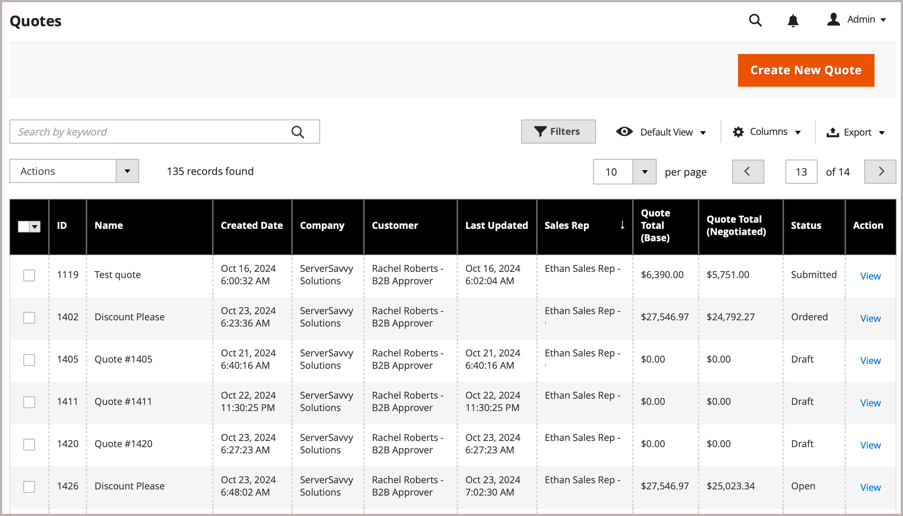
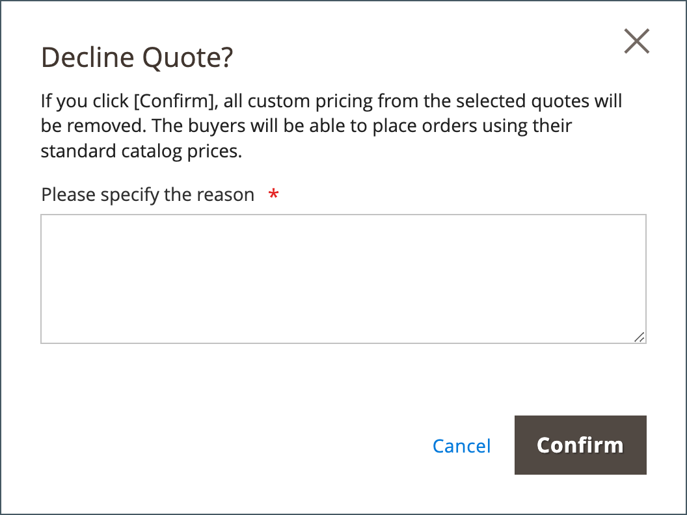

# Cotações Negociáveis

Compradores e vendedores usam Cotações para gerenciar o processo de negociação de itens de adição de uma ordem, atualização de quantidades, solicitação e aplicação de descontos, etc., até chegarem a um acordo. O processo de negociação de cota pode ser iniciado por um comprador autorizado da empresa ou por um representante de vendas da empresa.

{width="700" zoomable="yes"}

Depois que a cota é criada, o processo de negociação começa quando o comprador ou vendedor submete a cota para revisão. A grade _Quotes_, que lista cada cotação recebida e mantém um histórico da comunicação entre comprador e vendedor. Use os [controles do local de trabalho](../getting-started/admin-workspace.md) padrão para filtrar a lista, alterar o layout da coluna, salvar exibições e exportar dados.

- Na loja, os compradores enviam a cotação como uma [solicitação para negociar](quote-price-negotiation.md) o preço do carrinho de compras. Ao criar a solicitação de cota, um comprador pode salvar a cota como uma preliminar ou submetê-la diretamente ao vendedor.

- No Administrador, os representantes de vendas podem criar cotações em nome do comprador da empresa. Ao criar a cota, um vendedor pode salvá-la como uma preliminar ou submetê-la diretamente ao comprador para iniciar o processo de negociação.

Durante o processo de negociação, a cota só pode ser atualizada pela pessoa que revisa e propõe os termos para negociação adicional.

## Pré-requisitos

As cotas negociáveis estarão disponíveis somente se o Adobe Commerce tiver as seguintes definições de configuração:

- [A extensão B2B do Adobe Commerce está instalada](install.md)
- [Recursos B2B configurados](enable-basic-features.md)
   - Habilitar contas da empresa
   - Ativar cotação B2B

## Fluxo de trabalho de cotação

As cotações podem ser iniciadas pelo comprador ou pelo vendedor.

Este diagrama mostra os status da cota de um comprador e vendedor (Admin) nas diferentes etapas quando você inicia uma cota.

{width="700" zoomable="yes"}

**Etapa 1: Criação da cotação (Nova)**

- **O comprador solicita uma cotação** - O comprador [solicita uma cotação](quote-request.md) do carrinho de compras. A solicitação aparece na lista _Minhas Cotações_ no painel de conta do comprador e a notificação por email é enviada ao representante de vendas atribuído à conta da empresa. No Administrador, a solicitação aparece na grade _Aspas_, com o status `New`. Uma solicitação de cotação pode ser modificada pelo comprador até que seja aberta pelo vendedor.

  {width="700" zoomable="yes"}

- **Representante de vendas** — Um Representante de Vendas pode [criar uma cotação](sales-rep-initiates-quote.md) do Administrador em nome de um comprador específico da empresa. O Representante de Vendas deve atualizar a cota para adicionar produtos e outras informações, como descontos e notas ao comprador. A Representação de Vendas pode salvar a cotação como um `draft` ou enviá-la ao comprador para iniciar a negociação. No estado de rascunho, a cotação é visível somente para o vendedor. Depois que a cotação é enviada, o status é `Submitted`. Ele não pode ser modificado pelo vendedor até que o comprador o envie de volta.

  {width="700" zoomable="yes"}

**Etapa 2: revisão e negociação da cotação (revisão)**

Revisar ou negociar uma cota pode incluir alterar quantidades, remover itens, adicionar comentários de item de linha, aplicar descontos de item de linha ou de cota (vendedor) e adicionar um endereço de entrega (comprador).

- **O vendedor exibe a solicitação e envia a resposta** - No Administrador, o vendedor exibe a solicitação de cotação. Na loja, o status da cotação muda para `Pending`, e o comprador não pode fazer nenhuma alteração. O [vendedor responde](quote-price-negotiation.md) oferecendo descontos de preço e ajustando quantidades e itens conforme necessário, insere um comentário e envia a cotação de volta ao comprador. O comprador e o representante de vendas são notificados por e-mail de que o vendedor respondeu.

- **O comprador visualiza a cotação do vendedor e envia a resposta** - O comprador clica no link na notificação por email para abrir a cotação ou abre a cotação na página _Minhas Cotações_ do painel de conta. O comprador pode deixar notas ao vendedor no nível do item de linha ou da cota, alterar quantidades e remover itens.

O comprador e o vendedor podem continuar o processo de negociação até que um acordo seja alcançado ou o vendedor recuse a cotação. Se o comprador fizer alterações na cotação, como adicionar ou remover produtos ou alterar quantidades de produtos, a cotação deverá ser devolvida ao vendedor para revisão.

- **O comprador adiciona um endereço de entrega** - O comprador pode adicionar um endereço de entrega à cotação. Depois que o comprador adicionar o endereço, o vendedor poderá fornecer opções de envio e entrega. Os métodos de envio mostrados dependem da configuração da Storefront.

Se o comprador adicionar um endereço de entrega, o acordo de negociação deverá ser revisado e o vendedor poderá continuar o processo de negociação até que um acordo seja alcançado ou o vendedor recuse a cotação.

**Etapa 3: O comprador aceita a cotação (Check-out)**

O comprador aceita o preço proposto e prossegue para o checkout. Descontos adicionais não podem ser adicionados à cotação negociada.

As opções de envio são bloqueadas no check-out.

## Status da Cotação

O status da cotação fornece informações sobre o estado atual da cotação no fluxo de trabalho da cotação. O status de uma cotação muda somente quando um comprador ou vendedor executa uma ação na cotação. Por exemplo, o status será alterado para ordem se um comprador selecionar [!UICONTROL Proceed to Checkout] em uma cotação ativa.

- *[!UICONTROL New]** - O comprador enviou uma solicitação de cotação, mas ela não foi visualizada pelo vendedor. A solicitação pode ser atualizada pelo comprador até que seja aberta pelo vendedor.

- **[!UICONTROL Draft]** - O vendedor cria uma cotação de rascunho para um comprador. A cotação não é visível para o comprador até que o vendedor adicione os detalhes da oferta (itens, quantidade, desconto e assim por diante) e envie a cotação para o comprador.

- **[!UICONTROL Open]** - O vendedor abriu a solicitação e está em processo de revisá-la e preparar uma resposta

- **[!UICONTROL Submitted]** - O vendedor enviou uma resposta ao comprador. O registro de cota não pode ser editado durante o processo de negociação.

- **[!UICONTROL Client Reviewed]** - O comprador visualizou a resposta do vendedor e está preparando uma resposta.

- **[!UICONTROL Updated]** - O comprador enviou uma resposta, mas ela não foi visualizada pelo vendedor.

- **[!UICONTROL Ordered]** - O comprador enviou a ordem com base na cotação negociada.

- **[!UICONTROL Closed]** - O comprador cancelou a solicitação de cotação.

- **[!UICONTROL Declined]** - O vendedor recusou a solicitação de cotação. Qualquer preço personalizado é removido da cotação e o registro é bloqueado para novas edições.

- **[!UICONTROL Expired]** - O comprador não respondeu à resposta do vendedor dentro do período de tempo designado e a cotação não é mais válida.

## Recursos da função B2B para cotações de armazenamento

As opções de configuração para cotações são controladas usando os [recursos de função](../systems/permissions-user-roles.md#role-resources). Esses recursos de função devem ser definidos para a função de usuário Administrador atribuída ao administrador de armazenamento.

Para conceder acesso às funções de cotação no Administrador, vá para **[!UICONTROL System]** > _[!UICONTROL Permissions]_>**[!UICONTROL User Roles]**, selecione a função e navegue até [!UICONTROL Sales] > [!UICONTROL Operations] > [!UICONTROL Quotes] na árvore_ Recursos de Função _.

{width="700" zoomable="yes"}

## Aplicar uma ação

No Admin, os Administradores e Vendedores B2B podem gerenciar cotações da Grade de Cotações usando o menu [!UICONTROL Actions].

{width="700" zoomable="yes"}

1. Na barra lateral _Admin_, vá para **[!UICONTROL Sales]** > **[!UICONTROL Quotes]**.

1. Na primeira coluna da grade, marque a caixa de seleção de cada registro ao qual deseja aplicar a ação.

1. Em **[!UICONTROL Actions]**, selecione a ação a ser aplicada.

### Exibir uma cotação

1. Na coluna **[!UICONTROL Actions]** de um registro, clique em **[!UICONTROL View]**.

1. Para responder à solicitação do cliente, siga as instruções e inicie o processo [negociação de preço](quote-price-negotiation.md).

### Exibir atividade de cotação

Exibir a linha do tempo da negociação, a comunicação e outras atividades de cotação do [!UICONTROL Comments] e do [!UICONTROL History Log]—as informações incluem alterações de status, atualizações de informações de cliente e de remessa, atualizações de itens e preços e outras informações importantes.

1. Abra uma cotação.

1. Exiba os comentários e o histórico da negociação de cotações rolando até **[!UICONTROL Negotiation]** e selecionando **[!UICONTROL Comments]** e **[!UICONTROL History Log]**.

   {width="400"}

1. O histórico também é rastreado no nível do item de linha.

   {width="400"}

### Recusar uma solicitação de cotação

Somente solicitações de cotação com status `Open` podem ser recusadas.

1. Selecione cada solicitação de cotação em aberto que você deseja recusar.

1. Defina o controle _[!UICONTROL Actions]_&#x200B;como `Declined`.

1. Quando solicitado, insira o motivo da recusa da cotação e clique em **[!UICONTROL Confirm]**.

   {width="400"}
