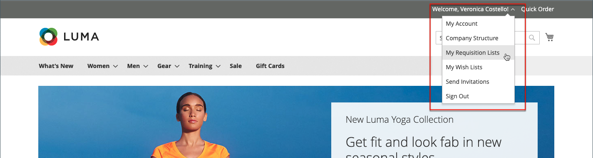

# Listas de requisições

O uso de uma lista de requisições economiza tempo ao comprar produtos solicitados com frequência, pois os itens são adicionados ao carrinho diretamente da lista. Os compradores podem manter várias listas que se concentram em produtos de diferentes fornecedores, compradores, equipes, campanhas ou qualquer outra coisa que simplifique o fluxo de trabalho. Ele está disponível tanto para usuários conectados quanto para convidados.

>[!NOTE]
>
>Para habilitar listas de requisições para o armazenamento, consulte [Habilitar Recursos B2B](enable-basic-features.md). Até 999 listas de requisições podem ser mantidas para cada conta de comprador, dependendo da [configuração](configure-requisition-lists.md).

A funcionalidade da lista de requisições é semelhante às listas de desejos, com as seguintes diferenças:

- Uma lista de requisições não é apagada depois de enviar itens ao carrinho de compras. Ele pode ser usado várias vezes.
- A interface do usuário para listas de requisição usa uma exibição compacta para exibir muitos itens.

{width="600" zoomable="yes"}

## Criar uma lista de requisições a partir do painel de contas

Um comprador conectado que esteja associado a uma conta da empresa pode criar uma lista de requisições a partir do painel de instrumentos da conta.

1. Na barra lateral da conta, escolhe **[!UICONTROL My Requisition Lists]**.

1. Na página _[!UICONTROL Requisition Lists]_, clique em **[!UICONTROL Create New Requisition List]**.

1. Insira o **[!UICONTROL Requisition List Name]** e **[!UICONTROL Description]**.

   {width="300"}

1. Quando terminar, clica em **[!UICONTROL Save]**.

## Criar uma lista de requisições a partir de uma página de produto

Um comprador conectado que esteja associado a uma conta da empresa pode criar uma lista de requisições a partir de uma página de produto. Esse método fornece um atalho fácil para criar a lista e adicionar o produto.

1. Na página de detalhes do produto, o comprador clica em **[!UICONTROL Add to Requisition List]**.

1. Cliques **[!UICONTROL Create New Requisition List]**.

1. Insira o **[!UICONTROL Requisition List Name]** e **[!UICONTROL Description]**.

1. Quando terminar, clica em **[!UICONTROL Save]**.

## Adicionar produtos a uma lista de requisições

Os compradores podem adicionar produtos a uma lista de requisições a partir de:

- Páginas de produto
- Uma página de catálogo
- O carrinho de compras
- Pedidos existentes
- Cotações existentes

### De uma página de detalhes do produto

1. Na loja, o comprador vai para a página de detalhes do produto a ser adicionado à lista de requisições.

1. Clica em **[!UICONTROL Add to Requisition List]** e executa um dos seguintes procedimentos:

   - Escolhe uma lista de requisições existente.
   - Cria uma lista de requisições.

   {width="700" zoomable="yes"}

### De uma página de catálogo

1. Na loja, o comprador vai para a página do catálogo que contém o produto a ser adicionado à lista de requisições.

1. Passe o mouse sobre o produto.

1. Clica em **[!UICONTROL Add to Requisition List]** e executa um dos seguintes procedimentos:

   - Escolhe uma lista de requisições existente.
   - Cria uma lista de requisições.

   {width="700" zoomable="yes"}

### De uma ordem existente

1. Na barra lateral do painel da conta, o comprador escolhe **[!UICONTROL My Orders]**.

1. Na parte superior do pedido, clica em **[!UICONTROL Add to Requisition List]** e realiza um dos seguintes procedimentos:

   - Escolhe uma lista de requisições existente.
   - Cria uma lista de requisições.

   {width="700" zoomable="yes"}

### De uma cotação existente

A partir de uma cotação negociável, os compradores podem usar a opção [!UICONTROL Move to Requisition List] para mover produtos da cotação para uma lista de requisições existente. Se não houver listas de requisições, a opção [!UICONTROL Move to Requisition List] não estará disponível.

1. Na barra lateral do painel da conta, o comprador seleciona **[!UICONTROL My Quotes]**.

1. Localize e acesse a cotação desejada na lista.

1. Na guia [!UICONTROL Items Quoted], selecione o produto a ser movido.

1. Usando a lista suspensa [!UICONTROL Select] na coluna [!UICONTROL Actions] para o item de linha de produtos, escolha **[!UICONTROL Move to Requisition list]**.

1. Selecione a lista de requisições para os itens selecionados.

1. Clique em **[!UICONTROL Move item to Requisition List]**.

Consulte o tópico [Minhas cotações](account-dashboard-my-quotes.md) para obter mais informações sobre Cotações B2B.

### Do carrinho

1. No item, o comprador clica no menu **[!UICONTROL Add to Requisition List]** e realiza uma das ações a seguir:

   - Escolhe uma lista de requisições existente.
   - Cria uma lista de requisições.

   {width="700" zoomable="yes"}

## Exibir a lista de requisições atualizada

Quando conectado em sua conta, um comprador pode usar qualquer um dos métodos a seguir para exibir qualquer uma de suas listas de requisições.

{width="700" zoomable="yes"}

### No painel de contas

1. Na barra lateral do painel da conta, escolhe **[!UICONTROL My Requisition Lists]**.

1. Na lista de listas de requisições, clique em **[!UICONTROL View]** na coluna _Ações_.

### De qualquer página de vitrine

1. Na barra de links rápidos, na parte superior da página, clique no nome de usuário.

1. No menu, escolha **[!UICONTROL My Requisition Lists]**.
