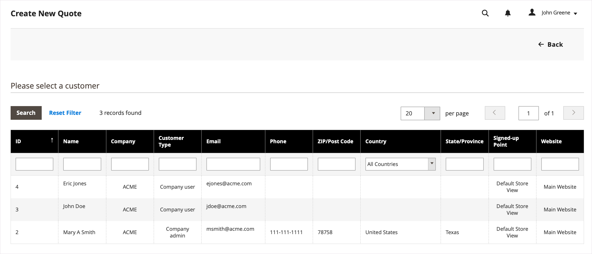

# Iniciar uma Cota para um Comprador

Se as cotações estiverem habilitadas na [Configuração de recursos de vendas](configure-quotes.md), um representante de vendas poderá iniciar o processo de negociação com um comprador da empresa criando uma cota do Administrador.

- As cotações de rascunho são visíveis somente para o vendedor.
- Cotações preliminares não podem ser submetidas até que o representante de vendas adicione itens, descontos relevantes e notas para criar a oferta inicial para o comprador.
- Um vendedor pode criar uma cotação a partir das Cotações ou da Grade de Clientes.

O Representante de Vendas envia a cota ao comprador para iniciar o processo de negociação. Consulte [Negociar uma Cotação](quote-price-negotiation.md).

## Experiência de criação de cotação de representante de vendas

Um Representante de Vendas pode criar uma cota a partir da Grade de Cotas ou Cliente.

>[!NOTE]
>
>Para ver uma demonstração em vídeo de um vendedor criando uma cotação para um comprador, consulte [O Representante de Vendas inicia a cotação](https://experienceleague.adobe.com/docs/commerce-learn/tutorials/b2b/b2b-quote/sales-rep-initiates-quote.html?lang=pt-BR) em _Vídeos e Tutorials do Commerce_.

### Criar uma cotação na grade Cotação

1. O representante de vendas faz logon no Administrador como um administrador com [permissões de Operações de Vendas](../systems/permissions.md) para gerenciar cotações.

1. No Administrador, vá para a grade [!UICONTROL Quotes] selecionando **[!UICONTROL Sales]** e, em seguida, selecione **[!UICONTROL Quotes]**.

1. Criar uma cotação para um comprador.

   - Na grade Cotas, selecione **[!UICONTROL Create New Quote]**.

     {width="700" zoomable="yes"}

   - Na página [!UICONTROL Create New Quote], selecione o cliente (Comprador da empresa) para criar a cotação.

     {width="700" zoomable="yes"}

     Uma nova cotação é exibida no status `Draft`.

     {width="700" zoomable="yes"}

   - Atualize o nome da cotação e modifique a data de expiração conforme necessário.

   - Salve a cotação como rascunho.

## Preparar a cotação para o comprador

Depois de criar a cotação preliminar, adicione itens de produto, aplique descontos e comunique-se com o comprador adicionando comentários e quaisquer arquivos relacionados à cotação. Em seguida, envie a cota ao comprador para revisão ou salve-a como rascunho.

1. Adicionar itens à cotação selecionando **[!UICONTROL Add Product By SKU]**. Insira o número e a quantidade do SKU e selecione **[!UICONTROL Add Product]**.

   {width="675" zoomable="yes"}

1. Aplique descontos de item de linha aos produtos conforme necessário.

   - No menu de ações [!UICONTROL Select], escolha **[!UICONTROL Discount Item]**.

   - No formulário [!UICONTROL Discount Line item], selecione o **[!UICONTROL Discount Type]**.

     {width="675" zoomable="yes"}

   - No campo [!UICONTROL Discount], insira o valor do tipo de desconto. Por exemplo, se você selecionou uma porcentagem de desconto, insira 10 para aplicar um desconto de 10% ao item de linha.

   - Opcionalmente, bloqueie o valor de desconto do item de linha para que o preço do produto não seja reduzido ainda mais por descontos aplicados no nível da cota.

     Após confirmar a alteração, os atributos de item de linha na grade de produtos são atualizados para mostrar o valor do desconto aplicado. Se o desconto estiver bloqueado, um ícone de bloqueio será exibido.

   Um Representante de Vendas pode solicitar um desconto de um item de linha específico em uma cota.

   >[!NOTE]
   >
   >Para ver uma demonstração em vídeo de como funcionam os descontos no item de linha, consulte [O Representante de Vendas aplica desconto a um item de linha de cotação](https://experienceleague.adobe.com/docs/commerce-learn/tutorials/b2b/b2b-quote/quote-line-item-discount.html?lang=pt-BR) em _Vídeos e Tutorials do Commerce_.

1. Aplique um desconto em nível de cotação conforme necessário:

   - Na seção [!UICONTROL Quote Totals - Negotiated Price], selecione o tipo de desconto e insira o valor a ser aplicado.

     {width="700" zoomable="yes"}

   A grade de produtos é atualizada para mostrar o desconto.

1. Inclua informações adicionais para o comprador.

   Na guia **[!UICONTROL Negotiation - Comments]**, adicione uma observação e anexe todos os arquivos de suporte necessários para o comprador.

   {width="700" zoomable="yes"}

   Por padrão, um [arquivo anexado](configure-quotes.md) pode ter até 2 MB, em qualquer um dos seguintes formatos de arquivo: DOC, DOCX, XLS, XLSX, PDF, TXT, JPG ou JPEG, PNG.

1. Adicionar endereço de entrega durante as negociações.

   Um Representante de Vendas pode fazer uma seleção de entrega e distribuição depois que o comprador tiver adicionado um endereço de entrega à cotação.

   As opções de envio são bloqueadas no check-out.

   Para obter mais informações, consulte [Minhas cotações](account-dashboard-my-quotes.md#adding-a-shipping-address).

1. Processar a cotação.

   Salve a cotação como rascunho ou envie-a ao comprador.

   - Se você salvar a cotação como rascunho, o status será atualizado para `Draft` e uma mensagem de confirmação será exibida.

   - Se você enviar a cotação para o comprador, o status será alterado para `Submitted`. O comprador recebe uma notificação por email para revisar a cotação. A cota é bloqueada até que o comprador a devolva para negociação adicional. O vendedor pode exibir a cotação na grade Cotação ou na grade Cliente.

## Exibir e criar cotações da Grade de Clientes

1. No Administrador, vá para a grade [!UICONTROL Customer] selecionando **[!UICONTROL Customers]** e, em seguida, selecione **[!UICONTROL All Customers]**.

1. Selecione a ID do cliente para um Comprador da empresa.

   {width="700" zoomable="yes"}

1. Selecione **[!UICONTROL Edit]** para exibir as informações do cliente.

1. Crie uma cotação para o cliente selecionando **[!UICONTROL Create Quote]** e seguindo o processo para atualizar a cotação de rascunho e enviá-la para o cliente.

1. Exiba as cotações existentes dos clientes selecionando **[!UICONTROL Quotes]**.

   {width="700" zoomable="yes"}

1. Abra uma cotação selecionando **[!UICONTROL View]**.

Para obter detalhes sobre como gerenciar o processo de negociação de cota, consulte [Negociar uma cota](quote-price-negotiation.md)
