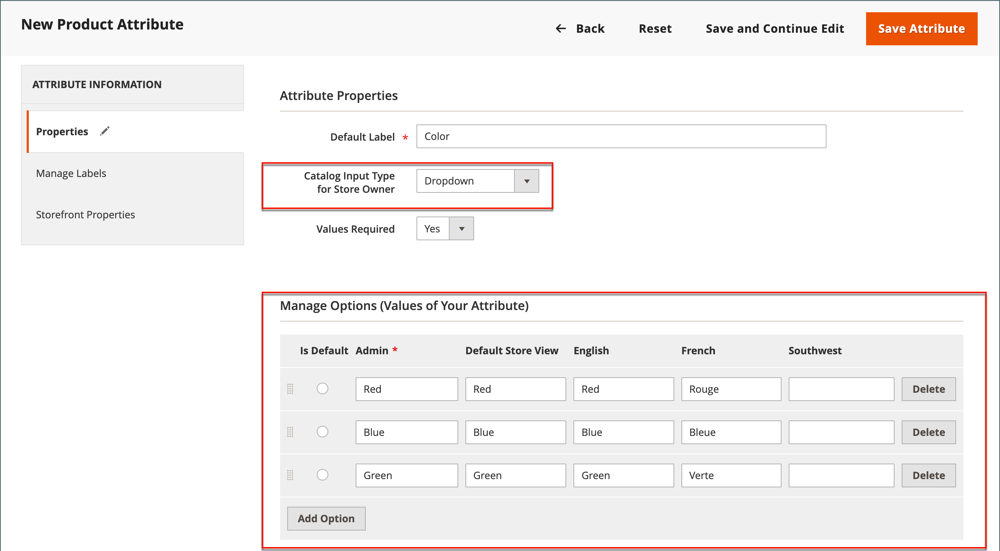
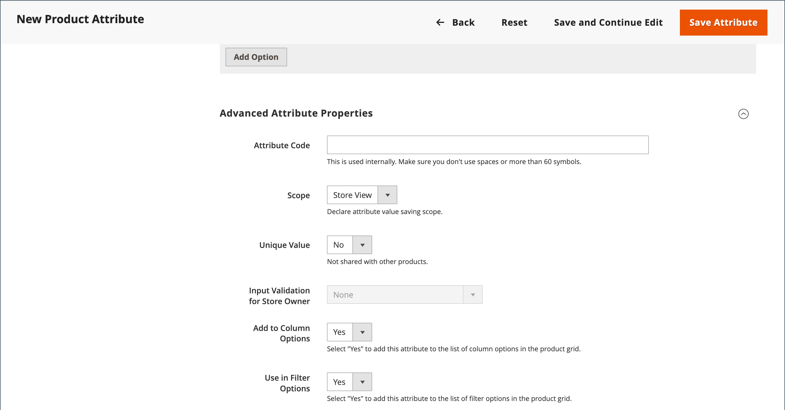
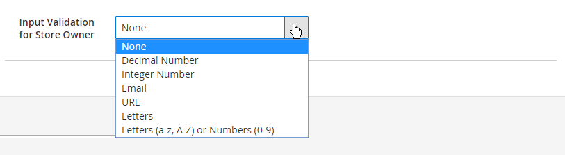
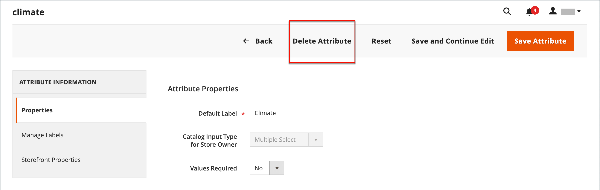

# Criar e excluir atributos de produto

Você pode criar atributos ao trabalhar em um produto ou na página _[!UICONTROL Product Attributes]_. As etapas a seguir mostram como criar atributos no menu&#x200B;_[!UICONTROL Stores]_.

## Etapa 1: Descrever as propriedades básicas do atributo

1. Na barra lateral _Admin_, vá para **[!UICONTROL Stores]** > _[!UICONTROL Attributes]_>**[!UICONTROL Product]**.

1. Clique em **[!UICONTROL Add New Attribute]**.

   {width="600" zoomable="yes"}

1. Para **[!UICONTROL Default Label]**, insira um rótulo que identifique o atributo.

1. Defina **[!UICONTROL Catalog Input Type for Store Owner]** como o tipo de [controle de entrada](attributes-input-types.md) a ser usado para entrada de dados.

   Se o atributo for usado para um [produto configurável](product-create-configurable.md), escolha `Dropdown`. Em seguida, defina **[!UICONTROL Required]** como `Yes`.

1. Se você quiser que uma opção seja selecionada antes que o cliente possa comprar o produto, defina **[!UICONTROL Values Required]** como `Yes`.

1. Para os tipos de entrada [!UICONTROL Dropdown] e [!UICONTROL Multiple Select], faça o seguinte:

   - Em _[!UICONTROL Manage Options]_, clique em **[!UICONTROL Add Option]**.

   - Insira o primeiro valor que você deseja que apareça na lista.

     Você pode inserir um valor para o Administrador e uma tradução do valor para cada exibição de loja. Se você tiver apenas uma visualização de loja, poderá inserir apenas o valor Admin e ele também será usado para a loja.

   - Clique em **[!UICONTROL Add Option]** e repita a etapa anterior para cada opção que deseja incluir na lista.

   - Selecione **[!UICONTROL Is Default]** para usar a opção como valor padrão.

   {width="600" zoomable="yes"}

## Etapa 2: descrever as propriedades avançadas (se necessário)

1. Insira um **[!UICONTROL Attribute Code]** exclusivo em caracteres minúsculos e sem espaços.

   >[!NOTE]
   >
   >Não é recomendável usar o valor `type` no campo [!UICONTROL Attribute Code]. Isso pode causar erros porque o valor `type` está reservado para uso do sistema.

   {width="600" zoomable="yes"}

   As opções disponíveis dependem da configuração _[!UICONTROL Catalog Input Type for Store Owner]_.

1. Para indicar onde a [hierarquia de armazenamento](../getting-started/websites-stores-views.md) pode usar o atributo, defina **[!UICONTROL Scope]**.

1. Se você quiser impedir qualquer entrada de valor duplicada, defina **[!UICONTROL Unique Value]** como `Yes`.

1. Para tipos de entrada que são valores inseridos, execute um teste de validade de quaisquer dados inseridos em um campo de texto definindo **[!UICONTROL Input Validation for Store Owner]** como o tipo de dados que o campo deve conter.

   Este campo não está disponível para tipos de entrada com valores selecionados. O teste pode validar qualquer um dos seguintes itens:

   - `Decimal Number`
   - `Integer Number`
   - `Email`
   - `URL`
   - `Letters`
   - `Letters (a-z, A-Z) or Numbers (0-9)`

   {width="400"}

1. Para adicionar este atributo à [Lista de produtos](products-list.md), defina as seguintes opções como `Yes`.

   - **Adicionar às Opções de Coluna** - Inclui o atributo como uma coluna na lista _[!UICONTROL Products]_.
   - **Usar em Opções de Filtro** - Adiciona um controle de filtro ao cabeçalho da coluna na lista _[!UICONTROL Products]_.

## Etapa 3: insira o rótulo do campo

1. No lado esquerdo da navegação, escolha **[!UICONTROL Manage Labels]**.

1. Digite um **[!UICONTROL Title]** para ser usado como rótulo para o campo.

   Se a loja estiver disponível em diferentes idiomas, você poderá inserir um título traduzido para cada exibição.

   {width="600" zoomable="yes"}

   >[!NOTE]
   >
   > Se você planeja usar esse atributo como uma faceta no Live Search, você deve especificar um rótulo específico da loja. Sem ele, o nome do atributo pode não ser exibido corretamente na página de configuração da faceta. Para atualizar a configuração, edite manualmente o rótulo usando a [opção de edição na lista facetada do Live Search](https://experienceleague.adobe.com/pt-br/docs/commerce/live-search/live-search-admin/facets/facets-add#step-2-edit-facet-properties-optional) no _Guia do Live Search_.

## Etapa 4: descrever as propriedades da loja

1. No lado esquerdo da navegação, escolha **[!UICONTROL Storefront Properties]**.

   {width="600" zoomable="yes"}

   As opções disponíveis dependem da configuração _[!UICONTROL Catalog Input Type for Store Owner]_.

1. Se o atributo deve estar disponível para pesquisa, defina **[!UICONTROL Use in Search]** como `Yes`.

   - Para controlar onde o item aparece nos resultados da pesquisa, defina o valor **[!UICONTROL Search Weight]**: 1 (peso mais baixo) como 10 (peso mais alto).

   - Defina o **[!UICONTROL Visible in Advanced Search]** conforme necessário. Saiba mais em [Pesquisa avançada](search.md#advanced-search).

1. Para incluir o atributo na Comparação de Produtos, defina **[!UICONTROL Comparable on Storefront]** como `Yes`.

1. Para campos suspensos, de seleção múltipla e de preço, faça o seguinte:

   - Para usar o atributo como um filtro na navegação em camadas, defina **[!UICONTROL Use in Layered Navigation]** como `Yes`.

   - Para usar o atributo na navegação em camadas nas páginas de resultados da pesquisa, defina **[!UICONTROL Use in Search Results Layered Navigation]** como `Yes`.

   - Para **[!UICONTROL Position]**, insira um número para indicar a posição relativa do atributo no bloco de navegação em camadas.

1. Para usar o atributo em regras de preço, defina **[!UICONTROL Use for Promo Rule Conditions]** como `Yes`.

1. Para permitir que o texto seja formatado com HTML, defina **[!UICONTROL Allow HTML Tags on Frontend]** como `Yes`.

   Essa configuração disponibiliza o editor do WYSIWYG para o campo.

1. Para incluir o atributo na página do produto, defina **[!UICONTROL Visible on Catalog Pages on Storefront]** como `Yes`.

1. Conclua as seguintes configurações, se houver suporte no seu tema:

   - Para incluir o atributo nas listagens de produtos, defina **[!UICONTROL Used in Product Listing]** como `Yes`.

   - Para usar o atributo como parâmetro de classificação para as listagens de produtos, defina **[!UICONTROL Used for Sorting in Product Listing]** como `Yes`.

1. Quando terminar, clique em **[!UICONTROL Save Attribute]**.

## Etapa 5: Atribuir o atributo criado ao conjunto de atributos

Para que um atributo fique visível na página de criação do produto, adicione-o a um conjunto de atributos específico.

1. Depois de concluir as etapas anteriores, vá para **[!UICONTROL Stores]** > _[!UICONTROL Attributes]_>**[!UICONTROL Attribute Set]**.

1. Selecione o conjunto de atributos necessário na lista e abra-o no modo de edição.

1. Arraste o atributo criado da lista **[!UICONTROL Unassigned Attributes]** para a pasta apropriada na coluna **Grupos**.

1. Quando terminar, clique em **[!UICONTROL Save]**.

## Atributos para produtos configuráveis

Qualquer atributo usado como uma lista suspensa de opções de um [produto configurável](product-create-configurable.md) deve ter as seguintes propriedades:

| Propriedade | Valor |
|----------|------ |
| Tipo de Entrada de Catálogo para o Proprietário da Loja | Lista suspensa |
| Escopo | Global |

{style="table-layout:auto"}

## Excluir um atributo

Quando um atributo é excluído, ele é removido de todos os produtos e conjuntos de atributos relacionados. Os atributos do sistema fazem parte da funcionalidade principal do armazenamento e não podem ser excluídos.

Antes de excluir um atributo, verifique se nenhum produto do catálogo o usa no momento. Uma maneira fácil de determinar se um atributo está em uso é usar a ferramenta [Export](../systems/data-export.md) para verificar a lista de Atributos de Entidade do produto. Se a lista não incluir o atributo, nenhum produto no catálogo o usará.

**_Para excluir um atributo:_**

1. Na barra lateral _Admin_, vá para **[!UICONTROL Stores]** > _[!UICONTROL Attributes]_>**[!UICONTROL Product]**.

1. Localize o atributo na lista e abra-o no modo de edição.

1. Clique em **[!UICONTROL Delete Attribute]**.

   {width="600" zoomable="yes"}

1. Quando for solicitada a confirmação, clique em **[!UICONTROL OK]**.

