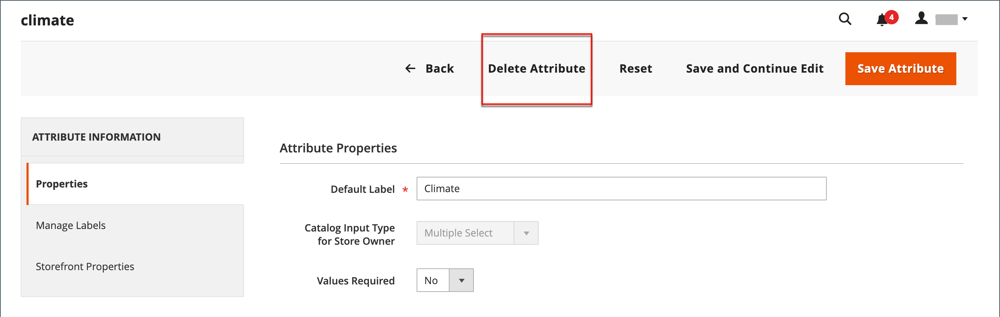

# Criar e excluir atributos de produto

Você pode criar atributos ao trabalhar em um produto ou na página _[!UICONTROL Product Attributes]_. As etapas a seguir mostram como criar atributos no menu_[!UICONTROL Stores]_.

## Etapa 1: Descrever as propriedades básicas do atributo

1. Na barra lateral _Admin_, vá para **[!UICONTROL Stores]** > _[!UICONTROL Attributes]_>**[!UICONTROL Product]**.

1. Clique em **[!UICONTROL Add New Attribute]**.

   {width="600" zoomable="yes"}

1. Para **[!UICONTROL Default Label]**, insira um rótulo que identifique o atributo.

1. Para determinar o tipo de controle de entrada usado para entrada de dados, defina **[!UICONTROL Catalog Input Type for Store Owner]** como um dos seguintes:

   | Propriedade | Descrição |
   |--- |--- |
   | `Text Field` | Um campo de entrada de linha única para texto. |
   | `Text Area` | Um campo de entrada de várias linhas para inserir parágrafos de texto, como uma descrição do produto. Você pode usar o Editor WYSIWYG para formatar o texto com tags HTML ou inserir as tags diretamente no texto. |
   | `Text Editor` | Um editor de texto totalmente funcional no local do atributo. |
   | Data | Exibe um valor de data no [formato preferido](attributes-input-types.md#date-and-time-options) e [fuso horário](../getting-started/store-details.md#locale-options). Os valores de data podem ser selecionados de uma lista ou de um calendário (  ).   **_Observação:_**Dependendo da configuração do seu sistema, os usuários do_Administrador _podem inserir datas diretamente em um campo ou selecionar uma data no calendário ou na lista. Para obter informações sobre como especificar valores de data e hora, consulte [Opções de data e hora](attributes-input-types.md#date-and-time-options). |
   | `Yes/No` | Exibe uma lista suspensa com opções predefinidas de `Yes` e `No`. |
   | `Dropdown` | Exibe uma lista suspensa de valores que aceitam apenas uma única seleção. O tipo de entrada suspensa é um componente chave de [produtos configuráveis](product-create-configurable.md). |
   | `Multiple Select` | Exibe uma lista suspensa de valores que aceitam várias seleções. |
   | `Price` | Esse tipo de entrada é usado para criar campos de preço que estão além dos atributos predefinidos: Preço, Preço Especial, Preço da Camada e Custo. A moeda usada é determinada pela configuração do sistema. |
   | `Media Image` | Associa uma imagem extra a um produto, como um logotipo do produto, instruções de cuidados ou ingredientes de um rótulo de alimentos. Quando você adiciona um atributo de imagem de mídia ao conjunto de atributos de um produto, ele se torna um tipo de imagem extra, juntamente com Base, Pequeno e Miniatura. O atributo de imagem de mídia pode ser excluído do [navegador de mídia de vitrine](catalog-images-video.md#storefront-media-browser). |
   | `Fixed Product Tax` | Permite definir [taxas FPT](../stores-purchase/fixed-product-tax.md) com base nos requisitos da sua localidade. |
   | `Visual Swatch` | Exibe uma amostra que representa a cor, a textura ou o padrão de um produto configurável. Uma [amostra visual](swatches.md) pode ser preenchida com um valor de cor hexadecimal ou exibir uma imagem carregada que represente a cor, o material, a textura ou o padrão da opção. |
   | `Text Swatch` | Uma representação baseada em texto de uma opção de produto configurável que é frequentemente usada para o tamanho. [Amostras de texto](swatches.md#text-based-swatches) também podem incluir valores de cor hexadecimais. |
   | `Page Builder` | Um espaço de trabalho [Page Builder](../page-builder/introduction.md) totalmente funcional no local do atributo que facilita a adição de conteúdo envolvente à página do produto. |

   {style="table-layout:auto"}

1. Se você quiser que uma opção seja selecionada antes que o cliente possa comprar o produto, defina **[!UICONTROL Values Required]** como `Yes`.

1. Para os tipos de entrada [!UICONTROL Dropdown] e [!UICONTROL Multiple Select], faça o seguinte:

   - Em _[!UICONTROL Manage Options]_, clique em **[!UICONTROL Add Option]**.

   - Insira o primeiro valor que você deseja que apareça na lista.

     Você pode inserir um valor para o Administrador e uma tradução do valor para cada exibição de loja. Se você tiver apenas uma visualização de loja, poderá inserir apenas o valor Admin e ele também será usado para a loja.

   - Clique em **[!UICONTROL Add Option]** e repita a etapa anterior para cada opção que deseja incluir na lista.

   - Selecione **[!UICONTROL Is Default]** para usar a opção como valor padrão.

   {width="600" zoomable="yes"}

## Etapa 2: descrever as propriedades avançadas (se necessário)

1. Insira um **[!UICONTROL Attribute Code]** exclusivo em caracteres minúsculos e sem espaços.

   >[!NOTE]
   >
   >Não é recomendável usar o valor `type` no campo [!UICONTROL Attribute Code]. Isso pode causar erros porque o valor `type` está reservado para uso do sistema.

   {width="600" zoomable="yes"}

   As opções disponíveis dependem da configuração _[!UICONTROL Catalog Input Type for Store Owner]_.

1. Defina **[!UICONTROL Scope]** para indicar onde na [hierarquia de armazenamento](../getting-started/websites-stores-views.md) o atributo pode ser usado.

1. Se você quiser impedir qualquer entrada de valor duplicada, defina **[!UICONTROL Unique Value]** como `Yes`.

1. Para tipos de entrada que são valores inseridos, execute um teste de validade de quaisquer dados inseridos em um campo de texto definindo **[!UICONTROL Input Validation for Store Owner]** como o tipo de dados que o campo deve conter.

   Este campo não está disponível para tipos de entrada com valores selecionados. O teste pode validar qualquer um dos seguintes itens:

   - `Decimal Number`
   - `Integer Number`
   - `Email`
   - `URL`
   - `Letters`
   - `Letters (a-z, A-Z) or Numbers (0-9)`

   {width="400"}

1. Para adicionar este atributo à [Lista de produtos](products-list.md), defina as seguintes opções como `Yes`.

   - **Adicionar às Opções de Coluna** - Inclui o atributo como uma coluna na lista _[!UICONTROL Products]_.
   - **Usar em Opções de Filtro** - Adiciona um controle de filtro ao cabeçalho da coluna na lista _[!UICONTROL Products]_.

## Etapa 3: insira o rótulo do campo

1. No lado esquerdo da navegação, escolha **[!UICONTROL Manage Labels]**.

1. Digite um **[!UICONTROL Title]** para ser usado como rótulo para o campo.

   Se a loja estiver disponível em diferentes idiomas, você poderá inserir um título traduzido para cada exibição.

   {width="600" zoomable="yes"}

## Etapa 4: descrever as propriedades da loja

1. No lado esquerdo da navegação, escolha **[!UICONTROL Storefront Properties]**.

   {width="600" zoomable="yes"}

   As opções disponíveis dependem da configuração _[!UICONTROL Catalog Input Type for Store Owner]_.

1. Se o atributo deve estar disponível para pesquisa, defina **[!UICONTROL Use in Search]** como `Yes`.

   - Defina o valor **[!UICONTROL Search Weight]** para controlar onde o item aparece nos resultados da pesquisa: 1 (peso mais baixo) para 10 (peso mais alto).

   - Defina o **[!UICONTROL Visible in Advanced Search]** conforme necessário. Saiba mais em [Pesquisa avançada](search.md#advanced-search).

1. Para incluir o atributo na Comparação de Produtos, defina **[!UICONTROL Comparable on Storefront]** como `Yes`.

1. Para campos suspensos, de seleção múltipla e de preço, faça o seguinte:

   - Para usar o atributo como um filtro na navegação em camadas, defina **[!UICONTROL Use in Layered Navigation]** como `Yes`.

   - Para usar o atributo na navegação em camadas nas páginas de resultados da pesquisa, defina **[!UICONTROL Use in Search Results Layered Navigation]** como `Yes`.

   - Para **[!UICONTROL Position]**, insira um número para indicar a posição relativa do atributo no bloco de navegação em camadas.

1. Para usar o atributo em regras de preço, defina **[!UICONTROL Use for Promo Rule Conditions]** como `Yes`.

1. Para permitir que o texto seja formatado com HTML, defina **[!UICONTROL Allow HTML Tags on Frontend]** como `Yes`.

   Essa configuração disponibiliza o editor do WYSIWYG para o campo.

1. Para incluir o atributo na página do produto, defina **[!UICONTROL Visible on Catalog Pages on Storefront]** como `Yes`.

1. Conclua as seguintes configurações, se houver suporte no seu tema:

   - Para incluir o atributo nas listagens de produtos, defina **[!UICONTROL Used in Product Listing]** como `Yes`.

   - Para usar o atributo como parâmetro de classificação para as listagens de produtos, defina **[!UICONTROL Used for Sorting in Product Listing]** como `Yes`.

1. Quando terminar, clique em **[!UICONTROL Save Attribute]**.

## Etapa 5: Atribuir o atributo criado ao conjunto de atributos

Para que um atributo fique visível na página de criação do produto, adicione-o a um conjunto de atributos específico.

1. Depois de concluir as etapas anteriores, vá para **[!UICONTROL Stores]** > _[!UICONTROL Attributes]_>**[!UICONTROL Attribute Set]**.

1. Selecione o conjunto de atributos necessário na lista e abra-o no modo de edição.

1. Arraste o atributo criado da lista **[!UICONTROL Unassigned Attributes]** para a pasta apropriada na coluna **Grupos**.

1. Quando terminar, clique em **[!UICONTROL Save]**.

## Atributos para produtos configuráveis

Qualquer atributo usado como uma lista suspensa de opções de um [produto configurável](product-create-configurable.md) deve ter as seguintes propriedades:

| Propriedade | Valor |
|----------|------ |
| Tipo de Entrada de Catálogo para o Proprietário da Loja | Lista suspensa |
| Escopo | Global |

{style="table-layout:auto"}

## Excluir um atributo

Quando um atributo é excluído, ele é removido de todos os produtos e conjuntos de atributos relacionados. Os atributos do sistema fazem parte da funcionalidade principal do armazenamento e não podem ser excluídos.

Antes de excluir um atributo, verifique se ele não está sendo usado por nenhum produto em seu catálogo. Uma maneira fácil de determinar se um atributo está em uso é usar a ferramenta [Export](../systems/data-export.md) para verificar a lista de Atributos de Entidade do produto. Se o atributo não estiver incluído na lista, ele não será usado por nenhum produto no catálogo.

**_Para excluir um atributo:_**

1. Na barra lateral _Admin_, vá para **[!UICONTROL Stores]** > _[!UICONTROL Attributes]_>**[!UICONTROL Product]**.

1. Localize o atributo na lista e abra-o no modo de edição.

1. Clique em **[!UICONTROL Delete Attribute]**.

   {width="600" zoomable="yes"}

1. Quando for solicitada a confirmação, clique em **[!UICONTROL OK]**.
