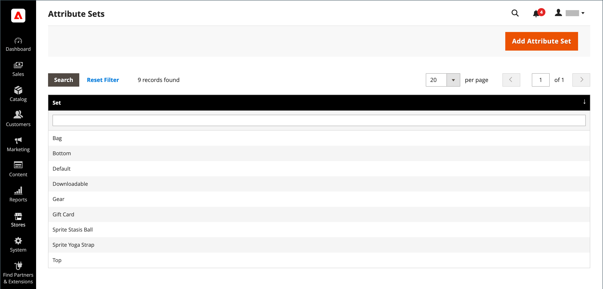
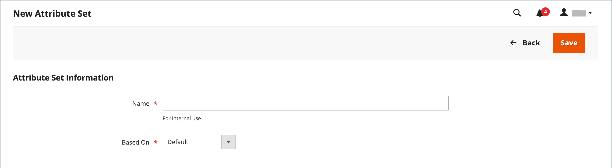
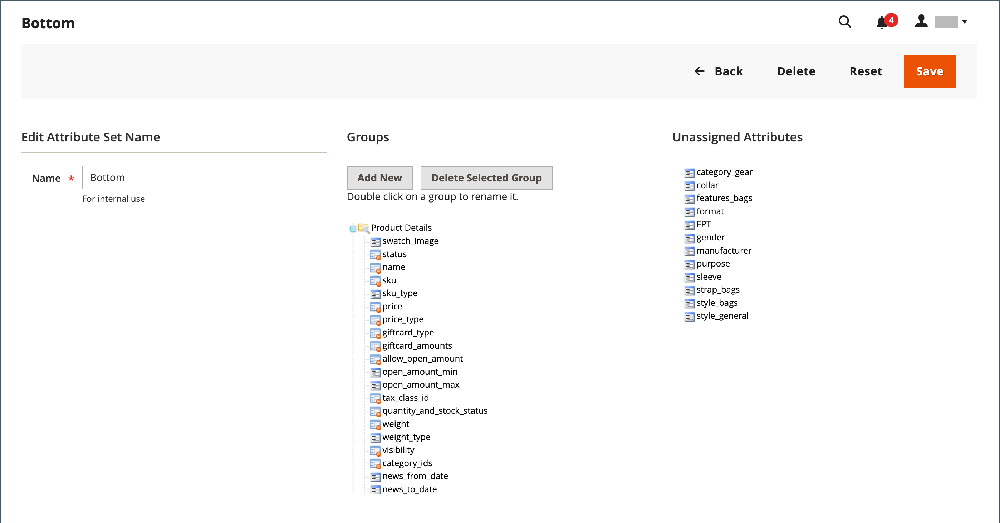

# Conjuntos de atributos

Uma das primeiras etapas ao criar um produto é escolher o conjunto de atributos usado como modelo para o registro do produto. O conjunto de atributos determina os campos que estão disponíveis durante a entrada de dados e os valores que aparecem para o cliente.

Os atributos são organizados em grupos que determinam onde eles aparecem no registro do produto. Seu armazenamento vem com um conjunto de atributos inicial (chamado _padrão_) que inclui um conjunto de atributos comumente usados. Se você quiser adicionar alguns atributos, poderá adicioná-los a esse conjunto de atributos padrão. Se você vender produtos que exigem tipos específicos de informações, talvez seja melhor criar um conjunto de atributos dedicado que inclua os atributos específicos necessários para o produto.

{width="700" zoomable="yes"}

## Criar um conjunto de atributos

1. Na barra lateral _Admin_, vá para **[!UICONTROL Stores]** > _[!UICONTROL Attributes]_>**[!UICONTROL Attribute Set]**.

1. Clique em **[!UICONTROL Add New Set]**.

   {width="600" zoomable="yes"}

1. Insira um **[!UICONTROL Name]** para o conjunto de atributos.

1. Defina **[!UICONTROL Based On]** para um conjunto de atributos existente para ser usado como modelo.

1. Clique em **[!UICONTROL Save]**.

   A próxima página exibe o seguinte:

   - A coluna da esquerda mostra o nome do conjunto de atributos. O nome é para referência interna e pode ser alterado conforme necessário.
   - O centro da página lista a seleção atual de grupos de atributos.
   - A coluna direita lista a seleção de atributos que não estão designados ao conjunto de atributos no momento.

1. Para adicionar um atributo ao conjunto, arraste o atributo da lista **[!UICONTROL Unassigned Attributes]** para a pasta apropriada na coluna **[!UICONTROL Groups]**. Para remover um atributo do conjunto, arraste-o para a lista **[!UICONTROL Unassigned Attributes]**.

   >[!NOTE]
   >
   >Os atributos do sistema são marcados com um ponto e não podem ser removidos da lista _[!UICONTROL Groups]_. No entanto, eles podem ser arrastados para outro grupo no conjunto de atributos.

1. Quando terminar, clique em **[!UICONTROL Save]**.

{width="600" zoomable="yes"}

## Criar um grupo de atributos

1. Na coluna _[!UICONTROL Groups]_do conjunto de atributos, clique em **[!UICONTROL Add New]**.

1. Insira um **[!UICONTROL Name]** para o novo grupo e clique em **[!UICONTROL OK]**.

1. Siga um destes procedimentos:

   - Arraste **[!UICONTROL Unassigned Attributes]** para o novo grupo.
   - Arraste os atributos de qualquer outro grupo para o novo grupo.
   - Arraste atributos desnecessários para **[!UICONTROL Unassigned Attributes]**.

   O novo grupo se torna uma seção de atributos em qualquer produto baseado no conjunto de atributos.

## Excluir um conjunto de atributos

1. Na barra lateral _Admin_, vá para **[!UICONTROL Stores]** > _[!UICONTROL Attributes]_>**[!UICONTROL Attribute Set]**.

1. Selecione o conjunto de atributos na lista e abra no modo de edição.

1. Clique em **[!UICONTROL Delete]**.

1. Quando for solicitada a confirmação, clique em **[!UICONTROL OK]**.
