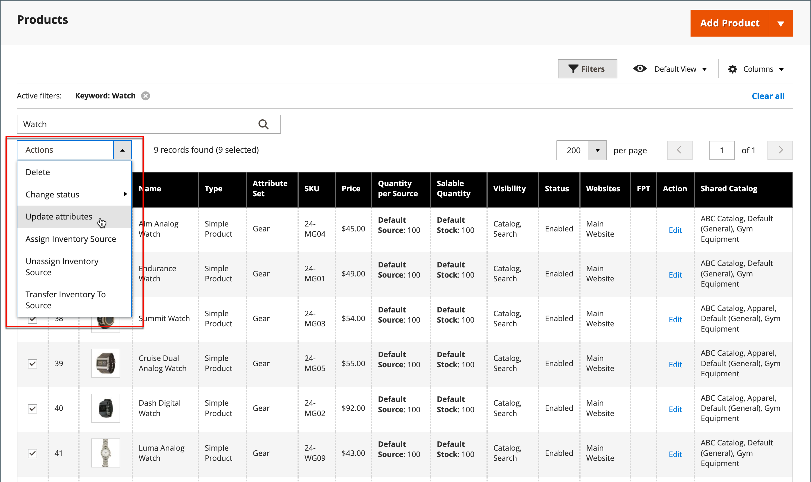

# Atualizações em massa para atributos do produto

Use a ferramenta _[!UICONTROL Update Attributes]_&#x200B;para alterar um ou mais atributos em seus produtos. Essa ferramenta permite aplicar alterações significativas em um grande grupo de produtos.

1. Na barra lateral _Admin_, vá para **[!UICONTROL Catalog]** > **[!UICONTROL Products]**.

1. Selecione os produtos para os quais deseja modificar origens.

   Procure ou pesquise para encontrar os produtos e marque essas caixas de seleção.

1. Clique no menu **[!UICONTROL Actions]** na parte superior e escolha **[!UICONTROL Update Attributes]**.

   {width="600" zoomable="yes"}

1. Atualize o atributo, o inventário avançado ou os dados do site dos produtos selecionados, de acordo com suas necessidades.

   {width="600" zoomable="yes"}

1. Quando terminar, clique em **[!UICONTROL Save]**.
