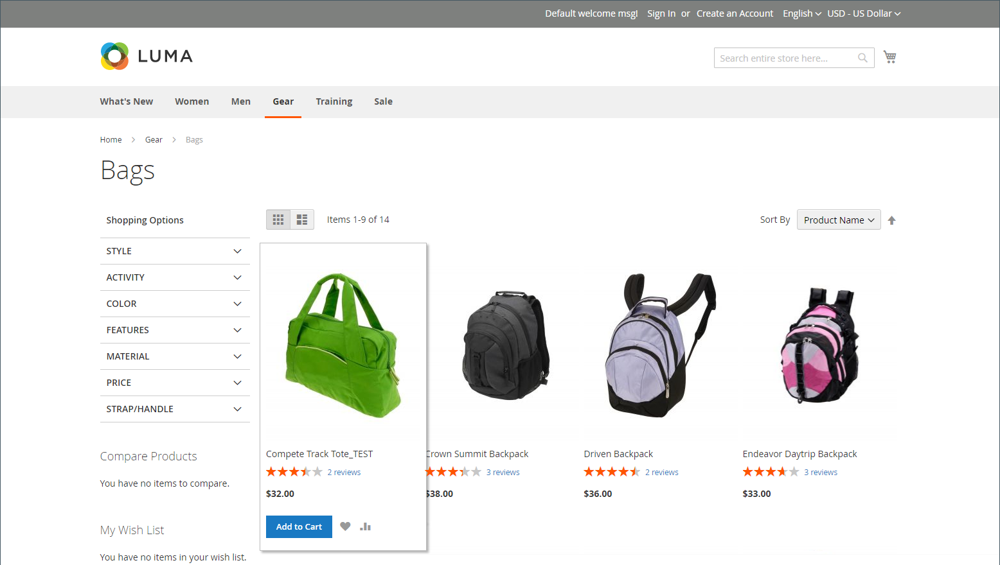

# Catálogos simples

>[!IMPORTANT]
>
>O uso de um catálogo simples não é mais recomendado como prática recomendada. O uso continuado desse recurso é conhecido por causar degradação de desempenho e outros problemas de indexação. Uma descrição detalhada e uma solução estão disponíveis na [Central de Ajuda](https://experienceleague.adobe.com/docs/commerce-knowledge-base/kb/troubleshooting/miscellaneous/slow-performance-slow-and-long-running-crons.html?lang=pt-BR).  As versões afetadas incluem:  - Adobe Commerce na infraestrutura de nuvem, 2.3.x e superior - Adobe Commerce (No local), 2.3.x e superior - Magento Open Source, 2.3.x e superior   Em qualquer versão de lançamento, algumas extensões funcionam somente com tabelas simples, criando um risco se você desabilitar tabelas simples. Se você souber que tem algumas extensões que usam indexadores de Catálogo Simples, deverá estar ciente desse risco ao definir esses valores como `No`.

O Commerce geralmente armazena dados de catálogo em várias tabelas, com base no modelo Entity-Attribute-Value (EAV). Como os atributos do produto são armazenados em muitas tabelas, as consultas SQL às vezes são longas e complexas.

Por outro lado, um catálogo simples cria tabelas em tempo real, onde cada linha contém todos os dados necessários sobre um produto ou categoria. Um catálogo simples é atualizado automaticamente — a cada minuto ou de acordo com seu trabalho cron. A indexação de catálogos simples também pode acelerar o processamento de regras de catálogo e preço de carrinho. Um catálogo com até 500.000 SKUs pode ser indexado rapidamente como um catálogo simples.

>[!NOTE]
>
>Antes de habilitar um catálogo simples para uma loja em tempo real, teste a configuração em um ambiente de desenvolvimento.

## Etapa 1: Ativar o catálogo simples

1. Na barra lateral _Admin_, vá para **[!UICONTROL Stores]** > _[!UICONTROL Settings]_>**[!UICONTROL Configuration]**.

1. No painel esquerdo, expanda **[!UICONTROL Catalog]** e escolha **[!UICONTROL Catalog]** abaixo de.

1. Expanda a seção _Vitrine_ e faça o seguinte:

   - Defina **[!UICONTROL Use Flat Catalog Category]** como `Yes`. (Se necessário, desmarque a caixa de seleção **[!UICONTROL Use system value]**.)

   - Defina **[!UICONTROL Use Flat Catalog Product]** como `Yes`.

   {width="700" zoomable="yes"}

1. Quando terminar, clique em **[!UICONTROL Save Config]**.

1. Quando solicitado a atualizar o cache, clique em **[!UICONTROL Cache Management]** na mensagem do sistema e siga as instruções para atualizar o cache.

## Etapa 2: verificar os resultados

Há dois métodos que podem ser usados para verificar os resultados.

### Método 1: verificar os resultados de um único produto

1. Na barra lateral _Admin_, vá para **[!UICONTROL Catalog]** > **[!UICONTROL Products]**.

1. Abra um produto no modo de edição.

1. Para **[!UICONTROL Name]**, adicione o texto `_TEST` ao final do nome do produto.

1. Clique em **[!UICONTROL Save]**.

1. Em uma nova guia do navegador, navegue até a página inicial da loja e faça o seguinte:

   - Procure o produto que você editou.

   - Use a navegação para procurar o produto na categoria atribuída.

     Se necessário, atualize a página para ver os resultados. A alteração aparece dentro de um minuto ou de acordo com seu cronograma [Cron](../systems/cron.md).

   {width="700" zoomable="yes"}

### Método 2: verificar os resultados de uma categoria

1. Na barra lateral _Admin_, vá para **[!UICONTROL Catalog]** > **[!UICONTROL Categories]**.

1. No canto superior esquerdo, verifique se **[!UICONTROL Store View]** está definido como `All Store Views`.

   Se solicitado, clique em **[!UICONTROL OK]** para confirmar.

1. Na árvore de categorias, selecione uma categoria existente, clique em **[!UICONTROL Add Subcategory]** e faça o seguinte:

   - Para **[!UICONTROL Category Name]**, digite `Test Category`.

   - Quando terminar, clique em **[!UICONTROL Save]**.

     {width="600" zoomable="yes"}

   - Expanda  a seção **[!UICONTROL Products in Category]** e clique em **[!UICONTROL Reset Filter]** para exibir todos os produtos.

   - Marque a caixa de seleção de vários produtos a serem adicionados à nova categoria.

   - clique em **[!UICONTROL Save]**.

   {width="600" zoomable="yes"}

1. Em uma nova guia do navegador, navegue até a página inicial da loja e use a navegação para navegar até a categoria criada.

   Se necessário, atualize a página para ver os resultados. A alteração será exibida dentro de um minuto ou de acordo com a programação do cron.

## Etapa 3: Remover os dados de teste

Faça o seguinte para remover os dados de teste e restaurar o nome original do produto e a configuração do catálogo.

### Remover a categoria de teste

1. Na barra lateral _Admin_, vá para **[!UICONTROL Catalog]** > **[!UICONTROL Categories]**.

1. Na árvore de categorias, selecione a subcategoria de teste criada.

1. No canto superior direito, clique em **[!UICONTROL Delete]**.

1. Quando for solicitada a confirmação, clique em **[!UICONTROL OK]**.

   Essa remoção de categoria não remove os produtos atribuídos à categoria.

### Restaurar o nome original do produto

1. Na barra lateral _Admin_, vá para **[!UICONTROL Catalog]** > **[!UICONTROL Categories]**.

1. Abra o produto de teste no modo de edição.

1. Remova o texto `_TEST` adicionado ao **[!UICONTROL Product Name]**.

1. No canto superior direito, clique em **[!UICONTROL Save]**.

### Restaurar a configuração original do catálogo

1. Na barra lateral _Admin_, vá para **[!UICONTROL Stores]** > _[!UICONTROL Settings]_>**[!UICONTROL Configuration]**.

1. No painel esquerdo, expanda **[!UICONTROL Catalog]** e escolha **[!UICONTROL Catalog]** abaixo de.

1. Expanda a seção _Vitrine_ e faça o seguinte:

   - Defina **[!UICONTROL Use Flat Catalog Category]** como `No`.

   - Defina **[!UICONTROL Use Flat Catalog Product]** como `No`.

1. Quando terminar, clique em **[!UICONTROL Save Config]**.

1. Quando solicitado, atualize o cache.
