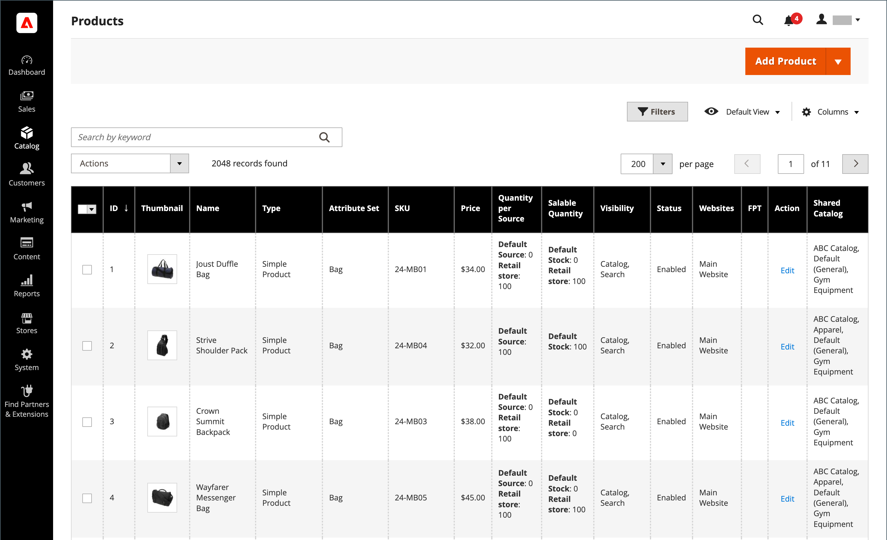
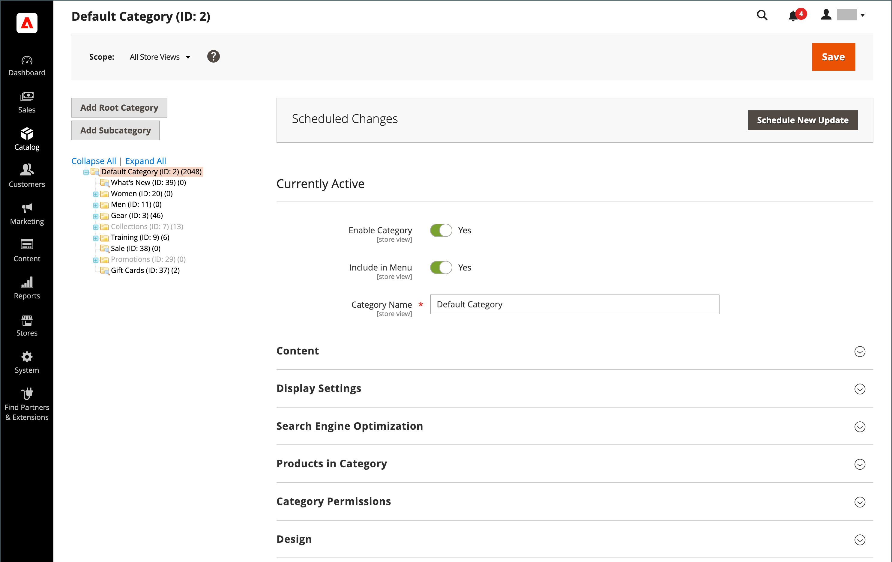
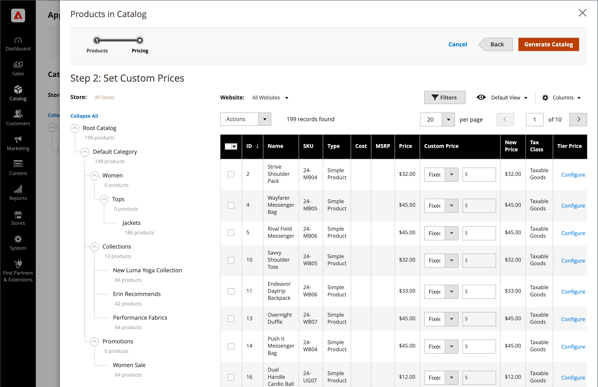

# Menu [!UICONTROL Catalog]

O menu [!UICONTROL Catalog] fornece acesso fácil às ferramentas de criação de produtos, categoria e gerenciamento de estoque, além de catálogos compartilhados para preços personalizados em [lojas B2B](https://experienceleague.adobe.com/docs/commerce-admin/b2b/introduction.html?lang=pt-BR).

>[!BEGINTABS]

>[!TAB Adobe Commerce]

[!BADGE Somente PaaS]{type=Informative url="https://experienceleague.adobe.com/pt-br/docs/commerce/user-guides/product-solutions" tooltip="Aplica-se somente a projetos do Adobe Commerce na nuvem (infraestrutura do PaaS gerenciada pela Adobe) e a projetos locais."}

{width="300" zoomable="yes"}

>[!TAB Adobe Commerce as a Cloud Service]

[!BADGE Somente SaaS]{type=Positive url="https://experienceleague.adobe.com/pt-br/docs/commerce/user-guides/product-solutions" tooltip="Aplicável somente a projetos do Adobe Commerce as a Cloud Service e do Adobe Commerce Optimizer (infraestrutura SaaS gerenciada pela Adobe)."}

{width="300" zoomable="yes"}

>[!ENDTABS]

Na barra lateral _Admin_, clique em **[!UICONTROL Catalog]**.

## [!UICONTROL Products]

Crie [produtos](products-list.md) de todos os tipos e gerencie seu inventário.

{width="700" zoomable="yes"}

## [!UICONTROL Categories]

Crie a estrutura de [categoria](categories.md) que é a base da navegação do armazenamento.

{width="700" zoomable="yes"}

## [!UICONTROL Shared Catalogs]

Para lojas com o Adobe Commerce B2B instalado e habilitado, os [catálogos compartilhados](https://experienceleague.adobe.com/docs/commerce-admin/b2b/shared-catalogs/catalog-shared.html?lang=pt-BR) oferecem a capacidade de disponibilizar preços personalizados para diferentes empresas.

{width="700" zoomable="yes"}
