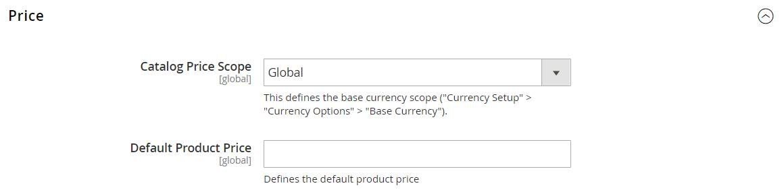

# Escopo de preço

O escopo da [moeda base](../stores-purchase/currency-configuration.md) usada para os preços dos produtos pode ser configurado para ser aplicado no nível global ou do site. Se aplicado ao nível global, o mesmo preço é usado em toda a hierarquia da loja. Se aplicado ao nível do site, o mesmo produto pode estar disponível a preços diferentes de lojas associadas a sites diferentes. Por padrão, o escopo dos preços do produto é global.

Fatores diferentes podem afetar o preço do mesmo produto em um local e não em outro. Por exemplo, pode haver custos adicionais de distribuição para o produto e outras considerações que afetam o preço dos produtos vendidos em uma loja específica. O diagrama a seguir mostra uma instalação multissite com a moeda base definida no nível do site. As lojas e visualizações de loja associadas a cada site refletem os preços do produto definidos no nível do site.

 Se você estiver usando catálogos compartilhados, consulte também [Definir estrutura e preço do catálogo compartilhado](../b2b/catalog-shared-pricing-structure.md) no _Guia B2B do Adobe Commerce_.

{width="550"}

## Configurar escopo de preço

1. No menu _Admin_, vá para **[!UICONTROL Stores]** > _[!UICONTROL Settings]_>**[!UICONTROL Configuration]**.

1. No painel esquerdo, expanda **[!UICONTROL Catalog]** e escolha **[!UICONTROL Catalog]** abaixo de.

1. Role para baixo até a seção **[!UICONTROL Price]** e defina **[!UICONTROL Catalog Price Scope]** como um dos seguintes:

   - `Global`
   - `Website`

   A configuração de escopo escolhida aparece abaixo dos campos de preço no catálogo.

   {width="600" zoomable="yes"}

1. Quando terminar, clique em **[!UICONTROL Save Config]**.

## Usar escopo para configurar preços de produtos

A Commerce não permite a definição de um preço de produto para cada loja. Mas você pode alterar o preço por site:

1. No menu _Admin_, vá para **[!UICONTROL Stores]** > _[!UICONTROL Settings]_>**[!UICONTROL Configuration]**.

1. No painel esquerdo, expanda **[!UICONTROL Catalog]** e escolha **[!UICONTROL Catalog]** abaixo de.

1. Na guia **[!UICONTROL Price]**, defina o escopo de preço como `Website` em vez de global.

1. Defina o preço abrindo a página de edição do produto, selecionando o escopo no canto superior esquerdo e inserindo um novo preço por site.
