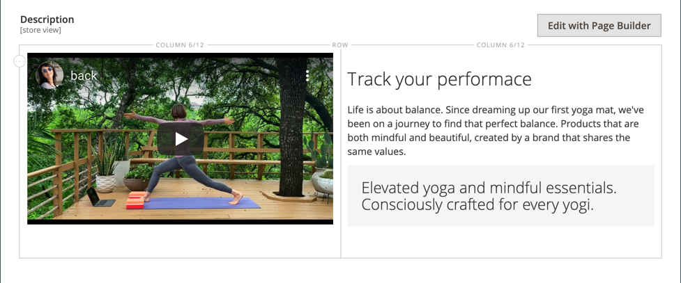

# Categorias - Configurações de conteúdo

A variável _[!UICONTROL Content]_determinam que qualquer conteúdo adicional será exibido na página de categoria. Além da lista de produtos da categoria, a página pode incluir uma imagem, uma descrição e um bloco CMS. Você pode usar o [[!DNL Page Builder]](../page-builder/introduction.md) ferramentas de conteúdo para definir a descrição da categoria.

## Adicione a descrição da categoria em [!DNL Page Builder]

1. Abra a categoria no modo de edição.

1. Rolar para baixo e expandir  o **[!UICONTROL Content]** seção.

   {width="600" zoomable="yes"}

1. Na parte superior direita do **[!UICONTROL Description]** clique em **[!UICONTROL Edit with Page Builder]**.

1. Use o [[!DNL Page Builder]](../page-builder/introduction.md) ferramentas de conteúdo para [editar qualquer texto existente](../page-builder/text.md) e adicione outro conteúdo (se necessário).

## [!DNL Page Builder] pré-visualização

Ao expandir a variável _Conteúdo_ seção para uma categoria existente onde há conteúdo criado com [!DNL Page Builder], ele exibe uma pré-visualização da variável **[!UICONTROL Description]** como seria exibido na página de categoria. Clicar na área de conteúdo abre a variável [!DNL Page Builder] espaço de trabalho, onde você pode fazer as atualizações necessárias.

{width="500" zoomable="yes"}

Essa pré-visualização de conteúdo é ativada para os formulários de produto e categoria por padrão. Se o desempenho for afetado pelo carregamento da visualização, você poderá desativar a visualização na [Configuração da Gestão de conteúdo](../configuration-reference/general/content-management.md#advanced-content-tools) configurações.

## Adicionar a descrição da categoria no editor

Digite somente caracteres ASCII simples na caixa de texto. Ao colar texto de um processador de texto, salve-o primeiro como um arquivo .TXT simples para remover os caracteres de controle invisíveis.

Para obter mais informações, consulte [Editor WYSIWYG](../content-design/editor.md).

1. Abra a categoria no modo de edição.

1. Rolar para baixo e expandir  o **[!UICONTROL Content]** seção.

   {width="500" zoomable="yes"}

1. Insira a categoria **[!UICONTROL Description]** e use o [barra de ferramentas do editor](../content-design/editor.md) para formatar conforme necessário.

   Você pode arrastar o canto inferior direito para alterar a altura da caixa de texto.

## Adicionar um bloco CMS à página de categoria

1. No _Admin_ barra lateral, vá para **[!UICONTROL Catalog]** > **[!UICONTROL Categories]**.

1. Na árvore de categorias, selecione a categoria que deseja editar.

1. Expandir  o **[!UICONTROL Content]** seção.

1. Para **[!UICONTROL Add the CMS block]**, selecione um bloco que deseja adicionar.

1. Expandir  o **[!UICONTROL Display Settings]** seção.

1. Defina o **[!UICONTROL Display Mode]** a um dos seguintes:

   - `Static block only`
   - `Static block and products`

1. Quando terminar, clique em **[!UICONTROL Save]** e revise a exibição de blocos na loja (requer atualização do cache).

## Referência de configurações de conteúdo

| Configuração | [Escopo](../getting-started/websites-stores-views.md#scope-settings) | Descrição |
|--- |--- |--- |
| [!UICONTROL Category Image] | Exibição da loja | Especifica uma imagem para a parte superior da página de categoria. Métodos:   **[!UICONTROL Upload]**- Faz upload de um arquivo de imagem do seu computador local para a galeria e o usa como a imagem da categoria.  **[!UICONTROL Select from Gallery]** - Solicita que você escolha uma imagem existente da galeria.    - Arraste um arquivo de imagem para o bloco da câmera ou navegue até a imagem e selecione-a no sistema de arquivos local. |
| [!UICONTROL Description] | Exibição da loja | Especifica uma descrição que aparece na página da categoria.   **[!UICONTROL Edit with Page Builder]**- Abre a [[!DNL Page Builder] espaço de trabalho](../page-builder/workspace.md), em que você pode editar a descrição.  **[!UICONTROL Show / Hide Editor]** - Alterna a exibição entre o editor WYSIWYG e os modos HTML. |
| [!UICONTROL Add CMS Block] | Exibição da loja | Adiciona um existente [Bloco CMS](../content-design/blocks.md) à página de categoria. |

{style="table-layout:auto"}
