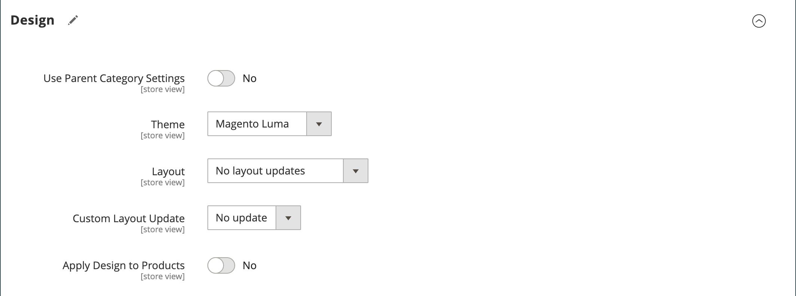

# Categorias - Configurações de design

A seção _[!UICONTROL Design]_&#x200B;oferece controle sobre a aparência de uma categoria, todas as páginas de produto associadas e o layout da página. É possível personalizar uma página de categoria e seus produtos associados para uma promoção ou para diferenciar a categoria. Por exemplo, você pode desenvolver um design especial para uma marca ou linha especial de produtos ou aplicar uma atualização por um período específico.

{width="600" zoomable="yes"}

>[!NOTE]
>
>Quando o mesmo produto é atribuído a várias categorias com configurações de design diferentes para cada categoria, é recomendável definir **Usar Caminho de Categorias para URLs de Produtos** = `Yes` nas [opções de configuração da Otimização do Mecanismo de Pesquisa](../configuration-reference/catalog/catalog.md#search-engine-optimization). Para acessar esta configuração, vá para **[!UICONTROL Stores]** > _[!UICONTROL Settings]_>**[!UICONTROL Configuration]**, expanda **[!UICONTROL Catalog]**&#x200B;e escolha **Catálogo**&#x200B;no painel esquerdo e, em seguida, expanda a seção **Otimização do Mecanismo de Pesquisa**&#x200B;na página.

| Campo | Descrição |
|--- |--- |
| [!UICONTROL Use Parent Category Settings] | Permite que a categoria atual herde as configurações de design da categoria principal. Se usados, todos os outros campos na seção Design ficarão indisponíveis. Opções: `Yes` / ` No` |
| [!UICONTROL Theme] | Aplica um tema personalizado à categoria. |
| [!UICONTROL Layout] | Aplica um layout diferente à página de categoria. Opções:  **[!UICONTROL No layout updates]**- Por padrão, as atualizações de layout não estão disponíveis para páginas de categoria. **[!UICONTROL Empty]** - Use para definir seu próprio layout de página. (Requer compreensão de XML.)  **[!UICONTROL 1 column]**- Aplica um layout de uma coluna à página de categoria. **[!UICONTROL 2 columns with left bar]** - Aplica um layout de duas colunas com uma barra lateral esquerda à página de categoria.  **[!UICONTROL 2 columns with right bar]**- Aplica um layout de duas colunas com uma barra lateral direita à página de categoria. **[!UICONTROL 3 columns]** - Aplica um layout de três colunas à página de categoria. **[!UICONTROL Page -- Full Width]**- (Requer o [Page Builder](../page-builder/introduction.md)) Aplica o layout de largura total das páginas do CMS à página de categoria. **[!UICONTROL Category -- Full Width]** - (Exige o Page Builder) Aplica o layout de largura total das páginas de categoria à página de categoria.  **[!UICONTROL Product -- Full Width]**- (Exige o Page Builder) Aplica o layout de largura total das páginas de produto à página de categoria. |
| [!UICONTROL Custom Layout Update] | Lista os arquivos de atualização de layout personalizado disponíveis no servidor. Escolha a atualização de layout personalizado que deseja aplicar à categoria. |
| [!UICONTROL Apply Design to Products] | Quando selecionada, aplica as configurações personalizadas a todos os produtos na categoria. |

{style="table-layout:auto"}

## [!UICONTROL Scheduled Design Update]

{{ce-feature}}

A seção _[!UICONTROL Scheduled Design Update]_&#x200B;determina o intervalo de datas quando um design personalizado é aplicado a páginas de categoria.

| Campo | Descrição |
|--- |--- |
| [!UICONTROL Schedule Update From/To] | Determina o intervalo de datas quando um layout personalizado é aplicado à categoria. |

{width="600" zoomable="yes"}
