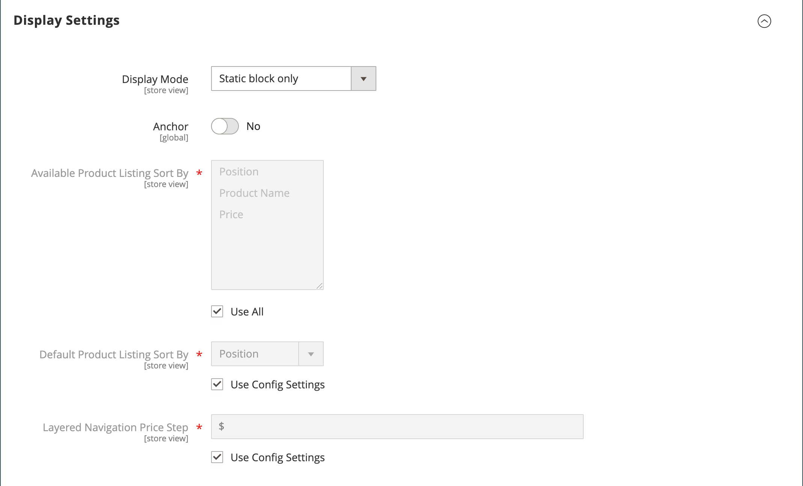

# Categorias - Configurações de exibição

As configurações de exibição determinam quais elementos de conteúdo aparecem em uma página de categoria e a ordem em que os produtos aparecem. Você pode habilitar blocos do CMS, definir o status de âncora da categoria e gerenciar opções de classificação na guia _[!UICONTROL Display Settings]_. Para obter exemplos de como as categorias são refletidas na loja, consulte [Navegação no catálogo](navigation.md).

{width="600" zoomable="yes"}

| Campo | Descrição |
|--- |--- |
| [!UICONTROL Display Mode] | Determina os elementos de conteúdo exibidos na página de categoria. Opções: `Products Only` / `Static Block Only` / `Static Block and Products` |
| [!UICONTROL Anchor] | Quando definido como `Yes`, exibe produtos das subcategorias na categoria, mesmo que eles não tenham sido explicitamente adicionados à categoria, e habilita a exibição da seção _[!UICONTROL filter by attribute]_&#x200B;na navegação em camadas. Opções: `Yes` / `No` |
| [!UICONTROL Available Product Listing Sort By] | (Obrigatório) Os valores padrão são `Position`, `Name` e `Price`. Para personalizar a opção de classificação, desmarque a caixa de seleção **[!UICONTROL Use All Available Attributes]** e selecione os atributos que deseja usar. Você pode definir e adicionar atributos conforme necessário. Esta configuração não se aplica ao [!DNL Live Search] [Widget de página de listagem de produtos](https://experienceleague.adobe.com/pt-br/docs/commerce/live-search/live-search-storefront/plp-styling). |
| [!UICONTROL Default Product Listing Sort By] | (Obrigatório) Para definir a opção _[!UICONTROL Sort By]_&#x200B;padrão, desmarque a caixa de seleção **[!UICONTROL Use Config Settings]**&#x200B;e selecione um atributo. Esta configuração não se aplica ao [!DNL Live Search] [Widget de página de listagem de produtos](https://experienceleague.adobe.com/pt-br/docs/commerce/live-search/live-search-storefront/plp-styling). |
| [!UICONTROL Layered Navigation Price Step] | Por padrão, o Commerce exibe a faixa de preços em incrementos de 10, 100 e 1000, dependendo dos produtos na lista. Para alterar o intervalo de Etapas de Preço, desmarque a caixa de seleção **[!UICONTROL Use Config Settings]**. |

{style="table-layout:auto"}
