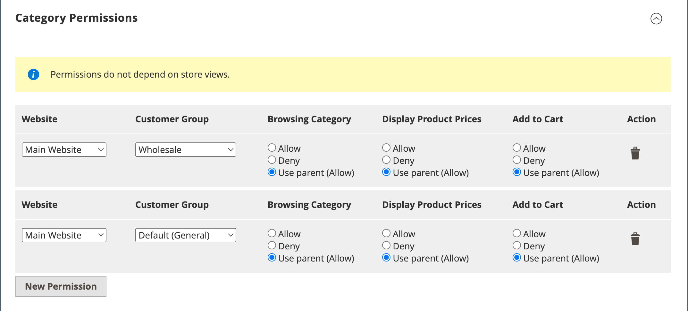

# Criar categorias

A estrutura de categoria do catálogo é como uma árvore de cabeça para baixo, com a raiz na parte superior. Cada seção da árvore pode ser expandida e recolhida. As categorias desativadas ou ocultas ficam esmaecidas. As categorias no primeiro nível (abaixo do [raiz](category-root.md)) normalmente aparecem como opções na [menu principal](navigation-top.md). É possível criar quantas subcategorias adicionais forem necessárias, de acordo com a profundidade máxima do menu definida na configuração. As categorias podem ser arrastadas e soltas em outros locais na árvore. O número da ID da categoria aparece entre parênteses após o nome da categoria na parte superior da página.

Para um site com vários [lojas](../stores-purchase/stores.md#add-stores), é possível criar uma categoria raiz diferente para cada loja que define o conjunto de categorias usado para a variável [navegação superior](navigation-top.md).

{width="700" zoomable="yes"}

## Práticas recomendadas

Use essas práticas recomendadas ao planejar e criar categorias.

### Estrutura de categoria

A estrutura das categorias no menu principal pode afetar a experiência e o desempenho do cliente. Como prática recomendada, você deve identificar uma categoria de nível superior abrangente e evitar ter outras categorias com o mesmo nome. Por exemplo, em vez de ter várias categorias para &quot;Crianças&quot; organizadas em diferentes departamentos, como `Clothing/Kids`, `Shoes/Kids`, `Accessories/Kids`. Pode ser mais eficiente tornar a categoria principal de nível superior `Kids`e, em seguida, crie subcategorias conforme necessário abaixo. Seja consistente com a estrutura da categoria e use a mesma abordagem para todos os tipos de produtos no catálogo.

### Regras de negócios e automação

Considere a estrutura da categoria e os valores de atributo disponíveis ao usar a lógica de negócios para mostrar itens semelhantes em uma página de catálogo ou para configurar uma promoção personalizada, um processo automatizado ou critérios de pesquisa. Por exemplo, se você especificar &quot;polo&quot; como uma categoria principal, os resultados poderão incluir gênero misto e produtos inadequados para a idade. No entanto, se você corresponder a uma subcategoria específica de camisas polo, os resultados são mais estreitos e susceptíveis de atrair um cliente específico. Os resultados podem ser ainda mais específicos quando combinados com outros valores de atributo que se destinam a um cliente específico. Considere o número de produtos que devem ser filtrados e recuperados ao fazer referência a um caminho de categoria específico. A diferença nos resultados pode ser dramática. Considere os diferentes resultados retornados pelos seguintes caminhos de categoria:

- `[Category:  All Products/Shirts/Father's Day/Polos/Sale]`
- `[Category Path: Men/Shirts/Polos]`
- `[Child Category: Polos]`

É importante definir claramente as relações categóricas, como:

- categoria principal
- subcategoria
- caminho da categoria

Além disso, defina quaisquer palavras-chave e atributos associados, como:

- disponibilidade
- preço de venda
- marca
- tamanho
- cor

## Etapa 1: criar uma categoria

1. No _Admin_ barra lateral, vá para **[!UICONTROL Catalog]** > **[!UICONTROL Categories]**.

1. Definir **[!UICONTROL Store View]** para determinar onde a nova categoria deve estar disponível.

1. Na árvore de categorias, selecione a categoria principal da nova categoria.

   O nível principal está um acima da nova categoria.

   Se você estiver começando do início sem nenhum dado, pode haver apenas duas categorias na lista: _Categoria padrão_, que é a raiz, e um _Exemplo de categoria_

1. Clique em **[!UICONTROL Add Subcategory]**.

## Etapa 2: Preencher as informações básicas

1. Se quiser que a categoria fique disponível imediatamente no armazenamento, defina **[!UICONTROL Enable Category]** para `Yes`.

1. Para incluir a categoria na variável [navegação superior](navigation-top.md), definir **[!UICONTROL Include in Menu]** para `Yes`.

1. Insira o **[!UICONTROL Category Name]**.

   {width="500" zoomable="yes"}

1. click **[!UICONTROL Save]** e continue.

## Etapa 3: completar o conteúdo da categoria

1. Expandir  o **[!UICONTROL Content]** seção.

   {width="600" zoomable="yes"}

1. Para exibir um **[!UICONTROL Category Image]** na parte superior da página, você pode fazer upload de sua própria imagem ou usar uma imagem que exista no [Armazenamento de mídia](../content-design/media-storage.md).

   - Para carregar sua própria imagem, clique em **[!UICONTROL Upload]** e escolha a imagem que deseja representar a categoria.

   - Para usar imagens do Armazenamento de mídia, clique em **[!UICONTROL Select from Gallery]** e selecione a imagem que deseja representar a categoria.

   >[!NOTE]
   >
   >Na Galeria de mídia, também é possível usar a variável [Integração do Adobe Stock](../content-design/adobe-stock.md) para localizar uma imagem apropriada clicando em **[!UICONTROL Search Adobe Stock]**.

1. Para **[!UICONTROL Description]**, insira o texto ou outro conteúdo que deseja exibir na landing page da categoria.

   Para obter mais informações, consulte [Conteúdo da categoria](categories-content-settings.md).

1. Para incluir um bloco de conteúdo na landing page da categoria, escolha a **[!UICONTROL CMS Block]** que você deseja que apareça.

1. click **[!UICONTROL Save]** e continue.

## Etapa 4: concluir as configurações de exibição

1. Expandir  o **[!UICONTROL Display Setting]** seção.

   {width="600" zoomable="yes"}

   Para obter mais informações sobre essas opções, consulte. Para obter mais informações sobre essas opções, consulte  [Configurações de exibição](categories-display-settings.md).

1. Definir **[!UICONTROL Display Mode]** a um dos seguintes:

   - `Products Only`
   - `Static Block Only`
   - `Static Block and Products`

1. Se desejar que a página da categoria inclua a variável _`Filter by Attribute`_seção de navegação em camadas, definir **[!UICONTROL Anchor]**para `Yes`.

1. Para o **[!UICONTROL Available Product Listing Sort By]** selecione um ou mais valores disponíveis que estarão disponíveis para que os clientes classifiquem a lista.

   Por padrão, todos os valores disponíveis são incluídos. Desmarque a opção **[!UICONTROL Use All]** para alterar as seleções. Por exemplo, os valores podem incluir:

   - `Position`
   - `Product Name`
   - `Price`

1. Para definir a ordem de classificação padrão para a categoria, escolha a **[!UICONTROL Default Product Listing Sort By]** valor.

1. Para alterar a navegação em camadas padrão [etapa de preço](navigation-layered.md#configure-price-navigation) faça o seguinte:

   - Desmarque a opção **[!UICONTROL Use Config Settings]** caixa de seleção

   - Insira o valor a ser usado como uma etapa de preço incremental para navegação em camadas.

1. Clique em **[!UICONTROL Save]** e continue.

## Etapa 5: Concluir as configurações de otimização do mecanismo de pesquisa

1. Expandir  o **[!UICONTROL Search Engine Optimization Settings]** seção.

   {width="600" zoomable="yes"}

   Para obter mais informações sobre essas opções, consulte [Otimização do mecanismo de pesquisa](categories-search-engine-optimization.md).

1. Conclua o seguinte [metadados](../merchandising-promotions/meta-data.md) para a categoria:

   - [!UICONTROL Meta Title]
   - [!UICONTROL Meta Keywords]
   - [!UICONTROL Meta Description]

1. Clique em **[!UICONTROL Save]** e continue.

## Etapa 6: Escolher os produtos na categoria

1. Expandir  o **[!UICONTROL Products in Category]** seção.

   {width="600" zoomable="yes"}

   Para obter mais informações sobre essas opções, consulte [Produtos na categoria](categories-product-assignments.md).

1. Se necessário, use o [filtros](../getting-started/admin-grid-controls.md) para encontrar os produtos.

   Para exibir todos os registros que ainda não estão incluídos na categoria, defina o seletor de registros na primeira coluna como `No` e clique em **[!UICONTROL Search]**.

1. Na primeira coluna, marque a caixa de seleção de cada produto a ser incluído na categoria.

1. Clique em **[!UICONTROL Save]** e continue.

## Etapa 7: definir as permissões de categoria

{{ee-feature}}

1. Expandir  o **[!UICONTROL Category Permissions]** seção.

1. Para uma instalação de vários sites, escolha o **[!UICONTROL Website]** onde as permissões de categoria se aplicam.

1. Escolha o **[!UICONTROL Customer Group]** onde as permissões de categoria se aplicam.

    ([B2B para Adobe Commerce](../b2b/introduction.md) somente) Se necessário, você pode escolher um **[!UICONTROL Shared Catalog]** em vez disso.

1. Defina as seguintes permissões conforme necessário:

   - [!UICONTROL Browsing Category]
   - [!UICONTROL Display Product Prices]
   - [!UICONTROL Add to Cart]

1. Para adicionar outra regra de permissão, clique em **[!UICONTROL New Permission]** e repita o processo.

   {width="600" zoomable="yes"}

## Etapa 8: concluir as configurações de design

1. Expandir  o **[!UICONTROL Design]** seção.

1. Defina as configurações de design conforme necessário:

   - ([B2B para Adobe Commerce](../b2b/introduction.md) somente) Para aplicar as configurações de design da categoria pai a esta categoria, defina **[!UICONTROL Use Parent Category Settings]** para `Yes`.

   - Para alterar o design das páginas de categoria, escolha a **[!UICONTROL Theme]** que deseja aplicar.

   - Para alterar o layout de coluna das páginas de categoria, escolha a **[!UICONTROL Layout]** que deseja aplicar.

   - Para inserir um código personalizado, insira um código XML válido na caixa **[!UICONTROL Layout Update XML]** caixa.

   - Para usar o mesmo design para páginas de produtos, defina **[!UICONTROL Apply Design to Products]** para `Yes`.

   {width="600" zoomable="yes"}

1.  (Somente Magento Open Source) Para agendar a atualização de design para um período específico, faça o seguinte:

   - Expanda a _[!UICONTROL Schedule Design Update]_seção.

   - Usar o calendário () para escolher a Atualização programada **[!UICONTROL from]** e **[!UICONTROL to]** datas.

   {width="600" zoomable="yes"}

1. Quando terminar, clique em **[!UICONTROL Save]**.
