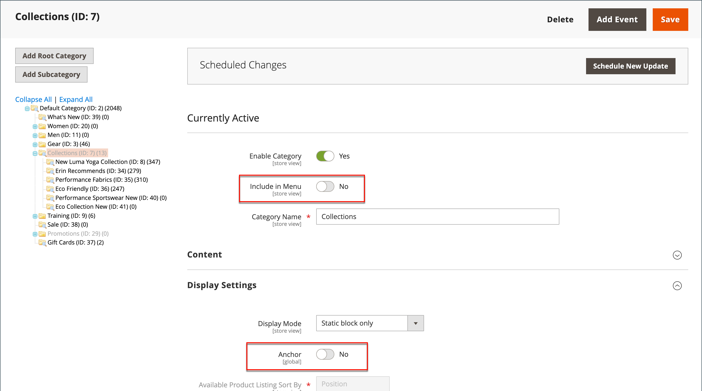

# Categorias ocultas

Há muitas maneiras de usar categorias ocultas. Talvez você queira criar níveis de categoria adicionais para suas próprias finalidades internas, mas mostrar apenas as categorias de nível superior para os clientes. Ou talvez você queira vincular a uma categoria que não está incluída no menu de navegação.

## Criar categorias ocultas

1. Na barra lateral _Admin_, vá para **[!UICONTROL Catalog]** > **[!UICONTROL Categories]**.

1. Na árvore de categorias, selecione a categoria que deseja ocultar e faça o seguinte:

   - Defina **[!UICONTROL Is Active]** como `Yes`.
   - Defina **[!UICONTROL Include in Menu]** como `No`.

1. Na seção **[!UICONTROL Display Settings]**, defina **[!UICONTROL Anchor]** como `No`.

   {width="600" zoomable="yes"}

   A categoria oculta está ativa, mas não aparece no menu superior nem na navegação em camadas.

1. Complete as configurações a seguir para cada subcategoria oculta para criar subcategorias:

   >[!NOTE]
   >
   >Embora a categoria esteja oculta, você pode criar subcategorias abaixo dela e ativá-las.

   - Defina **[!UICONTROL Enable Category]** como `Yes`.
   - Na seção **[!UICONTROL Display Settings]**, defina **[!UICONTROL Anchor]** como `Yes`.

   Como categorias ativas, agora é possível vinculá-las a partir de outros locais na loja, mas elas não aparecem no menu.

1. Quando terminar, clique em **[!UICONTROL Save]**.
