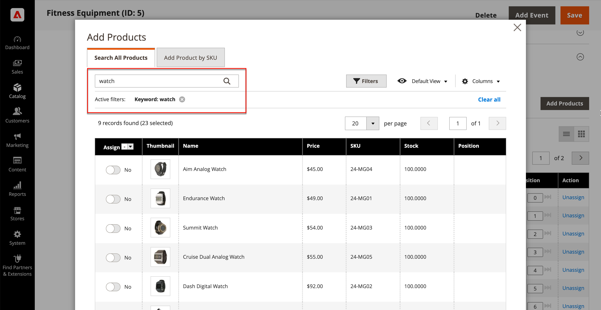

# Adicionar e remover produtos da categoria

No [Produtos na categoria](categories-product-assignments.md) seção, um administrador de loja pode adicionar produtos à categoria. Esta seção lista todos os produtos atribuídos à categoria e exibe **[!UICONTROL Add Product]** quando **[!UICONTROL Match products by rule]** está definida como `No`.

{width="600" zoomable="yes"}

## Procurar produtos para adicionar

1. No _Admin_ barra lateral, vá para **[!UICONTROL Catalog]** > **[!UICONTROL Categories]**.

1. Na árvore de categorias à esquerda, escolha a categoria à qual deseja adicionar um produto.

1. Expandir  o _Produtos na categoria_ seção.

1. Clique em **[!UICONTROL Add Products]**.

1. Uso _Pesquisar por palavra-chave_ ou filtros para encontrar os produtos que deseja adicionar.

   {width="700" zoomable="yes"}

1. No _[!UICONTROL Assign]_, alterne a opção para `Yes` para cada produto que deseja adicionar.

   Se desejar incluir todos os produtos exibidos, clique na seta do menu no cabeçalho da coluna e escolha **[!UICONTROL Select All]**.

1. Para aplicar as alterações, clique em **[!UICONTROL Save and Close]**.

### Ações

| Ação | Descrição |
|--- |--- |
| [!UICONTROL Select All] | Marca a caixa de seleção de todos os registros na lista. |
| [!UICONTROL Unselect All] | Desmarca a caixa de seleção de todos os registros na lista. |
| [!UICONTROL Select All on This Page] | Marca a caixa de seleção de registros na página atual. |
| [!UICONTROL Deselect All on This Page] | Limpa a caixa de seleção de registros na página atual. |

{style="table-layout:auto"}

## Adicionar produtos por SKU

1. Clique em **[!UICONTROL Add Products]**

1. Selecione o **[!UICONTROL Add Products by SKU]** guia.

1. Insira SKUs (uma por linha) e clique em **[!UICONTROL Assign]**.

   Para descartar as alterações, clique em **[!UICONTROL Remove]**.

   {width="700" zoomable="yes"}

1. Para aplicar as alterações, clique em **[!UICONTROL Save and Close]**.

## Remover produtos de uma categoria

1. No _Admin_ barra lateral, vá para **[!UICONTROL Catalog]** > **[!UICONTROL Categories]**.

1. Na árvore de categorias à esquerda, escolha a categoria que deseja editar.

1. Expandir  o _[!UICONTROL Products in Category]_seção.

1. Localize os produtos a serem removidos.

1. No _[!UICONTROL Actions]_clique em **[!UICONTROL Unassign]**.

1. Para aplicar as alterações, clique em **[!UICONTROL Save]**.
