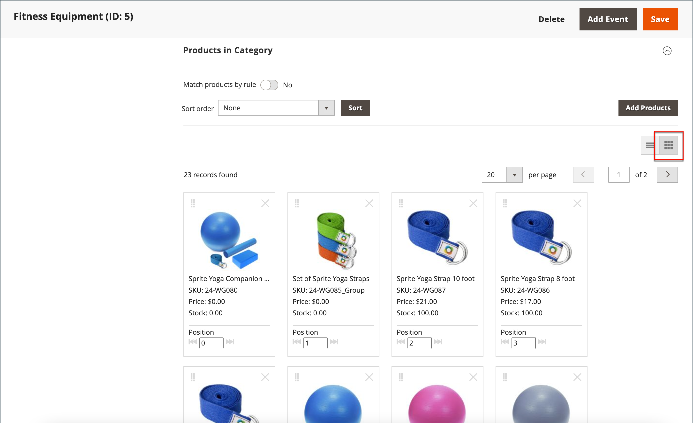
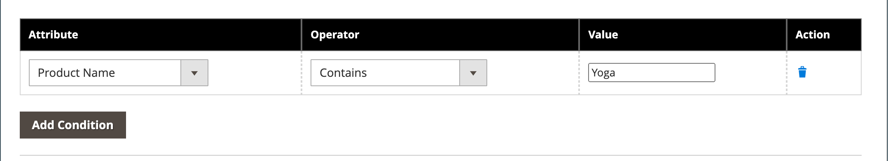

# Classificar produtos da categoria

{{ee-feature}}

A posição dos produtos em uma categoria pode ser especificada manualmente arrastando e soltando produtos na posição ou aplicando uma ordem de classificação predefinida. Por padrão, os produtos podem ser classificados por nível de estoque, idade, cor, nome, SKU e preço. A classificação automática substitui a ordem de classificação atual e redefine as posições de arrastar e soltar definidas manualmente. A ordem de classificação das cores e o nível mínimo de estoque que pode ser necessário para os produtos a serem incluídos na lista são definidos na configuração do [Visual Merchandiser](../configuration-reference/catalog/visual-merchandiser.md).

Você pode configurar as opções de categoria separadamente para cada [exibição da loja](../stores-purchase/stores.md#add-stores) para determinar a seleção de produtos, sua posição relativa na lista e os atributos disponíveis para regras de categoria. Entretanto, há uma única ordem de classificação **_global_** e uma posição de produto no catálogo e elas são compartilhadas em todas as [exibições de loja](../stores-purchase/store-views.md), lojas e sites.

## Etapa 1: definir o escopo da configuração

1. Na barra lateral _Admin_, vá para **[!UICONTROL Catalog]** > **[!UICONTROL Categories]**.

1. Se necessário, escolha a **[!UICONTROL Store View]** à qual as configurações se aplicam.

   Para uma instalação com vários armazenamentos, a configuração _[!UICONTROL Store View]_&#x200B;aplica a ordem de classificação a todas as exibições disponíveis no armazenamento.

1. Na árvore de categorias à esquerda, escolha a categoria que deseja editar.

   {width="700" zoomable="yes"}

## Etapa 2: Classificar os produtos

>[!NOTE]
>
>Ao classificar uma categoria por um atributo de produto, os produtos com os mesmos valores de atributo também são classificados por seu _[!UICONTROL Product ID]_&#x200B;na ordem crescente.

Na seção _[!UICONTROL Products in Category]_, clique no ícone de blocos (  ) para mostrar os blocos de produtos em uma grade. Use o método manual ou automático para classificar os produtos.

{width="600" zoomable="yes"}

### Método 1: classificação manual

1. Defina **[!UICONTROL Sort Order]** de acordo com sua preferência.

   {width="600" zoomable="yes"}

1. Para aplicar a nova ordem de classificação, clique em **[!UICONTROL Sort]**.

1. Para salvar a ordem de classificação, clique em **[!UICONTROL Save Category]**.

1. Quando solicitado, atualize todos os indexadores inválidos.

### Método 2: classificação automática

1. Defina **[!UICONTROL Match products by rule]** () para `Yes`.

1. Defina **[!UICONTROL Automatic Sorting]** de acordo com sua preferência.

1. Para criar uma regra de categoria, siga as instruções na próxima etapa.

## Etapa 3: criar uma regra de categoria

1. Defina **[!UICONTROL Match products by rule]** () para `Yes`.

1. Clique em **[!UICONTROL Add Condition]**.

1. Escolha o **[!UICONTROL Attribute]** que é a base da condição.

1. Defina **[!UICONTROL Operator]** como um dos seguintes:

   - `Equal`
   - `Not equal`
   - `Greater than`
   - `Greater than or equal to`
   - `Less than`
   - `Less than or equal to`
   - `Contains`

1. Digite o **[!UICONTROL Value]** apropriado.

   {width="600" zoomable="yes"}

1. Para adicionar outra condição, clique em **[!UICONTROL Add Condition]** e repita o processo.

## Etapa 4: salvar, atualizar e verificar

1. Quando terminar, clique em **[!UICONTROL Save Category]**.

1. Quando solicitado a atualizar o cache, clique em **[!UICONTROL Cache Management]** e atualize cada cache inválido.

1. Na loja, verifique se a seleção do produto, a classificação e as regras de categoria funcionam corretamente.

   Se precisar fazer ajustes, altere as configurações e tente novamente.
