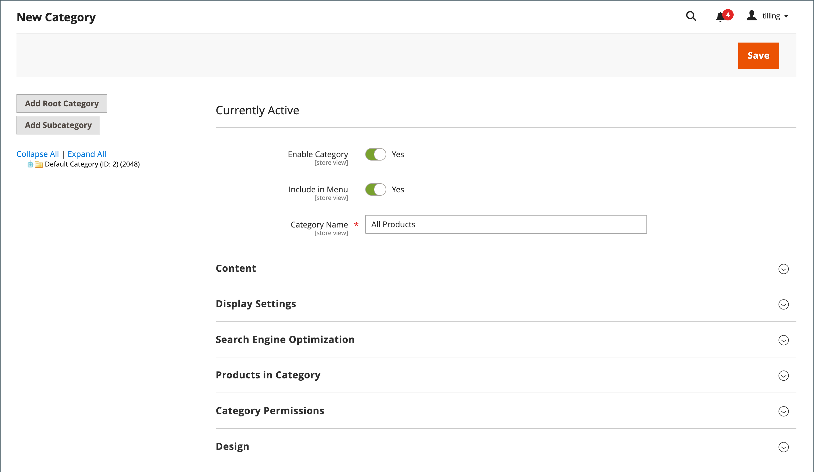

# Categoria raiz e hierarquia

Os produtos no menu principal são determinados pela categoria raiz atribuída à [loja](../stores-purchase/stores.md#add-stores). A categoria raiz é basicamente um container para o menu principal na árvore de categorias. É possível criar uma categoria raiz com um conjunto de produtos totalmente novo ou copiar produtos de uma categoria raiz existente. A categoria raiz pode ser atribuída ao armazenamento atual ou a qualquer outro armazenamento no mesmo site.

{width="550"}

No Admin, a estrutura da categoria é como uma árvore de cabeça para baixo, com a raiz na parte superior. A raiz tem um nome, mas nenhuma chave de URL, e não aparece na [navegação superior](navigation-top.md) do armazenamento. Todas as outras categorias no menu são aninhadas abaixo da raiz. Como a categoria raiz é o nível mais alto do catálogo, seu armazenamento pode ter somente uma categoria raiz ativa por vez. No entanto, você pode criar categorias raiz adicionais para estruturas de catálogo alternativas e lojas diferentes.

O exemplo a seguir mostra como criar uma categoria raiz e atribuí-la a um armazenamento diferente.

## Etapa 1: criar uma categoria raiz

1. Na barra lateral _Admin_, vá para **[!UICONTROL Catalog]** > **[!UICONTROL Categories]**.

1. À esquerda, clique em **[!UICONTROL Add Root Category]**.

   {width="600" zoomable="yes"}

1. Insira um **[!UICONTROL Category Name]**.

   O nome escolhido é inicialmente atribuído a todas as exibições de loja.

1. Se quiser adicionar produtos ao catálogo a partir do catálogo atual, faça o seguinte:

   - Expanda o  a seção _Produtos na Categoria_.

   - Use os [filtros de pesquisa](../getting-started/admin-grid-controls.md) para localizar os produtos desejados e marque a caixa de seleção de cada produto que deseja copiar para o novo catálogo.

1. Quando terminar, clique em **[!UICONTROL Save]**.

## Etapa 2: criar o menu principal

1. À esquerda, selecione a nova categoria raiz que você criou na etapa anterior.

1. Para criar a [estrutura de categoria](category-create.md) para o menu principal, clique em **[!UICONTROL Add Subcategory]** e siga as instruções.

## Etapa 3: atribuir a categoria raiz ao armazenamento

1. Na barra lateral _Admin_, vá para **[!UICONTROL Stores]** > _[!UICONTROL Settings]_>**[!UICONTROL All Stores]**.

1. Na coluna _Lojas_ da grade, clique no armazenamento ao qual deseja atribuir o novo catálogo.

1. Defina **[!UICONTROL Root Category]** para a nova categoria raiz que você criou.

1. Verifique se o armazenamento tem um **[!UICONTROL Default Store View]** atribuído.

   O armazenamento deve ter pelo menos uma [exibição de armazenamento](../stores-purchase/store-views.md).

1. Quando terminar, clique em **[!UICONTROL Save Store]**.

1. Para verificar se o armazenamento tem um novo catálogo, faça o seguinte:

   - Na barra lateral _Admin_, vá para **[!UICONTROL Catalog]** > **[!UICONTROL Products]**.

     Todos os produtos que foram copiados para o novo catálogo aparecem na grade.

   - Para verificar se o novo catálogo e o menu principal estão funcionando corretamente, visite a loja.
