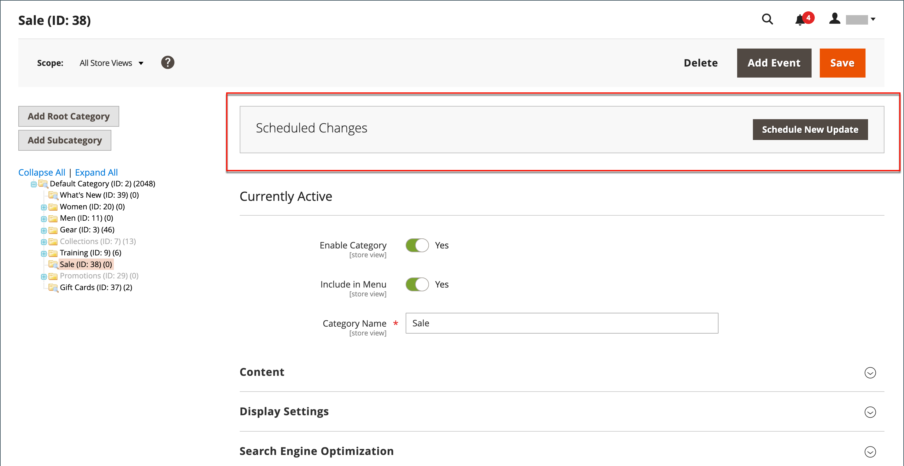

# Alterações agendadas para categorias

{{ee-feature}}

As atualizações de categoria podem ser aplicadas de acordo com o agendamento e agrupadas com outras alterações de conteúdo. Você pode criar uma campanha com base em alterações agendadas na categoria ou aplicar as alterações a uma campanha existente. Para saber mais, consulte [Preparo de conteúdo](../content-design/content-staging.md).

>[!NOTE]
>
>A variável [!UICONTROL Schedule Design Update] A guia foi removida em  Adobe Commerce e não podem ser modificados diretamente na categoria. Você deve criar uma atualização agendada para essas ativações.

>[!NOTE]
>
>Todas as atualizações programadas são aplicadas consecutivamente, o que significa que qualquer entidade pode ter apenas uma atualização programada de cada vez. Qualquer atualização agendada é aplicada a todas as exibições de loja dentro de seu período de tempo. Como resultado, uma entidade não pode ter várias atualizações agendadas para diferentes exibições de loja ao mesmo tempo. Todos os valores de atributo de entidade em todas as exibições de armazenamento, que não são afetados pela atualização agendada atual, são obtidos dos valores padrão, e não da atualização agendada anterior.

## Programar uma atualização para uma categoria

1. No _Admin_ barra lateral, vá para **[!UICONTROL Catalog]** > **[!UICONTROL Categories]**.

1. Na árvore de categorias à esquerda, escolha a categoria a ser modificada.

1. No _Alterações Agendadas_ na parte superior da página, clique em **[!UICONTROL Schedule New Update]**.

   {width="600" zoomable="yes"}

1. Com o **[!UICONTROL Save as a New Update]** selecionada, defina os parâmetros básicos da atualização:

   - Para **[!UICONTROL Update Name]**, digite um nome para a nova campanha de preparo de conteúdo.

   - Insira um resumo **[!UICONTROL Description]** da atualização e como ela será usada.

   - Usar o calendário (  ) para escolher a **[!UICONTROL Start Date]** e **[!UICONTROL End Date]** para a campanha.

   >[!IMPORTANT]
   >
   >Campaign **[!UICONTROL Start Date]** e **[!UICONTROL End Date]** deve ser definido usando o **_padrão_** Fuso horário do administrador, que é convertido do fuso horário local de cada site. Por exemplo, com vários sites em fusos horários diferentes nos quais você deseja iniciar uma campanha com base em um fuso horário dos EUA, é necessário agendar uma atualização separada para cada fuso horário local. Você define o **[!UICONTROL Start Date]** e **[!UICONTROL End Date]** para cada, que é convertido do fuso horário do site local para o fuso horário padrão do Administrador.

   {width="600" zoomable="yes"}

1. Faça as alterações necessárias na atualização agendada.

1. Para visualizar as alterações, clique em **[!UICONTROL Preview]** na barra de botões superior direita.

1. Quando terminar, clique em **[!UICONTROL Save]**.

## Atribuir a uma atualização existente

1. No _Admin_ barra lateral, vá para **[!UICONTROL Catalog]** > **[!UICONTROL Categories]**.

1. Na árvore de categorias à esquerda, escolha a categoria a ser modificada.

1. No _Alterações Agendadas_ na parte superior da página, clique em **[!UICONTROL Schedule New Update]**.

1. Selecionar **[!UICONTROL Assign to Existing Campaign]**.

1. Na lista, localize a campanha necessária e clique em **[!UICONTROL Select]**.

1. Faça as alterações necessárias na atualização agendada.

1. Quando terminar, clique em **[!UICONTROL Save]**.
