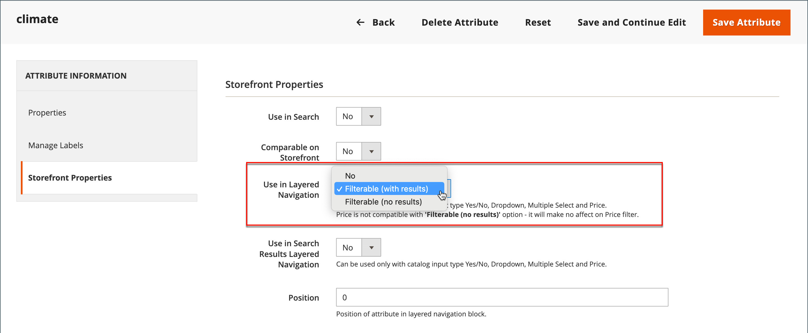

# Navegação em camadas

>[!NOTE]
>
>A navegação em camadas padrão descrita nesta seção é diferente da navegação filtrada do Live Search com [facetas](https://experienceleague.adobe.com/docs/commerce/live-search/live-search-admin/facets/facets.html).

A navegação em camadas facilita a localização de produtos com base na categoria, na faixa de preço ou em qualquer outro atributo disponível. A navegação em camadas geralmente aparece na coluna esquerda dos resultados da pesquisa e nas páginas de categoria e, às vezes, na página inicial. A navegação padrão inclui uma lista de categorias e um intervalo de preços _Comprar por_. Você pode configurar a exibição da navegação em camadas, incluindo a contagem de produtos e a faixa de preços.

{width="700" zoomable="yes"}

## Atributos filtráveis

>[!NOTE]
>
>Os requisitos de atributo filtráveis descritos neste tópico são diferentes para o [Live Search](https://experienceleague.adobe.com/docs/commerce/live-search/overview.html). Para saber mais, consulte [Facetas](https://experienceleague.adobe.com/docs/commerce/live-search/live-search-admin/facets/facets.html).

A navegação em camadas pode ser usada para procurar produtos por categoria ou por atributo. Por exemplo, quando um comprador escolhe a categoria Mens/Shorts na navegação superior, os resultados iniciais incluem todos os produtos na categoria. A lista pode ser filtrada ainda mais escolhendo um estilo, clima, cor, material, padrão ou preço específico — ou uma combinação de valores. Os atributos filtráveis são exibidos em uma seção de expansão que lista cada valor de atributo. Como opção, a lista de produtos com resultados correspondentes pode ser configurada para incluir produtos com ou sem uma correspondência.

As propriedades do atributo, combinadas com o tipo de entrada do produto, determinam quais atributos podem ser usados para a navegação em camadas. A navegação em camadas está disponível somente para as categorias [_âncora_](categories-display-settings.md), mas também pode ser adicionada às páginas de resultados da pesquisa. A propriedade **Tipo de Entrada de Catálogo para o Proprietário do Repositório** de cada atributo deve ser definida como `Yes/No`, `Dropdown`, `Multiple Select` ou `Price`. Para tornar os atributos filtráveis, a propriedade **Usar na Navegação em Camadas** de cada um deve ser definida como `Filterable (with results)` ou `Filterable (no results)`.

_Exemplo: atributos filtráveis com resultados_

{width="700" zoomable="yes"}

_Exemplo: valores de amostra filtráveis exibidos sem resultado_

{width="700" zoomable="yes"}

As instruções a seguir mostram como configurar a navegação em camadas básica com atributos filtráveis. Para uma navegação em camadas avançada com etapas de preço, consulte [Navegação de Preço](navigation-layered.md#configure-price-navigation).

## Etapa 1: Configurar as propriedades do atributo

1. Na barra lateral _Admin_, vá para **[!UICONTROL Stores]** > _[!UICONTROL Attributes]_>**[!UICONTROL Product]**.

1. Procurar ou usar a pesquisa filtrada para localizar um atributo na lista e abri-lo no modo de edição.

   {width="700" zoomable="yes"}

1. No painel esquerdo, escolha **[!UICONTROL Storefront Properties]** e defina **[!UICONTROL Use In Layered Navigation]** como um dos seguintes:

   - `Filterable (with results)` - A navegação em camadas inclui apenas os filtros para os quais os produtos correspondentes podem ser encontrados. Qualquer valor de atributo que já se aplique a todos os produtos mostrados na lista ainda deve aparecer como um filtro disponível. Valores de atributo com uma contagem de zero (0) correspondências de produto são omitidos da lista de filtros disponíveis. A lista filtrada inclui apenas os produtos que correspondem ao filtro. A lista de produtos é atualizada somente se os filtros selecionados alterarem o que é mostrado.

   - `Filterable (no results)` - A navegação em camadas inclui filtros para todos os valores de atributos disponíveis e suas contagens de produtos, incluindo produtos com zero (0) correspondências de produto. Se o valor do atributo for uma amostra, ele será exibido como um filtro, mas riscado. A filtragem em camada de preço não é compatível com essa opção e não afeta os Filtros de preço.

1. Defina **[!UICONTROL Use In Search Results Layered Navigation]** como `Yes`.

   {width="600" zoomable="yes"}

1. Repita essas etapas para cada atributo que deseja incluir na navegação em camadas.

>[!NOTE]
>
>Quando a configuração _[!UICONTROL Use in Search]_está definida como `No`, a configuração_[!UICONTROL Use in Search Results Layered Navigation]_ não é exibida e o atributo de produto não é usado na pesquisa com nenhum valor de configuração [!UICONTROL Use in Layered Navigation].

>[!NOTE]
>
>O campo [!UICONTROL Position] fica esmaecido por padrão, portanto, você deve salvar o atributo antes de modificar essa configuração.

## Etapa 2: tornar a categoria uma âncora

1. Na barra lateral _Admin_, vá para **[!UICONTROL Catalog]** > **[!UICONTROL Categories]**.

1. Na árvore de categorias, selecione a categoria em que deseja usar a navegação em camadas.

1. Expanda  a seção **[!UICONTROL Display Settings]** e defina **[!UICONTROL Anchor]** como `Yes`.

   {width="600" zoomable="yes"}

1. Clique em **[!UICONTROL Save]**.

## Etapa 3: testar os resultados

Para testar a configuração, visite sua loja e navegue até a categoria do menu principal. A seleção de atributos filtráveis é exibida na navegação em camadas da página de categoria.

Pesquise, filtre e revise os produtos exibidos.

## Remover valores de atributo filtráveis da navegação em camadas

A navegação em camadas inclui filtros para todos os valores de atributo disponíveis e suas contagens de produto, incluindo produtos com zero (0) correspondências de produto (como mostrado na imagem a seguir).

{width="700" zoomable="yes"}

Esse resultado pode dificultar para os clientes selecionarem um produto preferencial e não há necessidade de exibir valores de atributo &#x200B;&#x200B;com 0 produtos no front-end.

Você pode usar as seguintes etapas para remover valores de atributos filtráveis com 0 Produtos da navegação em camadas:

1. Na barra lateral _Admin_, vá para **[!UICONTROL Stores]** > _[!UICONTROL Attributes]_>**[!UICONTROL Product]**.

1. Procurar ou usar a pesquisa filtrada para localizar um atributo na lista e abri-lo no modo de edição.

1. Em _[!UICONTROL Attribute Information]_, clique em **[!UICONTROL Storefront Properties]**.

1. Para **[!UICONTROL Layered Navigation]**, escolha `Filterable (with results)`.

   {width="600" zoomable="yes"}

1. Clique em **[!UICONTROL Save Attribute]**.

## Navegação de preço

>[!NOTE]
>
>A configuração de navegação de preço descrita neste tópico é diferente para o [Live Search](https://experienceleague.adobe.com/docs/commerce/live-search/overview.html).

A navegação de preço pode ser usada para distribuir produtos por faixa de preço na navegação em camadas. Também é possível dividir cada intervalo em intervalos. Há algumas maneiras de calcular a navegação de preço:

- Automático (Equalizar Faixas de Preços)
- Automático (Equalizar Contagens de Produtos)
- Manual

Com os dois primeiros métodos, as etapas de navegação são calculadas automaticamente. O método manual permite especificar um limite de divisão para intervalos de preço. O exemplo a seguir mostra a diferença entre etapas de navegação de preço de 10 e 100.

A divisão iterativa fornece a melhor distribuição de produtos entre as faixas de preço. Com a divisão iterativa, depois de escolher o intervalo de US$ 0,00 a US$ 99, o cliente pode detalhar várias subfaixas de preços. A divisão de faixa de preços é interrompida quando o número de produtos atinge o limite definido pelo Limite de Divisão de Intervalo.

## Exemplo: etapas de navegação de preço

| Preço por 10 | Preço por 100 |
|----------|--------|
| $ 20,00 - $ 29,99 (1) | de US$ 0,00 a US$ 99,99 (4) |
| US$ 30,00 a US$ 39,99 (2) | US$ 100 a US$ 199,99 (5) |
| US$ 70,00 a US$ 79,99 (1) | $ 400,00 - $ 499,99 (2) |
| US$ 100,00 - US$ 109,99 (1) | US$ 700,00 e superior (1) |
| $ 120,00 - $ 129,99 (2) |   |
| $ 150,00 - $ 159,99 (1) |   |
| $ 180,00 - $ 189,99 (1) |   |
| $ 420,00 - $ 429,99 (1) |   |
| $ 440,00 - $ 449,99 (1) |   |
| US$ 710,00 e acima (1) |   |

{style="table-layout:auto"}

## Configurar navegação de preço

>[!IMPORTANT]
>
>Para exibir corretamente os produtos e seus preços de acordo com os _filtros de preço_ na navegação em camadas, verifique se as configurações de exibição de preço na [configuração de Imposto](../configuration-reference/sales/tax.md) têm o mesmo valor (`Excluding Tax` **ou** `Including Tax`). Para o _[!UICONTROL Calculation Settings]_, verifique o valor **[!UICONTROL Catalog Prices]**. E para_[!UICONTROL Price Display Settings]_, verifique o valor **[!UICONTROL Display Product Prices in Catalog]**. Se eles tiverem valores diferentes, os filtros de preço na navegação em camadas podem não filtrar e classificar corretamente os produtos por preço.

1. Na barra lateral _Admin_, vá para **[!UICONTROL Stores]** > _[!UICONTROL Settings]_>**[!UICONTROL Configuration]**.

1. No painel esquerdo, expanda **[!UICONTROL Catalog]** e escolha **[!UICONTROL Catalog]** abaixo de.

1. Expanda  a seção _Navegação em camadas_.

   Por padrão, **[!UICONTROL Display Product Count]** está definido como `Yes`. Se necessário, desmarque a caixa de seleção **[!UICONTROL Use system value]** para alterar essa configuração.

   {width="600" zoomable="yes"}

   Para obter uma lista detalhada dessas opções de configuração, consulte [Navegação em Camadas](../configuration-reference/catalog/catalog.md#layered-navigation) na _Referência de Configuração_.

1. Defina **[!UICONTROL Price Navigation Steps Calculation]** para um dos métodos nas seções a seguir.

1. Quando terminar, clique em **[!UICONTROL Save Config]**.

### Método 1: Automático (igualar faixas de preços)

Deixar **[!UICONTROL Price Navigation Steps Calculation]** definido como `Automatic (Equalize Price Ranges)` (padrão). Essa configuração usa o algoritmo padrão para navegação de preço.

### Método 2: Automático (equalizar contagens de produtos)

>[!TIP]
>
>Se necessário, primeiro desmarque a caixa de seleção **[!UICONTROL Use system value]** para alterar essas configurações.

1. Defina **[!UICONTROL Price Navigation Steps Calculation]** como `Automatic (equalize product counts)`.

1. Para exibir um preço único quando houver vários produtos com o mesmo preço, defina **[!UICONTROL Display Price Interval as One Price]** como `Yes`.

1. Para **[!UICONTROL Interval Division Limit]**, insira o limite para o número de produtos dentro de um intervalo de preços.

   O intervalo não pode ser dividido além desse limite. O valor padrão é `9`.

   {width="600" zoomable="yes"}

### Método 3: Manual

>[!NOTE]
>
>Se necessário, primeiro desmarque a caixa de seleção **[!UICONTROL Use system value]** para alterar essas configurações.

1. Defina **[!UICONTROL Price Navigation Steps Calculation]** como `Manual`.

1. Insira um valor que determine o **[!UICONTROL Default Price Navigation Step]**.

1. Insira os **[!UICONTROL Maximum Number of Price Intervals]** permitidos, até `100`.

   Manual{width="600" zoomable="yes"}

## Configurar navegação em camadas

>[!NOTE]
>
>A configuração padrão descrita nesta página é diferente para o [Live Search](https://experienceleague.adobe.com/docs/commerce/live-search/overview.html).

A configuração de navegação em camadas determina se uma contagem de produtos aparece entre parênteses após cada atributo e o tamanho do cálculo de etapa usado na navegação de preço.

1. Na barra lateral _Admin_, vá para **[!UICONTROL Stores]** > _[!UICONTROL Settings]_>**[!UICONTROL Configuration]**.

1. No painel esquerdo, expanda a seção _[!UICONTROL Catalog]_e escolha **[!UICONTROL Catalog]**abaixo.

1. Expanda a seção _[!UICONTROL Layered Navigation]_.

   >[!NOTE]
   >
   >Se necessário, primeiro desmarque a caixa de seleção **[!UICONTROL Use system value]** para alterar essas configurações.

1. Para exibir o número de produtos encontrados para cada atributo, defina **[!UICONTROL Display Product Count]** como `Yes`.

1. Defina **[!UICONTROL Price Navigation Step Calculation]** como `Automatic (equalize price ranges)`.

1. Quando terminar, clique em **[!UICONTROL Save Config]**.
