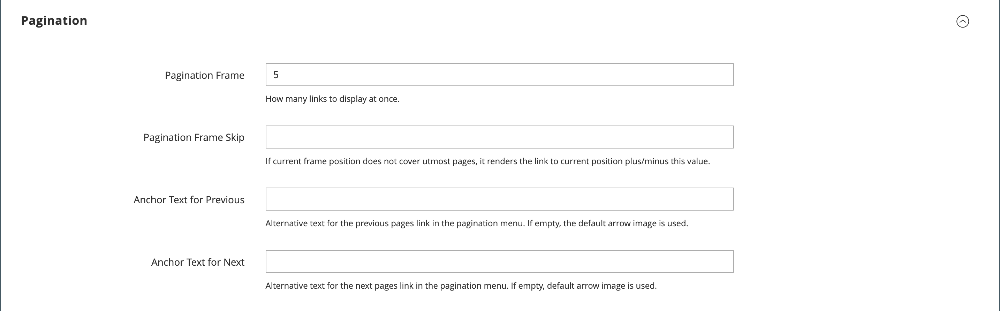

# Listagens de produtos

As listas de produtos podem ser definidas para serem exibidas por padrão como uma lista ou grade. Você também pode determinar quantos produtos aparecem por página e qual atributo é usado para classificar a lista. A lista de produtos inclui um conjunto de controles que podem ser usados para classificar os produtos, alterar o formato da lista, classificar por atributo e avançar de uma página para outra.

>[!NOTE]
>
>Ao classificar uma categoria por um atributo de produto, os produtos com os mesmos valores de atributo também são classificados por seu _[!UICONTROL Product ID]_na ordem crescente.

{width="700" zoomable="yes"}

## Configurar listas de produtos

1. Na barra lateral _Admin_, vá para **[!UICONTROL Stores]** > _[!UICONTROL Settings]_>**[!UICONTROL Configuration]**.

1. No painel esquerdo, expanda **[!UICONTROL Catalog]** e escolha **[!UICONTROL Catalog]** abaixo de.

1. Expandir  a seção **[!UICONTROL Storefront]**.

   {width="600" zoomable="yes"}

   Para obter uma lista detalhada dessas opções, consulte [Storefront](../configuration-reference/catalog/catalog.md#storefront) na _Referência de Configuração_.

   >[!NOTE]
   >
   >Para exibir corretamente os produtos e seus preços de acordo com a _classificação de produto por preço_, verifique se as configurações de exibição de preço na [configuração de Imposto](../configuration-reference/sales/tax.md) têm o mesmo valor (`Excluding Tax` **ou** `Including Tax`). Para o _[!UICONTROL Calculation Settings]_, verifique o valor **[!UICONTROL Catalog Prices]**. E para_[!UICONTROL Price Display Settings]_, verifique o valor **[!UICONTROL Display Product Prices in Catalog]**. Se eles tiverem valores diferentes, os filtros de preço na navegação em camadas podem não filtrar e classificar corretamente os produtos por preço.

1. Defina o padrão **[!UICONTROL List Mode]** como um dos seguintes:

   - `Grid Only`
   - `List Only`
   - `Grid (default) / List`
   - `List (default / Grid`

1. Para **[!UICONTROL Products per Page on Grid Allowed Values]**, insira o número de produtos que você deseja exibir por página quando mostrado no formato de grade.

   Para inserir uma seleção de valores, separe cada número por vírgula.

1. Para **[!UICONTROL Products per Page on Grid Default Value]**, insira o número padrão de produtos a serem exibidos na grade por página.

1. Para **[!UICONTROL Products per Page on List Allowed Values]**, insira o número de produtos que você deseja que apareçam por página quando mostrados no formato de lista.

   Para inserir uma seleção de valores, separe cada número por vírgula.

1. Para **[!UICONTROL Products per page on List Default Value]**, insira o número padrão de produtos que aparecem na lista, por página.

1. Defina **[!UICONTROL Product Listing Sorted by]** com o atributo padrão que é usado inicialmente para classificar a lista.

1. Para dar aos clientes a opção de listar todos os produtos, defina **[!UICONTROL Allow All Products on Page]** como `Yes`.

1. Se quiser reter todas as configurações de paginação enquanto os clientes navegam pelas listagens do catálogo, defina **[!UICONTROL Remember Category Pagination]** como `Yes`.

   Ativar essa configuração garante que o número de produtos exibidos em uma lista ou grade seja retido à medida que os compradores navegam de uma categoria para outra. Por padrão, esse campo está definido como `No` porque usa mais armazenamento em cache e pode afetar a forma como as páginas são indexadas por mecanismos de pesquisa.

1. Se estiver usando um [catálogo simples](catalog-flat.md) (**não recomendado**), faça o seguinte:

   - Para exibir uma lista de categorias simples de produtos, defina **[!UICONTROL Use Flat Catalog Category]** como `Yes`.

   - Para exibir uma lista de produtos simples, defina **[!UICONTROL Use Flat Catalog Product]** como `Yes`.

1. Para permitir referências dinâmicas para ativos de mídia na categoria e URLs de produto, defina **[!UICONTROL Allow Dynamic Media URLs in Products and Categories]** como `Yes`.

1. Quando terminar, clique em **[!UICONTROL Save Config]**.

## Controles de página

| Controle | Descrição |
|--- |--- |
| [!UICONTROL View As] | Exibe os produtos no formato de grade ou lista. |
| [!UICONTROL Sort By] | Altera a ordem de classificação da lista. |
| [!UICONTROL Show Per Page] | Determina quantos produtos são exibidos por página. |
| Links de paginação | Links para outras páginas. |

{style="table-layout:auto"}

## Controles de paginação

As Configurações de paginação são exibidas nas partes superior e inferior da lista e controlam o formato dos links de paginação para as listagens de produtos. Você pode definir o número de links que aparecem no controle e configurar os links Next e Previous. Para que os links de paginação apareçam, deve haver mais produtos na lista do que o permitido por página na configuração da lista de produtos.

{width="700" zoomable="yes"}

### Controles de paginação de vitrine eletrônica

| Controle | Descrição |
|--- |--- |
|  | [!UICONTROL View As] - Exibe a lista no formato Grade ou Lista. |
|  | [!UICONTROL Sort By] - Altera a ordem de classificação da lista. A propriedade de vitrine _[!UICONTROL Used for Sorting in Product Listing]_determina quais [atributos de produto](../catalog/product-attributes.md) podem ser usados para classificar a lista. |
|  | [!UICONTROL Show Per Page] - Determina quantos produtos aparecem por página. |
|  | Links de paginação - Links de navegação para outras páginas. |

{style="table-layout:auto"}

### Configurar os controles de paginação

1. Na barra lateral _Admin_, vá para **[!UICONTROL Content]** > _[!UICONTROL Design]_>**[!UICONTROL Configuration]**.

1. Localize a exibição de armazenamento que você deseja configurar e, na coluna **[!UICONTROL Action]**, clique em **[!UICONTROL Edit]**.

1. Em **[!UICONTROL Other Settings]**, expanda  a seção **[!UICONTROL Pagination]**.

   {width="600" zoomable="yes"}

   Para obter mais informações sobre essas configurações, consulte [Configuração do Design](../content-design/configuration.md).

1. Para **[!UICONTROL Pagination Frame]**, insira o número de links que você deseja exibir no controle de paginação.

1. Para **[!UICONTROL Pagination Frame Skip]**, insira o número de links que deseja pular antes de exibir o próximo conjunto de links no controle de paginação.

   Por exemplo, se o quadro de paginação tiver cinco links e você quiser ir para os próximos cinco links, quantos links deseja pular adiante? Se você definir o valor como quatro (`4`), o último link do conjunto anterior será o primeiro link no próximo conjunto.

1. Para **[!UICONTROL Anchor Text for Previous]**, insira o texto que você deseja que apareça para o link Anterior.

   Deixe em branco para utilizar a seta padrão.

1. Para **[!UICONTROL Anchor Text for Next]**, insira o texto que você deseja que apareça para o link Próximo. Deixe em branco para utilizar a seta padrão.

1. Quando terminar, clique em **[!UICONTROL Save Configuration]**.
