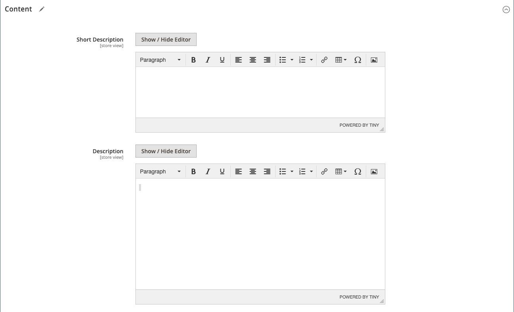

# Configurações do produto - [!UICONTROL Content]

A seção _[!UICONTROL Content]_&#x200B;é usada para inserir e editar a descrição principal do produto que aparece na página do produto. A descrição curta pode ser usada na maioria dos feeds RSS e também pode aparecer em listagens de catálogo, dependendo do [tema](../content-design/themes.md).

>[!NOTE]
>
>O enriquecimento do catálogo pode aplicar as atualizações sugeridas pela IA ao nome do produto e à descrição longa nesta seção. Para obter mais informações, consulte [Enriquecimento do catálogo](catalog-enrichment.md).

## Adicionar a descrição do produto em [!DNL Page Builder]

1. Abra o produto no modo de edição.

1. Role para baixo e expanda  na seção **[!UICONTROL Content]**.

   {width="600" zoomable="yes"}

1. Insira um **[!UICONTROL Short Description]** do produto e use a [barra de ferramentas do editor](../content-design/editor.md) para formatar conforme necessário.

1. No rótulo **[!UICONTROL Description]**, clique em **[!UICONTROL Edit with Page Builder]**.

1. Use as ferramentas de conteúdo do [[!DNL Page Builder]](../page-builder/introduction.md) para [editar o texto existente](../page-builder/text.md) e adicionar outro conteúdo (se necessário).

## Visualização de [!DNL Page Builder]

Quando você expande a seção _[!UICONTROL Content]_&#x200B;para um produto existente onde há conteúdo criado com [!DNL Page Builder], ela exibe uma pré-visualização do conteúdo **[!UICONTROL Description]**&#x200B;como ele apareceria na página do produto. Abra o espaço de trabalho [!DNL Page Builder], onde você pode fazer as atualizações necessárias, clicando em **[!UICONTROL Edit with Page Builder]**.

{width="600" zoomable="yes"}

Essa pré-visualização de conteúdo é ativada para os formulários de produto e categoria por padrão. Se o desempenho for afetado pelo carregamento da visualização, você poderá desabilitar a visualização nas configurações de [Gerenciamento de conteúdo](../configuration-reference/general/content-management.md#advanced-content-tools).

## Adicionar a descrição do produto no editor

Se o [!DNL Page Builder] estiver desativado para sua loja, use o editor de texto para adicionar o conteúdo do produto. Digite somente caracteres ASCII simples na caixa de texto. Ao colar texto de um processador de texto, salve-o primeiro como um arquivo .TXT simples para remover os caracteres de controle invisíveis. Para obter mais informações, consulte [Usando o Editor](../content-design/editor.md).

1. Abra o produto no modo de edição.

1. Role para baixo e expanda  na seção **[!UICONTROL Content]**.

   {width="600" zoomable="yes"}

1. Insira um **[!UICONTROL Short Description]** do produto e o formato, conforme necessário.

1. Insira o produto principal **[!UICONTROL Description]** e use a barra de ferramentas do editor para formatar conforme necessário.

   Você pode arrastar o canto inferior direito para alterar a altura da caixa de texto.
