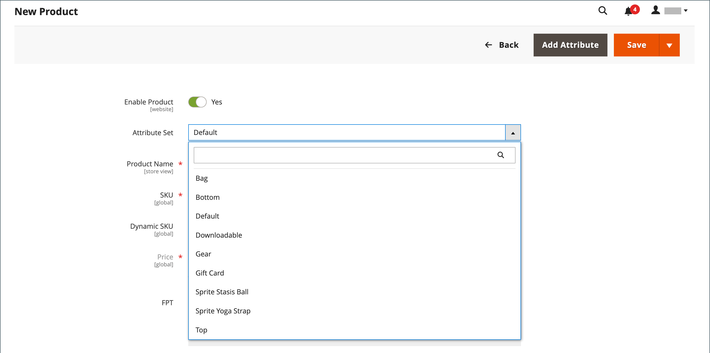
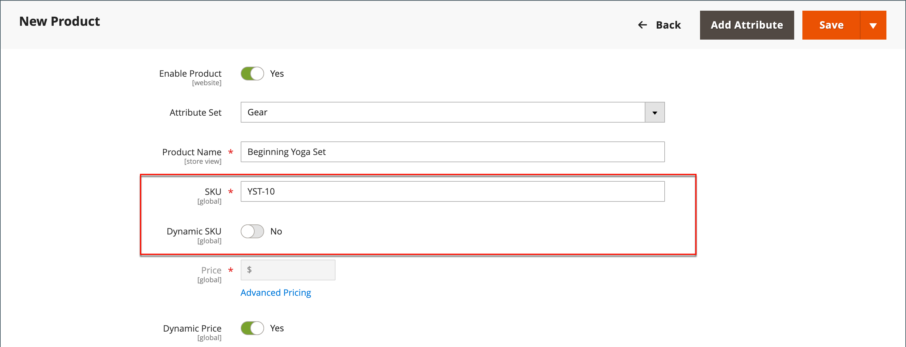
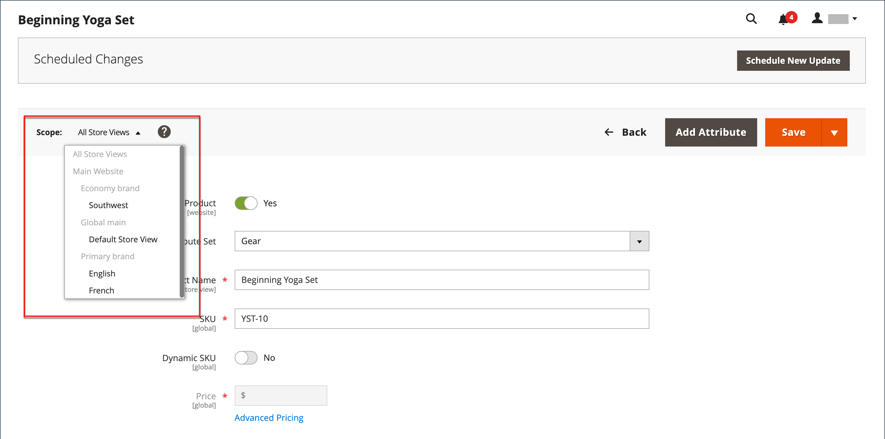
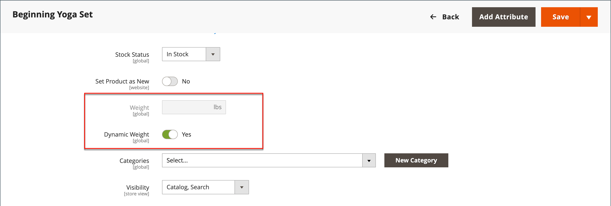
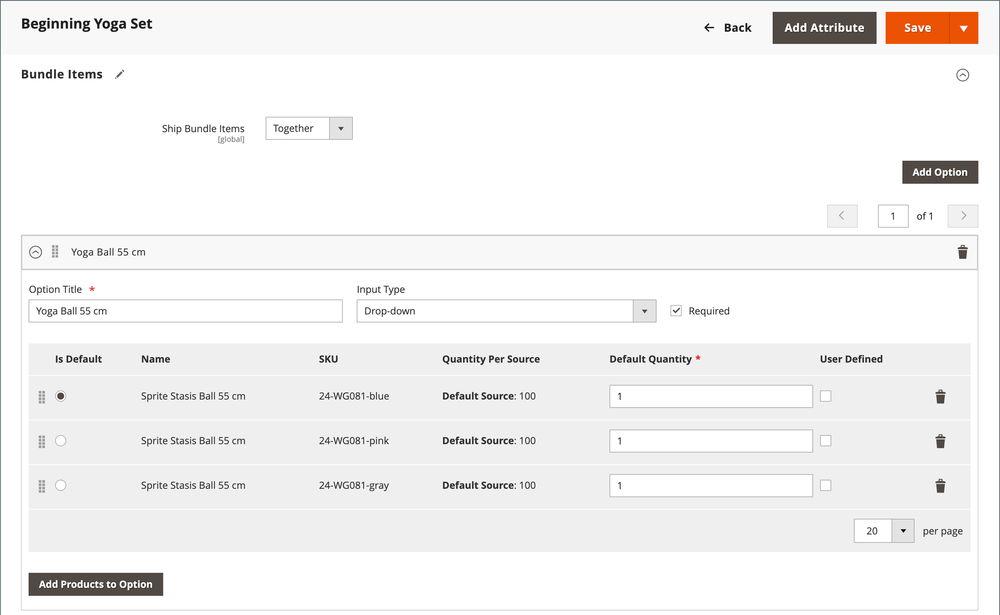

# Produto do pacote

Um pacote é um _compile seu próprio_ produto personalizável. Cada item em um pacote pode ser baseado em um dos seguintes tipos de produto:

- [Produto simples](product-create-simple.md)
- [Produto virtual](product-create-virtual.md)

{width="700" zoomable="yes"}

As opções são exibidas quando o cliente clica em **[!UICONTROL Customize]** ou **[!UICONTROL Add to Cart]**. Como os produtos incluídos no pacote variam, a SKU, o Preço e o Peso podem ser definidos como um valor dinâmico ou fixo.

>[!NOTE]
>
>O Preço mínimo anunciado (MAP) não está disponível para produtos de pacote que usam preço dinâmico.

>[!NOTE]
>
>O produto do pacote principal é sempre exibido automaticamente como um produto de venda adicional para todos os seus produtos secundários.

Se a [Compra Instantânea](../stores-purchase/checkout-instant-purchase.md) estiver disponível, o botão _Compra Instantânea_ aparecerá abaixo do botão _Adicionar ao Carrinho_ para cada item do pacote.

{width="600" zoomable="yes"}

As instruções a seguir orientam você no processo de criação de um pacote de produtos usando um [modelo de produto](attribute-sets.md), campos obrigatórios e configurações básicas. Cada campo obrigatório está marcado com um asterisco vermelho (`*`). Quando terminar as noções básicas, você poderá concluir as outras configurações do produto conforme necessário.

## Etapa 1: Escolher o tipo de produto

1. Na barra lateral _Admin_, vá para **[!UICONTROL Catalog]** > **[!UICONTROL Products]**.

1. No canto superior direito do menu _[!UICONTROL Add Product]_( {width="25"} ), escolha **[!UICONTROL Bundle Product]**.

   {width="700" zoomable="yes"}

## Etapa 2: Escolher o conjunto de atributos

Para escolher o [conjunto de atributos](attribute-sets.md) usado como modelo para o produto, siga um destes procedimentos:

- Para **[!UICONTROL Search]**, insira o nome do conjunto de atributos,
- Na lista, escolha o conjunto de atributos que deseja usar.

O formulário é atualizado para refletir a alteração.

{width="600" zoomable="yes"}

## Etapa 3: concluir as configurações necessárias

1. Insira o produto **[!UICONTROL Product Name]**.

1. Aceite o **[!UICONTROL SKU]** padrão baseado no nome do produto ou insira um valor diferente.

   Para determinar o tipo de SKU atribuído a cada item do pacote, faça o seguinte:

   - Um **[!UICONTROL Dynamic SKU]** pode ser atribuído automaticamente a cada item do pacote ao adicionar um sufixo à SKU padrão. Por padrão, está definido como `Yes`.

   - Se preferir atribuir uma SKU exclusiva para cada item do pacote, defina **[!UICONTROL Dynamic SKU]** como `No`.

   {width="600" zoomable="yes"}

1. Para determinar o preço do pacote, siga um destes procedimentos:

   - Para que o preço reflita as opções escolhidas pelo cliente, defina **[!UICONTROL Dynamic Price]** como `Yes` e deixe **[!UICONTROL Price]** em branco. Nesse caso, um produto de pacote não tem seu próprio preço no catálogo, e o preço do produto é derivado do preço dos produtos individuais incluídos no pacote.

   - Para cobrar um preço fixo do pacote, defina **[!UICONTROL Dynamic Price]** como `No` e insira o **[!UICONTROL Price]** que deseja cobrar do pacote.

   >[!NOTE]
   >
   >[!UICONTROL Special Price] e [!UICONTROL Customer Group Price] (Preço de camada) são sempre definidos como a porcentagem de desconto para todos os tipos de produtos agrupados.

1. Como o produto ainda não está pronto para publicação, defina **[!UICONTROL Enable Product]** como `No`.

1. Clique em **[!UICONTROL Save]** e continue.

   Quando o produto é salvo, o seletor de [Exibição da loja](introduction.md#product-scope) aparece no canto superior esquerdo.

1. Escolha o **[!UICONTROL Store View]** onde o produto deve estar disponível.

   {width="600" zoomable="yes"}

## Etapa 4: concluir as configurações básicas

1. Se o pacote tiver Preço Fixo, defina **[!UICONTROL Tax Class]** como um dos seguintes:

   - `None`
   - `Taxable Goods`

   Se o pacote tiver o Dynamic Pricing, o imposto será determinado para **_cada_** item do pacote. Se o pacote tiver Preço Fixo, o imposto será determinado para o produto do pacote **_inteiro_**.

1. Anote o seguinte:

   - O **[!UICONTROL Quantity]** não está disponível porque o valor é determinado para cada item do pacote.

   - Por padrão, o **[!UICONTROL Stock Status]** está definido como `In Stock`.

1. Para determinar o peso do pacote, siga um destes procedimentos:

   - Para que o peso reflita as opções escolhidas pelo cliente, defina **[!UICONTROL Dynamic Weight]** como `Yes` e deixe **[!UICONTROL Weight]** em branco.

   - Para atribuir um peso fixo ao pacote, defina **[!UICONTROL Dynamic Weight]** como `No` e insira o **[!UICONTROL Weight]** do pacote.

   {width="600" zoomable="yes"}

1. Para incluir o produto na lista de [novos produtos](../content-design/widget-new-products-list.md), marque a caixa de seleção **[!UICONTROL Set Product as New]**.

1. Aceite a configuração padrão **[!UICONTROL Visibility]** de `Catalog, Search`.

1. Para atribuir _[!UICONTROL Categories]_ao produto, clique na caixa **[!UICONTROL Select…]**e siga um destes procedimentos:

   **Escolha uma categoria existente:**

   - Comece a digitar na caixa até encontrar uma correspondência.

   - Marque a caixa de seleção de cada categoria que deve ser atribuída.

   {width="600" zoomable="yes"}

   **Criar uma categoria:**

   - Clique em **[!UICONTROL New Category]**.

   - Insira o **[!UICONTROL Category Name]** e escolha o **[!UICONTROL Parent Category]**, que determina sua posição na estrutura de menu.

   - Clique em **[!UICONTROL Create Category]**.

1. Escolha o **[!UICONTROL Country of Manufacture]**.

   Pode haver atributos adicionais que descrevam o produto. A seleção varia o conjunto de atributos e você pode concluí-los posteriormente.

## Etapa 5: adicionar os itens do pacote

A seção _[!UICONTROL Bundle Items]_é usada para adicionar itens a um tipo de produto Pacote e editar a seleção atual de itens.

{width="600" zoomable="yes"}

1. Role para baixo até a seção _Itens do pacote_ e defina **[!UICONTROL Ship Bundle Items]** como um dos seguintes:

   - `Separately`
   - `Together`

   Se você selecionar `Together`, todos os itens do pacote deverão ser atribuídos à mesma [origem](../inventory-management/sources-manage.md).

1. Clique em **[!UICONTROL Add Option]** e faça o seguinte:

   - Digite um **[!UICONTROL Option Title]** para ser usado como rótulo de campo.

   - Defina **[!UICONTROL Input Type]** como um dos seguintes:

      - `Drop-down`
      - `Radio buttons`
      - `Checkbox`
      - `Multiple Select`

   - Para tornar o campo uma entrada obrigatória, marque a caixa de seleção **[!UICONTROL Required]**.

   - Clique em **[!UICONTROL Add Products to Option]** e marque a caixa de seleção de cada produto que você deseja incluir nesta opção.

     Se houver muitos produtos, use os filtros de lista e os controles de paginação para encontrar os produtos necessários.

   - Clique em **[!UICONTROL Add Selected Products]**.

     {width="600" zoomable="yes"}

   - Depois que os itens aparecerem na seção _Opções_, escolha um item para ser a seleção **[!UICONTROL Default]**.

   - Na coluna _Quantidade Padrão_, insira a quantidade de cada item que deve ser adicionado ao pacote quando um cliente escolher o item.

   - Para permitir que os clientes alterem a quantidade de um item do pacote, selecione **[!UICONTROL User Defined]**.

     >[!NOTE]
     >
     >A quantidade pode ser um valor predefinido ou definido pelo usuário. No entanto, não atribua a propriedade _[!UICONTROL User Defined]_a caixas de seleção nem selecione vários tipos de entrada.

     Por padrão, a Quantidade padrão incluída em um item de pacote não pode ser alterada pelo cliente. No entanto, o cliente pode inserir a quantidade do item que deve ser incluída no pacote.

     Por exemplo, se a Quantidade Padrão da Bola de Status de entidade gráfica estiver definida como `2` e o cliente pedir `4` dessa opção do pacote, o número total de bolas compradas será `8`.

     {width="600" zoomable="yes"}

1. Repita essas etapas para cada item que deseja adicionar ao pacote.

1. Para alterar a ordem dos itens em uma seção de pacote, clique no ícone _Mover_ (  ) no início da linha e arraste o item para a posição.

   {width="600" zoomable="yes"}

   A ordem dos itens também pode ser alterada nos dados de um produto de pacote exportado e depois reimportada para o catálogo. Para obter mais informações, consulte [Importando produtos do pacote](../systems/data-transfer-bundle-products.md).

   Para ter uma melhor visualização do espaço de trabalho, recolha cada seção primeiro e arraste-as para a posição.

1. Para remover qualquer item do pacote, clique no ícone **[!UICONTROL Delete]** (  ).

1. Quando terminar, clique em **[!UICONTROL Save]**.

## Etapa 6: Preencher as informações do produto

Role para baixo e preencha as informações nas seguintes seções, conforme necessário:

- [Conteúdo](product-content.md)
- [Imagens e vídeos](product-images-and-video.md)
- [Otimização do mecanismo de pesquisa](product-search-engine-optimization.md)
- [Produtos relacionados, venda adicional e venda cruzada](related-products-up-sells-cross-sells.md)
- [Opções personalizáveis](settings-advanced-custom-options.md)
- [Produtos em sites](settings-basic-websites.md)
- [Design](settings-advanced-design.md)
- [Opções de presente](product-gift-options.md)

## Etapa 7: Publish do produto

1. Se você estiver pronto para publicar o produto no catálogo, defina **[!UICONTROL Enable Product]** como `Yes` (  ).

1. Siga um destes procedimentos:

   **Método 1:** Salvar e visualizar

   - No canto superior direito, clique em **[!UICONTROL Save]**.

   - Para exibir o produto em sua loja, escolha **[!UICONTROL Customer View]** no menu _Admin_ (  ).

     A loja é aberta em uma nova guia do navegador.

   {width="600" zoomable="yes"}

   **Método 2:** Salvar e fechar

   No menu _[!UICONTROL Save]_( {width="25"} ), escolha **[!UICONTROL Save & Close]**.

## Controles de entrada

| Controle | Descrição | Exemplo |
|--- |--- |--- |
| [!UICONTROL Drop-down] | Exibe uma lista suspensa de opções com o nome e o preço do produto. Somente um item pode ser selecionado. | {width="200"} |
| [!UICONTROL Radio Buttons] | Exibe um botão de opção para cada opção, seguido do nome e do preço do produto. Somente um item pode ser selecionado. | {width="200"} |
| [!UICONTROL Checkbox] | Exibe uma caixa de seleção para cada opção, seguida pelo nome e preço do produto. Vários itens podem ser selecionados. | {width="200"} |
| [!UICONTROL Multiple Select] | Exibe uma lista de opções com o nome e o preço do produto. Para selecionar vários itens, mantenha pressionada a tecla Ctrl (PC) ou a tecla Command (Mac) e clique em cada item. | {width="200"} |

{style="table-layout:auto"}

## Descrições dos campos

| Campo | Descrição |
|--- |--- |
| [!UICONTROL SKU] | Determina se cada item recebe um SKU variável ou dinâmico ou se um SKU fixo é usado para o pacote. Opções: `Fixed` / `Dynamic` |
| [!UICONTROL Weight] | Especifica se o peso é calculado com base nos itens selecionados ou se é um peso fixo para todo o pacote. Opções: `Fixed` / `Dynamic` |
| [!UICONTROL Price View] | Determina se o preço do produto é mostrado como um intervalo, do mais barato ao mais caro (Intervalo de preços) ou com o mais barato exibido (tão baixo quanto). Opções: `Price Range` / `As Low As` |
| Itens do pacote de remessa | Especifica se itens individuais podem ser remetidos separadamente. |

{style="table-layout:auto"}

## Status do estoque de produtos do pacote

O status do estoque de produtos do pacote é **_alterado automaticamente para Sem Estoque_** quando um destes cenários ocorrer:

- Todas as opções são opcionais e todos os produtos associados estão _esgotados_.

- Algumas opções são obrigatórias e os produtos associados a quaisquer opções necessárias estão _Sem Estoque_.

O status do estoque de produtos do pacote é **_não alterado automaticamente para Sem Estoque_** quando um destes cenários ocorrer:

- Todas as opções são opcionais e pelo menos um produto associado é _Em Estoque_.

- Algumas opções são obrigatórias e pelo menos um produto associado em cada opção necessária é o _Em Estoque_.

## Coisas para lembrar

 Os clientes podem _criar seu próprio produto de pacote_.

 Os itens do pacote podem ser produtos simples ou virtuais sem opções personalizadas.

 A Exibição de Preço pode ser definida como `Price Range` ou `As Low As`.

 SKU e Peso podem ser `Fixed` ou `Dynamic`.

 A quantidade pode ser uma predefinição ou um valor definido pelo usuário. No entanto, não atribua a propriedade _[!UICONTROL User Defined]_a caixas de seleção nem selecione vários tipos de entrada.

 Os itens do pacote podem ser enviados juntos ou separadamente.

 O produto do pacote principal é sempre exibido automaticamente como um produto de venda suplementar para todos os seus produtos secundários.

 [!UICONTROL Special Price] e [!UICONTROL Customer Group Price] (Preço de camada) são sempre definidas como a porcentagem de desconto para todos os tipos de produtos de pacote.
