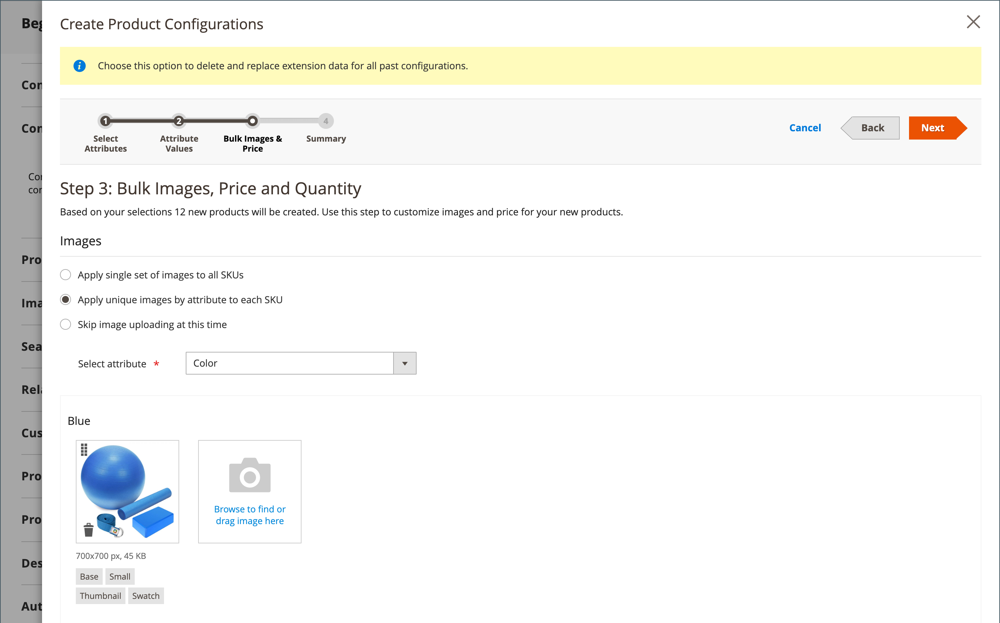
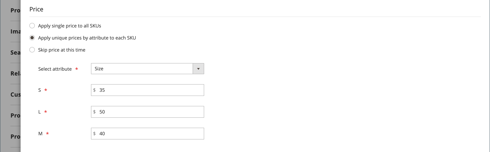
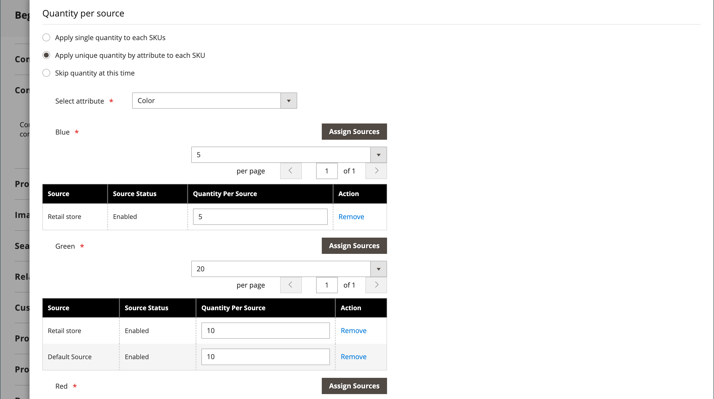
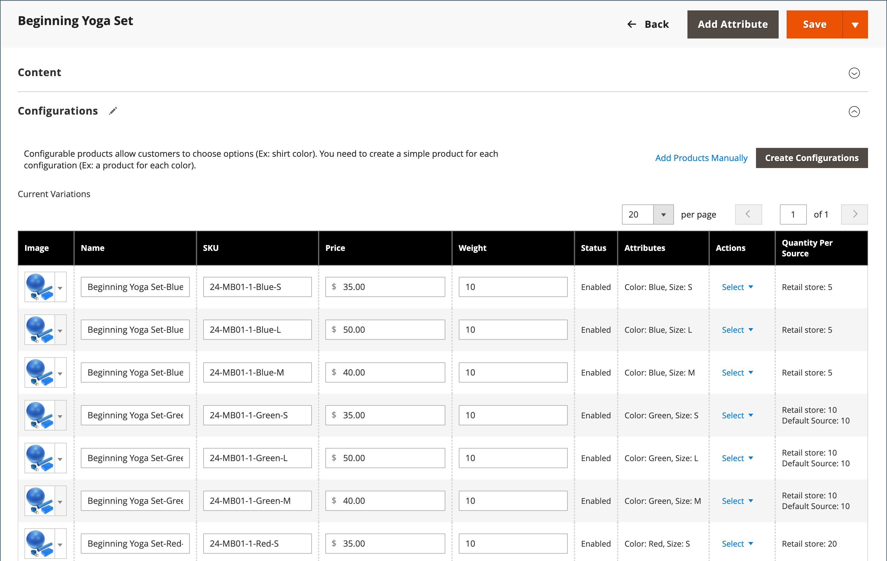

# Produto configurável

Um produto configurável se parece com um único produto com uma lista suspensa de cada variação. Cada item da lista é na verdade um produto simples separado com uma SKU exclusiva, o que permite rastrear o inventário para cada variação de produto. Você pode obter um efeito semelhante usando um produto simples com opções personalizadas, mas sem a capacidade de rastrear o inventário para cada variação.

As instruções a seguir demonstram o processo de criação de um produto configurável usando um [modelo de produto](attribute-sets.md), campos obrigatórios e configurações básicas. Cada campo obrigatório está marcado com um asterisco vermelho (`*`). Quando terminar as noções básicas, você poderá concluir as outras configurações do produto conforme necessário.

{width="700" zoomable="yes"}

## Parte 1: Criação de um produto configurável

Embora um produto configurável use mais SKUs e possa, inicialmente, levar um pouco mais para ser configurado, ele pode economizar seu tempo no final. Se você planeja expandir seu negócio, o tipo de produto configurável é uma boa escolha para produtos com várias opções.

Antes de começar, prepare um [conjunto de atributos](attribute-sets.md) que inclua um atributo definido como um dos tipos de entrada permitidos para cada variação de produto. Por exemplo, o conjunto de atributos pode incluir atributos suspensos para cor e tamanho.

As propriedades de cada atributo usado para uma variação de produto configurável devem ter as seguintes configurações:

### Requisitos do atributo de variação de produto

| Propriedade | Configuração |
|--- |--- |
| [!UICONTROL Scope] | `Global` |
| [!UICONTROL Catalog Input Type for Store Owner] | O tipo de entrada de qualquer atributo usado para uma variação de produto deve ser um dos seguintes: `Dropdown`, `Visual Swatch` ou `Text Swatch`. |
| [!UICONTROL Values Required] | `Yes` |
| [!UICONTROL Use for Promo Rule Conditions] | `Yes` |

{style="table-layout:auto"}

### Etapa 1: Escolher o tipo de produto

1. Na barra lateral _Admin_, vá para **[!UICONTROL Catalog]** > **[!UICONTROL Products]**.

1. No menu _[!UICONTROL Add Product]_( {width="25"} ), no canto superior direito, escolha **[!UICONTROL Configurable Product]**.

   {width="700" zoomable="yes"}

### Etapa 2: Escolher o conjunto de atributos

O [conjunto de atributos](attribute-sets.md) determina a seleção de campos que são usados no produto. O conjunto de atributos usado no exemplo a seguir tem atributos para cor e tamanho. O nome do conjunto de atributos é indicado na parte superior da página e é inicialmente definido como `Default`.

1. Para escolher o conjunto de atributos do produto, clique no campo na parte superior da página e siga um destes procedimentos:

   - Para **[!UICONTROL Search]**, insira o nome do conjunto de atributos.
   - Na lista, escolha o conjunto de atributos que deseja usar.

   O formulário é atualizado para refletir a alteração.

1. Se quiser adicionar outro atributo ao conjunto de atributos, clique em **[!UICONTROL Add Attribute]** e siga as instruções em [Adicionando um Atributo](product-attributes-add.md).

   {width="600" zoomable="yes"}

### Etapa 3: concluir as configurações necessárias

1. Insira o produto **[!UICONTROL Product Name]**.

1. Aceite o **[!UICONTROL SKU]** padrão que é baseado no nome do produto ou digite outro.

1. Insira o produto **[!UICONTROL Price]**.

1. Como o produto ainda não está pronto para publicação, defina **[!UICONTROL Enable Product]** como `No`.

1. clique em **[!UICONTROL Save]** e continue.

   Quando o produto é salvo, o seletor de [Exibição da loja](introduction.md#product-scope) aparece no canto superior esquerdo.

1. Escolha o **[!UICONTROL Store View]** onde o produto deve estar disponível.

   {width="600" zoomable="yes"}

### Etapa 4: concluir as configurações básicas

1. Defina **[!UICONTROL Tax Class]** como um dos seguintes:

   - `None`
   - `Taxable Goods`

1. O **[!UICONTROL Quantity]** é determinado pelas variações de produto, portanto, você pode deixá-lo em branco.

1. Deixe o **[!UICONTROL Stock Status]** como está definido.

   O status do estoque de um produto configurável é determinado por cada configuração associada. Como o produto foi salvo sem inserir uma quantidade, o **[!UICONTROL Stock Status]** está definido como `Out of Stock`.

   >[!NOTE]
   >
   >O **Status do Stock** do produto configurável é uma configuração controlada **_semimentalmente_**. É parcialmente controlada pelo status de estoque de seus produtos derivados. Ela faz parte de um cálculo de status de estoque **_com vários critérios_**, que está descrito na seção [Configurar o status do estoque](#configure-the-stock-status).

1. Insira o produto **[!UICONTROL Weight]**.

>[!NOTE]
>
>Um produto configurável deve sempre ter um peso. Se você selecionar **[!UICONTROL This item has no weight]** na lista suspensa, ele será automaticamente alterado para **[!UICONTROL This item has weight]** depois de salvar o produto.

1. Aceite a configuração padrão **[!UICONTROL Visibility]** de `Catalog, Search`.

1. Para incluir o produto na lista de [novos produtos](../content-design/widget-new-products-list.md), marque a caixa de seleção **[!UICONTROL Set Product as New]**.

1. Para atribuir Categorias ao produto, clique na caixa **[!UICONTROL Select…]** e siga um destes procedimentos:

   **Escolha uma categoria existente**:

   - Comece a digitar na caixa até encontrar uma correspondência.

   - Marque a caixa de seleção da categoria a ser atribuída.

   {width="600" zoomable="yes"}

   **Criar uma categoria**:

   - Clique em **[!UICONTROL New Category]**.

   - Insira o **[!UICONTROL Category Name]** e escolha o **[!UICONTROL Parent Category]**, que determina sua posição na estrutura de menu.

   s- Clique em **[!UICONTROL Create Category]**.

1. Escolha o **[!UICONTROL Country of Manufacture]**.

   Pode haver atributos adicionais usados para descrever o produto. A seleção varia de acordo com o conjunto de atributos, e você pode concluí-los posteriormente.

### Etapa 5: salvar e continuar

Agora é um bom momento para salvar seu trabalho. No canto superior direito, clique em **[!UICONTROL Save]**. Nas próximas etapas, você definirá as configurações para cada variação do produto.

## Parte 2: Adição de configurações

O exemplo a seguir mostra como adicionar configurações para três cores e três tamanhos. Ao todo, nove produtos simples são criados com SKUs exclusivas para abranger todas as combinações possíveis de variações. Por padrão, o nome do produto e o SKU de cada variação se baseiam no valor do atributo e no nome do produto principal ou SKU.

A barra de progresso na parte superior da página mostra onde você está no processo e o orienta em cada etapa.

### Etapa 1: Escolher os atributos

1. Continuando de cima, role para baixo até a seção _[!UICONTROL Configurations]_&#x200B;e clique em **[!UICONTROL Create Configurations]**.

   {width="600" zoomable="yes"}

1. Marque a caixa de seleção de cada atributo que você deseja incluir como uma configuração.

   Para este exemplo, `color` e `size` estão selecionados.

   {width="600" zoomable="yes"}

   A lista inclui todos os atributos do conjunto de atributos que podem ser usados em um produto configurável.

1. Se quiser adicionar um atributo, clique em **[!UICONTROL Create New Attribute]** e faça o seguinte:

   - Complete as propriedades do atributo.

   - Clique em **[!UICONTROL Save Attribute]**.

   - Marque a caixa de seleção do atributo.

1. No canto superior direito, clique em **[!UICONTROL Next]**.

### Etapa 2: Inserir os valores de atributo

1. Para cada atributo, marque a caixa de seleção dos valores que se aplicam ao produto.

   {width="600" zoomable="yes"}

1. Para reorganizar os atributos, pegue o ícone _Reordenar_ (  ) e mova a seção para uma nova posição.

   A ordem determina a posição das listas suspensas na página do produto.

1. Na barra de progresso, clique em **[!UICONTROL Next]**.

### Etapa 3: configurar as imagens, o preço e a quantidade

Essa etapa determina as imagens, os preços e a quantidade de cada configuração. As opções disponíveis são as mesmas para cada uma e você pode escolher apenas uma. Você pode aplicar a mesma configuração a todos os SKUs, aplicar uma configuração exclusiva a cada SKU ou ignorar as configurações por enquanto.

Escolha as opções de configuração que se aplicam.

Use um dos métodos a seguir para configurar o **[!UICONTROL images]**:

**Método 1:** Aplicar um único conjunto de imagens a todas as SKUs

1. Selecione **[!UICONTROL Apply single set of images to all SKUs]**.

1. Navegue até cada imagem que deseja incluir na galeria de produtos ou arraste-as para a caixa.

{width="600" zoomable="yes"}

**Método 2:** Aplicar imagens exclusivas para cada SKU

Como a imagem do produto principal já foi carregada, você pode usar essa opção para carregar uma imagem de cada cor. É possível adicionar uma imagem diferente que aparece no carrinho de compras quando alguém compra o item em uma cor específica.

1. Selecione **[!UICONTROL Apply unique images by attribute to each SKU]**.

1. Selecione a **[!UICONTROL Attribute]** que as imagens ilustram, como `color`.

1. Para cada valor de atributo, navegue até as imagens que deseja usar para essa configuração ou arraste-as para a caixa.

   Se você arrastar a imagem para uma caixa de valor, ela também aparecerá nas seções para os outros valores. Para excluir uma imagem, clique no ícone _Lixeira_ ().

   {width="600" zoomable="yes"}

Use um dos métodos a seguir para configurar o **[!UICONTROL prices]**:

>[!NOTE]
>
>Um produto configurável não tem seu próprio preço no catálogo. O preço do produto configurável é derivado de seus [!UICONTROL In Stock] produtos derivados.

**Método 1:** Aplicar o mesmo preço a todas as SKUs

1. Se o preço for o mesmo para todas as variações, selecione **[!UICONTROL Apply single price to all SKUs]**.

1. Insira o **[!UICONTROL Price]**.

   {width="600" zoomable="yes"}

**Método 2:** Aplicar um preço diferente para cada SKU

1. Se o preço for diferente para cada um ou para algumas variações do produto, selecione **[!UICONTROL Apply unique prices by attribute to each SKU]**.

1. Selecione o **[!UICONTROL Attribute]** que é a base da diferença de preço.

1. Digite o **[!UICONTROL Price]** para cada valor de atributo.

   Neste exemplo, o tamanho XL custa mais.

   {width="600" zoomable="yes"}

Use um dos métodos a seguir para configurar o **[!UICONTROL Quantity]**:

**Método 1:** Aplicar a mesma quantidade a todas as SKUs

Se a quantidade for a mesma para todos os SKUs, selecione **[!UICONTROL Apply single quantity to each SKU]** e especifique a quantidade.

_Comerciantes de origem única_ - Insira o **[!UICONTROL Quantity]**.

_Vários comerciantes da Source que usam o [Inventory management](../inventory-management/introduction.md)_ - Atribua fontes e adicione quantidades para todas as variantes de produtos geradas:

1. Selecione a opção **[!UICONTROL Apply single quantity to each SKU]**.

1. Para adicionar uma origem, clique em **[!UICONTROL Assign Sources]**.

1. Procure ou procure uma origem que deseja adicionar. Marque a caixa de seleção ao lado das fontes que deseja adicionar ao produto.

1. Informe uma quantia de inventário em estoque por origem.

   {width="600" zoomable="yes"}

**Método 2:** Aplicar quantidade diferente por atributo

_Comerciantes de origem única_ - Insira o **[!UICONTROL Quantity]**.

_Vários comerciantes da Source que usam o [Inventory management](../inventory-management/introduction.md)_ - Atribua fontes e adicione quantidades para todas as variantes de produtos geradas:

1. Se a quantidade for diferente para cada SKU, selecione **[!UICONTROL Apply unique quantity by attribute to each SKU]**.

1. Insira o **[!UICONTROL Quantity]** para cada.

   {width="600" zoomable="yes"}

Quando a configuração de imagens, preço e quantidade estiver concluída, clique em **[!UICONTROL Next]** no canto superior direito.

### Etapa 4: gerar as configurações do produto

Aguarde um momento para que a lista de produtos seja exibida e siga um destes procedimentos:

- Se você estiver satisfeito com as configurações, clique em **[!UICONTROL Generate Products]**.

- Para fazer correções, clique em **[!UICONTROL Back]**.

{width="600" zoomable="yes"}

As variações de produtos atuais aparecem na parte inferior da seção _Configuração_.

{width="600" zoomable="yes"}

### Etapa 5: adicionar imagens de produtos

1. Role para baixo e expanda  na seção _[!UICONTROL Images and Videos]_.

1. Clique no bloco _Câmera_ e navegue até a imagem principal que deseja usar para o produto configurável.

Para obter mais informações, consulte [Imagens e Vídeo](product-images-and-video.md).

### Etapa 6: Preencher as informações do produto

Role para baixo e preencha as informações nas seguintes seções, conforme necessário:

- [Conteúdo](product-content.md)

- [Produtos relacionados, venda adicional e venda cruzada](related-products-up-sells-cross-sells.md)

- [Otimização do mecanismo de pesquisa](product-search-engine-optimization.md)

- [Opções personalizáveis](settings-advanced-custom-options.md)

- [Produtos em sites](settings-basic-websites.md)

- [Design](settings-advanced-design.md)

- [Opções de presente](product-gift-options.md)

### Etapa 7: publicar o produto

1. Se você estiver pronto para publicar o produto no catálogo, defina **[!UICONTROL Enable Product]** como `Yes` e siga um destes procedimentos:

   - **Método 1:** Salvar e visualizar

      - No canto superior direito, clique em **[!UICONTROL Save]**.

      - Para exibir o produto em sua loja, escolha **[!UICONTROL Customer View]** no menu _Admin_ (  ).

     A loja é aberta em uma nova guia do navegador.

     {width="600" zoomable="yes"}

   - **Método 2:** Salvar e fechar

     No menu _[!UICONTROL Save]_( {width="25"} ), escolha **[!UICONTROL Save & Close]**.

### Etapa 8: configurar as miniaturas do carrinho

Se você tiver uma imagem diferente para cada variação, poderá definir a configuração para usar a imagem correta para a miniatura do carrinho de compras.

1. Na barra lateral _Admin_, vá para **[!UICONTROL Stores]** > _[!UICONTROL Settings]_>**[!UICONTROL Configuration]**.

1. No painel esquerdo, expanda **[!UICONTROL Sales]** e escolha **[!UICONTROL Checkout]** abaixo de.

1. Expandir  a seção _[!UICONTROL Shopping Cart]_.

1. Defina **[!UICONTROL Configurable Product Image]** como `Product Thumbnail Itself`.

1. Quando terminar, clique em **[!UICONTROL Save Config]**.

   {width="600" zoomable="yes"}

## Configurar o status do estoque

O status do estoque de produtos configuráveis é diferente do status do estoque do produto simples, onde é uma representação direta da disponibilidade do produto. Para um produto configurável, o status do estoque faz parte de um cálculo de status de estoque de **_vários critérios_**.

### Visão geral

Os princípios mais importantes dos relacionamentos de Status do Estoque são os seguintes:

- Quando você altera o **[!UICONTROL Stock Status]** do produto configurável como `Out of Stock` e clica em **[!UICONTROL Save]**, ele **_não é controlado_** pelos status de estoque de seus produtos derivados. Ele é sempre exibido como `Out of Stock` no Administrador e na Loja.

- Ao definir o **[!UICONTROL Stock Status]** do produto configurável como `In Stock` e clicar em **[!UICONTROL Save]**, ele será **_apenas parcialmente controlado_** pelos status de estoque de seus produtos derivados, que são refletidos no Administrador e na Loja.

### Descrição detalhada

O _Status do Estoque_ do produto configurável é parcialmente controlado pelo Status do Estoque de seus produtos derivados e de acordo com os seguintes cálculos de status do estoque **_multicritérios_**:

#### Somente com origem/estoque padrão:

- Se o Status do Estoque do produto configurável for **_manualmente_** definido como `Out of Stock` por um usuário administrador, importação de arquivo ou chamada de API, ele permanecerá como `Out of Stock` no **_Administrador_** e na **_Loja_** até que seja **_manualmente_** alterado para `In stock` por um usuário administrador, importação de arquivo ou chamada de API. Ela não pode ser controlada pelo status de estoque de seus produtos derivados.

- Se o Status do Estoque do produto configurável for **_manualmente_** definido como `In Stock` por um usuário administrador, importação de arquivo ou chamada de API, seu status do estoque será **_automaticamente_** controlado pelo status do estoque de seus produtos derivados no **_Administrador_** e na **_Loja_**.

>[!NOTE]
>
>Estoques e fontes personalizados fazem parte da extensão [Inventory management](../inventory-management/sources-stocks.md) e é altamente recomendável que você use essa ferramenta exclusivamente para gerenciar estoque e fonte. As funções de estoque e fonte padrão fazem parte do módulo `CatalogInventory`, que foi descontinuado.

#### Com pelo menos uma fonte/estoque personalizado:

- Se o valor configurável do Status do Estoque do produto for **_manualmente_** definido como `Out of Stock` por um usuário administrador, importação de arquivo ou chamada de API, ele permanecerá como `Out of Stock` no **_Administrador_** e na **_Loja_** até que seja **_manualmente_** alterado para `In Stock` por um usuário administrador, importação de arquivo ou chamada de API. Ele **_não pode_** ser controlado pelo status de estoque de seus produtos derivados.

- Se o valor configurável do Status do Estoque do produto for **_manualmente_** definido como `In Stock` por um usuário administrador, importação de arquivo ou chamada de API, seu status do estoque será **_automaticamente_** controlado pelo status do estoque de seus produtos derivados somente na **_Loja_**.

- Se o valor configurável do Status do Estoque do produto for **_manualmente_** definido como `In Stock` por um usuário administrador, importação de arquivo ou chamada de API, ele permanecerá como `In Stock` no **_Administrador_** até que seja **_manualmente_** alterado para `Out of Stock` por um usuário administrador, importação de arquivo ou chamada de API. Ele **_não pode_** ser controlado pelo status de estoque de seus produtos derivados.

## Coisas para lembrar

- Um produto configurável permite que o comprador escolha opções entre tipos de entrada suspensos, de seleção múltipla, de amostra visual e de amostra de texto. Cada opção é um produto simples e separado.

- O [Status do Stock](../inventory-management/sources-stocks.md) de um produto configurável é uma configuração controlada semimensalmente. É diferente do status do estoque do produto simples, onde é uma representação direta da disponibilidade do produto. Para um produto configurável, o status do estoque faz parte de um cálculo de status do estoque com vários critérios.

- Os produtos derivados configuráveis podem ser produtos simples ou virtuais **sem opções personalizadas**. Para tornar virtuais os produtos personalizados derivados, você deve selecionar `Тhis item has no weight` para a configuração **[!UICONTROL Weight]** para cada um deles.

- Todos os produtos derivados são atribuídos e desatribuídos do produto configurável **_globalmente_** para todos os sites, lojas e exibições de loja ao mesmo tempo.

- Um produto configurável não tem seu próprio preço no catálogo. O preço do produto configurável é derivado de seus [!UICONTROL In Stock] produtos derivados.

- Os atributos usados para variações de produtos devem ter um escopo global e o cliente deve ser solicitado a escolher um valor. Os atributos de variação do produto devem ser incluídos no conjunto de atributos usado como modelo para o produto configurável.

- O conjunto de atributos usado como modelo para um produto configurável deve incluir os atributos que contêm os valores necessários para cada variação de produto.

- A imagem em miniatura no carrinho de compras pode ser definida para exibir a imagem do registro do produto configurável ou da variação do produto.

- Os [Atributos de amostra](swatches.md#create-swatches-for-products) podem ser configurados para não exibir imagens de produtos simples correspondentes quando a amostra é selecionada ao definir o valor da opção **[!UICONTROL Update Product Preview Image]** como `No` na página de edição de atributos no Administrador.

- O tema controla como a Galeria de imagens se comporta quando um usuário alterna entre as configurações do produto. O comportamento padrão para o tema _Em branco_ é substituir as imagens de produtos configuráveis principais pela variação de produtos selecionada. Para o tema Luma, o comportamento padrão é anexar as imagens de variação do produto selecionado às imagens do produto configuráveis principais.
