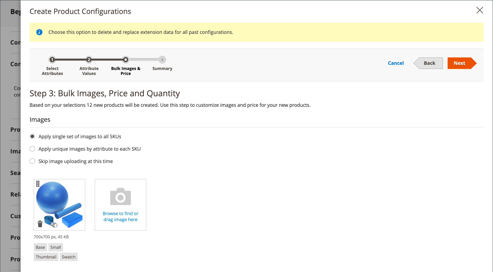

# Produto configurável

Um produto configurável é exibido como um único produto com opções suspensas para variações (como cor ou tamanho). Cada variação é um produto simples separado com sua própria SKU, permitindo o rastreamento individual do inventário, ao contrário de produtos simples com opções personalizadas.

**Recomendado para:** produtos com várias opções (cor, tamanho, material, etc.) nos quais você precisa rastrear o inventário para cada variação. A configuração inicial leva mais tempo, mas fornece melhor escalabilidade.

{width="700" zoomable="yes"}

## Antes de começar

### Lista de verificação de pré-requisitos

Antes de criar um produto configurável, verifique se você tem:

1. **Conjunto de Atributos** - Um conjunto de atributos que inclui atributos de variação (como cor e tamanho)
1. **Atributos de Variação Criados** - Atributos definidos com as configurações abaixo
1. **Imagens de Produtos** - (Opcional, mas recomendado) Imagens do produto principal e de cada variação

### Requisitos de atributo

Cada atributo usado para variações de produto deve ter estas configurações:

| Propriedade | Configuração Obrigatória |
|--- |--- |
| [!UICONTROL Scope] | `Global` |
| [!UICONTROL Catalog Input Type for Store Owner] | `Dropdown`, `Visual Swatch` ou `Text Swatch` |
| [!UICONTROL Values Required] | `Yes` |

{style="table-layout:auto"}

Para obter instruções sobre como criar atributos, consulte [Atributos do produto](product-attributes.md).

## Fase 1: Criar a base do produto

### Etapa 1: Escolher o tipo de produto

1. Na barra lateral _Admin_, vá para **[!UICONTROL Catalog]** > **[!UICONTROL Products]**.

1. No menu _[!UICONTROL Add Product]_( {width="25"} ), no canto superior direito, escolha **[!UICONTROL Configurable Product]**.

   {width="700" zoomable="yes"}

### Etapa 2: Escolher o conjunto de atributos

O [conjunto de atributos](attribute-sets.md) determina quais campos aparecem no formulário de produto e quais atributos estão disponíveis para variações.

1. Clique no campo do conjunto de atributos na parte superior da página e siga um destes procedimentos:

   - Para **[!UICONTROL Search]**, insira o nome do conjunto de atributos.
   - Na lista, escolha o conjunto de atributos que deseja usar.

   O formulário é atualizado para refletir o conjunto de atributos selecionado.

1. Se precisar adicionar outro atributo ao conjunto de atributos, clique em **[!UICONTROL Add Attribute]** e siga as instruções em [Adicionando um Atributo](product-attributes-add.md).

   {width="600" zoomable="yes"}

### Etapa 3: Inserir informações básicas

1. Insira o produto **[!UICONTROL Product Name]**.

1. Aceite o **[!UICONTROL SKU]** padrão com base no nome do produto ou insira um valor diferente.

1. Insira o produto **[!UICONTROL Price]**.

   >[!NOTE]
   >
   >Esse preço é substituído pelos preços do produto filho. O preço real exibido para os clientes vem dos [!UICONTROL In Stock] produtos secundários.

1. Como o produto ainda não está pronto para publicação, defina **[!UICONTROL Enable Product]** como `No`.

1. Clique em **[!UICONTROL Save]** e continue.

   Quando o produto é salvo, o seletor de [Exibição da loja](introduction.md#product-scope) aparece no canto superior esquerdo.

1. Escolha o **[!UICONTROL Store View]** onde o produto deve estar disponível.

   {width="600" zoomable="yes"}

### Etapa 4: completar as configurações básicas

1. Defina **[!UICONTROL Tax Class]** como um dos seguintes:

   - `None`
   - `Taxable Goods`

1. Deixe **[!UICONTROL Quantity]** em branco. A quantidade é determinada pelas variações do produto.

1. Deixe **[!UICONTROL Stock Status]** como definido.

   O status do estoque de um produto configurável é determinado por suas variações associadas. Como o produto foi salvo sem uma quantidade, o **[!UICONTROL Stock Status]** está definido como `Out of Stock`.

   >[!NOTE]
   >
   >O **Status do Estoque** de um produto configurável é uma configuração controlada **_semimensalmente_**, parcialmente baseada no status do estoque de seus produtos derivados. Isso faz parte de um cálculo de status de estoque de **_vários critérios_**. Consulte [Configurar status do estoque](#configure-stock-status) para obter detalhes.

1. Insira o produto **[!UICONTROL Weight]**.

   >[!NOTE]
   >
   >Um produto configurável deve sempre ter um peso. Se você selecionar **[!UICONTROL This item has no weight]** na lista suspensa, ele será alterado automaticamente para **[!UICONTROL This item has weight]** quando você salvar o produto.

1. Aceite a configuração padrão **[!UICONTROL Visibility]** de `Catalog, Search`.

1. Para incluir o produto na lista de [novos produtos](../content-design/widget-new-products-list.md), marque a caixa de seleção **[!UICONTROL Set Product as New]**.

1. Para atribuir categorias ao produto, clique na caixa **[!UICONTROL Select…]** e siga um destes procedimentos:

   **Escolha uma categoria existente:**

   - Comece a digitar na caixa para encontrar uma correspondência.

   - Marque a caixa de seleção de cada categoria a ser atribuída.

   {width="600" zoomable="yes"}

   **Criar uma nova categoria:**

   - Clique em **[!UICONTROL New Category]**.

   - Insira o **[!UICONTROL Category Name]** e escolha o **[!UICONTROL Parent Category]** para determinar sua posição na estrutura de menu.

   - Clique em **[!UICONTROL Create Category]**.

1. Escolha o **[!UICONTROL Country of Manufacture]**.

   Atributos adicionais podem aparecer dependendo do conjunto de atributos. Você pode concluí-los mais tarde.

### Etapa 5: salvar e continuar

Este é um bom momento para salvar seu trabalho. Clique em **[!UICONTROL Save]** no canto superior direito. Na próxima fase, você definirá as configurações para cada variação.

## Fase 2: adicionar variações de produtos

As etapas a seguir mostram como adicionar configurações para várias variações. A barra de progresso na parte superior da página mostra sua posição atual no processo.

**Exemplo:** para uma camisa com 3 cores e 3 tamanhos, você criará 9 produtos simples com SKUs exclusivas (uma para cada combinação). Por padrão, o nome do produto e o SKU de cada variação se baseiam no valor do atributo e no nome do produto principal ou SKU.

### Etapa 6: Escolher atributos de variação

1. Role para baixo até a seção _[!UICONTROL Configurations]_&#x200B;e clique em **[!UICONTROL Create Configurations]**.

   {width="600" zoomable="yes"}

1. Marque a caixa de seleção de cada atributo para incluir como uma variação.

   Para este exemplo, `color` e `size` estão selecionados.

   {width="600" zoomable="yes"}

   A lista inclui todos os atributos do conjunto de atributos que podem ser usados em um produto configurável.

1. Se precisar adicionar um atributo, clique em **[!UICONTROL Create New Attribute]** e faça o seguinte:

   - Complete as propriedades do atributo.

   - Clique em **[!UICONTROL Save Attribute]**.

   - Marque a caixa de seleção do atributo.

1. Clique em **[!UICONTROL Next]** no canto superior direito.

### Etapa 7: Selecionar valores de atributo

1. Para cada atributo, marque a caixa de seleção dos valores que se aplicam ao produto.

   {width="600" zoomable="yes"}

1. Para reorganizar os atributos, pegue o ícone _Reordenar_ (  ) e mova a seção para uma nova posição.

   A ordem determina a posição das listas suspensas na página do produto.

1. Na barra de progresso, clique em **[!UICONTROL Next]**.

### Etapa 8: configurar imagens, preços e inventário

Essa etapa determina as imagens, os preços e a quantidade para cada configuração. As opções disponíveis são as mesmas para cada uma. Você pode aplicar a mesma configuração a todos os SKUs, aplicar configurações exclusivas a cada SKU ou ignorar as configurações por enquanto.

#### Configurar imagens

Escolha a opção de configuração que se aplica:

**Opção 1: aplicar um único conjunto de imagens a todas as SKUs**

1. Selecione **[!UICONTROL Apply single set of images to all SKUs]**.

1. Navegue até cada imagem a ser incluída na galeria de produtos ou arraste imagens para a caixa.

{width="600" zoomable="yes"}

**Opção 2: Aplicar imagens exclusivas para cada SKU**

Como a imagem do produto principal já foi carregada, use essa opção para carregar imagens para cada variação. Você pode adicionar diferentes imagens que aparecem no carrinho de compras quando alguém compra uma variação específica.

1. Selecione **[!UICONTROL Apply unique images by attribute to each SKU]**.

1. Selecione a **[!UICONTROL Attribute]** que as imagens ilustram, como `color`.

1. Para cada valor de atributo, navegue até as imagens que serão usadas para essa configuração ou arraste-as para a caixa.

   Se você arrastar uma imagem para uma caixa de valor, ela também aparecerá nas seções para outros valores. Para excluir uma imagem, clique no ícone da _Lixeira_ ().

   {width="600" zoomable="yes"}

#### Configurar preços

>[!NOTE]
>
>Um produto configurável não tem seu próprio preço no catálogo. O preço do produto configurável é derivado de seus [!UICONTROL In Stock] produtos derivados.

Escolha a opção de configuração que se aplica:

**Opção 1: Aplicar o mesmo preço a todas as SKUs**

1. Se o preço for o mesmo para todas as variações, selecione **[!UICONTROL Apply single price to all SKUs]**.

1. Insira o **[!UICONTROL Price]**.

   {width="600" zoomable="yes"}

**Opção 2: Aplicar um preço diferente para cada SKU**

1. Se o preço for diferente para cada uma ou para algumas variações, selecione **[!UICONTROL Apply unique prices by attribute to each SKU]**.

1. Selecione o **[!UICONTROL Attribute]** que é a base da diferença de preço.

1. Digite o **[!UICONTROL Price]** para cada valor de atributo.

   Neste exemplo, o tamanho XL custa mais.

   {width="600" zoomable="yes"}

#### Configurar inventário

Escolha a opção de configuração que se aplica:

**Opção 1: aplicar a mesma quantidade a todas as SKUs**

Se a quantidade for a mesma para todos os SKUs, selecione **[!UICONTROL Apply single quantity to each SKU]** e especifique a quantidade.

_Comerciantes únicos do Source :_

Insira o **[!UICONTROL Quantity]**.

_Vários comerciantes do Source usando o [Inventory management &#x200B;](../inventory-management/introduction.md):_

Atribuir origens e adicionar quantidades para todas as grades de produtos geradas:

1. Selecione a opção **[!UICONTROL Apply single quantity to each SKU]**.

1. Para adicionar uma origem, clique em **[!UICONTROL Assign Sources]**.

1. Procure ou procure uma origem para adicionar. Marque a caixa de seleção ao lado das origens do produto.

1. Informe uma quantia de inventário em estoque por origem.

   {width="600" zoomable="yes"}

**Opção 2: Aplicar quantidade diferente por atributo**

_Comerciantes únicos do Source :_

Digite o **[!UICONTROL Quantity]** para cada valor de atributo.

_Vários comerciantes do Source usando o [Inventory management &#x200B;](../inventory-management/introduction.md):_

Atribuir origens e adicionar quantidades para todas as grades de produtos geradas:

1. Selecione **[!UICONTROL Apply unique quantity by attribute to each SKU]**.

1. Insira o **[!UICONTROL Quantity]** para cada variação.

   {width="600" zoomable="yes"}

Quando a configuração de imagens, preço e quantidade estiver concluída, clique em **[!UICONTROL Next]** no canto superior direito.

### Etapa 9: Gerar configurações de produto

Aguarde um momento para que a lista de produtos seja exibida e siga um destes procedimentos:

- Se você estiver satisfeito com as configurações, clique em **[!UICONTROL Generate Products]**.

- Para fazer correções, clique em **[!UICONTROL Back]**.

{width="600" zoomable="yes"}

As variações de produtos atuais aparecem na parte inferior da seção _Configuração_.

{width="600" zoomable="yes"}

### Etapa 10: adicionar imagens de produtos

1. Role para baixo e expanda  na seção _[!UICONTROL Images and Videos]_.

1. Clique no bloco _Câmera_ e navegue até a imagem principal a ser usada para o produto configurável.

Para obter mais informações, consulte [Imagens e Vídeo](product-images-and-video.md).

### Etapa 11: Informações completas sobre o produto

Role para baixo e preencha as informações nas seguintes seções, conforme necessário:

- [Conteúdo](product-content.md)

- [Produtos relacionados, venda adicional e venda cruzada](related-products-up-sells-cross-sells.md)

- [Otimização do mecanismo de pesquisa](product-search-engine-optimization.md)

- [Opções personalizáveis](settings-advanced-custom-options.md)

- [Produtos em sites](settings-basic-websites.md)

- [Design](settings-advanced-design.md)

- [Opções de presente](product-gift-options.md)

## Fase 3: publicar o produto

### Etapa 12: publicar o produto

1. Se você estiver pronto para publicar o produto no catálogo, defina **[!UICONTROL Enable Product]** como `Yes`.

1. Siga um destes procedimentos:

   **Método 1: salvar e visualizar**

   - No canto superior direito, clique em **[!UICONTROL Save]**.

   - Para exibir o produto em sua loja, escolha **[!UICONTROL Customer View]** no menu _Admin_ (  ).

   A loja é aberta em uma nova guia do navegador.

   {width="600" zoomable="yes"}

   **Método 2: Salvar e fechar**

   No menu _[!UICONTROL Save]_( {width="25"} ), escolha **[!UICONTROL Save & Close]**.

## Configurar status do estoque

O status do estoque de produtos configuráveis é diferente do status de estoque de produtos simples. Para um produto configurável, o status do estoque faz parte de um cálculo de **_vários critérios_**.

### Como o status do estoque funciona

Os princípios-chave do comportamento do status do estoque:

| Você Definiu O Status Como | Resultado | Controlado Por Produtos Filhos? |
|---|---|---|
| `Out of Stock` (manual) | Sempre exibe `Out of Stock` no Administrador e na Loja | Não - permanece até ser alterado manualmente para `In Stock` |
| `In Stock` (manual) | O status é dinâmico com base em produtos derivados | Parcial - consulte os detalhes abaixo |

{style="table-layout:auto"}

### Quando definido como &quot;Em estoque&quot;

Ao definir manualmente o status do estoque do produto configurável para `In Stock`, ele se comporta de forma diferente dependendo da configuração do inventário:

**Somente com origem/estoque padrão:**

- **Admin e Storefront:** o status do Stock reflete automaticamente a disponibilidade do produto derivado

**Com pelo menos uma origem/estoque personalizado:**

- **Loja:** o status do estoque reflete automaticamente a disponibilidade do produto derivado
- **Administrador:** Permanece como `In Stock` até ser alterado manualmente (não controlado por produtos derivados)

>[!NOTE]
>
>Estoques e fontes personalizados fazem parte da extensão [Inventory management](../inventory-management/sources-stocks.md). É altamente recomendável usar essa ferramenta exclusivamente para gerenciar estoque e origem. As funções de estoque e fonte padrão fazem parte do módulo `CatalogInventory`, que foi descontinuado.

### Alterações manuais de status do estoque

Se você definir manualmente o status do estoque para `Out of Stock` (por meio da ação do usuário administrador, importação de arquivo ou chamada de API), ele permanecerá `Out of Stock` no Administrador e na Loja até que você altere manualmente de volta para `In Stock`. Ela não é afetada pelo status de estoque de produtos secundários.

## Configuração do sistema (opcional)

### Exibir imagens de variação em miniaturas do carrinho

Se você tiver imagens diferentes para cada variação, poderá configurar o sistema para exibir a imagem correta para a miniatura do carrinho de compras.

1. Na barra lateral _Admin_, vá para **[!UICONTROL Stores]** > _[!UICONTROL Settings]_>**[!UICONTROL Configuration]**.

1. No painel esquerdo, expanda **[!UICONTROL Sales]** e escolha **[!UICONTROL Checkout]**.

1. Expandir  a seção _[!UICONTROL Shopping Cart]_.

1. Defina **[!UICONTROL Configurable Product Image]** como `Product Thumbnail Itself`.

1. Clique em **[!UICONTROL Save Config]**.

   {width="600" zoomable="yes"}

## Principais considerações

- **Tipos de variação:** os compradores podem selecionar opções de tipos de entrada com lista suspensa, seleção múltipla, amostra visual e amostra de texto. Cada opção é um produto simples e separado.

- **Rastreamento de inventário**: diferentemente dos produtos simples com opções personalizadas, os produtos configuráveis rastreiam o inventário de cada variação independentemente.

- **Tipos de produtos secundários:** os produtos secundários podem ser produtos simples ou virtuais **sem opções personalizadas**. Para tornar os produtos derivados virtuais, selecione `Тhis item has no weight` para a configuração **[!UICONTROL Weight]** para cada filho.

- **Atribuição global:** os produtos derivados são atribuídos e desatribuídos do produto configurável **globalmente** em todos os sites, lojas e exibições de loja simultaneamente.

- **Preços:** um produto configurável não tem seu próprio preço no catálogo. O preço exibido vem de seus [!UICONTROL In Stock] produtos secundários.

- **Atributos:** os atributos de variação devem ter um escopo global, e os clientes devem ser solicitados a escolher um valor. Os atributos devem ser incluídos no conjunto de atributos usado para o produto configurável.

- **Miniaturas do carrinho:** a miniatura do carrinho de compras pode exibir a imagem do registro do produto configurável ou da variação do produto. Consulte [Configuração do Sistema](#system-configuration-optional) acima.

- **Comportamento da amostra:** os [Atributos da amostra](swatches.md#create-swatches-for-products) podem ser configurados para não exibir imagens do produto simples correspondentes quando a amostra for selecionada ao configurar **[!UICONTROL Update Product Preview Image]** como `No` na página de edição do atributo.

- **Comportamento da galeria de imagens:** o tema controla como a Galeria de imagens se comporta quando os usuários alternam entre as configurações do produto. O comportamento padrão do tema _Em branco_ substitui as imagens de produto configuráveis principais pela variação selecionada. Para o tema Luma, o comportamento padrão é anexar as imagens de variação selecionadas às imagens do produto configuráveis principais.
