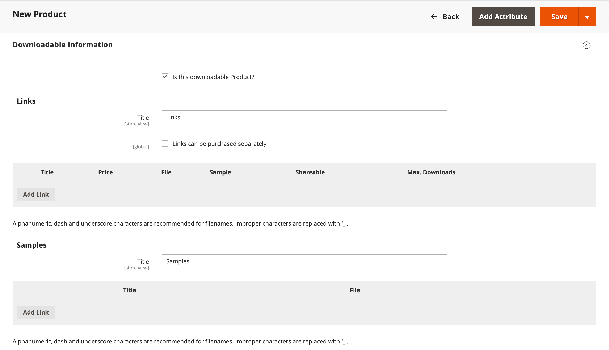
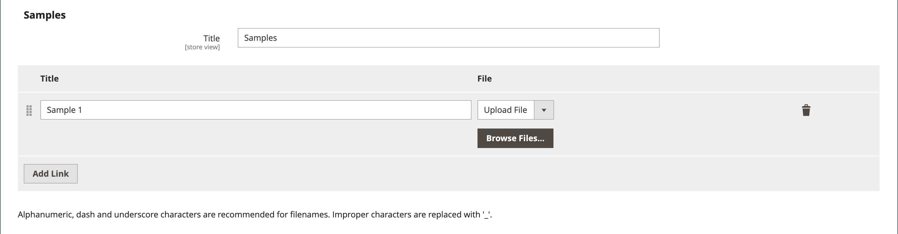

# Produto baixável

Um produto para download pode ser qualquer item que você pode fornecer como um arquivo, como um eBook, música, vídeo, aplicativo de software ou atualização. Você pode oferecer um álbum para venda e vender cada música individualmente. Você também pode usar um produto para download para fornecer uma versão eletrônica do catálogo de produtos.

Como o download não estará disponível até a compra, você pode fornecer amostras, como um trecho de um livro, um clipe de um arquivo de áudio ou um trailer de um vídeo. Um exemplo é algo que o cliente pode experimentar antes de comprar o produto. Os arquivos que você disponibiliza para download podem ser carregados no seu servidor ou em um servidor diferente.

{width="700" zoomable="yes"}

Os produtos para download podem ser configurados para exigir que o cliente faça logon em uma conta para receber o link ou podem ser enviados por email e compartilhados com outras pessoas. O status do pedido antes que o download se torne disponível, os valores padrão e outras opções de delivery são definidos na configuração. Conforme você planeja fazer o download das adições ao catálogo, anote o seguinte:

- Os produtos baixáveis podem ser carregados no servidor ou vinculados a partir de outro servidor na Internet.

- Você pode determinar o número de vezes que um cliente pode baixar um produto.

- Os clientes que compram um produto para download podem precisar fazer logon antes de passar pelo checkout.

- A entrega de um produto baixável pode ser feita quando o pedido estiver em um `Pending` ou `Invoiced` status.

- Como os produtos para download não são despachados, o _Envio_ a etapa do checkout é ignorada quando o carrinho contém somente o produto que pode ser baixado.

## Configurar as opções de download

As definições de configuração para download determinam os valores padrão e as opções de entrega para produtos para download e especificam se os convidados podem comprar downloads.

1. No _Admin_ barra lateral, vá para **[!UICONTROL Stores]** > _[!UICONTROL Settings]_>**[!UICONTROL Configuration]**.

1. No painel esquerdo, expanda **[!UICONTROL Catalog]** e escolha **[!UICONTROL Catalog]** por baixo.

1. Expandir  o _[!UICONTROL Downloadable Product Options]_seção.

   {width="700" zoomable="yes"}

   Para obter uma lista detalhada dessas opções de configuração, consulte [_Opções de produto baixáveis_](../configuration-reference/catalog/catalog.md#downloadable-product-options) no _Referência de configuração_.

1. Para determinar o status do processo do pedido quando o download se tornar disponível, defina **[!UICONTROL Order Item Status to Enable Downloads]** a um dos seguintes:

   - `Pending`
   - `Invoiced`

1. Para definir um limite padrão no número de downloads que um único cliente pode fazer, insira o número para **[!UICONTROL Default Maximum Number of Downloads]**.

1. Definir **[!UICONTROL Shareable]** a um dos seguintes:

   - `Yes` - Permite que os clientes enviem por email o link de download para outras pessoas.
   - `No` - Impede que os clientes compartilhem o link de download com outras pessoas, exigindo que os clientes façam logon em suas contas para acessar os links de download.

1. Para **[!UICONTROL Default Sample Title]**, insira o cabeçalho que deve aparecer acima da seleção de amostras.

   {width="400"}

1. Para **[!UICONTROL Default Link Title]**, insira o texto padrão que deseja usar para os links de download.

1. Se quiser que o link de download seja aberto em uma nova janela do navegador, defina **[!UICONTROL Opens Links in New Window]** para `Yes`.

   Essa configuração é usada para manter a janela do navegador aberta para sua loja.

1. Para determinar como o conteúdo para download é entregue, defina **[!UICONTROL Use Content Disposition]** a um dos seguintes:

   - `Attachment` - Fornece o link de download por email como um anexo.
   - `Inline` - Fornece o link de download como um link em uma página da Web.

1. Se você quiser exigir que os compradores se registrem em uma conta de cliente e façam logon antes de comprar um download, defina **[!UICONTROL Disable Guest Checkout if Cart Contains Downloadable Items]** para `Yes`.

1. Quando terminar, clique em **[!UICONTROL Save Config]**.

## Criar um produto para download

As instruções a seguir demonstram o processo de criação de um produto para download usando um [modelo do produto](attribute-sets.md), campos obrigatórios e configurações básicas. Cada campo obrigatório está marcado com um asterisco vermelho (`*`). Quando terminar as noções básicas, você poderá concluir as outras configurações do produto conforme necessário.

>[!NOTE]
>
>Os nomes de arquivos para download podem incluir letras e números. Um caractere de traço ou sublinhado pode ser usado para representar um espaço entre palavras. Todos os caracteres inválidos no nome do arquivo são substituídos por um sublinhado.

### Etapa 1: Escolher o tipo de produto

1. No _Admin_ barra lateral, vá para **[!UICONTROL Catalog]** > **[!UICONTROL Products]**.

1. No _[!UICONTROL Add Product]_( {width="25"} ) no canto superior direito, escolha `Downloadable Product`.

   {width="700" zoomable="yes"}

### Etapa 2: Escolher o conjunto de atributos

Os dados de amostra incluem uma [conjunto de atributos](attribute-sets.md) chamado _Baixável_ que tem campos especiais para produtos baixáveis. É possível usar um modelo existente ou criar outro antes de salvar o produto.

Para escolher o conjunto de atributos usado como modelo para o produto, siga um destes procedimentos:

- Para **[!UICONTROL Search]**, insira o nome do conjunto de atributos.

- Na lista, escolha o `Downloadable` conjunto de atributos.

O formulário é atualizado para refletir a alteração.

{width="600" zoomable="yes"}

### Etapa 3: concluir as configurações necessárias

1. Insira o **[!UICONTROL Product Name]**.

1. Aceitar o padrão **[!UICONTROL SKU]** que se baseia no nome do produto ou insira outro.

1. Insira o produto **[!UICONTROL Price]**.

1. Como o produto ainda não está pronto para publicação, defina **[!UICONTROL Enable Product]** para `No`.

1. click **[!UICONTROL Save]** e continue.

   Quando o produto for salvo, a variável [Exibição da loja](introduction.md#product-scope) seletor aparece no canto superior esquerdo.

1. Escolha o **[!UICONTROL Store View]** onde o produto deve estar disponível.

   {width="600" zoomable="yes"}

### Etapa 4: concluir as configurações básicas

1. Definir **[!UICONTROL Tax Class]** a um dos seguintes:

   - `None`
   - `Taxable Goods`

1. Insira o **[!UICONTROL Quantity]** do produto que está em estoque.

   Anote o seguinte:

   - Por padrão, **[!UICONTROL Stock Status]** está definida como `Out of Stock`.

   - Como os produtos para download não são despachados, o **[!UICONTROL Weight]** não é usado. Se você habilitar esse recurso, ele se tornará um [Produto simples](product-create-simple.md) e a variável _Este produto pode ser baixado?_ não pode ser usada.

   >[!NOTE]
   >
   >Se você habilitar [Inventory management](../inventory-management/introduction.md), os comerciantes de Origem Única definem a quantidade nesta seção. Comerciantes de várias origens adicionam origens e quantidades na seção Origens. Consulte o seguinte _Atribuir Origens e Quantidades (Inventory management)_ seção.

1. Aceitar o padrão **[!UICONTROL Visibility]** configuração de `Catalog, Search`.

1. Para incluir o produto na [lista de novos produtos](../content-design/widget-new-products-list.md), selecione o **[!UICONTROL Set Product as New]** caixa de seleção

1. Para atribuir _[!UICONTROL Categories]_ao produto, clique no link **[!UICONTROL Select…]**e siga um destes procedimentos:

   **Escolher uma categoria existente**:

   - Comece a digitar na caixa até encontrar uma correspondência.

   - Marque a caixa de seleção de cada categoria que deve ser atribuída.

   **Criar uma categoria**:

   - Clique em **[!UICONTROL New Category]**.

   - Insira o **[!UICONTROL Category Name]** e escolha o **[!UICONTROL Parent Category]**, que determina a sua posição na [estrutura de menu](category-root.md).

   - Clique em **[!UICONTROL Create Category]**.

1. Definir **[!UICONTROL Format]** a um dos seguintes:

   - `Download`
   - `DVD`

   Se necessário, é possível editar a variável [atributo](attribute-product-create.md) para adicionar mais valores.

   Pode haver atributos adicionais que descrevam o produto. A seleção varia de acordo com o conjunto de atributos e você pode concluí-los posteriormente.

#### Atribuir origens e quantidades ([!DNL Inventory Management])

{{$include /help/_includes/inventory-assign-sources.md}}

### Etapa 5: Preencha as informações baixáveis

Rolar para baixo, expandir  o _[!UICONTROL Downloadable Information]_e selecione o **[!UICONTROL Is this downloadable product?]**caixa de seleção

Quando ativado, a variável _[!UICONTROL Downloadable Information]_tem duas partes. A primeira parte descreve cada link de download e a segunda parte descreve cada arquivo de amostra. O valor padrão para muitas dessas opções pode ser definido na variável [configuração](#configure-the-download-options).

{width="600" zoomable="yes"}

#### Complete os links

1. No _[!UICONTROL Links]_, insira o **[!UICONTROL Title]**que você deseja usar como um cabeçalho para os links de download.

1. Se aplicável, selecione o **[!UICONTROL Links can be purchased separately]** caixa de seleção

1. Clique em **[!UICONTROL Add Link]** e faça o seguinte:

   - Insira o **[!UICONTROL Title]** e **[!UICONTROL Price]** do download.

   - Para ambos **[!UICONTROL File]** e **[!UICONTROL Sample]** escolha um dos seguintes métodos de distribuição para os downloads:

      - `Upload File` - Escolha este método para carregar o arquivo de distribuição no servidor. Navegue até o arquivo e selecione-o para upload.
      - `URL` - Escolha este método para acessar o arquivo de distribuição de um URL. Insira o URL completo para o arquivo de download.

   >[!NOTE]
   >
   >Não é possível usar links para recursos externos como produtos baixáveis. Domínios de link válidos são predefinidos programaticamente no `env.php` arquivo (consulte [referência env.php](https://experienceleague.adobe.com/docs/commerce-operations/configuration-guide/files/config-reference-envphp.html) no _Guia de configuração_).

   - Definir **[!UICONTROL Shareable]** a um dos seguintes:

      - `No` - Exige que os clientes façam logon em suas contas para acessar o link de download.

      - `Yes` - Envia o link por email, que os clientes podem compartilhar com outras pessoas.

      - `Use Config` - Usa o método especificado na variável [Opções de produto baixáveis](../configuration-reference/catalog/catalog.md) configuração.

   - Siga um destes procedimentos:

      - Para limitar os downloads por cliente, insira o número máximo de **[!UICONTROL Max. Downloads]**.
      - Para permitir downloads ilimitados, selecione o **[!UICONTROL Unlimited]** caixa de seleção

   {width="600" zoomable="yes"}

1. Para adicionar outro link, clique em **[!UICONTROL Add Link]** e repita essas etapas.

#### Complete as amostras

1. No _[!UICONTROL Samples]_, insira o **[!UICONTROL Title]**que você deseja usar como um cabeçalho para as amostras.

1. Para completar as informações de cada amostra, clique em **[!UICONTROL Add Link]**.

   {width="600" zoomable="yes"}

1. Preencha os detalhes do link da seguinte maneira:

   - Insira o **[!UICONTROL Title]** da amostra individual.

   - Escolha um dos seguintes métodos de distribuição:

      - `Upload File` - Escolha este método para carregar o arquivo de distribuição no servidor. Navegue até o arquivo e selecione-o para upload.
      - `URL` - Escolha este método para acessar o arquivo de distribuição de um URL. Insira o URL completo para o arquivo de download.

   - Para adicionar outra amostra, clique em **[!UICONTROL Add Link]** e repita essas etapas.

   - Para alterar a ordem das amostras, pegue a _Pedido de alteração_ (  ) e arraste a amostra para uma nova posição.

### Etapa 6: Preencher as informações do produto

Role para baixo e preencha as informações nas seguintes seções, conforme necessário:

- [Conteúdo](product-content.md)
- [Imagens e vídeos](product-images-and-video.md)
- [Otimização do mecanismo de pesquisa](product-search-engine-optimization.md)
- [Produtos relacionados, venda adicional e venda cruzada](related-products-up-sells-cross-sells.md)
- [Opções personalizáveis](settings-advanced-custom-options.md)
- [Produtos em sites](settings-basic-websites.md)
- [Design](settings-advanced-design.md)
- [Opções de presente](product-gift-options.md)

### Etapa 7: publicar o produto

Se estiver pronto para publicar o produto no catálogo, defina **[!UICONTROL Enable Product]** para `Yes` e siga um destes procedimentos:

**Método 1:** Salvar e visualizar

- No canto superior direito, clique em **[!UICONTROL Save]**.

- Para exibir o produto em sua loja, escolha **[!UICONTROL Customer View]** no _Admin_ (  ).

  A loja é aberta em uma nova guia do navegador.

  {width="600" zoomable="yes"}

**Método 2:** Salvar e fechar

No _[!UICONTROL Save]_( {width="25"} ), escolha **[!UICONTROL Save & Close]**.

## Experiência da vitrine

No painel de conta do cliente, a variável _[!UICONTROL My Downloadable Products]_A página vincula a cada pedido de produtos para download. Os downloads ficam disponíveis na conta do cliente quando o pedido é concluído.

{width="700" zoomable="yes"}

A tabela a seguir descreve as _Meus produtos baixáveis_ valores:

| Coluna | Descrição |
|--- |--- |
| [!UICONTROL Order#] | A variável [pedido](../stores-purchase/orders.md) na qual o produto disponível para download foi comprado. Fornece um link para os detalhes do pedido. |
| [!UICONTROL Date] | Data de criação do pedido. |
| [!UICONTROL Title] | O nome do produto para download adquirido com o pedido. Fornece um link para o produto que pode ser baixado. |
| [!UICONTROL Status] | Status de processamento do pedido. |
| [!UICONTROL Remaining Downloads] | Número de downloads disponíveis do produto baixado. |

_**Para baixar um arquivo de produto no painel de contas**_

1. No painel de contas, o cliente escolhe **[!UICONTROL My Downloadable Products]**.

1. Localiza a ordem na lista e clica no link após o título.

1. No canto inferior direito da janela de download, clique na guia _baixar_ ícone.

1. Localiza o arquivo no local de downloads e o salva no local desejado.
