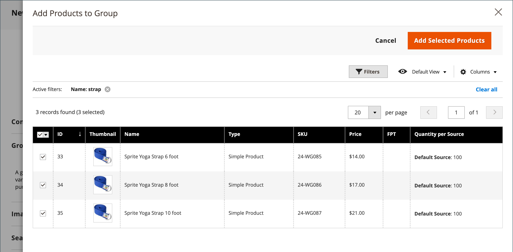
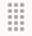

# Produto agrupado

Um produto agrupado consiste em produtos simples independentes que são apresentados como um grupo. Você pode oferecer variações de um único produto ou agrupá-las por temporada ou tema. A apresentação de um produto agrupado pode criar um incentivo para os clientes comprarem itens adicionais. Um produto agrupado fornece uma maneira fácil de oferecer variações de um produto e listá-las na mesma página.

Por exemplo, você pode vender talheres de estoque abertos e listar todos os tipos de utensílios que são usados em um ambiente de lugar formal. Alguns podem pedir vários garfos de salada, garfos de peixe, garfos de jantar, facas de jantar, facas de peixe, facas de manteiga, colheres de sopa e colheres de sobremesa. Outros clientes podem pedir um simples garfo, faca e colher. Os clientes podem solicitar qualquer número de cada item como desejarem.

Embora sejam apresentados como um grupo, cada produto do grupo é comprado como um item separado. No carrinho de compras, cada item e a quantidade comprada são exibidos como um item de linha separado.

As instruções a seguir demonstram o processo de criação de um produto agrupado usando um [modelo de produto](attribute-sets.md), campos obrigatórios e configurações básicas. Cada campo obrigatório está marcado com um asterisco vermelho (`*`). Quando terminar as noções básicas, você poderá concluir as outras configurações do produto conforme necessário.

{width="700" zoomable="yes"}

## Etapa 1: Escolher o tipo de produto

1. Na barra lateral _Admin_, vá para **[!UICONTROL Catalog]** > **[!UICONTROL Products]**.

1. No menu _[!UICONTROL Add Product]_( {width="25"} ), no canto superior direito, escolha **[!UICONTROL Grouped Product]**.

   {width="700" zoomable="yes"}

## Etapa 2: Escolher o conjunto de atributos

Para escolher o [conjunto de atributos](attribute-sets.md) usado como modelo para o produto, siga um destes procedimentos:

- Para pesquisar, insira o nome do **[!UICONTROL Attribute Set]**.
- Na lista, escolha o conjunto de atributos que deseja usar.

O formulário é atualizado para refletir a alteração.

{width="600" zoomable="yes"}

Se os atributos necessários não existirem, você poderá adicionar novos atributos ao criar um produto:

- No canto superior direito, clique em **[!UICONTROL Add Attribute]**.
- Defina um novo atributo (consulte [Adicionando um atributo a um produto](product-attributes-add.md)).

  {width="600" zoomable="yes"}

Para adicionar um atributo existente ao produto, use os [controles de filtro](../getting-started/admin-grid-controls.md) para localizar o atributo na grade e faça o seguinte:

- Marque a caixa de seleção na primeira coluna de cada atributo a ser adicionado.
- Clique em **[!UICONTROL Add Selected]**.

## Etapa 3: concluir as configurações necessárias

1. Insira o **[!UICONTROL Product Name]**.

1. Aceite o **[!UICONTROL SKU]** padrão que é baseado no nome do produto ou digite outro.

   Observe que o campo **[!UICONTROL Quantity]** não está disponível porque o valor é derivado dos produtos individuais que compõem o grupo.

   Um produto agrupado não tem seu próprio preço no catálogo. O preço agrupado do produto é derivado do preço dos produtos individuais incluídos no grupo.

1. Como o produto ainda não está pronto para publicação, defina **[!UICONTROL Enable Product]** como `No` (  ).

1. Clique em **[!UICONTROL Save]** e continue.

   Quando o produto é salvo, o nome do produto aparece na parte superior da página e o seletor de [Exibição da loja](introduction.md#product-scope) aparece no canto superior esquerdo.

1. Escolha o **[!UICONTROL Store View]** onde o produto deve estar disponível.

   {width="600" zoomable="yes"}

## Etapa 4: concluir as configurações básicas

1. Aceite a configuração **[!UICONTROL Stock Status]** de `In Stock`.

1. Para atribuir **[!UICONTROL Categories]** ao produto, clique na caixa **[!UICONTROL Select…]** e siga um destes procedimentos:

   **Escolha uma categoria existente:**

   - Comece a digitar na caixa até encontrar uma correspondência.

   - Marque a caixa de seleção da categoria a ser atribuída.

   **Criar uma categoria:**

   - Clique em **[!UICONTROL New Category]**.

   - Insira o **[!UICONTROL Category Name]** e escolha o **[!UICONTROL Parent Category]**, que determina sua posição na estrutura de menu.

   - Clique em **[!UICONTROL Create Category]**.

1. Aceite as configurações de **[!UICONTROL Visibility]** de `Catalog, Search`.

1. Para incluir o produto na [lista de novos produtos](../content-design/widget-new-products-list.md), escolha as datas **[!UICONTROL Set Product as New]** **[!UICONTROL from]** e **[!UICONTROL to]** no calendário.

1. Escolha o **[!UICONTROL Country of Manufacture]**.

   Pode haver atributos individuais adicionais que descrevam o produto. A seleção varia o conjunto de atributos e você pode concluí-los posteriormente.

## Etapa 5: adicionar produtos ao grupo

1. Role para baixo até a seção **[!UICONTROL Grouped Products]** e clique em **[!UICONTROL Add Products to Group]**.

   {width="600" zoomable="yes"}

1. Se necessário, use os [filtros](../getting-started/admin-grid-controls.md) para localizar os produtos que deseja incluir no grupo.

1. Na lista, marque a caixa de seleção de cada item que você deseja incluir no grupo.

   >[!NOTE]
   >
   >Somente produtos simples, para download e virtuais sem opções configuráveis podem ser agrupados em produtos secundários. Outros tipos de produtos não aparecem na lista de seleção.

   {width="600" zoomable="yes"}

1. Para adicioná-los ao grupo de produtos, clique em **[!UICONTROL Add Selected Products]**.

   Os produtos selecionados aparecem na seção _[!UICONTROL Grouped Products]_.

   Para comerciantes do Multi Source com [Inventory management](../inventory-management/sources-stocks.md), a grade inclui uma coluna **[!UICONTROL Quantity per Source]** com cada origem atribuída e valor de estoque de estoque de estoque.

   {width="600" zoomable="yes"}

1. Digite um **[!UICONTROL Default Quantity]** para qualquer um dos itens.

1. Para alterar a ordem dos produtos, segure o ícone _Pedido de alteração_ (  ) na primeira coluna e arraste o produto para a nova posição na lista.

1. Para remover um produto do grupo, clique em **[!UICONTROL Remove]**.

## Etapa 5: Preencher as informações do produto

Preencha as informações nas seguintes seções conforme necessário:

- [Conteúdo](product-content.md)
- [Imagens e vídeos](product-images-and-video.md)
- [Otimização do mecanismo de pesquisa](product-search-engine-optimization.md)
- [Produtos relacionados, venda adicional e venda cruzada](related-products-up-sells-cross-sells.md)
- [Opções personalizáveis](settings-advanced-custom-options.md)
- [Produtos em sites](settings-basic-websites.md)
- [Design](settings-advanced-design.md)
- [Opções de presente](product-gift-options.md)

## Etapa 6: Publish do produto

1. Se você estiver pronto para publicar o produto no catálogo, defina **[!UICONTROL Enable Product]** como `Yes`.

1. Siga um destes procedimentos:

   **Método 1:** Salvar e Visualizar

   - No canto superior direito, clique em **[!UICONTROL Save]**.

   - Para exibir o produto em sua loja, escolha **[!UICONTROL Customer View]** no menu _Admin_ (  ).

     A loja é aberta em uma nova guia do navegador.

     {width="700" zoomable="yes"}

   **Método 2:** Salvar e Fechar

   - No menu _[!UICONTROL Save]_( {width="25"} ), escolha **[!UICONTROL Save & Close]**.

## Etapa 7: configurar as miniaturas do carrinho (opcional)

Se você tiver uma imagem diferente para cada produto no grupo, poderá definir a configuração para usar a imagem correta para a miniatura do carrinho de compras.

1. Na barra lateral _Admin_, vá para **[!UICONTROL Stores]** > _[!UICONTROL Settings]_>**[!UICONTROL Configuration]**.

1. No painel esquerdo, expanda **[!UICONTROL Sales]** e escolha **[!UICONTROL Checkout]**.

1. Expandir  o **[!UICONTROL Shopping Cart]**.

   Para obter uma lista detalhada dessas opções de configuração, consulte [Carrinho de Compras](../configuration-reference/sales/checkout.md#shopping-cart) na _Referência de Configuração_.

1. Defina **[!UICONTROL Grouped Product Image]** como `Product Thumbnail Itself`.

   {width="600" zoomable="yes"}

   Se necessário, desmarque a caixa de seleção **[!UICONTROL Use system value]** para definir essa opção.

1. Clique em **[!UICONTROL Save Config]**.

## Coisas para lembrar

- Um produto agrupado é essencialmente uma coleção de produtos associados simples.

- Os produtos derivados agrupados podem ser produtos simples, baixáveis ou virtuais **[!UICONTROL without custom options]**.

- Cada item comprado aparece individualmente no carrinho de compras, não como parte do grupo.

- Um produto agrupado não tem seu próprio preço no catálogo. O preço agrupado do produto é derivado do preço dos produtos individuais incluídos no grupo.

- A imagem em miniatura no carrinho de compras pode ser definida para exibir a imagem do produto principal agrupado ou do produto associado.
