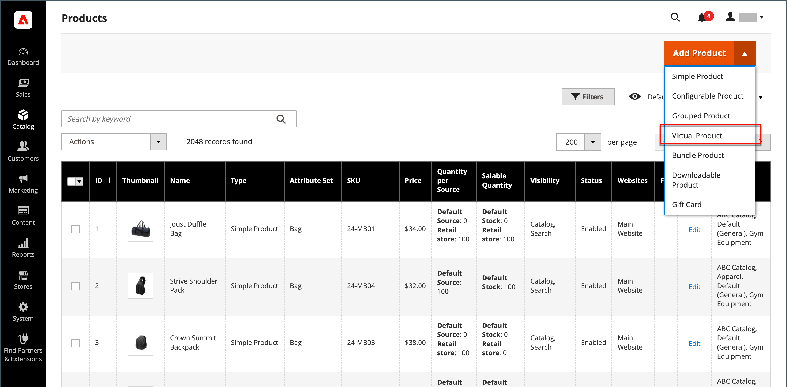

# Produto virtual

Os produtos virtuais, ou bens digitais, representam itens não tangíveis, como associações, serviços, garantias ou assinaturas e downloads digitais de livros, músicas, vídeos ou outros produtos. Os produtos virtuais podem ser vendidos individualmente ou incluídos como parte dos tipos de produto [Produto Agrupado](product-create-grouped.md), [Produto Configurável](product-create-configurable.md) ou [Pacote de Produtos](product-create-bundle.md).

Além da ausência do campo _[!UICONTROL Weight]_, o processo de criação de um produto virtual e um produto simples é o mesmo. As instruções a seguir demonstram o processo de criação de um produto virtual usando um [modelo de produto](attribute-sets.md), campos obrigatórios e configurações básicas. Quando terminar as noções básicas, você poderá concluir as outras configurações do produto conforme necessário.

>[!NOTE]
>
>O PayPal descontinuou o suporte para a venda de produtos digitais por meio do Check-out expresso do PayPal. Recomendamos que você use o [PayPal Payments Standard](../stores-purchase/paypal-payments-standard.md) ou qualquer outro gateway de pagamento do PayPal para processar qualquer pedido que inclua produtos virtuais.

{width="700" zoomable="yes"}

## Etapa 1: Escolher o tipo de produto

1. Na barra lateral _Admin_, vá para **[!UICONTROL Catalog]** > **[!UICONTROL Products]**.

1. No menu _[!UICONTROL Add Product]_( {width="25"} ), no canto superior direito, escolha **[!UICONTROL Virtual Product]**.

   {width="700" zoomable="yes"}

## Etapa 2: Escolher o conjunto de atributos

Para escolher o [conjunto de atributos](attribute-sets.md) usado como modelo para o produto, siga um destes procedimentos:

- Clique no campo **[!UICONTROL Attribute Set]** e insira todo ou parte do nome do conjunto de atributos.

- Na lista exibida, escolha o conjunto de atributos que deseja usar.

O formulário é atualizado para refletir a alteração.

{width="600" zoomable="yes"}

## Etapa 3: concluir as configurações necessárias

1. Insira o **[!UICONTROL Product Name]**.

1. Aceite o **[!UICONTROL SKU]** padrão que é baseado no nome do produto ou digite outro.

1. Insira o produto **[!UICONTROL Price]**.

1. Como o produto ainda não está pronto para publicação, defina **[!UICONTROL Enable Product]** como `No`.

1. Clique em **[!UICONTROL Save]** e continue.

   Quando o produto é salvo, o seletor de [Exibição da loja](introduction.md#product-scope) aparece no canto superior esquerdo.

1. Escolha o **[!UICONTROL Store View]** onde o produto deve estar disponível.

   {width="600" zoomable="yes"}

## Etapa 4: concluir as configurações básicas

1. Defina **[!UICONTROL Tax Class]** como um dos seguintes:

   - `None`
   - `Taxable Goods`

1. Insira o **[!UICONTROL Quantity]** do produto em estoque e faça o seguinte:

   - Aceite a configuração padrão **[!UICONTROL Stock Status]** de `In Stock`.

     Como um produto virtual não é enviado, o campo **[!UICONTROL Weight]** não é usado.

   - Aceite a configuração padrão **[!UICONTROL Visibility]** de `Catalog, Search`.

   >[!NOTE]
   >
   >Se você habilitar o [Inventory management](../inventory-management/introduction.md), comerciantes de origem única definirão a quantidade nesta seção. Comerciantes de várias origens adicionam origens e quantidades na seção Origens. Consulte a seguinte seção _Atribuir Fontes e Quantidades (Inventory management)_.

1. Para atribuir **[!UICONTROL Categories]** ao produto, clique na caixa **[!UICONTROL Select…]** e siga um destes procedimentos:

   **Escolha uma categoria existente**:

   - Comece a digitar na caixa até encontrar uma correspondência.

   - Marque a caixa de seleção da categoria a ser atribuída.

   **Criar uma categoria**:

   - Clique em **[!UICONTROL New Category]**.

   - Insira o **[!UICONTROL Category Name]** e escolha o **[!UICONTROL Parent Category]**, que determina sua posição na estrutura de menu.

   - Clique em **[!UICONTROL Create Category]**.

   Pode haver atributos individuais adicionais que descrevam o produto. A seleção varia de acordo com o conjunto de atributos e você pode concluí-los posteriormente.

### Atribuir fontes e quantidades ([!DNL Inventory Management])

{{$include /help/_includes/inventory-assign-sources.md}}

## Etapa 5: Preencher as informações do produto

Preencha as informações nas seguintes seções conforme necessário:

- [Conteúdo](product-content.md)
- [Imagens e vídeos](product-images-and-video.md)
- [Otimização do mecanismo de pesquisa](product-search-engine-optimization.md)
- [Produtos relacionados, venda adicional e venda cruzada](related-products-up-sells-cross-sells.md)
- [Opções personalizáveis](settings-advanced-custom-options.md)
- [Produtos em sites](settings-basic-websites.md)
- [Design](settings-advanced-design.md)
- [Opções de presente](product-gift-options.md)

>[!NOTE]
>
>A opção _[!UICONTROL Is this downloadable product?]_&#x200B;está desabilitada por padrão. Habilitar este recurso para um produto virtual torna o produto [Baixável](product-create-downloadable.md#downloadable-product).

## Etapa 6: publicar o produto

1. Se você estiver pronto para publicar o produto no catálogo, defina **[!UICONTROL Enable Product]** como `Yes`.

1. Siga um destes procedimentos:

   - **Método 1:** Salvar e visualizar

      - No canto superior direito, clique em **[!UICONTROL Save]**.

      - Para exibir o produto em sua loja, escolha **[!UICONTROL Customer View]** no menu _Admin_ (  ).

     A loja é aberta em uma nova guia do navegador.

     {width="600" zoomable="yes"}

   - **Método 2:** Salvar e fechar

     No menu _[!UICONTROL Save]_({width="25"} ), escolha **[!UICONTROL Save & Close]**.

## Coisas para lembrar

- Os produtos virtuais são usados para produtos incorpóreos, como serviços, assinaturas e garantias.

- Os produtos virtuais são muito parecidos com produtos simples, mas sem peso.

- As opções de envio não aparecem durante o check-out, a menos que haja um produto tangível no carrinho.

<!-- Last updated from includes: 2023-05-19 17:14:58 -->
