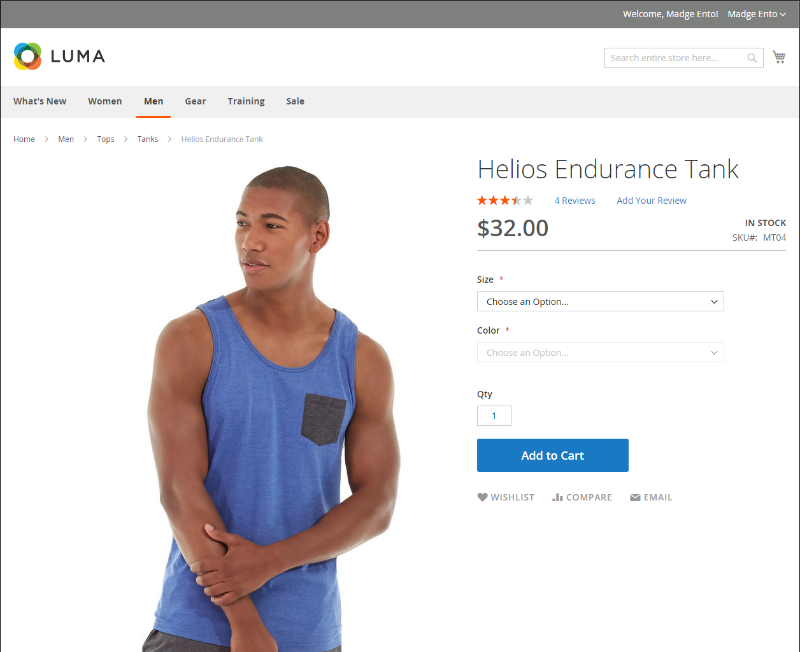

# Criar um produto

Escolher um tipo de produto é uma das primeiras coisas que você deve fazer para criar um produto. Se você estiver apenas começando a criar o catálogo de produtos, poderá criar algumas amostras de produtos para experimentar cada tipo de produto. Para além dos tipos do produto de base, o termo _produto complexo_ Às vezes, é usado para se referir a produtos com várias opções, como um produto configurável que está disponível em várias cores e tamanhos.

>[!NOTE]
>
>Para obter uma compreensão mais profunda, consulte catálogo [navegação](navigation.md), como configurar [categorias](categories.md) e [atributos](product-attributes.md), e o catálogo [Opções de URL](catalog-urls.md) disponíveis. Depois de entender esses conceitos, a maneira mais eficiente de adicionar muitos produtos ao catálogo é [importar](../systems/data-import.md) de um arquivo CSV.

{width="700" zoomable="yes"}

## Tipos de produto

**[Produto simples](product-create-simple.md)** - Um produto simples é um item físico com uma única SKU. Produtos simples têm vários preços e de controles de entrada, o que permite vender variações do produto. Produtos simples podem ser usados em associação com produtos agrupados, agrupados e configuráveis.

**[Produto configurável](product-create-configurable.md)** - Um produto configurável parece ser um único produto com listas de opções para cada variação. No entanto, cada opção representa um produto simples e separado com uma SKU distinta, o que permite rastrear o inventário para cada variação.

**[Produto agrupado](product-create-grouped.md)** - Um produto agrupado apresenta vários produtos independentes como um grupo. Você pode oferecer variações de um único produto ou agrupá-las para uma promoção. Os produtos podem ser comprados separadamente ou em grupo.

**[Produtos virtuais](product-create-virtual.md)** - Um produto virtual não é um produto tangível e é normalmente usado para produtos como serviços, associações, garantias e assinaturas. Os produtos virtuais podem ser usados em associação com produtos agrupados e agrupados.

**[Produto do pacote](product-create-bundle.md)**  - Um pacote de produtos permite que os clientes &quot;criem o seu próprio&quot; com base em uma variedade de opções. O pacote pode ser uma cesta de presentes, um computador ou qualquer outra coisa que possa ser personalizada. Cada item do pacote é um produto separado e independente.

**[Produto baixável](product-create-downloadable.md)** - Um produto para download digital consiste em um ou mais arquivos baixados. Os arquivos podem residir no servidor ou ser fornecidos como URLs para qualquer outro servidor.

**[Cartão-presente](product-gift-card-create.md)** - ([Adobe Commerce](../landing/home.md#product-editions) somente) Existem três tipos de cartões-presente. _Virtual_ cartões-presente são enviados por e-mail. _Físico_ os cartões-presente são enviados ao destinatário. _Combinado_ cartões-presente que são uma combinação de virtual e físico. Cada um tem um código exclusivo, que é resgatado durante o check-out. Cartões-presente também podem ser incluídos em um produto agrupado.

## Configurações do produto

As configurações e os atributos do produto usados com mais frequência são exibidos na parte superior da página, seguidos por atributos personalizados. Quaisquer outras configurações de produto estão em seções expansíveis na parte inferior da página.

{width="600" zoomable="yes"}

| Configuração | Descrição |
|--- |--- |
| [[!UICONTROL Sources]](../inventory-management/sources-assign-per-product.md) | (Quando [[!DNL Inventory Management]](../inventory-management/introduction.md) está ativado) Lista as fontes a partir das quais o produto pode ser distribuído. |
| [[!UICONTROL Content]](product-content.md) | Usado para inserir e editar a descrição principal do produto que aparece na página de produto da loja. |
| [[!UICONTROL Configurations]](product-configurations.md) | Lista todas as variações existentes do produto e pode ser usada para gerar variações para uso com o tipo de produto Configurável. |
| [[!UICONTROL Product Reviews]](settings-advanced-product-reviews.md) | Lista todas as revisões enviadas pelos clientes do produto. |
| [[!UICONTROL Search Engine Optimization]](product-search-engine-optimization.md) | Especifica os campos de chave e metadados de URL usados pelos mecanismos de pesquisa para indexar o produto. |
| [[!UICONTROL Related Products, Up-Sells, and Cross-Sells]](related-products-up-sells-cross-sells.md) | Usado para configurar blocos promocionais simples na loja que apresentam uma seleção de produtos adicionais que podem ser de interesse do cliente. |
| [[!UICONTROL Customizable Options]](settings-advanced-custom-options.md) | Adiciona opções personalizáveis a um produto. |
| [[!UICONTROL Product in Websites]](settings-basic-websites.md) | Identifica cada site onde o produto está disponível, de acordo com a hierarquia da loja. |
| [[!UICONTROL Design]](settings-advanced-design.md) | Usado para aplicar um tema diferente à página do produto, alterar o layout da coluna, determinar onde as opções do produto são exibidas e inserir o código XML personalizado. |
| [[!UICONTROL Gift options]](product-gift-options.md) | Usado para ativar ou desativar uma opção de mensagem de presente durante o check-out no nível do produto. |
| [[!UICONTROL Product In Shared Catalogs]](../b2b/catalog-shared.md) |  (Disponível com [Adobe Commerce B2B](../b2b/introduction.md) somente) Permite a capacidade de manter catálogos compartilhados com preços personalizados para empresas diferentes. |
| [[!UICONTROL Downloadable Information]](product-create-downloadable.md#step-5-complete-the-downloadable-information) | Usado para definir os parâmetros para download do produto. |

{style="table-layout:auto"}

## Preços e inventário avançados

Para acessar as configurações avançadas de preços e inventário, clique no link abaixo **[!UICONTROL Price]** e **[!UICONTROL Quantity]**. Para obter mais informações, consulte [Gerenciando Preços](pricing-advanced.md) e [Inventory management](../inventory-management/introduction.md).
