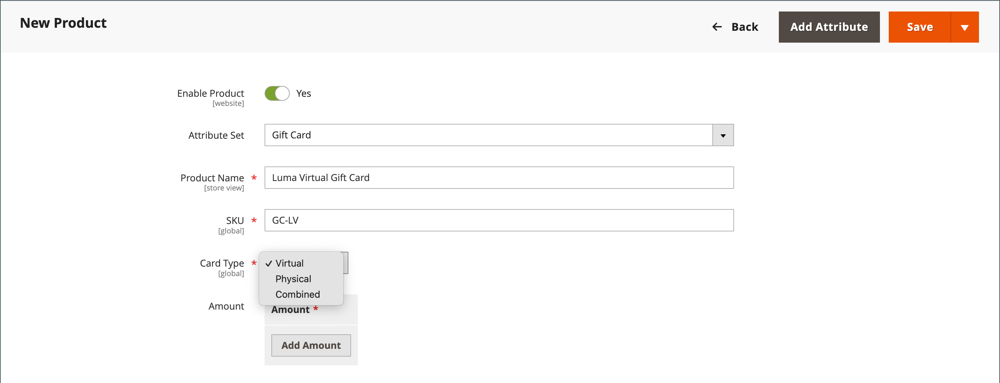

# Produto de cartão-presente

{{ee-feature}}

Cada cartão-presente tem um código exclusivo, que pode ser resgatado por apenas um cliente durante o check-out. A [pool de códigos](../stores-purchase/product-gift-card-accounts.md#step-3-establish-the-gift-card-code-pool) deve ser estabelecido antes que cartões-presente possam ser vendidos. Consulte [Fluxo de trabalho do cartão-presente](../stores-purchase/product-gift-card-workflow.md) para obter informações sobre como os cartões-presente são resgatados no carrinho de compras.

{width="700" zoomable="yes"}

Há três tipos de produtos de cartão-presente:

- **Virtual** - Um vale-presente virtual é enviado para o endereço de e-mail do destinatário, que é obrigatório durante a compra do vale-presente. Um endereço de entrega não é necessário.

- **Físico** - Um vale-presente físico é enviado para o endereço do destinatário, que é necessário durante a compra do vale-presente.

- **Combinado** - Um vale-presente combinado é enviado e enviado por e-mail ao destinatário. O email e o endereço de envio do recipient são necessários durante a compra do cartão-presente.

## Criar um produto de cartão-presente

As instruções a seguir demonstram o processo de criação de um cartão-presente usando um [modelo do produto](attribute-sets.md), campos obrigatórios e configurações básicas. Cada campo obrigatório está marcado com um asterisco vermelho (`*`). Quando terminar as noções básicas, você poderá concluir as outras configurações do produto conforme necessário.

### Etapa 1: Escolher o tipo de produto

1. No _Admin_ barra lateral, vá para **[!UICONTROL Catalog]** > **[!UICONTROL Products]**.

1. No canto superior direito da _[!UICONTROL Add Product]_( {width="25"}  ), escolha **[!UICONTROL Gift Card]**.

   {width="700" zoomable="yes"}

### Etapa 2: Escolher o conjunto de atributos

Você pode usar o padrão `Gift Card` atributo definido ou escolha outro. Para escolher o conjunto de atributos usado como modelo para o produto, siga um destes procedimentos:

- Clique em **[!UICONTROL Attribute Set]** e insira todo ou parte do nome do conjunto de atributos.

- Na lista exibida, escolha o conjunto de atributos que deseja usar.

{width="600" zoomable="yes"}

### Etapa 3: concluir as configurações necessárias

1. Insira um **[!UICONTROL Product Name]** para o cartão-presente.

   Você também pode indicar o tipo de cartão-presente no nome. Por exemplo, _Cartão-presente virtual Luma_.

1. Insira um **[!UICONTROL SKU]** para o produto.

   Por padrão, o Nome do produto é usado como SKU padrão.

1. Definir **[!UICONTROL Card Type]** a um dos seguintes:

   - `Virtual` - Cartões-presente virtuais são entregues por e-mail ao recipient.
   - `Physical` - Cartões-presente físicos podem ser produzidos em massa antecipadamente e gravados com códigos únicos.
   - `Combined` - Um vale-presente combinado tem as características de um vale-presente virtual e físico.

   {width="600" zoomable="yes"}

1. Para oferecer ao cliente uma opção de valores fixos, clique em **[!UICONTROL Add Amount]** e insira o primeiro valor fixo do cartão como um decimal.

   Para inserir a seleção de valores fixos, repita esta etapa para cada um.

1. Para fornecer aos clientes a capacidade de definir o valor do cartão-presente, faça o seguinte:

   - Definir **[!UICONTROL Open Amount]** para `Yes`.

   - Para definir a faixa de valores mínimos e máximos aceitáveis, informe o **[!UICONTROL Open Amount From]** e **[!UICONTROL To]** valores.

   Você pode criar cartões-presente com preço fixo, preço de valor em aberto ou ambos.

   >[!NOTE]
   >
   >Um produto de cartão-presente não tem seu próprio preço no catálogo. O preço do cartão-presente é derivado do valor do cartão-presente selecionado durante a compra.

   {width="600" zoomable="yes"}

### Etapa 4: concluir as configurações básicas

1. Para um cartão-presente físico ou combinado, insira o **[!UICONTROL Quantity]** em estoque.

1. Se o cartão-presente a ser enviado, insira o **[!UICONTROL Weight]** do pacote.

1. No **[!UICONTROL Categories]** escolha `Gift Card`.

Pode haver atributos individuais adicionais que descrevam o produto. A seleção varia o conjunto de atributos e você pode concluí-los posteriormente.

### Etapa 5: completar as informações do cartão-presente

A variável _[!UICONTROL Gift Card Information]_das configurações do produto pode ser usada para substituir a variável [configuração de cartão-presente](../configuration-reference/sales/gift-cards.md) configurações que determinam como o cartão é gerenciado.

1. Role para baixo até _[!UICONTROL Gift Card Information]_seção.

   As configurações padrão nesta seção são determinadas pela configuração do sistema.

   {width="600" zoomable="yes"}

1. Altere os campos adicionais de acordo com como deseja que o cartão-presente funcione:

   - **[!UICONTROL Treat Balance as Store Credit]** - Determina se o portador do cartão-presente pode resgatar o saldo como crédito da loja.

   - **[!UICONTROL Lifetime (days)]** - Determina o número de dias após a compra até o cartão-presente expirar. Se não quiser definir um limite para o tempo de vida do cartão, deixe esse campo em branco.

   - **[!UICONTROL Allow Message]** - Determina se o comprador do cartão-presente pode inserir uma mensagem para o destinatário. Uma mensagem de presente pode ser incluída para cartões-presente virtuais (enviados por email) e físicos (enviados).

   - **[!UICONTROL Email Template]** - Determina o modelo de email usado para a notificação enviada ao destinatário de um cartão-presente.

### Etapa 6: Preencher as informações do produto

Preencha as informações nas seguintes seções conforme necessário:

- [Conteúdo](product-content.md)
- [Imagens e vídeos](product-images-and-video.md)
- [Produtos relacionados, venda adicional e venda cruzada](related-products-up-sells-cross-sells.md)
- [Otimização do mecanismo de pesquisa](product-search-engine-optimization.md)
- [Opções personalizáveis](settings-advanced-custom-options.md)
- [Produtos em sites](settings-basic-websites.md)
- [Design](settings-advanced-design.md)
- [Opções de presente](product-gift-options.md)

### Etapa 7: publicar o produto

1. Se estiver pronto para publicar o produto no catálogo, defina as **Ativar produto** alternar para `Yes`.

1. Siga um destes procedimentos:

   **Método 1:** Salvar e visualizar

   - No canto superior direito, clique em **[!UICONTROL Save]**.

   - Para exibir o produto em sua loja, escolha **[!UICONTROL Customer View]** no _Admin_ (  ),

   {width="600" zoomable="yes"}

   **Método 2:** Salvar e fechar

   No _[!UICONTROL Save]_( {width="25"} ), escolha **[!UICONTROL Save & Close]**.

## Coisas para lembrar

- A _pool de códigos_ número de números exclusivos deve ser gerado antes que um cartão-presente possa ser oferecido para venda.

- Cartões-presente podem ser definidos como `Redeemable` ou `Non-Redeemable`.

- Os impostos são **_não aplicado_** para cartões-presente durante a compra do cartão-presente. Os impostos são aplicados aos produtos somente quando um cartão-presente comprado é usado para comprar produtos.

- A duração de um cartão-presente pode ser ilimitada ou definida para um número especificado de dias.

- O valor de um cartão-presente pode ser definido como um valor fixo ou como um valor aberto com um valor mínimo e máximo.

- Um produto de cartão-presente não tem seu próprio preço no catálogo. O preço do cartão-presente é derivado do valor do cartão-presente selecionado durante a compra.

- Uma conta de cartão-presente para o cliente pode ser criada quando o pedido for feito ou no momento da fatura.
