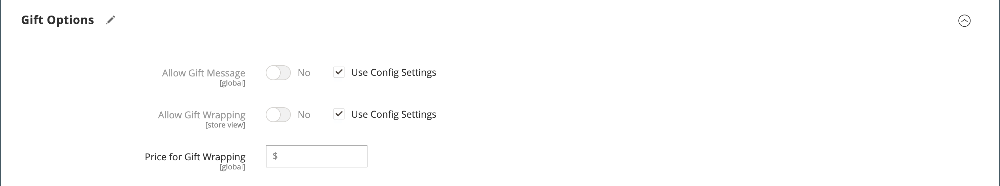

# Configurações do produto - [!UICONTROL Gift Options]

Na seção _[!UICONTROL Gift Options]_, é possível definir opções de mensagem de presente e invólucro de presente no check-out no nível do produto. Para substituir a configuração padrão, desmarque a caixa de seleção **[!UICONTROL Use Config Settings]**.

{width="600" zoomable="yes"}

## Definir opções de presente para um único produto

1. Abra o produto no modo de edição.

1. Role para baixo e expanda  a seção _[!UICONTROL Gift Options]_&#x200B;e faça o seguinte:

   - Para substituir a configuração padrão, desmarque a caixa de seleção **[!UICONTROL Use Config Settings]**.

   - Defina **[!UICONTROL Allow Gift Message]** conforme necessário para o produto.

   -  ([Adobe Commerce](../landing/home.md#product-editions) somente) Defina **[!UICONTROL Allow Gift Wrapping]** conforme necessário para o produto.

   -  ([Adobe Commerce](../landing/home.md#product-editions) somente) Se aplicável, insira o **[!UICONTROL Price for Gift Wrapping]**.

1. Quando terminar, clique em **[!UICONTROL Save]**.

## Habilitar mensagens de presente para sua loja

Por padrão, o Commerce permite que os clientes adicionem uma mensagem de presente personalizada a seus pedidos e produtos durante o processo de finalização.

Você pode fornecer este recurso aos clientes habilitando a _mensagem de presente_ para sua loja:

1. Na barra lateral _Admin_, vá para **[!UICONTROL Stores]** > _[!UICONTROL Settings]_>**[!UICONTROL Configuration]**.

1. No painel esquerdo, expanda **[!UICONTROL Sales]** e escolha **[!UICONTROL Sales]** abaixo de.

1. Expanda  **[!UICONTROL Gift Options]** na página.

1. Para **[!UICONTROL Allow Gift Messages on Order Level]**, selecione `Yes` para habilitar uma única mensagem de presente para todo o pedido.

1. Para **[!UICONTROL Allow Gift Messages for Order Items]**, selecione `Yes` para habilitar a adição de mensagens de presente separadamente a itens individuais no carrinho de compras do cliente.

1. Clique em **[!UICONTROL Save Config]**.

Com essa configuração, os clientes podem adicionar uma mensagem de presente à página do carrinho de loja, conforme mostrado no exemplo a seguir:

{width="600" zoomable="yes"}
