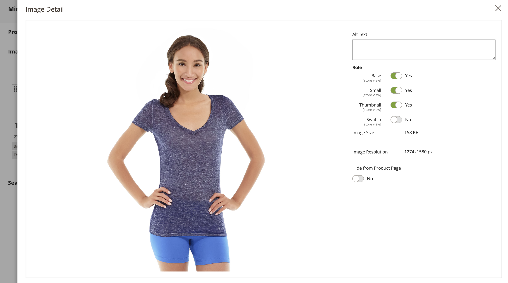

# Gerenciar imagens e vídeos de produtos

Para cada produto, você pode fazer upload de várias imagens e vídeos, reorganizar o pedido e controlar como cada um é usado. Se você tiver uma grande quantidade de imagens para gerenciar, talvez prefira importá-las em lote, em vez de carregar cada uma individualmente. Para obter mais informações, consulte [Importar imagens do produto](../systems/data-import-product-images.md).

Se você planeja fazer upload de imagens grandes para visualização no _[!UICONTROL Product Details]_considere definir um tamanho máximo de pixel (largura e altura) e redimensionar automaticamente os arquivos no upload. Há uma opção para habilitar o redimensionamento automático de arquivos de imagem maiores durante o upload. Para obter mais informações, consulte [Redimensionamento de imagem do produto](product-image-config.md#product-image-resizing).

## Atualizar as imagens do produto

1. Abra o produto no modo de edição.

1. Para trabalhar com uma visualização de loja específica, defina a **[!UICONTROL Store View]** no canto superior esquerdo para a exibição aplicável.

   >[!NOTE]
   >
   >Novas imagens do produto são **_sempre_** carregado e visível no **_all_** exibições de loja, mesmo se a variável `All Store Views` o escopo não é usado para upload.   Para ocultar qualquer imagem de produto de uma exibição de loja específica, você deve alternar para a Exibição de loja e selecionar a **[!UICONTROL Hide from Product Page]** para a imagem e clique em **[!UICONTROL Save]**.

1. Role para baixo e expanda a _[!UICONTROL Images and Videos]_seção.

### Carregar uma imagem

Para melhor compatibilidade, é recomendável carregar todas as imagens do produto com o `sRGB` perfil de cores. Todos os outros perfis de cores são convertidos automaticamente para o `sRGB` perfil de cores durante o upload da imagem do produto, o que pode causar inconsistência de cores na imagem carregada.

O nome do arquivo de imagem, incluindo a extensão, não pode exceder 90 caracteres.

Para fazer upload de uma imagem, siga um destes procedimentos:

- Arraste uma imagem da sua área de trabalho e solte-a na _Câmera_ (  ) lado a lado no _[!UICONTROL Images And Videos]_caixa.

- No _[!UICONTROL Images And Videos]_, clique no link_ Câmera _(  ), selecione o arquivo de imagem no seu computador e clique em **[!UICONTROL Open]**.

  {width="600" zoomable="yes"}

### Reorganizar imagens

Para alterar a ordem das imagens na galeria, clique no _[!UICONTROL Sort]_(  ) na parte inferior do bloco de imagens e arraste a imagem para uma posição diferente no_[!UICONTROL Images And Videos]_ caixa.

{width="600" zoomable="yes"}

### Excluir uma imagem

Para remover uma imagem da galeria, clique no link **[!UICONTROL Delete]** (  ) no canto superior direito do bloco de imagens e clique em **[!UICONTROL Save]**.

### Definir detalhes da imagem

Clique na imagem que deseja abrir na exibição detalhada e siga um destes procedimentos:

{width="600" zoomable="yes"}

Para fechar a view detalhada, clique no link _Fechar_ (  ) no canto superior direito.

Quando terminar, clique em **[!UICONTROL Save]**.

#### Inserir texto alternativo

O texto alternativo de imagem é referenciado por leitores de tela para melhorar a acessibilidade da Web e por mecanismos de pesquisa ao indexar o site. Alguns navegadores exibem o texto Alt ao passar o mouse. O texto alternativo pode ter várias palavras e incluir palavras-chave cuidadosamente selecionadas.

No _[!UICONTROL Alt Text]_insira uma breve descrição da imagem.

#### Atribuir funções

Por padrão, todas as funções são atribuídas à primeira imagem que é carregada no produto. Para reatribuir uma função a outra imagem, faça o seguinte:

No _[!UICONTROL Role]_escolha a função que deseja atribuir à imagem.

Quando você retornar ao _Imagens e vídeos_ , as funções atualmente atribuídas aparecem abaixo de cada imagem.

{width="600" zoomable="yes"}

#### Ocultar uma imagem

Para excluir uma imagem da galeria de miniaturas, selecione a **[!UICONTROL Hidden]** e clique em **[!UICONTROL Save]**.

{width="600" zoomable="yes"}

## Funções da imagem

| Função da imagem | Descrição |
|--- |--- |
| [!UICONTROL Thumbnail] | As imagens em miniatura são exibidas na galeria de miniaturas, no carrinho de compras e em alguns blocos, como Itens relacionados. Exemplo de tamanho: 50 x 50 pixels |
| [!UICONTROL Small Image] | A imagem pequena é usada para as imagens do produto em listagens nas páginas de categoria e resultados de pesquisa e para exibir as imagens do produto necessárias para seções como Vendas adicionais, Vendas cruzadas e a Nova lista de produtos. Tamanho do exemplo: 470 x 470 pixels |
| [!UICONTROL Base Image] | A imagem base é a imagem principal na página de detalhes do produto. O zoom da imagem é ativado se você carregar uma imagem maior do que o container da imagem. Dependendo do nível de zoom que você deseja alcançar, a imagem base deve ter duas ou três vezes o tamanho do contêiner. Exemplos de tamanhos: 470 x 470 pixels (sem Zoom), 1100 x 1100 pixels (com Zoom) |
| [!UICONTROL Swatch] | A [amostra](swatches.md) pode ser usado para ilustrar a cor, o padrão ou a textura. Exemplo de tamanho: 50 x 50 pixels |

{style="table-layout:auto"}

## Marcas d&#39;água

Se você arcar com as despesas de criar suas próprias imagens originais do produto, não há muito que você possa fazer para impedir que concorrentes sem escrúpulos as roubem com um clique de mouse. No entanto, você pode torná-los um destino menos atraente colocando uma marca d&#39;água em cada imagem para identificá-los como sua propriedade do. Um arquivo de marca d&#39;água pode ser uma imagem JPG (JPEG), GIF ou PNG. Os tipos de arquivo GIF e PNG são compatíveis com camadas transparentes, que podem ser usadas para dar à marca d&#39;água um plano de fundo transparente.

A marca d&#39;água usada para o _pequeno_ A imagem no exemplo a seguir é um logotipo preto com um plano de fundo transparente e salvo como um arquivo PNG com as seguintes configurações:

- Tamanho: 50x50
- Opacidade: 5
- Posição: Bloco

{width="700" zoomable="yes"}

### Adicionar marcas d&#39;água às imagens do produto

1. No _Admin_ barra lateral, vá para **[!UICONTROL Content]** > _[!UICONTROL Design]_>**[!UICONTROL Configuration]**.

   Para obter mais informações sobre configurações de design, consulte [Configuração de design](../content-design/configuration.md).

1. Localize a exibição de loja que deseja configurar e clique em **[!UICONTROL Edit]** no _[!UICONTROL Action]_coluna.

1. Em _[!UICONTROL Other Settings]_, expandir  o **[!UICONTROL Product Image Watermarks]**seção.

   {width="600" zoomable="yes"}

   A variável **[!UICONTROL Base]**, **[!UICONTROL Thumbnail]**, **[!UICONTROL Small]**, e **[!UICONTROL Swatch Image]** as configurações de imagem são as mesmas.

1. Use um dos métodos a seguir para adicionar o ativo de imagem de marca d&#39;água:

   - Clique em **[!UICONTROL Upload]** e escolha o arquivo de imagem em seu sistema que você deseja fazer upload para usar como marca d&#39;água.
   - Clique em **[!UICONTROL Select from Gallery]** e selecione um ativo de imagem na [Galeria de mídia](../content-design/media-gallery.md).

1. Conclua as configurações da exibição de marca d&#39;água:

   - Insira o **[!UICONTROL Image Opacity]** como uma porcentagem. Por exemplo: `40`

   - Insira o **[!UICONTROL Image Size]** em pixels. Por exemplo: `200 x 200`

   - Definir **[!UICONTROL Image Position]** para determinar onde a marca d&#39;água aparece.

1. Quando terminar, clique em **[!UICONTROL Save Config]**.

1. Quando for solicitado atualizar o cache, clique em **[!UICONTROL Cache Management]** na mensagem do sistema e atualize o cache inválido.

   {width="600" zoomable="yes"}

>[!TIP]
>
>Você pode clicar em **[!UICONTROL Use Default Value]**  para restaurar o valor padrão.

### Excluir uma marca d&#39;água

1. No canto inferior esquerdo da imagem, clique na guia **[!UICONTROL Delete]** (  ) ícone.

   {width="300"}

1. Clique em **[!UICONTROL Save Config]**.

1. Quando for solicitado atualizar o cache, clique em **[!UICONTROL Cache Management]** na mensagem do sistema e atualize o cache inválido.

   Se a imagem da marca d&#39;água persistir na loja, volte para o gerenciamento de cache e clique em **[!UICONTROL Flush Magento Cache]**.
